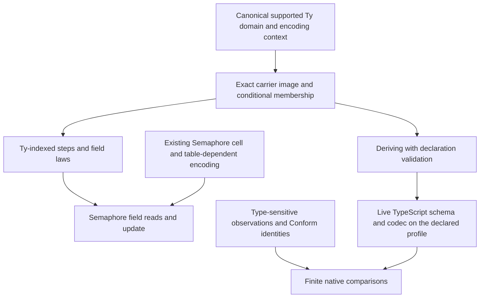

# MODULES revision 2 review

Keep the revised direction. Strengthen the carrier contract and repair the native grading before treating these probes as the implementation design.
The first-order step representation and the measured Latch batch repair resolve important findings from the first review.

This review targets `3af74a28`, including revision `b71c7aa9`.
The reviewed design is [MODULES revision 2](2026-10-08-seat-MODULES-r2.md).
The review branch is `codex/module-design-review`.
Its head is the commit containing this receipt.
No production declaration, owner ruling or submitted probe changes in this review.

## What reproduces

The [reproduction command](2026-10-08-modules-r2-review/review.py) records commands, outputs, pins and source digests in [results.json](2026-10-08-modules-r2-review/results.json).

| Subject | Evidence reproduced | Scope |
| --- | --- | --- |
| `StepData.Step` and `FieldRef` | source inspection | syntax contains data, not author-supplied field functions |
| `StepData.Step.sound` | kernel checks at `[propext, Quot.sound]` | input `Reads` and `wf` imply encoded term agreement |
| `StepData.frame_law` | kernel checks at `[propext, Quot.sound]` | distinct names, update spine, and an unwritten selected field |
| coalescing Latch | Lean run and generated TypeScript run | the retained batch client returns `[1,2,9]`, matching rc.112 |
| `TyModel` | compiled deriving example and sample guards | exact image, sample membership, TypeScript type syntax, Schema representation and sample Lean JSON round trip |
| native failure self-tests | runner detects the supplied wrong result, crash and unruled difference | the submitted finite controls |

These declarations live under `docs/research/2026-10-08-seat-MODULES-r2/`.
The baseline native command exits `2` for the original Latch's unruled batch difference.
The coalescing client receives a passing row.
This is the declared baseline result, not a failure to reproduce the revision.

## Findings that still change the design

### R2-F1: exact images need canonicality, support and membership [blocker]

`TyModel.Modeled` contains a raw `Ty` and inverse conversion functions.
It requires no canonical type, supported profile or membership evidence.
`derive_modeled` trusts each field's instance.

[ty-controls.inc.lean](2026-10-08-modules-r2-review/ty-controls.inc.lean) supplies a lawful custom instance with record names ordered `z`, then `a`.
It derives an outer record containing that type.

| Check on the outer record | Measured result |
| --- | --- |
| `refusal` | `none` |
| exact image round trip | true |
| membership at the declared type | false |
| Lean JSON encoding exists | false |

The generated inverse proofs check.
The problem is their reach: inverse functions do not establish the separate membership judgment.
`Val.hasTy` checks canonical record names in `src/Effect4/Program/Typed.lean`.
`Image.record` retains the raw column order.
Another retained control shows `Machine.Record.set` sorts that order and therefore disagrees with the proposed raw carrier update.

Support also needs enforcement.
An unsupported leaf maps to `Empty`, but `List Empty` contains `[]` and `Option Empty` contains `none`.
The retained custom handle instance permits deriving a field containing `List Empty`.
The image round trip works while `refusal` reports the unsupported handle.
Neither the class nor the command consults that refusal.

Use one canonical, formation-checked carrier domain.
Require recursive profile support before public deriving accepts an instance.
Derive membership from the carrier fold, retaining its allocation premises.
Transport the author's inverse conversions only after selecting that checked carrier.
Do not silently normalize an existing carrier without transporting its values and laws.

Reuse `ValueModel` in `src/Effect4/Laws/Program/ValueModel.lean`.
Its `image`, `type`, `needs` and `member` keep exactness, canonical type, allocation assumptions and membership separate.
Keep the core/law import boundary when sharing this structure and its proofs.
Do not make the application root import the law graph.

### R2-F2: native grading still accepts unequal observations [major]

[native-controls.py](2026-10-08-modules-r2-review/native-controls.py) exercises the submitted comparator directly and through its actual TypeScript execution path.
Both temporary programs declare the same result type, `boolean | number`.
One returns `true`; the other returns `1`.
Both compile with the pinned tsgo and execute on rc.112.
The comparator reports `pass` and exit code zero.

Python compares `True` and `1` as equal, including inside the result dictionaries.
The claimed exact observation comparison therefore needs type-sensitive JSON equality.
The same correction applies to predicted difference pairs.

The retained controls also show:

- a nonexistent ruling string changes an exact mismatch to `signed`;
- an empty client report produces exit code zero.

By source inspection, tool versions are recorded but not enforced.
Unused difference rows have no reverse join to required clients.
Subprocesses have no time limit.
Only body files enter the input digests.

Reuse `Conform.Report.complete` and `Report.exitCode` in `tools/Conform/Core/Report.lean`.
Validate the required client identities, tracked rulings, declared pins and both directions of the difference join.
Retain the observation type and avoid treating equal rendered failure strings as structured cause equality.
Keep broader provenance and timeout work in the planned Conform integration.

### R2-F3: the data step and the Ty carrier are separate probes [major]

`StepData.Step` still uses `Sy`, `Sy.I` and `Sy.enc`.
`TyModel.Carrier` and `image` independently interpret raw `Ty`.
No checked connector relates these representations.
The Ty-indexed field references, term typing, record laws and transported frame theorem remain proposed.

Keep `Sy` inside the research probe.
Land the final step syntax over the chosen canonical `Ty` domain.
Freeze that domain, field identities and encoding context before parallel work on the class and step laws.

The design's claim that MODS-9 supplies an `Image` and `ValueModel` record combinator needs correction.
MODS-9 supplies record reading, writing and selected-field frame laws.
MODS-11 supplies the exact `Image.record` combinator.
The universal membership law remains open.
The selected axiom outputs establish the named theorems' dependencies, not every generated declaration or Lean elaborator dependency.

### R2-F4: one declaration does not yet give a total target codec [major]

The current probe gives a TypeScript type expression and an Effect Schema representation.
It does not generate or execute a live typed TypeScript codec.
`Codegen.Schema.representation` renders a description of a schema.
`moduleSyntax` produces a persisted document decoded by `SchemaRepresentation.fromJson`.
Both declarations are in `src/Effect4/Codegen/Schema.lean`.

The pinned live conversion is `SchemaRepresentation.fromRepresentation`.
It requires explicit revivers, including those for the numeric filters in this example.
See `vendor/effect-4.0.0-rc.112/src/SchemaRepresentation.ts:1205-1238`.
The authoring surface should own that supported conversion and its required registrations.
The current probe does not exercise that connection.

The Lean codec also has a value-level domain.
The retained `Nat` control has exact image encoding and membership at `2^53 + 1`, but JSON encoding refuses it.
The positive control at `7` encodes.
`Schema.decode_encode` requires membership and `Ty.isCodecValue` in `src/Effect4/Laws/Schema/Codec.lean`.
An every-value codec claim must either state that premise or select a carrier whose values meet it.

Keep exact image, membership, codec admission and target execution as separate obligations.
A sample round trip cannot replace those boundaries.
Identity fields still require their role-specific tables and value-dependent allocation assumptions.

### R2-F5: deriving needs explicit declaration checks [major]

The retained typo control supplies a rename for a nonexistent field.
The command ignores it and derives the original spelling.
That can silently produce the wrong external API.

[duplicate.inc.lean](2026-10-08-modules-r2-review/duplicate.inc.lean) renames two independent Boolean fields to one spelling.
The command collapses the names, then fails its inverse proof.
The kernel prevents the invalid instance.
The author still needs an early, located refusal naming the conflicting fields.

Validate rename sources, repeated rename clauses and duplicate destination names before generating declarations.
Validate constructor parameters, dependent fields, inherited fields and supported field instances explicitly.
The command currently zips structure fields with the constructor's whole telescope.
Unsupported parameterized structures need a clear refusal before that zip.

Generic deriving and generic stored definitions are different features.
The existing `Modeled` instances for `List` and `Option` already quantify over a modeled element type.
Keep the first structure command monomorphic if that is the chosen profile.
Do not make stored-definition goal G8 its semantic prerequisite.

For future coverage, distinguish optional properties from required `Option` fields.
A tagged `Image.sum` also needs a representation policy before serving an untagged, potentially overlapping `Ty.union`.

### R2-F6: the first Semaphore slice still carries handles [sequencing]

The proposed `takeIfAvailableStep` migration retains the whole Semaphore cell.
Its waiter records contain `hint` and `id` at `Modules.idTy`, which is `Ty.deferredOf .unit .never`.
See `waiterTy` in `src/Effect4/Modules/Semaphore/Cell.lean` and `idTy` in `src/Effect4/Modules/Words.lean`.
The proposed data-only carrier refuses this type.
Choosing an operation that never waits does not remove handles already stored in its input.

Start by migrating the field reads and update while retaining the existing cell and its contextual encoding.
Reuse `Semaphore.cellTy` and `Model.cellVal tb s` from `src/Effect4/Laws/Modules/Semaphore/Relation.lean`.
Keep the existing table and the actual waiter values.

`takeIfAvailableStep_agrees` accepts every table in `src/Effect4/Laws/Modules/Semaphore/Steps.lean`.
It needs no injectivity premise because the operation changes only `taken`.
`takeIfAvailable_attempt` retains the allocation assumptions through its cell-membership premise in `src/Effect4/Laws/Modules/Semaphore/Ops.lean`.
These declarations provide the boundary for that step-language migration.
A whole-cell deriving claim still needs the role-specific encoding context.
Empty waiter examples do not discharge this dependency.

## Answers to the four questions

These are recommendations. This review records no owner ruling.

| Question | Recommendation |
| --- | --- |
| 1. Steps over `Ty`, with a carrier fold and deriving | Yes. Freeze the canonical supported domain and the bridge first. Keep `Image` exactness, `ValueModel` membership and codec admission distinct. The two working probes are not yet one checked connection. |
| 2. Match Latch batching or sign the difference | Match batching. The measured repair is a good basis. Keep the old mismatch as a regression witness. Add cancellation and reentrant-batch controls before claiming the component's behavioural law. |
| 3. Checked restricted clients and an abstract model | Yes. Specify an enforceable client judgment covering procedure bodies, callbacks and dependencies. Retain public failure, interruption, commits, replies and cleanup. Exclude raw implementation identities only where the observation contract says so. |
| 4. Four compatibility rows | Yes to separate claims, but correct their endpoints. The current directed-inclusion row compares Effect with the model again. Directed compatibility must compare Effect's behaviours with ours, in an explicitly chosen direction. |

Use these four subjects for question 4:

| Subject | Claim |
| --- | --- |
| shared-model conformance | each implementation's behaviours lie inside the model's allowed behaviours |
| directed compatibility | one implementation's behaviours lie inside the other's, under a named observation and profile |
| equal observations | both directions hold, or the finite named clients agree when the evidence is tested |
| signed differences | each accepted unequal observation matches a validated ruling and its exact predicted pair |

No finite sample of Effect executions establishes universal directed inclusion.
Record the pin, observation, fragment, bounds and evidence kind with each subject.

For question 2, the probe covers the original batching counterexample.
It does not prove cancellation after capture, one resumed waiter interrupting another, reentrant releases or close/reopen while a batch remains pending.
Those are missing controls, not demonstrated defects in `BatchLatch`.
The helper-identity boundary remains even with one coalescing helper.

For question 3, exclude numeric identity inspection rather than dropping all interruption or concurrency behaviour from the observation.
Clock and scheduling restrictions need precise statements.
Keep the quiet-budget premise explicit.
No run theorem lands in this revision.

## Smallest next implementation



Start with the carrier contract and one ordinary record with a nested field.
Make public deriving refuse the retained malformed instances for the intended reason.
Then connect the derived record to the final Ty-indexed step language.
Keep the Semaphore migration distinct from whole-cell deriving until the handle context is supported.
Keep the independent step specification when generating its agreement proof.
The existing `Forms` path still produces the sole core `Eff` program before checked TypeScript syntax.

Place new obligations in the theory before implementation, as `AGENTS.md` requires.
Keep membership and field-law placement separate from the module run claims.
The abstract model remains a specification of behaviour, not another program representation.

## Verification and hand back

Run from the review worktree:

```sh
python3 docs/research/2026-10-08-modules-r2-review/review.py
```

The command performs a narrow dependency build and reruns the submitted probes.
It expects the native comparison's candidate exit and checks the supplied failure self-tests.
It appends the retained Lean controls to the reviewed declarations in temporary files.
It checks the duplicate-name failure at the inverse equation.
It exercises the false native grading with actual compiled TypeScript bodies.
It requires Effect `4.0.0-rc.112` and tsgo `7.0.0-dev.20260629.1`.
Installed dependencies must exist under `ts/eff` and `harness/truth`.

The receipt also passes `python3 scripts/check-language.py --strict docs/research/2026-10-08-modules-r2-review.md`.

The changed files are this receipt and the review packet.
The packet holds the Lean appendices, native controls, reproduction runner and measured results.
The coordinator verifies the executable controls after three GPT-6.1 Sol agents inspect separate parts of the design.
The submitted packet remains byte-identical after reproduction.
No full battery, axiom-gate sweep, OCaml run, merge to the main checkout or push occurs.

Verdict: retain the revision's direction, repair the carrier and grading contracts, then land the first connected authoring slice.
