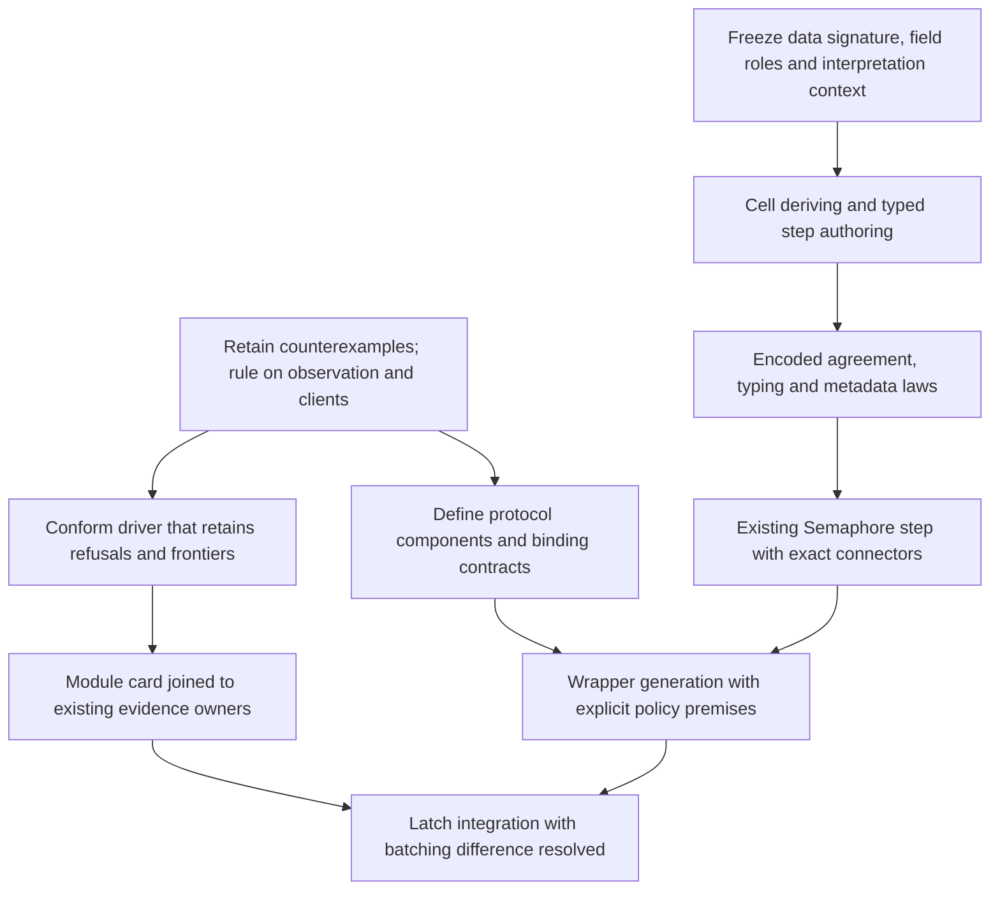

# MODULES design review

Rework the design before dispatching M1 to M7. Retain the shared step theorem and the existing authoring surface.
The proposed representation, client restriction, operation kinds and compatibility grade need corrections.

This review targets `29f369ca8acc5ccef2632375357f0bf7a2c4ac22`.
The reviewed note is [the MODULES design](2026-10-08-seat-MODULES-design.md).
The [review packet](2026-10-08-modules-review/) contains executable controls and measured results.
The review changes no production declaration, contract, authority document or submitted probe.
The review branch is `codex/module-design-review`.
Its head is the commit containing this receipt.
Its labels are local findings, not counterexample register IDs or owner rulings.

## Findings

### F1: the step tree still contains functions [blocker]

`StepText.Step.get` and `StepText.Step.set` store `Field` values.
`Field.get` and `Field.set` are Lean functions.
`Enc.enc` supplies another function through the encoding parameter.
These declarations live in `docs/research/2026-10-08-seat-MODULES/StepText.lean`.

Therefore the submitted tree is not first-order data under the representation rule in `AGENTS.md`.
Its displayed tree omits information that determines `Step.eval`.
This is an authoring representation defect, not a function stored in the emitted `Eff` program.

Use field identities and sort identities in stored step syntax.
Keep accessors, updaters, encoding functions and their laws in interpretation algebras outside that syntax.
Derive the traversals from the syntax signature or use one generated fold.
Retain `Term` and `Eff` as the existing stored term and program representations.

`Step.sound` remains useful and checks at `[propext]` in the submitted probe.
It derives `Reads` from input `Reads` and the field descriptors' reading and writing laws.
It establishes encoded evaluation agreement for the declared constructors.
It establishes neither faithful encoding, membership, typing, an independent specification nor a law of a run.

### F2: the proposed frame consequence is false [blocker]

The design says that a step keeps every field absent from its write footprint.
The permitted `Enc` and `Field` structures do not establish that statement for model fields.

[StepFrame.lean](2026-10-08-modules-review/StepFrame.lean) retains a finite counterexample.
Its model holds `flag` and `secret`, but its encoding holds only `flag`.
A field updater changes both fields while satisfying the submitted descriptor laws.
The footprint names only `flag`.

Two accepted descriptors produce the same term and footprint but different values of `secret`.
A positive control uses a faithful record encoding and keeps its other field.
The counterexample leaves the encoded conclusion of `Step.sound` intact.

Initially describe the footprint as a conservative summary of field occurrences and updates in pure expressions.
A model-field frame theorem needs explicit field laws and an encoding relation that retains those fields.
Keep that obligation separate from machine-state mutation and from step agreement.

### F3: wake batching has an observable difference [major]

[LatchControls.batchClient](2026-10-08-modules-review/LatchControls.lean) uses only public latch operations.
It releases one waiter, schedules an unrelated marker, registers another waiter, then releases again.

| Measured implementation | Successful result |
| --- | --- |
| library on the Lean machine | `[1,9,2]` |
| generated library TypeScript on rc.112 | `[1,9,2]` |
| generated client over Effect's Latch | `[1,2,9]` |

`Latch.scheduleUnsafe` appends later waiters to an already scheduled batch.
`Latch.flushScheduled` resumes that batch before the unrelated marker.
The pinned source is `vendor/effect-4.0.0-rc.112/src/internal/effect.ts:5573-5595`.
Our `postAll` creates a separate helper for each waiter in `src/Effect4/Modules/Waiting.lean`.

Both clients pass `Api.Author.build`.
Their actual emitted TypeScript passes the pinned `tsgo` compiler and runs against Effect rc.112.
This is finite target evidence, with exact versions and outputs in [results.json](2026-10-08-modules-review/results.json).

The bounded spinner model produces both measured orders on this client.
Thus shared-model inclusion can accept an observable compatibility difference.
The candidate `latch.wake-batch` now has a witness.
An owner ruling must choose native batch behaviour or a stated difference.
Signing a difference records acceptance of unequal observations.
It never establishes equal observations.

### F4: the proposed client restriction does not hide helper fibers [blocker]

`LatchControls.identityClient` passes the latch only to module operations.
It starts a waiter, interrupts it, starts another fiber, and returns that fiber's identifier.
The library returns `2` and the spinner model returns `3`.

Both clients pass `Api.Author.build`.
Neither measured run contains a `yieldInjected` event.
The bounded explorer also finds the library's exit outside the model's exit set.
These controls challenge row 329's proposed public-root-exit observation and operations-only handle restriction.

`LatchControls.identityTest` compares the identifier with `2` and returns a Boolean.
The library returns `true` and the model returns `false`.
Renaming identifiers in the final observation cannot repair arbitrary computation on numeric identifiers.
`Checker.checkAction` gives `Action.getId` type `.nat` in `src/Effect4/Program/Checker.lean`.

Prefer a checked restricted client fragment for the first run law.
Its contract must name identity observations, interruption causes, supervision, clocks and scheduling observations.
Use the existing abstract module transitions as the basis for a model without runnable spinner fibers where practical.
`Semaphore.Model` already supplies such transitions in `src/Effect4/Laws/Modules/Semaphore/Model.lean`.
Library helpers still require a relation on public allocations and observations.
Keep unrestricted typed clients as a stronger open contract.
This recommendation requires an explicit row 329 ruling.
This review changes no observation or premise silently.

### F5: the comparison tools can hide failures [major]

`LatchSim.programOf` uses `elaborateModule`, not `Api.Author.build`.
The review retains a scoped program that succeeds in authoring elaboration but fails typing.
Failed elaboration produces an empty exit set.
Exhausted fuel and other unfinished branches also disappear from the search result.
The zero-fuel control reports no mismatch after both exit sets become empty.

The submitted `pin/run.sh` prints results without comparing them.
An isolated replica returns exit code zero after an injected `[999]` result.
It also returns zero after an injected runtime exception.
The runner's command substitutions inside `echo` hide the failed child command.
The replica's baseline and restored source both reproduce the original outputs.

Before using these tools for grading:

1. Require checked program admission for every filling.
2. Retain build refusals and missing implementations as separate results.
3. Record explored tapes, accepted decisions, root exits, machine outcomes and live frontier reasons.
4. Retain command, compile and operation budgets separately.
5. Record the quiet-budget evidence and the schedule alphabet.
6. Require explicit equality or a precisely predicted signed difference in native comparisons.
7. Assert every expected fault is detected for its intended reason.
8. Record input digests, target bytes, compiler versions, package versions and process exit codes.

Report a bounded absence of mismatches with its scope.
Do not report unfinished runs as typed failures or erase them from a stronger claim.
Finite search cannot establish universal refinement or liveness.
A fault-detection row passes when it catches the required fault.
Retain the underlying counterexample in its detail, rather than making successful fault detection fail `Report.exitCode`.
Missing a matching model result at one search bound does not establish its absence at every bound.

G6 reverses the budget argument.
The probe uses command fuel `2000`, below the default operation budget `2048`.
More command fuel does not itself prevent an operation-budget yield.
`Env.maxOpsRef` defines the default in `src/Effect4/Machine/ContextMap.lean`.
Use the SIM note's proposed quietness theorem only with its settled-run and budget premises.
Until that theorem lands, retain the measured trace predicate with each applicable finite result.

### F6: rows and operation kinds need more than surface syntax [major]

[Answerers.lean](2026-10-08-modules-review/Answerers.lean) gives a host row and a stored definition the same name and columns.
Both clients build, but their program bytes differ.
The external invocation parks without an answer.
The stored invocation returns `7`.
Changing the external row's registration to `.deferred` fails admission.

`Row.call` builds `.external`; `Def.invoke` builds `.call` in `src/Effect4/Program/Authoring.lean`.
`compileEff` dispatches them differently in `src/Effect4/Program/Compile.lean`.
Row 328's conceptual three answerers do not yet provide an interchangeable answer table for identical client bytes.

Opaque typing also does not establish operations-only use.
The review builds a client that returns the handle and another that gives it to an unrelated host row.
A definition cannot use that opaque external handle as its private `Ref` receiver today.
Hidden representation access and checked client restrictions remain distinct obligations.

The proposed operation kinds omit existing protocol distinctions:

| Existing operation | Required distinction | Source |
| --- | --- | --- |
| Queue waiting | answer-bearing wake versus retry, and withdrawal that can owe notifications | `src/Effect4/Modules/Queue/Ops.lean` |
| Semaphore release | one posted helper walks live eligibility and permits between resumed waiters | `Semaphore.walk`, `src/Effect4/Modules/Semaphore/Ops.lean` |
| Pool return | the helper selects its counted group when it runs | `Pool.wake`, `src/Effect4/Modules/Pool/Ops.lean` |
| Pool close | stop new leases, wake borrowers, then wait for outstanding leases | `Pool.close`, `src/Effect4/Modules/Pool/Ops.lean` |
| Pool construction | acquisitions, failure, scope registration and ordered cleanup | `Pool.make`, `src/Effect4/Modules/Pool/Ops.lean` |
| protected use | mask, acquisition, cleanup installation, restoration and release | `protectedBy`, `src/Effect4/Modules/Waiting.lean` |

`protectedBy_scoped` establishes scope, not the protected operation's run law.
The law file states this boundary in `src/Effect4/Laws/Modules/Waiting.lean`.
Even simple allocation needs freshness and representation-extension evidence when used in a simulation.

Use explicit protocol components with declared premises.
Keep notification capture, selection time, coalescing, priority, commit and withdrawal separate.
Do not force every producer through `wakes step` and `postAll`.
Rows 220 to 222 already require these distinctions.

### F7: the card is a useful prototype, not the checked evidence producer [major]

The submitted card takes its JSON tree from the earlier `StepAlg` footprint interpretation.
The later `Step` tree has separate recursive term, evaluation and writes functions.
The packet does not yet derive every displayed field from one stored tree.

`await` and `withdraw` have manually written footprints and null trees.
The card still labels the module's step agreement as proved in the probe.
Scope that row to the covered steps until the other steps have evidence.
Replace handwritten status strings with joins to existing owners.
The packet's `partial` display functions also need replacement before production integration under `AGENTS.md`.

## Answers to the three owner questions

These are recommendations, not recorded rulings.

| Question | Answer |
| --- | --- |
| A new step sort? | Yes, if it is first-order authoring data with a named signature and arrows. Store schema, sort and field identities. Keep interpretation functions outside it. Reuse `Term` and `Eff` downstream. |
| One interface with three answerers? | Yes as the destination. It requires checked binding, hidden representations, handle ownership, interruption and pending-reply contracts. Hidden handle typing alone is insufficient. Retain existing function-parameterized probes until those connectors exist. |
| Compatibility means both refine one model? | No as the whole grade. Call that shared-model conformance. Record directed inclusion, equal observations, finite native agreement and signed differences separately, each under its named profile. |

The set control in `LatchControls.lean` records the elementary distinction.
Both `{1}` and `{2}` lie inside `{1,2}`, but neither inclusion establishes equal observations between them.
The measured batching witness gives the same distinction on the proposed module model.

Native comparison is independent evidence for a finite sample.
It does not outrank a universal theorem about an independently stated specification.
Keep evidence kind, claim and scope separate, as `Conform.Evidence` requires in `tools/Conform/Core/Evidence.lean`.

## Answers to the ten review questions

| Question | Recommendation and boundary |
| --- | --- |
| Q1: one command or three | Keep cell deriving, `eff_step` and `eff_module` as separate composable commands over shared declaration data. The module command owns operation headers and installation. A grouped surface can follow without becoming another metadata owner. |
| Q2: seven constructors | They support the small Latch prototype, not the existing modules. Freeze first-order schema and field references first. Add arithmetic and comparisons for Semaphore, then list selection, records, identity equality and explicit binders. Arbitrary Lean functions must remain outside stored syntax. |
| Q3: identity encoding | Use an explicit module encoding context with role-specific encodings. A count, waiter identity and resource identity can all be Lean `Nat` while requiring different stored values. Retain table injectivity, freshness, renewal and representation assumptions where their consumers require them. |
| Q4: Effect names | Put stable operation identity and Lean member name in the operation declaration. Put package, module export, member spelling and invocation shape in a target binding keyed by that identity. The same declaration data should drive aliases, imports, native rows and compatibility checks. Do not infer names from casing. |
| Q5: card producer | Join all existing owners. `SemanticsRegistry` owns claim identity, concept and requirement. The proof plan owns proof dependencies and derived status. `Conform.Report` owns finite checks, inputs and tool pins. Validate every join, including missing or duplicate subjects. |
| Q6: difference rows | Reuse stable identities and two-way validation, not the runtime census's machine-specific physical row format. Include profile, observation, pin, exact predicted result pair, witness digest and ruling reference. A signed operation-wide wildcard must not excuse unrelated failures. |
| Q7: operation kinds | No, the current table does not cover Queue, Semaphore and Pool faithfully. Compose waiting mode, commit point, withdrawal, selection and delivery policies, plus scoped construction and cleanup. Retain each policy's laws as explicit premises. |
| Q8: bounded search | Yes, place a driver in `Conform` after correcting F5. Keep depth four and fuel two thousand only as the reproduced smoke configuration. Persist replay tapes for routine batteries. Put broader exploration in a measured slow lane. The packet does not establish a general battery budget. |
| Q9: identical bytes without a constructor | No new `Eff` constructor is necessarily required because `perform` already carries the invocation. However, current `.external` and `.call` operations do not share a resolver. Define the binding data, admission and semantic connector before claiming table substitution. Treat constructor avoidance as a design constraint, not a landed capability. |
| Q10: first migration | Keep Latch as the prototype. Migrate one existing Semaphore step first, such as `takeIfAvailableStep`. Retain connectors to its current term, model, reading law and typing law before deleting old code. Then extend to waiting and Queue/Pool identities. |

Q3's concrete consumers are `Table.Injective.decides` in `src/Effect4/Laws/Modules/Table.lean` and `reads_removeById` in `src/Effect4/Laws/Modules/Reading.lean`.
Pool also needs its resource interpretation beside the waiter table.
A global `Enc Nat` instance cannot express those roles on its own.
`reads_foldWith` and `reads_removeById` also retain scope-depth and `Captured` premises in that reading file.
List and identity extensions must retain those premises or provide a checked replacement.
Adding constructors alone cannot extend the present unconditional step theorem to those cases.

For Q5, `Report.complete` and `Report.exitCode` already enforce planned subject coverage in `tools/Conform/Core/Report.lean`.
`Conform.Obligation` records open work in `tools/Conform/Core/Obligation.lean`.
Do not create a second proof-status system for the card.

## Row 329 recommendations

| Open choice | Recommendation |
| --- | --- |
| operation-budget yields | Start with the explicit budget-quiet fragment. Retain the premise and its evidence. Do not change the machine's yield semantics incidentally. |
| spinner or host-row model | Keep the spinner for finite exploration only under a declared restricted observation. Prefer an abstract transition model for the run contract. Host rows are not an immediate substitute because parking and cancellation change interactions. |
| operations-only or every typed client | Neither current formulation establishes the proposed law. Define and check the narrower client fragment. Keep hidden handles and unrestricted-client contextual claims as separate later obligations. |

These choices must retain public commits, replies, interruption and termination from row 230.
Excluding private state does not by itself exclude public observations of private allocation effects.

## Revised order and proof connections



M1 and M2 share a signature, field identity and encoding-context contract.
Agree that contract before parallel implementation.
Make M4's typing connection a dependency of generated operation integration.
Treat interchangeable answerers as a separate connector slice.
Do not hide it inside the hidden-handle slice.

| Connection | Evidence and remaining scope |
| --- | --- |
| authored step to `Term` reading | Submitted `Step.sound`: encoded agreement under input and descriptor laws. Retain it after changing representation. |
| new term to existing module step | Required migration connector to each existing `*-steps-agree` claim. Shared text alone does not establish the independent specification. |
| step to checked operation | Existing `Api.Author.build` checks each concrete program. The proposed generic typing theorem remains separate. |
| operation to module behaviour | Existing `queue-expansion-agrees`, `semaphore-expansion-agrees` and `pool-expansion-agrees` remain open at whole runs. |
| forms and definitions to core program | Keep `Forms` in `src/Effect4/Codegen/Forms.lean` and the single core `Eff` path. |
| core program to TypeScript syntax | `readModule_printModule_defs`, `src/Effect4/Laws/Codegen/Module.lean`, has its named readable-domain premises. It does not establish TypeScript execution. |
| emitted bytes to rc.112 behaviour | Retained compiler and native runs provide finite evidence. No universal host execution theorem follows. |
| LCNF stage to OCaml execution | Existing route obligations remain separate. This review runs no OCaml check and establishes no new LCNF result. |

Keep every new proof obligation's placement from the design's section 10.
Add the independent footprint and interface-binding obligations before assigning their proofs.
This review states no new theorem and adds no planned goal.

## Reproduce and hand back

Run this command from the review worktree:

```sh
python3 docs/research/2026-10-08-modules-review/review.py
```

The command performs the narrow dependency build and reruns the submitted Lean probes.
It checks the retained review controls and the actual emitted target files.
It requires Effect `4.0.0-rc.112` and `@typescript/native-preview` `7.0.0-dev.20260629.1`.
It measures the runtime versions rather than assuming them.
It exercises the script mutations only in a temporary replica and checks restoration.
It checks that the submitted packet's bytes remain unchanged.
Installed dependencies must already be available under `ts/eff` and `harness/truth`.

The changed files are this receipt and these research artifacts:

- `StepFrame.lean`, `Answerers.lean` and `LatchControls.lean`: executable review controls.
- `batch-lib.body.ts` and `batch-pin.body.ts`: emitted TypeScript witnesses.
- `review.py` and `results.json`: the reproduction command and its retained results.

The resulting [results.json](2026-10-08-modules-review/results.json) records commands, exit codes, timings, pins, digests and outputs.
The submitted `Step.sound` probe prints `[propext]`.
That output is a named theorem audit, not the repository-wide axiom gate.
No full battery, sweep, merge or push forms part of this review.

The review uses three GPT-6.1 Sol agents for separate representation, client-boundary and protocol investigations.
The coordinator runs the Lean lane and verifies the retained native witness.

The earlier authoring branch is committed at `a5c20712`.
The design's reference to staged compatibility work is stale.
Its current receipt is `git:a5c20712:docs/research/2026-10-08-module-compatibility-design.md`.
This review neither merges that branch nor changes its code.

Verdict: rework the representation and evidence tooling, then obtain the row 329 observation and client rulings before dispatching run proofs.
