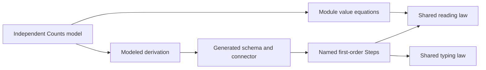

# PartitionedSemaphore scalar authoring probe

The probe checks authoring for scalar bookkeeping before partition registration.
It uses the finite natural-count profile of latest (Effect 4.0.1), `vendor/effect-4.0.1/src/PartitionedSemaphore.ts`.

## Obligations before proof

The proposed claim is `partitioned-semaphore-bookkeeping`.
Its concept is translation simulation, its role is simulation, and its requirement is R10.
Each value equation observes a reply and a scalar record.
The source reading theorem for that step consumes its value equation.
The shared `Step.sound` law supplies source reading.

The typing theorems serve `step-language-typed`, concept store typing, requirement R4.
Their consumer is the corresponding concrete source step.
The shared `Step.typed_of_normal` law supplies typing.

`reserve_eval` and `reserve_reads` require insufficient availability and a request within capacity.
Their premises identify the source branch.
Their arithmetic equations alone do not establish branch selection.

The probe establishes no registration, allocation, deferred identity, wrapper execution, schedule, fairness, progress, or host agreement.
It proposes no production contract or semantics registry amendment.
It serves the catalogue's next R10 module slice.

## Authoring question

Can a derived scalar structure supply the record schema and connector for typed steps without handwritten field order or carrier tuples?

`Model.lean` defines the independent model and derives its connector.
`Probe.lean` uses `Counts.modeledTy`, `Counts.modeledToC`, `Counts.modeledOfC`, `Counts.modeled_to_of`, and `Counts.modeled_of_to`.
The deriving command supplies each declaration.
The model uses ordinary records and arithmetic before the step definitions.

The author still names field references, input contexts, source applications, value equations, and source theorem premises.
The author still spells input carrier tuples for source reading.
The author still chooses result types for record construction.
The author still labels each proof's concept, requirement, consumer, and scope.
Direct `Step.eval` and `Step.sound` calls need explicit input contexts when Lean cannot infer the carrier tuple.
The proof file uses `backward.isDefEq.respectTransparency false` to expose concrete carrier folds.
Finite controls decode results before comparing them because carrier projections hide ordinary equality instances.

## Run

Run `bash docs/research/2026-10-08-partitioned-authoring-probe/check.sh`.
The command builds only the named prerequisites.
It compiles the saved probe, checks its controls, and audits every probe declaration.
It writes `build.log`, `model.log`, `check.log`, and `trust.log` beside the source.
The compiled `.olean` files remain an uncommitted check artifact.

Whole identity-bearing cells remain outside `Modeled` derivation.
`Model.refusal` rejects deferred types because their identity requires a table.
The scalar probe cannot replace that premise with numeric request fields.
