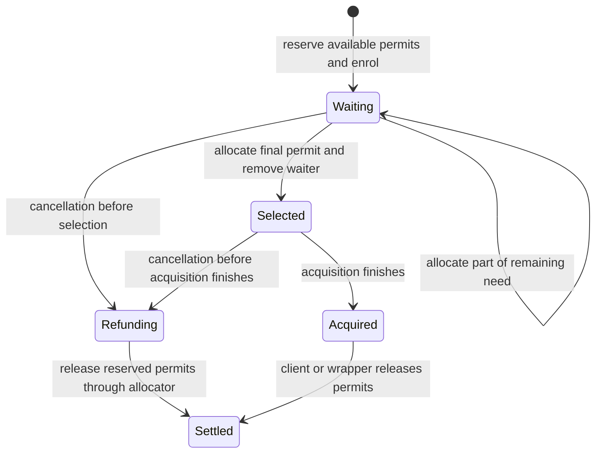

# PartitionedSemaphore: the next catalogue slices

PartitionedSemaphore needs reservations and ordered delivery, not ordinary Semaphore's retrying waiters.
The first production slice covers scalar bookkeeping after the checked authoring probe.
A whole-module agreement must retain cancellation between selection and completed delivery.

Base: `8785c6f989f7b25df220649a238e93eda03921cb`.
The catalogue brief places this module after Ref.
Decisions rows 330, 331, 333, and 335 supply the model, observation, latest-source, and composition constraints.
Claude owns S1 in the primary checkout.
This work uses isolated worktrees and leaves those files with Claude.

## Immediate order

1. Narrow the C3 explanation tool's axiom exception to exact implementation declarations.
2. Retain the PartitionedSemaphore behavior controls and the scalar authoring probe.
3. Land the scalar bookkeeping model, steps, and their shared-law connections.
4. Model waiter enrolment, one-permit selection, and reservation settlement before their steps.
5. Connect delivery and client observations only through their stated wrapper obligations.

The C3 review finds four structures deriving three schema certificates each inside the newly exempted explanation module.
The [repair receipt](2026-10-08-explain-admission-receipt.md) records the certificate control and the exact implementation exceptions.
The repair keeps those certificates under the ordinary axiom ceiling.
It leaves the explanation implementation's measured exception at its exact declarations.

## Admitted source profile

Latest (Effect 4.0.1) is the source under `vendor/effect-4.0.1/`.
The first profile uses natural partition keys and finite natural permit counts.
Zero capacity is allowed.
Negative, fractional, infinite, and NaN inputs are outside this profile.
Any host comparison also keeps numeric encodings within their exact admission bounds.
These restrictions select a source profile; they change no existing Semaphore ruling.

PartitionedSemaphore shares one available count across all partitions.
A waiting acquisition reserves the available permits before enrolment.
The independent model records the original request and its remaining need.
One allocated permit reduces one oldest waiter's need in the selected partition.
The release cursor follows partition insertion order across calls.
Deleting the last waiter removes its partition.
Reinserting that key gives the partition a new insertion position.

## Scalar bookkeeping slice

The independent `Counts` structure holds `capacity`, `available`, and `waiting` as natural numbers.
It is a subrecord for later state, not a numerical replacement for handles or waiters.
The authoring probe checks `deriving Modeled`, named inputs, named fields, and shared reading and typing against this structure.
No hand-written schema or input position belongs in the module's public declarations.

| Operation | Independent value rule | Scope |
| --- | --- | --- |
| Initial counts | Capacity and availability equal the supplied total; waiting is zero | Includes capacity zero |
| Read availability | Return the available count without changing state | No allocation or progress claim |
| Try acquisition | Zero succeeds unchanged; excessive count fails unchanged; otherwise subtract the count from availability | The private `tryTake` calculation, not the `withPermitsIfAvailable` wrapper |
| Reserve for enrolment | Need equals request minus availability; availability becomes zero; waiting gains that need | Requires insufficient availability and a request within capacity |

Registration rechecks availability in the source.
The reservation equation must retain its insufficiency premise, or an enclosing step must answer retry when the premise fails.
The scalar slice does not claim to enrol, suspend, resume, or cancel a waiter.

## Checked authoring surface

The [scalar probe](2026-10-08-partitioned-authoring-probe/Probe.lean) uses the public authoring and law entry modules.
Its [independent model](2026-10-08-partitioned-authoring-probe/Model.lean) declares the scalar record once.
Deriving supplies its schema, carrier maps, and inverse laws.
Named record construction accepts fields in a different order from the structure.
Named contexts supply both stored inputs and source applications.
The generic reading and typing laws connect each concrete step under their existing premises.

The probe still exposes positional value tuples in proof callers.
A small follow-up should pack carrier values from the existing named context declaration.
It should reject missing, repeated, unknown, and wrongly typed fields, just as source applications do.
It should infer the context and use the existing carrier interpretation.
It adds no stored syntax and no second metadata list.
The independent model equations remain author obligations.

## Retained behavior controls

The [host packet](2026-10-08-partitioned-semaphore-probes-receipt.md) retains the checked observations and deliberately wrong predictions.
It checks partial reservation, refunds, acquisition cleanup scope, reentrant release, partition order, and iterator mutation.
Its runner checks selected input hashes and the pinned TypeScript compiler before comparing retained output.
These finite host controls constrain the next independent model.
They establish no whole-module simulation or claim across schedules.
Cancellation after selection remains conditional source evidence, with no deterministic host reproduction in this packet.

## Waiting and delivery model

A partition records its natural key, insertion stamp, and FIFO waiters.
A waiter records its abstract request identity, original count, and remaining need.
The state records ordered live partitions, the next insertion stamp, and the persistent cursor.
Abstract request identities use the existing contextual handle mapping in the implementation connection.
They never become numerical runtime identity fields merely to satisfy deriving.

The cursor selects the first live partition whose stamp is at least its position.
If none remains, selection restarts from the first live partition.
Selection advances the cursor past that partition's stamp.
A new partition receives a fresh stamp; deleting a partition does not rewind the cursor.
The eventual correspondence must state its ordering and freshness premises.

A successful final allocation removes the waiter synchronously and produces a wake record.
Removal alone does not mean delivery has completed.
The source's cancellation closure still retains the selected entry until the acquisition finishes.
Its remaining need can be zero while its entire reservation remains refundable.
A withdrawal that looks only in the live queue therefore loses a required cancellation case.

A later failure after completed acquisition does not refund a plain take automatically.
The wrapper's exit behavior is a separate connection.
The source can run a resumed client's synchronous continuation inside release before release returns.
That continuation may change availability or enrol more waiters.
A sequence of pure allocations followed by all wakes therefore does not state the public release observation.

## Invariants for the later cell

- Availability is at most capacity.
- Waiting equals the sum of live remaining needs.
- Positive waiting implies zero availability.
- Each live partition has at least one waiter.
- Each live remainder is positive and at most its original request, which is at most capacity.
- Live partition keys and insertion stamps are distinct.
- Partition stamps increase in list order and remain below the next stamp.
- Request identities remain distinct while waiting or selected reservations remain unsettled.

These are planned premises and obligations, not proved facts of a landed PartitionedSemaphore implementation.

## Proof placement

| Obligation | Concept and question | Reach and premises | What it does not establish | Consumer and requirement |
| --- | --- | --- | --- | --- |
| Scalar value equations | `translation-simulation`; helpers of proposed `partitioned-semaphore-bookkeeping` | Independent counts; natural inputs; explicit reservation branch premises | Enrolment, delivery, host behavior, or schedules | The scalar reading connectors and later operation connections; R10 |
| Scalar source readings | `translation-simulation`; same proposed claim | Successful input readings; derived exact image; shared Step reading premises | Allocation or codec admission from type membership | Checked Ref-backed bookkeeping callers; R10 |
| Scalar typing | `store-typing`; helper of `step-language-typed` | Typed caller inputs and shared Step facts | Handle allocation or semantic module agreement | Checked bookkeeping callers; R4 |
| Ordered selection | `translation-simulation`; proposed later allocation claim | Valid live partitions, ordered insertion stamps, and cursor correspondence | Wake delivery, fairness, or public release reply | One-permit allocation connector; R10 |
| Reservation settlement | `translation-simulation`; proposed wrapper connection | Explicit waiting, selected, acquired, and cancellation states | Arbitrary client observations or unqualified progress | Waiting and protected-permit wrappers; R10 and R11 |
| Contextual request identity | `store-typing`; L6 and G9 | Role-specific table injectivity and actual handle-allocation premises | Whole-cell deriving from a data-only example | Equality and wait delivery connections; R4 |

The coordinator owns additions to the semantics registry and any owner ruling.
A production slice places its concrete claim and readers before proving helpers.
The research probes establish their stated finite or checked scopes only.

## Explicit gaps

G1 covers the meaning of waiting, cancellation settlement, and wake delivery.
G5 covers client execution inside a module's observation.
G9 covers the contextual handle correspondence.
G10 covers module observations across schedules and any progress claim.
The step language also lacks general key equality and a numeric repetition builder.
Natural keys and one-permit steps avoid those latter requirements only within the stated first profile.

Whole-state deriving remains open for cells containing actual deferred identities.
The scalar probe does not close L6.
The full release and cancellation operations must wait for the delivery contract.
No current result licenses ordinary Semaphore's `waitRetry` behavior here.

## Verification and completion

The first production slice finishes with an independent model and checked Step value, reading, and typing connections.
Its accepted caller and deliberately wrong state update must exercise the same public entry modules.
Regenerate engine fixtures and recheck affected Faces tests after any production step change.
Keep exact images, membership, codec admission, allocation, transition agreement, and finite host comparison as separate evidence.
Use one narrow Lake process per worktree, with `LEAN_NUM_THREADS=3`.
TypeScript controls use pinned tsgo 7 and exact Effect 4.0.1 inputs.
No full sweep, merge, or push belongs to this plan.
