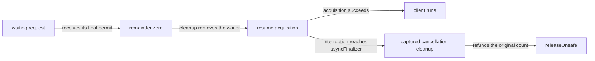

# PartitionedSemaphore delivery and cleanup boundaries

Status: research note, history rather than authority.
Base: `8785c6f989f7b25df220649a238e93eda03921cb`.

## Question

Which source boundaries prevent pure allocation steps from stating the whole public operation's observation?

## Sources inspected

The measured source hashes appear in `inputs.json` beside this file.
The installed source and vendored source agree for every source pair that the fingerprint command checks.

| Declaration | Pinned path | Inspected range |
| --- | --- | --- |
| makeUnsafe, releaseUnsafe, take | vendor/effect-4.0.1/src/PartitionedSemaphore.ts | 117–245 |
| withPermits, tryTake, withPermitsIfAvailable | vendor/effect-4.0.1/src/PartitionedSemaphore.ts | 247–307 |
| MutableHashMapProto iterator | vendor/effect-4.0.1/src/MutableHashMap.ts | 91–95 |
| callbackOptions, asyncFinalizer | vendor/effect-4.0.1/src/internal/effect.ts | 1136–1202 |
| OnExitImpl, onExitUnsafe | vendor/effect-4.0.1/src/internal/effect.ts | 4164–4224 |
| withFiber | vendor/effect-4.0.1/src/internal/core.ts | 619–627 |

## Findings

Evidence status: source inspected.
Scope: finite natural requests and the inspected runtime implementation.
Proof role: proposed constraints for the next module contract.

`releaseUnsafe` reduces the selected waiter's remainder to zero before calling its resume function.
That function removes the waiter before resuming the acquisition effect.
`callbackOptions` calls `fiber.evaluate` directly when that fiber has yielded.
The resumed client can therefore run before the releasing operation returns.
The finite reentrant control checks this source path with a client that releases its permit immediately.

The diagram separates selection from acquisition success.
It states no scheduler or delivery law.

The cancellation effect retains the original request size and the mutable waiter entry.
It subtracts `entry.permits` from the waiting total and releases `permits - entry.permits`.
At remainder zero, that formula refunds the full original request.
Cleanup removal does not erase these captured values.

`callbackOptions` retains its cancellation effect in an `asyncFinalizer` stack entry.
Its resume function sets `resumed` and enters the fiber, but does not directly remove that stack entry.
If interruption reaches that entry before acquisition success consumes it, `asyncFinalizer` runs the captured cancellation effect.
This is a source constraint on a proposed delivery model.
The packet contains no deterministic host reproducer for this interruption boundary.
It establishes no claim that every schedule reaches that boundary.

Immediate `take` registers `onExitUnsafe` for its current `withFiber` evaluation.
That cleanup refunds only when this evaluation fails.
Once acquisition succeeds, a later client failure does not trigger that acquisition cleanup.
The finite completed-take control checks the retained-permit observation.

Callback registration checks availability again before reserving or enrolling.
If availability has changed, it resumes another `take` instead of enrolling.
A separate enrolment step therefore needs an insufficiency premise or a retry reply.

## Proposals

A pure allocation step ends at state change and a wake record.
That record retains the original request size and reservation identity until acquisition delivery settles.
A withdrawal based only on current waiter lookup cannot describe the conditional cancellation path above.
The next contract must place this path before claiming public acquisition or release observations.

## Limits

Native `Map` controls check selected deletion, reinsertion, append and exhaustion cases only.
They are finite probes, not a formal iterator simulation.
The packet states no fairness, progress, whole-module agreement or law across schedules.
General keys, fractional counts, negative counts, non-finite counts and large-number rounding remain outside these controls.
