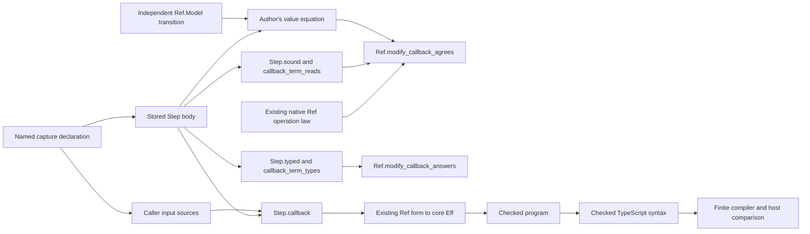

# Ref catalogue landing receipt

The Ref slice reuses the existing native operations and adds one shared connection for typed callbacks.
Its capture rules account for both the caller's scope and bindings inside captured expressions.
The semantics registry join remains a proposal for the coordinator's C3 work.

Base: `b8b4099eb6516f59d4380f8a8bdcb488332adeee`.
Code head: `84deccef2ec90340789e5d1831f6f0281d55d7b9`.
Branch: `codex/module-catalogue`.
Worktree: `/Users/pooks/.codex/worktrees/module-semaphore/lean4-effect4`.
The primary branch now contains the code head after a separate fast-forward integration.
This slice edits only its isolated worktree.
No push or sweep runs.

## Result

`Ref.Model` independently defines all thirteen effectful operations in Effect 4.0.1.
Its file imports neither the step language nor the machine.
The existing native operations remain the implementation.
There is no new cell record, operation family, or program representation.

`Step.callback` connects a stored step to an existing native callback form.
It resolves captured inputs at the caller's original scope and location.
It relocates each captured term's internal bindings before inserting the current-value slot.
Shared reading and typing laws establish both parts once.
The final program checker still checks the selected operation's required callback shape.

`Ref.modify_callback_agrees` connects the callback to an independently supplied transition.
Its premise states the value equation between the step and that transition.
`Ref.modify_callback_answers` derives operation typing from the step's facts and typed caller inputs.
Authors supply no premise that their inputs survive the callback's new binding.

The public `Effect4.Author` entry now exports the callback connection and existing generated Forms helpers.
The Ref acceptance programs import `Effect4.Author` and `Effect4.Run` alone.
The Ref library entry and proof entries remain on their respective sides of the import boundary.

## Authoring surface

The checked example is `Test.Program.RefPrograms.modifyBody` in `Test/Program/RefPrograms.lean`.
The declaration of captures supplies both the callback's input metadata and the source readers.
The author writes no input positions or generated binder names.

```lean
step_context% NatCaptures (amount : .nat)
abbrev NatInputs : InputContext := ("current", .nat) :: NatCaptures

def modifyBody : Step NatInputs.types (.prod .nat .nat) :=
  step_inputs% NatInputs => .pair (.nat 41) (.add current amount)

-- Inside a caller with the reference q and captured source amount:
Step.callback modifyBody
  (input_sources% (NatCaptures) {amount := amount})
  (Ref.modifyWith q)
```

The same connection supplies update, optional update, and modify callbacks to their existing forms.
The author still proves a module's independent value equation.
Generating that certificate remains G3; the module form remains G2.

## Proof placement and consumers

The plan `docs/research/2026-10-08-ref-catalogue-plan.md` precedes the proofs.
The model receipt records the individual operation obligations and their hypotheses.

| Obligation | Concept and question | Reach and premises | Limits | Consumer and requirement |
| --- | --- | --- | --- | --- |
| Shared callback reading | `translation-simulation`; helper of `step-language-sound` | One inserted binding; aligned scope; input readings; canonical step; required identity interpretation | No host execution or allocation claim | `Ref.modify_callback_agrees`; R10 |
| Shared callback typing | `store-typing`; helper of `step-language-typed` | Aligned scope; typed captures; step normalization and formation facts | No membership or allocation inference from an image | `Ref.modify_callback_answers`; R4 |
| Independent operation agreement | `translation-simulation`; proposed `ref-steps-agree` | Encoded current value; allocated cell; successful callback evaluation in its required shape | Replies and final stores, without write events or schedules | Callback agreement and later composed modules; R10 |
| Independent initial allocation | `translation-simulation`; proposed Ref allocation node | Arbitrary exact image; the existing native allocation step | No host allocation identity theorem | Ref callers; R10 |
| Captured operation agreement | `translation-simulation`; proposed Ref callback node | The independent transition equation and shared callback premises | One native update; no arbitrary JavaScript callback or whole-run theorem | `Test.Program.RefAgreement`; later module callbacks; R10 |
| Captured operation typing | `store-typing`; helper of `fold-typed-atomic-update` | Normal formed cell and reply types; typed receiver and captures; step facts | Existing membership and allocation premises remain separate | `Test.Program.RefAgreement`; later module wrappers; R4 |



The semantics registry proposal uses the concrete operation laws in `src/Effect4/Laws/Library/Ref/Operations.lean`.
It keeps `make_agrees` separate from the twelve laws requiring an allocated cell.
It adds the callback connection through `modify_callback_agrees` in `src/Effect4/Laws/Library/Ref/Callback.lean`.
The placement attributes already associate the laws with R10 and R4.
C3 owns edits to the semantics registry; this slice changes no coordinator authority.

## Changed files

The exact code-slice file list is `docs/research/2026-10-08-ref-catalogue-checks/changed-files.txt`.
Git measures it between the base and code head above.
It includes the shared callback, Ref model and laws, public entries, batteries, architecture roles, and retained compiler inputs.
This receipt adds its audit source and the retained integration logs beside that list.

## Verification

| Command or check | Measured result |
| --- | --- |
| `LEAN_NUM_THREADS=3 lake build Effect4.Laws.Library.Ref.Callback Effect4.Author Effect4.Library Tools.ArchitectureRoles` | Pass, 578 jobs |
| `LEAN_NUM_THREADS=3 lake build Test.Program.RefAgreement Test.Program.RefModel` | Pass, 929 jobs |
| Integration command below | Pass, 981 jobs |
| `LEAN_NUM_THREADS=3 python3 scripts/generate.py --only fixtures` | Pass; no engine fixture changes |
| `opam exec --switch=effect4 -- dune exec engine/test/test_engine.exe`, from `ocaml/` | Pass, 162 checks and no failures |
| Focused trust command below | Pass, 172 declarations within `[propext, Quot.sound]` |
| Compiler and host command below | Pass, 21 callers on Effect 4.0.1; tsgo 7.0.0-dev.20260629.1; Bun 1.4.2 |
| Isolated compiler faults | Four expected diagnostics; restored compilation passes |
| Stored-state mutation | Typing accepts it; execution detects `[41, 5]` instead of `[41, 7]` |
| Emission comparison after entry integration | All 21 emitted callers and 24 compiled inputs remain byte-identical |
| Source import check | All 16 changed library and battery sources reach their intended roots |
| Compiled core import check | Ref and Step.Callback are reachable; no Laws or Aesop import |

```sh
LEAN_NUM_THREADS=3 lake build Test.Program.RefFaces Test.Program.RefAgreement \
  Effect4.Laws.Author Tools.LoadPaths Test.Audit.Exposure \
  Test.Program.QueueFaces Test.Program.SemaphoreFaces Test.Program.SemaphoreEngine \
  Test.Program.PoolEngine Test.Program.QueueEngine Test.Dogfood.Scenario.Lowered

LEAN_NUM_THREADS=3 lake env lean -DwarningAsError=true \
  docs/research/2026-10-08-ref-catalogue-audit.lean

python3 harness/ref-catalogue/run.py --skip-build \
  --install /Users/pooks/Dev/lean4-effect4/ts/release/node_modules \
  --out /private/tmp/ref-catalogue-integrated-20261008
```

Use a fresh output directory when reproducing the host command.
The runner retains evidence and refuses to overwrite it.
The preceding narrow build justifies `--skip-build` in this recorded run.
The engine command covers existing native Ref paths, including captures and folds, on both store implementations.
It does not execute the new twenty-one-case packet in OCaml.

The retained checks are under `docs/research/2026-10-08-ref-catalogue-checks/`.
The exact TypeScript inputs remain under `docs/research/2026-10-08-ref-callers-evidence/`.
The integrated host receipt records the changed Lean source hash and unchanged emitted input hashes.
The independent agent receipts remain historical evidence of their reviewed commits.

## Reuse measurement

The focused command reports 25 theorems, with 25 local, 12 tree, and 63 core dependency edges.
Its direct-citation reuse ratio is 32%.
It reports zero new load-bearing nodes against the loaded semantics registry roots.

This is the tool's direct-citation view, not a measure of semantic usefulness.
The new claim joins remain proposed, and the report omits anonymous battery readers.
The earlier scout also records missed dependencies through ordinary definitions and roots absent from the loaded environment.
The concrete consumers above supply the proof connections that this ratio cannot describe.
No heartbeat limit increases in this slice.

## Boundaries and next slice

`Ref.set` retains the existing native cell-identity reply, under DI-98.
Effect 4.0.1 returns its backing MutableRef despite declaring void.
The public finite caller discards that reply explicitly through `Forms.asVoid`.
The raw host control distinguishes the backing object from the outer Ref object.

The model retains optional writes.
The operation laws observe final stores and replies; they do not observe write events.
`modifySome` writes the old value on None, while the optional update operations skip that write.

The laws cover pure step callbacks under their stated reading and typing premises.
They establish no arbitrary JavaScript closure, callback exception, reentrant mutation, aliasing behavior, progress, or schedule theorem.
`makeUnsafe` and `getUnsafe` remain outside the effectful surface.
Membership, exact encoding, codec admission, handle allocation, one-cell agreement, and finite host comparison retain separate claims.

PartitionedSemaphore is next in the catalogue.
Its model must retain partial reservations and ordered keyed waiters, with cancellation refunds and the release iterator.
The earlier catalogue scout retains counterexamples to direct reuse of ordinary Semaphore behavior.
The new Ref foundation does not discharge the waiting, delivery, identity, or schedule gaps.
The next slice must state that model before adding its steps.
