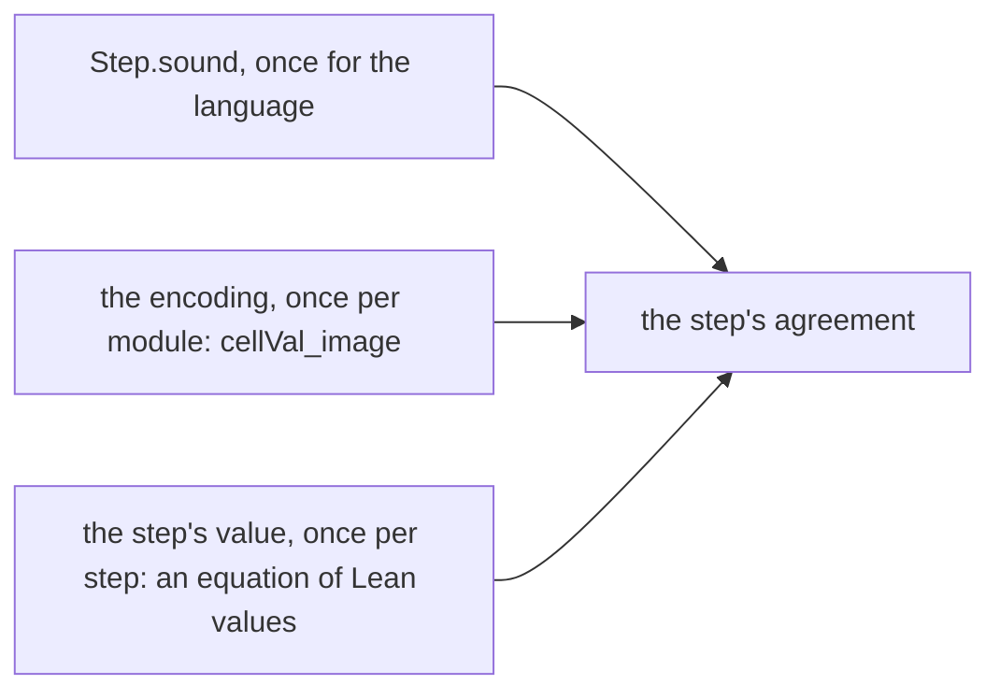

# 2026-10-08 seat MODULES, slice L3: four modules on the step language

Status: landed. Decisions row 330 records the ruling and this slice. The owner widened the slice
from Semaphore's `takeIfAvailable` to Pool, the Queue and the Latch, to look for more
compositionality.

## 1. The one thing to know first

Every step of the four modules that folds nothing now takes its laws from the step language:

- Semaphore's `takeIfAvailable` and `release`;
- Pool's `select` and `close`;
- the Queue's `size`;
- the Latch's four steps.

The ten existing theorems keep their statements, and each proof is now a corollary. Codex's
three open findings are repaired: OW-01, OW-02 and OW-03.

## 2. Base, head and files

- Base: `09da9715` (slice L2). Head: the commit that carries this receipt.
- The step language (`src/Effect4/Modules/Step.lean`, `src/Effect4/Laws/Modules/Step.lean`):
  - an operation `tuple2`;
  - the typing facts `Step.Facts`, with `Step.typed` over them and `Step.typed_of_normal` by the
    check;
  - the input helpers `Input.reads_cons`, `Input.types_cons` and their `nil` forms;
  - `Step.eval_ite`.
- The identity context gains a carrier for a type variable (`Model.Leaves.var`,
  `src/Effect4/Schema/Modeled.lean`).
- Fields by name: `src/Effect4/Schema/FieldRef/Elab.lean` (`field_ref%`).
- Each module's canonical field list is named once in its cell module:
  - `cellRecord` in `src/Effect4/Modules/Semaphore/Cell.lean`;
  - `cellRecord` in `src/Effect4/Modules/Pool/Cell.lean`;
  - `cellRecord` in `src/Effect4/Modules/Queue/Cell.lean`.
- The steps as data: `src/Effect4/Modules/{Semaphore,Pool,Queue}/Data.lean`, and the Latch's
  `src/Effect4/Modules/Latch/Steps.lean`.
- The connectors: `src/Effect4/Laws/Modules/{Semaphore,Pool,Queue}/Data.lean`, and the Latch's
  `src/Effect4/Laws/Modules/Latch/Model.lean` and `Steps.lean`.
- New proofs, same statements:
  - `takeIfAvailableStep_agrees` and `releaseStep_agrees`, with their two typing statements;
  - Pool's `selectStep_agrees` and `closeStep_agrees`, with their two typing statements;
  - the Queue's `sizeStep_agrees` and `sizeStep_typed`.
- Deriving (`src/Effect4/Schema/Modeled/Derive.lean`), with the core lemma
  `Model.refusal_record`.
- Batteries:
  - `Test/Program/LatchSteps.lean`, which is new;
  - `Test/Program/StepLanguage.lean` and `Test/Schema/Modeled.lean`, which changed.
- Registers:
  - `Test/Audit/AxiomGate.lean`: the elaborator is listed as meta code;
  - the three roots;
  - the semantics registry, `docs/core/semantics.md`, `docs/core/decisions.md`, `docs/STATE.md`
    and `generated/semantics.md`.

## 3. What composed: the factorization of an agreement

Each module's step agreement now factors into three parts.



1. **The reading law**, proved once (`Step.sound`).
2. **The encoding**, once for each module: a model state's carrier at the opaque identity
   context has the cell's value as its image (`cellVal_image`). For the native Latch it is a
   definition, so this part disappears.
3. **The step's value**, once for each step: the step's value on that carrier is the model's
   transition (`takeIfAvailable_eval`, `select_eval`, `wake_eval`, …). These are equations of
   Lean values, proved by cases and list lemmas, with no term or machine in them.

The typing statements need no connector. For a concrete type, the typing check closes by `rfl`.
For a type parameter, the module's own normal-form lemma (`cellTy_normal`) gives the facts.

## 4. What generalized, and what it asked for

- **Type parameters are opaque to a step.** Pool's resource type and the Queue's message type
  never reach a step's term: each `*_eq` theorem holds by `rfl` at every `A`. So the reading is
  taken with a type variable in place of `A`. Its carrier at the opaque context is the value
  itself (`Leaves.var`), and the model already holds raw values there (`res`, `msg`). Typing is
  taken at `A` itself, through `Step.Facts`.
- **The identity record is one shape.** Pool's `waiterTy`, the Queue's `takerTy` and the
  Latch's `waiterTy` are the same record of a hint and an identity. A shared request record is a
  candidate for the next slice. Semaphore's waiter extends it with a count and a stamp.
- **Thirteen steps wait for language features.** They are Semaphore's three, Pool's four, the
  Queue's five and the Latch's `await` and withdrawal:
  - **folds with captured inputs** (`removeById`, `renewHint`, `marked`, `freed`, `heldBy`,
    `gained`, `fromFirst`): the largest gap;
  - **record construction** (`mkWaiter`, `mkTaker`, `mkOffer`, `mkItem`);
  - **an identity test** (`same`): it needs a table-backed identity context with injectivity
    (slice L6), since the opaque context cannot decide two handles' equality;
  - **typed empty constants** (`noneT`, `nilT`), whose type is `never` below the one wanted;
  - a `cons` word.

## 5. Codex's findings

| Finding | Repair | Control |
| --- | --- | --- |
| OW-03, a position can silently select another field | `field_ref% "name"` writes the position from the schema. It refuses a missing name, a duplicate name, an optional field, a field of another type, and a schema it cannot read. Each module's data names its fields | `Test/Program/StepLanguage.lean`: a field inserted before `taken` moves its position, and the reference by name moves with it; one control per refusal |
| OW-03, the battery repeats Semaphore's schema | each module names its canonical list once (`cellRecord`), and `cellTy` is the record of it | the data modules and the battery use `Effect4.Semaphore.cellRecord` |
| OW-03, the battery repeats a clearing update | `cleared` is one step that `release` and its next cell share | the frame law's reader at `releaseNext` |
| OW-03, the algebra is hand-written | the reason is recorded in `src/Effect4/Modules/Step.lean`: the generator's support of a family indexed by `Ty` is not established | — |
| OW-01, deriving needs a field instance's body | `Model.refusal_record` composes each field instance's `checked`, and `decide` reads only the names' order | `Test/Schema/Modeled.lean`: a structure with an `opaque` field instance derives, and its membership reader holds |
| OW-02, a name collision leaves recovery declarations | every generated name is checked before anything is written, and a later failure restores the environment | `Test/Schema/Modeled.lean`: one refusal, and `Token.modeled_checked` is absent |

Codex suggested canonicalizing each module's own declaration (`Ty.canon cellFields`). That does
not reduce inside the core's module system: the string order's internals are not exposed there.
It reduces in a file outside the module system. So the canonical list is named once in each cell
module instead.

## 6. Commands and results

Run on 2026-10-08 from the repository root:

```sh
scratch/lean-slot.sh lake build Effect4 Effect4.Laws Tools.SemanticsRegistry
scratch/lean-slot.sh lake build Test.Program.LatchSteps Test.Program.StepLanguage Test.Schema.Modeled
scratch/lean-slot.sh python3 scripts/check-conform.py cases
```

All 38 batteries of Semaphore, Pool, the Queue, the Latch and the step language were built too,
from the list `Test/Program/{Semaphore,Pool,Queue,Latch,StepLanguage}*`. Every build completed
with no error and no warning. The case-site audit passed: `conform cases: PASS, exit 0`.

**Axioms.** A scratch audit walked every declaration of the 27 new and changed modules with
`Lean.collectAxioms`:

- every one is at `[propext, Quot.sound]` but the two metaprograms;
- `Effect4.Schema.FieldRef.Elab` and `Effect4.Schema.Modeled.Derive` reach `Classical.choice`
  through `MetaM`. Each is named in the gate's list of audit implementation modules, so neither
  entry is stale;
- no declaration reaches `sorryAx`.

The whole battery, the axiom gate over `Test.All` and `make check` were not run: they belong to
the owner's sweep.

## 7. Open obligations

- The thirteen steps of section 4, by the language features they need.
- The Latch's `await`, its withdrawal, its initial value and its wrapper.
- A shared request record.
- Slices L4 to L6, as the revision 3 note's section 6 orders them.

## 8. Evidence kinds

The theorems are proved for every model state, table, scope and type parameter in their
statements. The Latch battery's batching checks are finite evaluations of the model. Nothing
here is host evidence.
