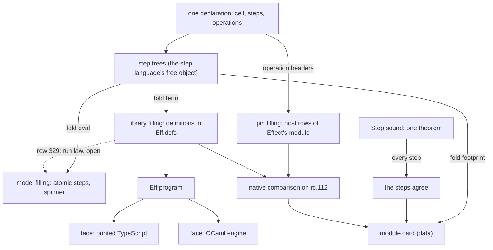
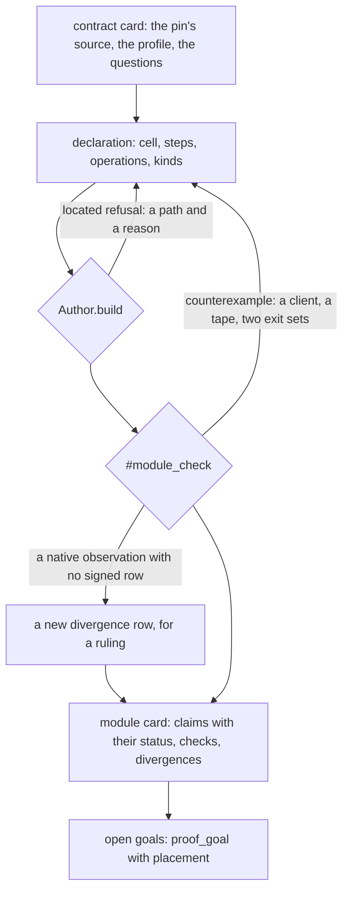

# 2026-10-08 seat MODULES design: an Effect module, authored once, checked and printed to TypeScript

Status: a design with eight compiled probes, written for Codex's review. Codex reviewed it at
`37c1dea4`; the revision is `docs/research/2026-10-08-seat-MODULES-r2.md`. Base: `f0ca3dcb` on
`refactor/phase1-phase3`. This note changes no decisions row. It proposes three questions for the
owner (§11) and ten review questions for Codex (§12).

It builds on two pieces of Codex's work that are not merged yet:

- `eff_module`, on branch `codex/module-authoring` at `3f5aadae`
  (`git:3f5aadae:src/Effect4/Program/Authoring/Module.lean`, its receipt
  `git:3f5aadae:docs/research/2026-10-08-module-authoring-receipt.md`);
- Codex's compatibility exploration, staged in that worktree and not committed
  (`docs/research/2026-10-08-module-compatibility-design.md` there).

The probes and their outputs are filed beside this note, in
`docs/research/2026-10-08-seat-MODULES/`.

## 1. The one thing to know first

A module has two halves of proof: its steps and its runs.

**The step half is solved by one pattern.** An author writes each step once, in a small typed step
language. The step is a tree of that language, which is data. The library's term, the model's
function and the step's metadata are three folds of the tree. One soundness theorem covers every
step of every module (probe MODS-8, `Step.sound`, at `[propext]`).

**The run half stays the open core.** It is the waiting wrappers across schedules: decisions row
329 and the slices S1 to S6 of `docs/research/2026-10-08-seat-SIM-design.md`. This design makes it
one law for each kind of operation, not one for each module.

## 2. What the owner asked

The owner's steer of 2026-10-08, in plain words:

1. Build Effect's modules, such as Pool and Semaphore, as checked modules, and grade their
   compatibility with Effect's own modules.
2. Give users the same tools, so a user-defined module gets the same checks and the same faces.
3. Centralize the moving parts in one deep module: compilation, staged compilation, the proof
   obligations, the TypeScript print and the LCNF route to OCaml.
4. Keep the surface Effect's, backed by an implementation whose parts carry named evidence, and
   brought to several targets.
5. Make it agent-first. An agent creates a module, and its meaning, its obligations and its
   differences from the pin are data.
6. Render that data. Authoring is visible as data, beside the program views.

## 3. Scenarios

| Scenario | The author writes | The author gets | Today |
| --- | --- | --- | --- |
| U1 use an Effect module | `Latch.await l` inside `eff do` | a program that prints to Effect TypeScript, and the module card | Queue, Semaphore and Pool as library programs; no card |
| U2 write a new module | the cell, the steps, one declaration of the operations | the library, the model, the agreement, the checks, the card | `eff_module` gives the definitions (Codex); the rest is by hand |
| U3 an agent writes it | the same, from a contract card | a refusal or a counterexample with its tape at each failure | the finite searches exist in scratch only |
| U4 swap the answerer | nothing: the client stays | the same client over the library, over Effect's module, over the model | the client is a Lean function over an operation record (§9, G5) |
| U5 change an implementation | a new step or a new wake | the checks and the card again, with the moved rows | by hand |
| U6 move the pin | the new pin's path | the native comparison again; each signed difference still holds or turns into a counterexample | the runtime census does this for the machine, not for modules |
| U7 grade compatibility | nothing | one row for each subject and check, with its evidence kind | Codex's exploration report, five rows |

## 4. The algebraic reading

**Module card.** A module card is the data record of one module's surface and evidence. It holds
the operations, the steps, the exclusions, the differences from the pin, the claims and the checks.
The owner's "verification certificate" is this record. A certificate in the dictionary is
narrower: a checker's evidence that a program has a type.

**Filling.** A filling is one handler for all of a module's operations. Decisions row 328, point
4, gives a row three answerers: the store, the host and the program. A module has four fillings:

| Filling | Answerer | What it is | Where |
| --- | --- | --- | --- |
| the library | the program | each operation is a definition of the block (`Eff.defs`); its body is the wrapper over the step terms | `Effect4` root |
| the model | the law side | each operation is one atomic step of the model; a waiting operation enrols, and a private spinner polls its ready predicate | `Effect4.Laws` only |
| the pin | the host | each operation is a host row named after Effect's export, such as `Row.host "Latch.await"` | a probe today |
| a substituted implementation | the target | handwritten or imported code bound to a definition's identity | later (Codex's target binding) |

A client is a program over the operations. Running it at a filling is a fold: each operation
goes to its answer.



The relations between fillings come in four grains:

| Grain | Relation | How it is established |
| --- | --- | --- |
| step | the library's step term reads the model's step | `Step.sound`, once for the language (MODS-8) |
| operation | each body checks against its declared row | the checker, at each build (`Author.build`) |
| run | the library's runs refine the model's runs, under every schedule | the relation of row 329; one law for each operation kind (§6.3) |
| target | the printed text reads back; it runs on the pin | `readModule_printModule_defs` (G6); finite runs, tested |

The step grain is agreement of folds. The term fold and the model fold are two algebras of one
free object, and one induction relates them.

## 5. What exists, and what each probe added

| Piece | Where | State |
| --- | --- | --- |
| term builders, `Ref.modifyWith`, the waiting wrapper (`waitAnswer`, `waitRetry`, `postAll`, `protectedBy`) | `src/Effect4/Program/Authoring.lean`, `src/Effect4/Modules/Waiting.lean` | landed |
| definitions, `Def.of`, `Params` | `src/Effect4/Program/Authoring/Defs.lean` | landed (PROC-4) |
| `eff_module`: operation headers once, invocations, installation | `git:3f5aadae:src/Effect4/Program/Authoring/Module.lean` | Codex, not merged |
| the reads lemmas of the term builders | `src/Effect4/Laws/Modules/Reading.lean` | landed |
| step agreement for Queue, Semaphore and Pool | `queue-steps-agree`, `semaphore-steps-agree`, `pool-steps-agree` | proved, by hand for each step |
| the run laws | `queue-expansion-agrees`, `semaphore-expansion-agrees`, `pool-expansion-agrees` | proposed claims (R10) |
| the report: rows, evidence kinds, obligations, proof references | `tools/Conform/Core/Report.lean`, `Evidence.lean`, `Obligation.lean`, `Proof.lean` | landed |
| signed divergences joined both ways | `scripts/check-effect-runtime-census.sh` | landed, for the machine's census |
| a module's stated differences from the pin | the section "The stated differences from the pin" of `Test/contracts/semaphore.contract.md` and `pool.contract.md` | Markdown tables, not data |

The probes, all on Effect's `Latch` (`vendor/effect-4.0.0-rc.112/src/Latch.ts`, and the class
`Latch` of `vendor/effect-4.0.0-rc.112/src/internal/effect.ts`):

| Probe | File | What it shows | Result |
| --- | --- | --- | --- |
| MODS-1 | `LatchProbe.lean` | Latch with today's tools: model, cell, steps, operations, `Def.of` definitions, three clients | builds; the definitions' exits equal the inline exits on L1 to L3 |
| MODS-2 | `DenProbe.lean` | a certified builder carries a term, a value and the proof that the term reads the value | `close_agrees` at `[propext]`; the term and the value equal the hand forms by `rfl` |
| MODS-3 | `LatchSim.lean` | the model filling (one atomic step, a spinner) and a bounded search of schedules | below |
| MODS-4 | `LatchSim.lean`, `pin/` | the same clients over Effect's own Latch as host rows, printed and run on rc.112 | below |
| MODS-5 | `StepAlgProbe.lean` | the step text against an abstract carrier, so the library keeps its import boundary | `close_agrees` at `[propext]`, one line |
| MODS-6 | `StepText.lean` | the author's surface `eff_step`; encodings by type (`Enc`), fields by name (`FieldOf`); a footprint carrier | three Latch steps; each projection equals its hand form by `rfl`; a red control |
| MODS-7 | `StepText.lean` | the operations built over the step projections; the module card as JSON | L2 answers `[true, 1, false]`; `latch-card.json` written |
| MODS-8 | `StepText.lean` | the step language as a free object, its three folds, one soundness theorem | `Step.sound` at `[propext]`; no line for each step |

MODS-3: the bounded search, depth 4, seven decisions, fuel 2000.

| Client | The library's exits | The model's exits | Library exits outside the model |
| --- | --- | --- | --- |
| c1: A waits, release, B waits, mark 3, open | `[3,1,2]` | `[3,1,2]`, `[3,2,1]` | none |
| c2: A and B wait, open, mark 3 | `[3,1,2]` | `[3,1,2]`, `[3,2,1]` | none |
| c1 with the fault "release opens" | `[2,3,1]` | `[3,1,2]`, `[3,2,1]` | `[2,3,1]`: caught |

MODS-4: one schedule each, on Effect `4.0.0-rc.112` under bun 1.4.2.

| Client | Ours on rc.112 | Effect's Latch on rc.112 | The Lean machine |
| --- | --- | --- | --- |
| d1 (c1's shape) | `[3,1,2]` | `[3,1,2]` | `[3,1,2]` |
| d2 (c2's shape) | `[3,1,2]` | `[3,1,2]` | `[3,1,2]` |
| d3: a waiter interrupted, then open | `[true,[3]]` | `[true,[3]]` | `[true,[3]]` |

Each of Effect's exits on d1 and d2 lies inside the model's set. So the native comparison reads as
a second refinement: Effect's own module against the same model (§9, G13).

## 6. The authoring API, layer by layer

### 6.1 The step language (MODS-6 and MODS-8)

The author declares the cell once. A generator writes the encoding and one field descriptor for
each field, with its two record lemmas by `rfl`.

```lean
structure State where          -- the model's state
  isOpen : Bool
  waiters : List Nat

instance : Enc State := ...                     -- the cell's record encoding
instance : FieldOf State "isOpen" Bool := ...   -- spelling "open", get, set, read, write
instance : FieldOf State "waiters" (List Nat) := ...
```

The author writes each step once, in Lean-like syntax:

```lean
eff_step releaseS (s : State) : (Bool × List Nat) × State :=
  if s.isOpen then ((false, emptyOf(s.waiters)), s)
  else ((true, s.waiters), { s with waiters := emptyOf(s.waiters) })
```

The step is a tree of the step language. Its constructors are `input`, `bool`, `ite`, `pair`,
`get`, `set` and `emptyLike`, each indexed by a Lean type and its encoding. Three folds read it:

| Fold | Answer | Used by |
| --- | --- | --- |
| `Step.term` | the step term | the library's `Ref.modifyWith` |
| `Step.eval` | the model's step function | the model filling and the module's laws |
| `Step.writes`, and a tree fold to JSON | the fields read and written, the tree | the module card and its views |

One theorem covers every step:

```lean
theorem Step.sound (h : Reads src env path vals (ei.enc v)) :
    (s : Step ι ei α e) → Reads (s.term src) env path vals (e.enc (s.eval v))
```

The probes record what each projection equals:

- `releaseS`'s term is MODS-1's hand term, by `rfl` (with `pair` for the inner reply, where MODS-1
  wrote `tuple`);
- its model is the spec "true where closed, every waiter woken, the latch stays closed", by `rfl`;
- its written fields are `["waiters"]`, by `rfl`.

The footprint is metadata, and it is evidence too. A step that does not write a field keeps it,
so a frame condition comes from the fold.

**The red control (MODS-6).** A wrong `release` that opens the latch agrees with itself: its term
reads its own model. The spec equation refuses it on a sample state. So agreement by
construction shows that the term is the text. It does not show that the text is the right step
(§9, G1).

### 6.2 Encodings and fields by type

`Enc α` gives the encoding of a Lean type: `Bool`, `Nat`, lists and pairs by instance, the cell
by the generator. `FieldOf σ "name" φ` finds a field's descriptor by its Lean name. So the author
writes `s.isOpen`, and the cell's spelling `"open"` stays in one place.

### 6.3 Operation kinds

Each operation of a module has one kind. The kind fixes the library's program, the model's
filling and the run law that serves it.

| Kind | The library's program | The model's filling | Latch | The run law it needs |
| --- | --- | --- | --- | --- |
| `make` | one `Ref.make` of the initial cell | the same | `make` | none: one allocation |
| `atomic step` | one `Ref.modifyWith` of the step term | the step | `close` | the atomic replacement (SIM S4) |
| `waits ready step withdraw` | `waitAnswer` over the attempt step, the withdrawal on interruption | enrol, then a spinner polls `ready` | `await` | the waiting law, with the policy as a parameter |
| `wakes step` | the step under `uninterruptible`, then `postAll` of the woken | the step alone; nothing is posted | `open`, `release` | the posting law: a helper resolves a hint the spinner reads |
| `expanded` | a library builder over a body, such as `protectedBy` | the builder at the model's operations | `whenOpen` | the builder's own law (`protectedBy_scoped`, …) |

The run law for each kind is stated once, over any step and any ready predicate that keeps the
policy's laws. The module factory plan already asks for this: "a shared waiting law takes the
policy as a parameter and requires the policy's own laws"
(`docs/research/2026-10-05-claude-lead/module-factory-plan.md`). Latch is the cheapest second
consumer after Semaphore, so the extraction can follow S6 at once.

### 6.4 The module declaration (proposed, not compiled)

`eff_module` keeps the operation headers. The proposal adds a kind clause to each operation, a
cell clause and a pin clause. One declaration then gives every filling and the card.

```lean
eff_module Latch
    pin "effect/Latch"                       -- Effect's module: the pin filling's rows
    cell State := ⟨false, []⟩                -- the cell, its encoding and its fields
where
  await (latch : handle) : .unit
    waits (fun s id => s.isOpen || !s.enrolled id) awaitS withdrawS;
  open (latch : handle) : .bool  wakes openS;
  release (latch : handle) : .bool  wakes releaseS;
  close (latch : handle) : .bool  atomic closeS
excluding
  whenOpen  "takes a program: stays expanded (DI-89)";
  makeUnsafe, openUnsafe, closeUnsafe, isOpen  "synchronous, outside Effect"
```

What the declaration generates:

| Output | Owner today | Proposed source |
| --- | --- | --- |
| definitions, invocations, installation | `eff_module` | unchanged |
| the library's bodies | the author, by hand | the kind, over the step terms |
| the model filling | a probe (MODS-3) | the kind, over the step models and the ready predicate |
| the pin filling | a probe (MODS-4) | the pin clause and each operation's Effect name |
| the step agreement | a proof for each step | `Step.sound` |
| the module card | none | the declaration, the semantics registry, the plan and the report |

### 6.5 The module card (MODS-7)

`latch-card.json` holds nine fields. The probe reads five from declarations and fills four by
hand:

| Field | Read from | In the probe |
| --- | --- | --- |
| `module`, `pin` | the declaration | by hand |
| `cell` | the cell's `Ty` | read |
| `operations`: Effect's name, the definition's spelling, parameters, answer, error, kind, steps, pin row | each `Defined.src`, and the kind clause | read, except the kind |
| `excluded` | the `excluding` clause | by hand |
| `steps`: reads, writes, tree | the step folds | read for `close`, `open` and `release` |
| `divergences` | data rows joined both ways, as the runtime census joins its rows | by hand |
| `obligations`: claim, grain, concept, status, evidence, consumer | `tools/Tools/SemanticsRegistry.lean` and the plan (`#plan_status`) | by hand |
| `checks`: check, subject, outcome, evidence, observation | `Conform.Report` rows | by hand, from MODS-3 and MODS-4 |

A producer fills the last three from their owners, and writes no status of its own. This follows
Codex's rule in the compatibility exploration: no second status system, no single percentage.

**A difference from the pin is a data row.** Its fields: an identifier, the operation, the pin's
behaviour, ours, the ruling row, a witness client, and a status (signed, candidate,
counterexample). The native comparison then classifies each observation:

- **agree**: equal exits;
- **signed**: unequal, and a signed row's witness predicts it;
- **counterexample**: unequal, and no signed row predicts it.

The contracts' tables "The stated differences from the pin" move into these rows. Codex's two
counterexamples (Semaphore over-release, Pool construction failure) are the first rows. Each
already has a ruling: rows 260 and 261 for Semaphore, row 267 for Pool.

### 6.6 The checks an author runs (proposed)

One command runs the module's finite checks and writes `Conform` rows:

```lean
#module_check Latch
  clients [c1, c2]          -- clients over the interface
  faults [releaseOpens]     -- each must be caught
  depth 4 fuel 2000
  native [d1, d2, d3]       -- printed over both answerers, run on the pin
```

| Check | Row | Evidence |
| --- | --- | --- |
| every client builds over each filling | `module.build` | tested |
| the library's exits lie inside the model's, over every tape to the depth | `module.bounded-refinement` | tested |
| each fault leaves the model's set | `module.fault` | tested |
| the native exits: agree, signed or counterexample | `module.native-observation` | tested |
| the step agreement | `module.steps-agree` | proved, by `Step.sound` |
| the run law | `module.whole-run-simulation` | unresolved until S6 |

The search is the explorer of `LatchSim.lean` and of the SIM probes, lifted into `tools/Conform`.

### 6.7 The faces

The definitions are the staging point. A module's body is written once, as definitions of the
block, and each face reads the block:

- the printed TypeScript module, one exported constant for each definition (PROC-3, G6);
- the OCaml engine's fixtures, by the generated group `fixtures`;
- later, a substituted implementation bound to a definition's identity, with its own
  representation relation (Codex's target binding).

The step language adds one more stage before the definitions. A step fold could print an OCaml
or a TypeScript step function directly. Each such fold needs its own relation to `Step.eval`.

## 7. The agent's loop



The agent never writes a step's agreement proof. It writes the model's state, the steps, the
ready predicates, the clients and the faults. Each of those is data or a short Lean text.

## 8. Rendering the authoring

The card is JSON, and its tree fields are the step trees. A view renders the operations, the steps
with their footprints, and the evidence of each grain. The probe's card is the first input for
the views of `native-view-design-steer` (the owner's view work).

## 9. The grill

**G1. Agreement by construction proves the term is the text, not that the text is right.** True.
The red control of MODS-6 shows it. Three checks are independent of the text: the spec equation
against a separately written model, the model's own laws, and the native comparison.

**G2. The model and the library share the step text, so a wrong text fools the bounded search.**
True: both fillings take their steps from one tree. The bounded search checks the wrappers and the
schedules, not the steps. MODS-3's fault swapped two operations, and so the search caught it. A
fault inside a step must be caught by G1's three independent checks. The native comparison is the
strongest of them, because Effect's module shares no text with ours.

**G3. rc.112 wakes in one batch; ours posts a helper for each waiter.** In rc.112, `open` and
`release` schedule one task at priority 0 (`scheduleUnsafe`). That task resumes every waiter in
order (`flushScheduled`), and an interrupted waiter leaves the pending batch. Ours posts one
helper for each waiter (`postAll`). No client of MODS-4 observes the difference. The model's exits
include both orders. The card records it as a candidate row with no witness. A witness search is a
probe for the review.

**G4. Every waiting operation needs a ready predicate.** It is spec content, one line for Latch:
open, or no longer enrolled. Semaphore's is "the request fits the free permits". Pool's counted
selection inside the posted task is harder (the module factory plan's waiting-policies table).

**G5. Clients that read the cell break the law.** MODS-1's L3 reads the cell, and the law excludes
it (row 329, question 3). Two designs answer this:

- **(a) Clients as Lean functions over an operation record** (today). A client that builds over the
  pin's opaque handle (`.handle "Latch.Latch"`) uses the handle only through operations. The check
  holds for one instantiation only, because a Lean function may inspect its argument.
- **(b) The interface as rows, with three answerers** (row 328, point 4). The client is one `Eff`
  program, the same bytes for every filling, and it types with the handle opaque. The library's
  answerer then needs the hidden handle type of row 230, so its definition can take the opaque
  handle and use its cell.

Design (b) makes the client data and the premise a typing fact. It depends on row 230 (§11,
question 2).

**G6. The operation count's yield is not a tape decision.** The bounded search runs at a fuel far
above one operation budget, so no injected yield appears in it. Each run law states the
budget-quiet premise (row 329, question 1).

**G7. Definitions are monomorphic.** A message type needs its own instance (`eff_module`'s group
parameters). Latch has no type parameter. Generic stored definitions are goal G8 of row 328.

**G8. Higher-order operations.** `whenOpen`, `withPermits` and `Pool.use` take a program. They stay
expanded (DI-89) as library builders with their own laws. The card lists them under the kind
`expanded`.

**G9. Names.** `eff_module` reserves `make`, `install` and `module`. Effect exports `make`.
Each operation needs its Effect name beside its Lean member name (Codex's finding).

**G10. The surface's shape.** The printed module exports `latchAwait(a0)`. Effect exports
`Latch.await(self)` and the method `latch.await`. Shape and behaviour are two subjects with two
rows. Codex's friendly aliases come from the same declaration.

**G11. Identities need a table.** The steps of Semaphore, Pool and Queue encode waiter identities
through a table (`reads_removeById` takes a `Table`). So the step language's encodings take the
table as a parameter. `await` and `withdraw` enter the language with `removeById`, `snoc` and
`record`, each of which has its reads lemma.

**G12. The step language is a new free object.** AGENTS.md admits a new representation only with its
sort's signature and the kind of each arrow. The step language is authoring-side: its term fold
writes the stored `Term`. MODS-6's alternative needs no new sort, but it emits one proof line for
each step and has no data tree. This note recommends the free object (§11, question 1).

**G13. Is the native comparison meaningful?** It is one schedule for each client on rc.112, a finite
check (tested). It establishes no target execution theorem (R8, DI-49). Its best reading: our
library and Effect's module each refine one model. An exit of Effect's module outside the model
is a signed row or a counterexample to the model.

**G14. The cost moves, it does not vanish.** Semaphore's law folder holds 2219 lines, and the shared
waiting laws 1866. The step half (the folders' `Steps`, `Reading` and `Relation`, and part of
`Typing`) becomes folds and one theorem. The run half is the investment: the SIM note sizes
Semaphore's law at 40 to 60 hours.

**G15. Typing by construction too.** Each step's typing is checked at each build today. A typing
fold over the step language and one theorem would replace the per-module typing statements:
Semaphore's `Typing.lean` holds six.

**G16. Is the abstract-carrier layer needed?** No. MODS-5 and MODS-6 needed it before the free object
existed. With MODS-8, `eff_step` can build the tree directly, and every carrier is a fold.

## 10. Placement of the obligations

| Obligation | Concept and property | Question | Reach | Not established | Unlocks |
| --- | --- | --- | --- | --- | --- |
| `Step.sound` | `translation-simulation`: a translation agrees with its meaning | a new claim `step-language-sound` | every step tree, every encoding, any scope where the input reads its value | that a step is the right one (G1); typing; any run | each module's `*-steps-agree` as a corollary; R10 |
| the typing fold's theorem | `residual-program-typing`: a well-typed step term | a new claim `step-language-typed` | every step tree at the cell's type | runs | the per-module typing statements; R10 |
| one run law for each kind | `translation-simulation`: a simulation between two programs | the claims `*-expansion-agrees`, over row 329's relation | budget-quiet runs; clients under row 329's premise | liveness; the host boundary | each module's law by instantiation; R10, R12 |
| the native comparison and the card | none: finite checks and data | `Conform` rows, no claim | the named clients, one schedule, rc.112 | any target execution theorem (R8, DI-49) | compatibility grading as data |

No obligation of this note has a consumer outside these rows.

## 11. Questions for the owner

Each is a choice of meaning, domain or representation.

1. **The step language as a free object.** The steps of a module are trees of a typed first-order
   step language, a new sort with its signature. Its folds give the term, the model and the
   metadata. Recommended: yes (G12, G16).
2. **The interface as rows with three answerers.** The client is one program, and a filling is an
   answer table. This needs the hidden handle type of row 230 first. The alternative keeps clients
   as Lean functions over an operation record. Recommended: (b), after row 230 (G5).
3. **What compatibility means.** Our library and Effect's module each refine one model of the
   module. Every difference is a data row: signed, candidate or counterexample. Recommended: yes
   (G13).

Row 329's three questions stay open, and the run half waits on them.

## 12. Questions for Codex's review

1. One command or three? `eff_cell`, `eff_step` and `eff_module`, or kinds and cells as clauses of
   `eff_module`.
2. Is the step language's signature right? Seven constructors now; the list, record and identity
   operations next (G11).
3. Should `Enc` carry the identity table, or should a module's encodings be a structure built from
   one table?
4. Where does an operation's Effect name live beside its Lean name (G9)?
5. Should the card's producer read `SemanticsRegistry`, the plan and `Conform.Report`, or
   `ProofGraph` alone?
6. Can a difference row reuse the runtime census's line format and its two-way join?
7. Does the kind table of §6.3 cover Queue, Semaphore and Pool? Pool's counted selection and
   the closer are the test.
8. Can the bounded search join `tools/Conform`, and at which bound does it stay inside a battery's
   budget?
9. Does design (b) of G5 fit the procedures note's section 5.1 (one row, three answerers) without
   a new constructor?
10. Which existing module migrates first to the step language: Semaphore, whose steps are the
    simplest of the three, or Latch, which is new?

## 13. Slices

Sizes are in hours of one seat. Gates follow each diff's reach.

| Slice | Hours | What lands | Owner |
| --- | --- | --- | --- |
| M1 the step language | 6 to 10 | `Step`, its folds, `Enc`, `FieldOf`, `eff_step` in the core; `Step.sound` and the claim in the law graph; Latch's three steps as readers | Claude |
| M2 cells | 4 to 6 | a command that writes the encoding, the field descriptors and the cell's `Ty` from one structure | Codex, with `eff_module` |
| M3 the list, record and identity operations | 6 to 8 | `await` and `withdraw` in the language; the table parameter (G11) | Claude |
| M4 typing by construction | 6 to 10 | the typing fold and its theorem (G15) | Claude |
| M5 kinds | 8 to 12 | the kind clauses of `eff_module`; the library and model fillings generated | Codex |
| M6 the checks and the card | 6 to 8 | `#module_check`; the card's producer; difference rows as data | Codex |
| M7 Latch end to end | 4 to 6 | Latch as the first module the declaration produces, with its card | Claude |
| the run half | per the SIM note | S1 to S6 after row 329's ruling; the kind laws after Semaphore and Latch | after the ruling |

M1 and M2 can run in parallel. M5 waits for M1 and M2. M7 waits for M3, M5 and M6.

## 14. What this does not establish

- No law of a whole run. Every bounded search is tested evidence, at depth 4 and one fuel.
- No target execution theorem. The native comparison runs three clients, one schedule each.
- `Step.sound` holds for the seven constructors probed. `await` and `withdraw` are outside the
  language today.
- The card's obligation, difference and check fields are hand-filled in the probe.
- The proposed syntax of §6.4 and §6.6 is not compiled.
- The probes import the law graph in one file. MODS-5 shows the split across the import boundary
  for one step only.

## 15. Reproduce

Run from the repository root, one `lake` at a time:

```sh
scratch/lean-slot.sh lake env lean docs/research/2026-10-08-seat-MODULES/LatchProbe.lean
scratch/lean-slot.sh lake env lean docs/research/2026-10-08-seat-MODULES/DenProbe.lean
scratch/lean-slot.sh lake env lean docs/research/2026-10-08-seat-MODULES/LatchSim.lean
scratch/lean-slot.sh lake env lean docs/research/2026-10-08-seat-MODULES/StepAlgProbe.lean
scratch/lean-slot.sh lake env lean docs/research/2026-10-08-seat-MODULES/StepText.lean
bash docs/research/2026-10-08-seat-MODULES/pin/run.sh
```

`LatchSim.lean` writes the six printed modules into `pin/`, and `StepText.lean` writes
`latch-card.json`. `pin/run.sh` prints both exits for each client, Effect's version and bun's.
