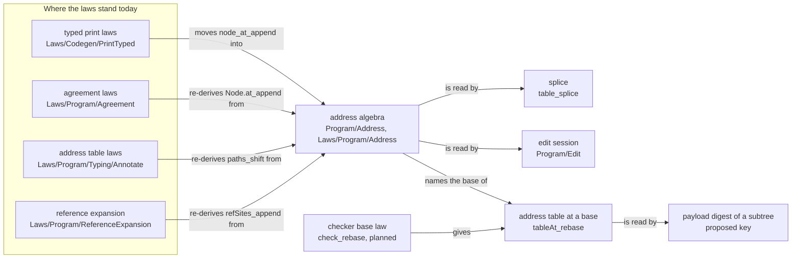

# 2026-10-08 Seat ORG: the theory map, the address algebra, and what the tools and the LCNF lowering stand on

Status: research note (history, not authority). Base: `cb1478a4` (`refactor/phase1-phase3`), the
splice law landed. Seat ORG wrote it read-only, beside the coordinator's landings. Nothing was
moved, edited or removed.

## 0. What was read or run

- **Read: the authorities.** `AGENTS.md`, `docs/STATE.md`, `docs/core/system-map.md`,
  `docs/core/semantics.md`, `generated/semantics.md`, `tools/ProofGraph/Registry.lean`,
  `docs/core/lcnf-route.md` and `ocaml/README.md`.
- **Read: the notes and the sources.** The four notes of 2026-10-08 that the brief names, and the
  address, typing, sketch, store and lowering sources cited below.
- **Run.** Seven scratch files, each through `scratch/lean-slot.sh lake env lean`, in
  `/private/tmp/claude-501/-Users-pooks-Dev-lean4-effect4/seat-ORG/`. `OrgFinal.lean` holds the
  measurements at the base. `OrgMeasure3.lean`, `OrgMeasure4.lean` and `OrgConnectors.lean` hold
  the new laws, the probes and the connectors. `OrgMini.lean` holds the in-degree query. The
  first two runs, `OrgMeasure.lean` and `OrgMeasure2.lean`, are superseded by `OrgFinal.lean`.
  The files are ephemeral, and Appendix A quotes the statements a reader needs to run them again.
- **The environment.** The scratch files import `Effect4.Laws`, `Effect4.Laws.Author`,
  `Tools.LoadPaths`, `Tools.Query` and `Tools.Semantics`. The graph holds 13,229 theorems of the
  tree, 258 roots and 7,041 load-bearing theorems (`#org_measure`, over `buildGraph`). Batteries
  under `Test/`, `src/OCaml5` and `tools/Conform` are not loaded.
- **The instruments.** `#load_report`, `#load_map` and `#landing_plan` (`tools/Tools/LoadPaths.lean`)
  ran as they are. Five scratch commands reuse its functions: `#org_measure` (categories),
  `#org_address` (the statement index), `#org_duplicates`, `#org_tools` (name literals) and
  `#org_general`, with `#org_lowering` over the closure manifests (`ocaml/gen/closure-*.tsv`).
- **Controls.** The name-literal scan finds the 9 laws that the query tool's header table names,
  and no others. The duplicate test pairs `Laws.Auto.bind_eq_ok` with `Program.bind_eq_ok`, and
  C5 shows them equal by `rfl`. It does not pair `Agreement.Node.at_append` with `node_at_append`,
  an instance and not an identity, which C1 relates by hand.
- **One later reading.** `#org_indeg` gave the in-degrees of §4.1's family members. It ran after
  the coordinator built the edit session's modules, uncommitted at the base, so its environment
  holds them too.

The words of the load-paths note keep their meaning here (`docs/research/2026-10-08-load-paths.md`
§3): load-bearing, unconsumed, off the roots' paths, reuse ratio. Five more words:

| Word | Meaning here |
| --- | --- |
| category | a group of modules that own one kind of semantics, named by module prefixes (§2) |
| joint | a theorem that many proofs name; its count is its in-degree along proof terms |
| stranded | a general lemma that lives in a consumer module, away from the module that owns its subject |
| payload digest | the hash of a value's canonical bytes: `Canonical.digest` (`src/Effect4/Store/Domain/Canonical.lean`) |
| node digest | the hash of a stored node's bytes, the key under which the store keeps it: `Ref`, `address` (`src/Effect4/Store/Domain/Node.lean`) |

## 1. The one thing to know first

- **The address algebra has no home, and its laws live in its consumers.** 242 theorem statements
  name `Node.at_` (`src/Effect4/Program/Refs.lean`), in 36 modules. The two address modules hold
  11 of them. 31 pure path lemmas stand outside the address modules, among them `node_at_append`
  in a printer law module (`src/Effect4/Laws/Codegen/PrintTyped.lean`).
- **Shifting is solved for the table, and open for a program's own bytes.** The landed splice
  computes the new subtree's table at its absolute base. A subtree's bytes still depend on
  where it stands: variable levels, layer-reference targets and row positions. Two finite probes
  show a changed payload digest and a lost reference formation after a move.
- **Content addressing does not reach programs.** A program has exact canonical bytes and a payload
  digest, and the store has a `program` kind. No `Content (Eff NativeOp)` instance exists
  (`Content`, `src/Effect4/Store/Domain/Node.lean`), so the store cannot key a program. The 80
  store, node and wire theorems hold no root of the semantics registry, and 40 are unconsumed.
- **The tools and the lowering stand on laws that the graph does not count.** Only `Tools.Query`
  (`tools/Tools/Query.lean`) names laws, 9 of them, and 3 carry no registered load. `src/OCaml5`
  declares no theorem, while 426 of the 476 lowered `Effect4` declarations of the engine are
  named by some theorem.
- **One deep module answers most of it.** The proposed address algebra's four new laws are proved
  in scratch, at `[propext]` or `[propext, Quot.sound]`, and not yet in the tree (§3.4). Five
  connectors re-derive stranded address lemmas from general ones, two of them from the new laws
  (§4.1).

## 2. The categorization

Each row is a category of program-composition semantics. The outer frame is the module map of
latest (Effect 4.0.1), where it applies (decisions row 335,
`docs/research/2026-10-08-effect-building-blocks.md` §2). Every count comes from `#org_measure`.
A theorem counts in the first category whose module prefixes match its module. The prefixes are
the directories and files of the "Deep modules" column; the scratch file `OrgFinal.lean` holds
the exact list.

The columns: T is theorems, LB load-bearing, U unconsumed. "Reuse" is the reuse ratio: edges into
other categories over those and the edges inside the category. "Claims" counts the claim
pointers that the category declares, and "tops" the requirement top nodes.

| Category | Frame (row 335) | Deep modules | T / LB / U | Joints (in-degree) | Claims; tops; requirement | Reuse | Gaps |
| --- | --- | --- | --- | --- | --- | --- | --- |
| A1 the address algebra | none: programs as data | `src/Effect4/Program/Refs.lean`, `src/Effect4/Program/NodeLenses.lean`, `src/Effect4/Laws/Program/References.lean`, `PathFold.lean`, `PathOrder.lean` | 59 / 38 / 12 | `Path.sortBy_perm` 7, `Path.lt_irrefl` 6, `Path.lt_trans` 6, `Node.replaceAt_spec` 5, `Node.setChild_spec` 5 | 1 (`addressed-replacement`); 0; R14, R8 | 0% (0 tree, 52 local) | §3, §4: the composition laws stand in consumers |
| A2 layer references | none | `src/Effect4/Laws/Program/ReferenceExpansion.lean`, `ReferenceTyping.lean`, `ExpandFix.lean`, `Hoisting.lean`, `HoistingTotal.lean` | 53 / 31 / 14 | `typeOfProgram_eq_if_refsWF` 6, `Eff.hoistAll_ordered` 3, `Eff.restoreAll_hoistAll` 3 | 1 (`reference-expansion-complete`); 0; R8 | 50% | a target does not move with its layer (§3.3) |
| A3 focus, replacement, address table, splice | none | `src/Effect4/Program/Typing/{Focus,Table,Annotate,Splice,Call}.lean` and their laws | 91 / 65 / 23 | `tableAt_eq_cons` 8, `checkStmt_step_binds` 7, `effTy_of_check` 7, `focusAt_eq_some` 7, `tableAt_none` 7 | 7; 6; R14 | 31% | the checker's base law; R14 still lists `edit-frame` open, which `table_splice` answers |
| A4 whole program: parts and the module check | none | `src/Effect4/Program/Typing/Parts.lean`, `src/Effect4/Program/Definitions.lean` and their laws | 47 / 27 / 6 | `checkModule_sound` 9, `checkModule_eq_check` 7, `Signature.withDefs_rowOf_of_none` 6 | 4; 0; R1, R6, R14 | 41% | no law lifts the splice over the parts |
| A5 sketch and type slices | none | `src/Effect4/Program/Sketch.lean`, `src/Effect4/Laws/Program/Sketch.lean`, `src/Effect4/Laws/Slice/Lattice.lean` | 87 / 35 / 16 | `SigApp.withHoles_extends` 5, `SliceView.valid_up` 5 | 5; 4; R14 | 30% | 36 off the roots' paths; renumbering, admission and wire are open parts |
| T typing | none | `src/Effect4/Program/Checker.lean`, `src/Effect4/Program/Typing.lean`, `src/Effect4/Laws/Program/Typing/` | 689 / 471 / 115 | `effTy_complete` 45, `effTy_sound` 37, `Checker.term?_eq_ok` 32 | 6; 10; R1, R2 | 24% | no law locates a refusal below a base |
| F folds and their agreement | none | `src/Effect4/Program/Fold.lean` (generated), `src/Effect4/Laws/Program/Folds/`, `src/Effect4/Laws/Auto/` | 380 / 152 / 178 | `ListSubset.sound_nil` 165, `ListSubset.subset_of_check` 165, `Laws.Auto.bind_eq_ok` 80 | 1; 1 | 6% | the path folds lack a base law and a map law (§3.4) |
| Y type algebra | none | `src/Effect4/Program/Ty.lean`, `src/Effect4/Laws/Program/TypeAlgebra.lean`, `TyView.lean` | 361 / 270 / 46 | `Ty.sub_refl` 73, `Ty.subN_refl` 58, `Ty.ind` 52 | 5; 0; R3 | 8% | — |
| ST the step language | the module toolkit (row 330) | `src/Effect4/Step.lean`, `src/Effect4/Step/`, `src/Effect4/Laws/Step.lean`, `src/Effect4/Laws/Step/` | 416 / 287 / 38 | `Reads.to` 51, `types_app` 38, `Step.sound` 36 | 5; 0; R4, R10 | 26% | — |
| L the composed modules | cells with waiters, compositions, the stream stack, one cell | `src/Effect4/Library/<M>/`, `src/Effect4/Laws/Library/<M>/` | Queue 313 / 168 / 76; Semaphore 159 / 39 / 49; Pool 266 / 131 / 73; Latch 35 / 17 / 18; Stream 18 / 0 / 9; Ref 33 / 18 / 15 | into ST: Pool 372 edges, Queue 324, Semaphore 267, Latch 53 | Queue 5, Semaphore 4, Pool 11, Latch 2, Stream 0, Ref 1; 0 tops; R10 | Queue 45%, Semaphore 65%, Pool 59%, Latch 77%, Stream 79%, Ref 15% | no module law (G10); the Stream carries no load |
| R runs, journals, replay | kernel: fibers | `src/Effect4/Run/`, `src/Effect4/Laws/Run.lean`, `src/Effect4/Laws/Run/`, `src/Effect4/Laws/Program/{RuntimeR,Agreement,LoopAgreement}.lean` | 920 / 739 / 139 | `Sched.FMeans.id` 43; exported `Agreement.resolve_of_at` 9, `Agreement.Node.at_append` 7 | 10; 4; R8, R13 | 20% | an address law is exported from here (§4) |
| H the host session | none | `src/Effect4/Laws/Api/{HostSession,SessionMeaning,SessionRef}.lean` | 42 / 23 / 13 | `submit_conditions` 4 | 5; 5; R6 | 55% | — |
| M the typed state, M5 to M7 | kernel | `src/Effect4/Laws/Program/Typed/` | 2,023 / 1,584 / 322 | `ConfigTyped.machine` 118, `MachineTyped.wide` 81 | 44; 17; R9, R4, R5 | 11% | — |
| K the machine | kernel: fibers, `Ref`, `Deferred`, `Scope`, clock, layers | `src/Effect4/Machine/`, `src/Effect4/Laws/Machine/` | 2,212 / 630 / 883 | `ServiceKey` order instances 92, `Machine.Ok_of_subset` 89 (not load-bearing) | 13; 7; R11, R12 | 11% | 883 unconsumed |
| SC the store and content addressing | none | `src/Effect4/Store/` (the node, the store, the wire and the digests), `src/Effect4/Laws/Store/` | 509 / 50 / 230 | `Canonical.fits` 207, `acceptsIn_mono_of_subset` 206 (both not load-bearing) | 0; 0 | 0% | no registered claim; the store cannot key a program (§3.3) |
| SD Schema and codecs | none | `src/Effect4/Schema/`, `src/Effect4/Laws/Schema/` | 320 / 160 / 122 | `cata_pos_list_check_eq` 22 | 8; 2; R3 | 8% | — |
| CG the TypeScript face | none | `src/Effect4/Codegen/`, `src/Effect4/Laws/Codegen/` | 1,033 / 765 / 175 | `Program.bind_eq_ok` 49, `Template.match_below` 25 | 11; 26; R8, R10 | 16% | its top joint is a duplicate (§4) |
| LW the lowering | none | `src/OCaml5/`, `tools/Conform/Lcnf/` | 0 in `OCaml5`; 5 in `tools/Conform/Lcnf/TargetLaws.lean` (grep; not loaded) | — | 0; 0; R8 | — | §6 |

Three readings of the table:

- **A1 is a foundation with no reuse.** It names no theorem of the tree, and 30 of its 59
  theorems are used outside it. Its growth is in the consumers instead (§3).
- **The composed modules reuse the most, and nothing reuses them.** Each library category is used
  outside itself by 0 theorems. Their joints are the step language's.
- **The store carries no registered load.** 50 of its 509 theorems are load-bearing, and its two
  strongest joints are not.

The cross-category edges (`#org_measure`, top of 45 pairs) show the dependency direction. The
program interface uses the store's codec facts 723 times. The Pool, the Queue and the Semaphore
use the step language 372, 324 and 267 times. Typing uses the type algebra 301 times. The layer
references use the address algebra 21 times, and no other pair into A1 reaches the list.

## 3. The address algebra

### 3.1 What exists

An address is a path of child indices from the root of a program (dictionary §3.6). The table
lists the address and what is built on it. Then it lists the other positions that a move touches:
machine points, layer identities, levels, row positions and digests.

| Kind | Representation | Operations | Laws | Owner |
| --- | --- | --- | --- | --- |
| address | `List Nat` over `Node` | `Node.at_`, `Node.replaceAt`, `Node.layerAt` (`src/Effect4/Program/Refs.lean`); `Node.child`, `Node.setChild` (generated, `src/Effect4/Program/NodeLenses.lean`) | `replaceAt_spec`, `replaceAt_self`, `replaceAt_overwrite`, `at_replaceAt_disjoint`, `setChild_spec`, `child_setChild_ne` (`src/Effect4/Laws/Program/References.lean`) | A1 |
| environment along an address | `NodeEnv` | `Node.childEnv`, `Node.envAt`, `focusAt` (`src/Effect4/Program/Typing/Focus.lean`) | `NodeHasTy.child_step`, `NodeHasTy.replace_envAt` (`src/Effect4/Laws/Program/Typing/Replace.lean`); `focusAt_typed` | A3 |
| every address, at a base | the path fold | `foldMapAt_eff` and six siblings (`src/Effect4/Program/Fold.lean`); `Node.addresses` (`src/Effect4/Program/Typing/Table.lean`) | `mem_foldList_iff`, `foldMapAt_eff_fuse` (`src/Effect4/Laws/Program/PathFold.lean`) | A1 |
| a table at a base | `Table.Entry` | `table`; `Annotate.check` at a base path (`src/Effect4/Program/Typing/Annotate.lean`); `tableAt`, a definition in `src/Effect4/Laws/Program/Typing/Annotate.lean`; `Table.splice` (`src/Effect4/Program/Typing/Splice.lean`) | `annotate_eq_table`, `tableAt_eq_cons`, `table_splice` (`src/Effect4/Laws/Program/Typing/Splice.lean`) | A3 |
| a refusal's location | `TypeRefusal.path` | `Checker.check` takes the base path and locates each refusal at it | the verdict ignores the path: `effTy_of_check` (`Laws/Program/Typing/Annotate.lean`), `checkLayer_path` (`src/Effect4/Laws/Program/ExpandFix.lean`) | T |
| a part's base | `0 :: replicate k 1 ++ [0]`, `[1]` | `Eff.partAt` (`src/Effect4/Program/Typing/Parts.lean`) | `Eff.partAt_at` (`src/Effect4/Laws/Program/Typing/Parts.lean`) | A4 |
| a machine point | `Point.path`, `Capture.path` | `Point.child`, `Point.childWith` (`src/Effect4/Program/Compile.lean`) | `Agreement.at_child`; `Sched.at_child_of` (two copies, §4) | R |
| a layer's identity and a reference | `LayerId := List Nat` (DB-12); `LayerTerm.ref target`, absolute | `Eff.refSites`, `Eff.expandRefs`, `Eff.hoistAll`, `LayerTerm.refName` (`L_1_0_0`) | `expanded_refs_nil_of_wf`, `restoreAll_hoistAll` | A2 |
| a variable | a level: a position from the start of the environment | `Var.weaken`, `Eff.weaken` (insert one slot) | `check_weaken`, `effTy_weaken` (`src/Effect4/Program/Typing.lean`) | T |
| an operation | a row position: an index into the row table | `Sketch.hole app k` is `app.rows.length + k` | `holes_conservative`, `SigApp.withHoles_rowOf` | A5 |
| a value's bytes | a payload digest | `Canonical.digest` (`src/Effect4/Store/Domain/Canonical.lean`) | the exact codecs, `decode_exact` at each carrier | SC |
| a stored node | a node digest: `Ref α` | `address`, `Store.put`, `Store.get` | `address_eq_or_collision`, `address_inj` under a named injectivity premise, `get_put` | SC |

### 3.2 Which laws hold, and where they live

The lens laws of the address hold in A1. The laws that compose addresses do not. Measured by
`#org_address`, the statement index of each address operation:

| Operation | Statements that name it | Load-bearing | Modules | In the address modules |
| --- | --- | --- | --- | --- |
| `Node.at_` | 242 | 201 | 36 | 11 (`PathFold` 6, `References` 5) |
| `Point.child` | 105 | 78 | 19 | 0 |
| `Checker.check` | 72 | 59 | 19 | 0 |
| `Node.child` | 31 | 24 | 14 | 9 |
| `Node.replaceAt` | 27 | 8 | 6 | 6 |
| `Eff.layerRefsWF` | 24 | 15 | 12 | 2 |
| `Node.envAt` | 11 | 11 | 6 | 0 |
| `Node.childEnv` | 8 | 8 | 3 | 0 (`Laws/Codegen/PrintTyped.lean` holds 5) |

The densest homes of `Node.at_` are `Laws/Program/Typed/Denotation.lean` (55),
`Laws/Program/Agreement.lean` (24) and `Laws/Program/Intro/Weight.lean` (14). §4 lists the pure
path lemmas among them.

### 3.3 What is missing

**(a) Shifting a subtree's addresses when it moves or is spliced.**

- **At the table it is done.** `table_splice` computes the new subtree's table at the absolute
  base (`tableAt … (.eff q') path`), so no entry needs a shift. It also answers R14's open part
  `edit-frame`, which the semantics registry still lists as proposed.
- **A relative table cannot be placed.** No law says where a refusal lands when the base changes.
  The checker's verdict ignores the path (`effTy_of_check`). No theorem constrains its refusal's
  location. So no law lets a table computed once at `[]` stand at another address.
- **The composition laws are stranded or absent.** `node_at_append` and `node_envAt_append` live
  in `src/Effect4/Laws/Codegen/PrintTyped.lean`. No law composes `replaceAt` along a path, and
  none reads below an edit. Both are proved in scratch (Appendix A, N1 and N2).
- **The path folds shift at two yields only.** `foldMapAt_eff_paths_shift` and six siblings
  shift the address yield (`Laws/Program/Typing/Annotate.lean`). `LayerTerm.refSites_append`
  shifts the reference yield (`src/Effect4/Laws/Program/ReferenceExpansion.lean`). A general
  base law and a general map law are proved in scratch, and they re-derive both (Appendix A).
- **A reference does not move with its layer.** Tested by a finite probe: a program whose layer
  references its own first component has well-formed references (`layerRefsWF = true`). Moved
  under a `suspend` by `Node.replaceAt`, it keeps the stored target `[0, 0]`, which now names the
  enclosing merge, and `layerRefsWF` answers `false`.
- **A level does not move with its subtree.** `Eff.weaken` inserts a slot, and no operation
  removes one. A subtree moved to a shallower environment has no strengthening.
- **A row position moves with the application.** The open part `sketch-renumbering` of R14 waits
  on the definition of a map of positions.

**(b) Content addressing.**

- **A program has a payload digest and no node digest.** `Canonical (Eff NativeOp)` gives exact
  bytes (`Program.Wire.decode_exact`, `src/Effect4/Store/Domain/ProgramWire.lean`), so
  `Canonical.digest` applies. The store's kind table has `program`
  (`src/Effect4/Store/Carrier/Kind.lean`). No `Content (Eff NativeOp)` instance exists (grep), so
  `address` and `Store.put` do not apply to a program.
- **One program would be one node.** By the header of `ProgramWire.lean`, the codec writes
  constructor frames and no `ref` frame. A stored program would share no subtree with another.
- **A subtree's payload digest depends on where it stands.** Tested by a finite probe: the program
  `bind (succeed 1) (succeed (var 0))` and the same program one slot deeper (`Eff.weaken 0`) have
  different payload digests. The bound variable's level moves from 0 to 1.
- **So a payload digest is invariant under a move only when the bytes are.** That needs an equal
  environment length, no internal layer reference, and the same row positions. No law states it.
- **The laws that exist carry no registered load.** The store's node, store, wire and digest
  modules hold 80 theorems, 0 roots and 40 unconsumed (`#org_lists`), among them
  `address_eq_or_collision`, `address_inj`, `get_put` and `Program.Wire.decode_exact`. By area,
  `#load_map 3` reads `Effect4.Store.Domain` as 302 theorems, 2 load-bearing and 164 unconsumed.

**(c) Search over the reusable theorems.**

- **The one search is by statement.** `#explain t` lists the theorems whose statement names `t`
  (`src/Effect4/Laws/Author/Explain.lean`).
- **For an address it answers too much, in the wrong order.** For `Node.at_` it lists 242
  statements from 36 modules. The 11 that state the address algebra are not marked as such.
- **No index by edit kind exists.** An agent that asks which law covers an edit at an address
  must know the names `replaceAt_spec`, `NodeHasTy.replace_envAt` and `table_splice` already.

### 3.4 The proposal: one deep module for addresses

A deep module here is a module whose interface is small against the laws it holds. The proposal
is `src/Effect4/Program/Address.lean` (core) and `src/Effect4/Laws/Program/Address.lean` (laws).
The core module names the positions; the laws module is the one home of their algebra.

**Interface (core).** `Address` (an abbreviation of `List Nat`); `Address.under` (today
`Table.under`); `Address.Disjoint`; `TypeRefusal.rebase` and `Table.Entry.rebase` (a base in
front of each address and location); later `Eff.rebaseRefs` and `Eff.strengthen`. It reuses
`Node.at_`, `Node.replaceAt`, `Node.envAt` and the generated lenses unchanged.

The diagram shows where the module's laws come from and which landed modules would read them. It
claims no proof: each edge is a move, a connector or a planned use.



**Laws, each placed by the five fields of `AGENTS.md`.** Every law serves concept
`initial-algebras-folds` (`docs/core/semantics.md` §2.7), property: an address is a composite of
child lenses, and the path folds are natural in their base.

| Law | Status | Question: claim, role | Reach | Does not establish | Unlocks |
| --- | --- | --- | --- | --- | --- |
| L1 `Node.at_append`, `Node.envAt_append` | exist in `Laws/Codegen/PrintTyped.lean`; move | proposed claim `address-composes` (compatibility), with L2 and L3 | any alphabet, any node, any path | typing, behaviour | R14 edit session; R8 typed print; re-derives the `Agreement` copy (C1) |
| L2 `Node.replaceAt_append` | new; proved in scratch at `[propext, Quot.sound]` | `address-composes` | any alphabet | that the edited program types | the edit session's nested edits; a move as cut-and-put |
| L3 `Node.at_replaceAt_below` | new; proved in scratch at `[propext]` | `address-composes` | any alphabet | typing | reading a pasted subtree; the splice's segment |
| L4 `at_replaceAt_disjoint`, `replaceAt_self`, `replaceAt_overwrite` | exist; unconsumed | `addressed-replacement` (registered, compatibility) | any alphabet | that disjoint edits keep types | undo and commuting edits of the edit session (row 334) |
| L5 `foldMapAt_*_base`, seven sorts | new; proved in scratch at `[propext]` | proposed claim `path-fold-natural` (compatibility) | every monoid, every yield | anything about a judgment | re-derives the 7 `paths_shift` lemmas and `LayerTerm.refSites_append` (C6, C7) |
| L6 `foldMapAt_*_hom`, seven sorts | new; proved in scratch at `[propext]` | `path-fold-natural` | a map of monoids | — | with L5, the address list at a base (`addresses` shifted) |
| L7 `check_rebase` | planned goal (stated in scratch) | proposed claim `checker-base-natural` (compatibility) | any signature and environment; the seven checker functions, `afterRet` moved too | the verdict's correctness, which `check_sound` owns | a table computed once and placed at any address (L8) |
| L8 `tableAt_rebase` | modulo L7 in scratch: not proved until L7 is | `checker-base-natural` | any node, any environment | a cost bound | tables keyed by payload digest (rank 5); paste between programs |
| L9 `rebaseRefs` keeps `layerRefsWF` | needs a definition | proposed claim `references-move` (preservation) | a subtree whose references stay inside it | references that leave the subtree | moves and pastes of layered subtrees; R14 |
| L10 `Node.childEnv` by its reads: two nodes that agree on what child `i`'s rule reads give child `i` one environment | a statement to write | `address-composes`, or the splice's own claim | the 56 arms of `Node.setChild`, stated once | typing | removes the splice's casework, which raised its heartbeat bound (the finding of commit `3086c8af`) |

`#landing_plan SeatORG.Plan.tableAt_rebase` predicts 1 owed goal (`check_rebase`), 0 local steps
and 0 joints, so 0% reuse. The table at a base is one step from the checker's base law. The work
is the base law: one mutual induction over the seven checker functions.

**What a home would have given the splice.** The landed splice law measures as follows.
`#load_report Effect4.Laws.Program.Typing.Splice`: 18 theorems, all load-bearing, reuse 54% (20
tree, 17 local). `#landing_plan Effect4.Program.table_splice`: 0 owed, 17 local steps, 12 joints,
all load-bearing, predicted reuse 41%. Seven of the 17 local steps are general facts: three
`List` facts, three `Table.under` facts and `Node.child_add_three`. With homes for them, those
seven would be joints, and the same count would read 19 of 29 (65%).

## 4. Stranded and duplicated foundations

Each family carries a class of the load-paths note's §5: access, basis, subsumed or stale. A
"connector" here is a scratch proof that the general law gives the family member. No removal is
proposed without one. No family reads as stale: each speaks of a representation that the tree
still uses.

### 4.1 Stranded address lemmas

`#org_address` lists 31 pure path lemmas outside the address modules: statements that name only
address operations. The families:

| Lemmas | Where | In-degree | Class | Connector |
| --- | --- | --- | --- | --- |
| `node_at_append`, `node_envAt_append`, `node_at_child`, `node_envAt_child` | `src/Effect4/Laws/Codegen/PrintTyped.lean` | 1, 3, 7, 5 | basis: move to the address module | a move, no connector |
| `Agreement.Node.at_append` (one index, `NativeOp`) | `src/Effect4/Laws/Program/Agreement.lean` | 10 | subsumed by `node_at_append` | C1, proved in scratch |
| `Typed.node_at_child` (`NativeOp`) | `src/Effect4/Laws/Program/Typed/Denotation.lean` | 18 | subsumed by `Codegen.node_at_child` (in-degree 7) | C2, proved in scratch |
| `Agreement.at_child`, `Agreement.at_childWith` | `src/Effect4/Laws/Program/Agreement.lean` | 2, 2 | subsumed by `Sched.at_child_of`, `Sched.at_childWith_of` (`src/Effect4/Laws/Program/Intro/Weight.lean`; 17, 6) | C3, proved in scratch |
| `foldMapAt_*_paths_shift` (7), `foldMapAt_*_paths_cons` (7), `Node.addresses_eq_cons` | `src/Effect4/Laws/Program/Typing/Annotate.lean` | 1 each | subsumed by L5 and L6 | C6, proved in scratch for the program sort; the six other sorts take the same two steps (not run) |
| `LayerTerm.refSites_append` | `src/Effect4/Laws/Program/ReferenceExpansion.lean` | 1 | subsumed by L5 and L6 | C7, proved in scratch |
| `Node.at_stmts_nil`, `Node.at_layers_nil`, `Node.replaceAt_eff` | `src/Effect4/Laws/Program/Typing/Replace.lean` | 1, 1, 4 | basis: move | a move |
| `Node.child_add_three`, `Table.under_append`, `Table.under_prefix_false`, `Table.under_sibling_false` | `src/Effect4/Laws/Program/Typing/Splice.lean` (landed today) | 1 each | basis: move | a move |
| `Typed.at_snoc1`, `Typed.at_snoc2`, `Typed.at_of_layerAt` | `src/Effect4/Laws/Program/Typed/Commands/Clauses/Gen.lean`, `Typed/LayerArm.lean` | 2, 1, 2 | access | — |
| `Node.setChild_defsOf`, `Authoring.Node.scopedAt_child` | `src/Effect4/Laws/Codegen/Module.lean`, `src/Effect4/Laws/Program/Authoring.lean` | 1, 0 | access | — |
| `mem_addresses_iff`, `addresses_eff_head` | `src/Effect4/Laws/Program/Typing/Table.lean` | 2, 2 | access: the table's view of the path fold | — |

Two definitions sit in a law module: `tableAt` and `tableEntryAt`
(`src/Effect4/Laws/Program/Typing/Annotate.lean`). They are the table at a base, the
specification of `Annotate.check` at a base. The core cannot name them. Class access; they move
with L8 if the core needs a subtree's table by name.

### 4.2 Statement-identical theorems

`#org_duplicates` compares statements with binder names and binder kinds erased. It finds 49
groups of two. None is an address lemma. The foundations among them:

| Pair | Modules | In-degree | Class |
| --- | --- | --- | --- |
| `Laws.Auto.bind_eq_ok` = `Program.bind_eq_ok` | `src/Effect4/Laws/Auto/Inversion.lean`; `src/Effect4/Laws/Codegen/ReadLeaf.lean` | 80; 49 | subsumed: one states the other (C5, `rfl`) |
| `Laws.Auto.map_eq_ok` = `Program.map_eq_ok` | the same two | 3; 6 | subsumed |
| `Laws.Auto.bool_and_eq_true`, `bool_or_eq_true`, `bool_not_eq_true` = the `Constructive.Bool` trio | `Laws/Auto/Inversion.lean`; `src/Effect4/Data/Constructive.lean` | 0 on the `Laws.Auto` side | subsumed |
| `utf8_digitChar`, `toDigitsCore_append` | `src/Effect4/Laws/Data/NatDecimal.lean`; `Laws/Codegen/ReadLeaf.lean` | 2, 2; 1, 0 | subsumed |
| six `inst*_congr` | `src/Effect4/Laws/Codegen/Read.lean`; `Laws/Codegen/PrintTyped.lean` | 0 to 5 | subsumed |
| `Typed.subN_never` = `Bounds.subN_never` | `Laws/Program/Typed/Denotation.lean`; `Laws/Program/Bounds.lean` | 25; 1 | subsumed |
| `hasTy_sub` = `sub_sound` | `Laws/Program/Admits.lean`; `Laws/Program/Template.lean` | 14; 0 | subsumed |
| `effTy_scoped` (two) | `Laws/Program/ScopedTyping.lean`; `Laws/Program/Typing/Sound.lean` | 4; 1 | subsumed |
| `Pool.unit_nodes` = `Semaphore.unit_nodes`; `Pool.bool_nodes` = `Semaphore.bool_nodes`; `Semaphore.Model.request_equal` = `Queue.Model.tableEqual` | the library's `Ops` and `Data` modules | 1 to 3 | basis: one shared statement per carrier shape |

The other 30 groups are twins elsewhere in the tree. Examples are `Agreement.compileEff_zero` and
`compileEff_at_zero`, and `Store.bool_eq_false_of_not` and `Sched.bool_eq_false_of_not`.

### 4.3 General statements in consumer modules

`#org_general` counts 147 theorems whose statement names no constant of the tree. 50 stand in the
designated homes, `src/Effect4/Data/Constructive.lean` and `src/Effect4/Laws/Auto/`. 97 stand in
52 other modules. The header of `Data/Constructive.lean` says that its facts name lists, numbers
and names only, and the 97 are facts of that kind. Examples:

- the three `List` facts of the landed splice (`List.all_of_takeWhile_length` and two more);
- `and_true` and `and_intro` (`src/Effect4/Laws/Step.lean`, in-degrees 9 and 3). C4 derives
  `and_true` from core's `Bool.and_eq_true`, and `and_intro` is its converse;
- eight UTF-8 facts in `src/Effect4/Store/Carrier/Utf8.lean`, none load-bearing;
- five `max` facts in `src/Effect4/Laws/Program/Order.lean`, none load-bearing.

Class: basis for the list facts; access for the others until a consumer appears.

## 5. Tracking the tools themselves

### 5.1 The tools, and the laws they stand on

| Tool | Where | The laws its answers stand on | How the dependency is recorded |
| --- | --- | --- | --- |
| the query tool (`check`, `addresses`, `focus`, `table`, `refusals`, `slots`, `omit`, `fill`) | `tools/Tools/Query.lean` | 9 name literals: `Sketch.check_program`, `mem_addresses_iff`, `focusAt_typed`, `Sketch.table_head`, `Sketch.refusals_head`, `Sketch.refusals_nil_iff`, `hasTy_extSlotEnv`, `Sketch.check_omit_focusAt`, `Sketch.check_fill_focusAt` | name literals, resolved at compile time; not counted by the graph |
| `#explain`, `#obligations` | `src/Effect4/Laws/Author/Explain.lean` | the semantics registry, the `@[semantics]` placements, `ProofGraph.Goal.standing` | read from the environment at each call; no name literal |
| `#load_report`, `#load_map`, `#landing_plan` | `tools/Tools/LoadPaths.lean` | proof terms and the semantics registry | — |
| `#plan_status`, `proof_goal`, `proof_sketch` | `tools/ProofGraph/` | the kernel's standing of each node | — |
| the edit session (in flight) | `src/Effect4/Program/Edit.lean` (untracked at the base) | `table_splice`, and its own `edit-session-coherent` | a claim of the semantics registry |
| the sketch's edits | `Sketch.fillAt`, `Sketch.omitAt`, `Sketch.focusAt` (`src/Effect4/Program/Sketch.lean`) | `Sketch.check_fill_focusAt`, `Sketch.check_omit_focusAt` | claims of R14 |
| the session face | `Live.open`, `Live.start`, `Live.feed`, `Live.view` (row 326) | `session_eq_ref`, `reply_commute` | claims of R6 |

### 5.2 What the measurement shows

`#org_tools` scans the definitions of 14 tool modules for name literals of theorems. Only
`Tools.Query` names any: 9 theorems. Three are not load-bearing: `Sketch.check_fill_focusAt`,
`Sketch.check_omit_focusAt` and `Sketch.check_program`. Two of them are used by no proof and no
root, so `#load_map` counts the query tool's `omit` law and its `check` law as unconsumed.

The tool also decides each law's premises before it names the law (`omitPremises`,
`fillPremises`). No theorem relates those Boolean deciders to the laws' premises. So a named law
is a tested claim of the tool, not a proved one.

### 5.3 How to record the dependency as data

1. **Make each decider a theorem.** State `fillPremises_sound` and `omitPremises_sound`: the
   decider's `true` gives the law's premises. Their proofs name the laws, so the graph counts
   the tool's edges with no new instrument.
2. **Count name literals as edges of a third kind.** Extend `buildGraph` with the scan of
   `#org_tools`: a tool definition's name literal of a theorem is an access edge. `#load_map`
   then reports a tool's load beside a claim's.
3. **Register the tools.** A section `tools` of the semantics registry holds each tool's entry
   function and the laws it may name. A gate compares that list with the scan, as
   `#exposure_gate` compares imports.

Option 1 makes the tools' claims theorems, and it is the recommendation. Options 2 and 3 measure
the tools that stay tested.

## 6. The lowering's attachment

### 6.1 What connects today

- **No theorem.** `src/OCaml5` declares 0 theorems and 171 `#guard` or `example` lines (grep).
  `src/OCaml5/Lcnf/Translate.lean` imports no `Effect4` module.
- **Data imports only.** `src/OCaml5` imports `Effect4.Program.Node`, `Program.Native`,
  `Program.Definitions`, `Machine.Stores` and three `Store.Domain` modules, for the `eff/`
  emitters and the goldens.
- **Evidence outside the graph.** The vector differential ran once (`docs/core/lcnf-route.md`
  §3). The `compiler` profile of `scripts/check-conform.py` runs at `make check-compiler`. Five
  laws of the target evaluator stand in `tools/Conform/Lcnf/TargetLaws.lean`, outside the axiom
  gate. By the module's header, they reach `Classical.choice`.
- **Outside the instrument.** `Tools.LoadPaths.treeScopes` is `Effect4`, `Test`, `Tools` and
  `ProofGraph`. It leaves out `OCaml5` and `Conform`.

### 6.2 What the lowered code is, and which laws name it

`#org_lowering` reads the closure manifests that `make gen-lcnf` writes.

| Lowered roots | Lowered `Effect4` declarations | Named by some theorem's statement | Named by a load-bearing theorem |
| --- | --- | --- | --- |
| the engine (`ocaml/gen/closure-api_engine.tsv`; roots include `Api.run`, `Api.replay`, `Program.compile`, `Program.Node.child`) | 476 | 426 | 355 |
| the fiber machine (`ocaml/gen/closure-fibers_gen.tsv`) | 132 | 125 | 102 |

By area, the engine lowers 189 `Effect4.Machine` declarations (166 named) and 167
`Effect4.Program` declarations (158 named). No declaration of `Effect4.Library`, `Effect4.Step`
or `Effect4.Laws` is lowered. A composed module reaches OCaml as a program that the lowered
machine runs, not as lowered Lean.

So the joints exist on the Lean side. The lowered `Api.replay` has its equal-observation
theorems (`run_eq_ref` at the empty row table, `session_eq_ref`), and the lowered `Node.child`
has its generated lens laws. The lowering attaches to none of them.

### 6.3 Where the module needs deepening

- **The stage's contract is not one module.** The translation (`src/OCaml5/Lcnf/Translate.lean`),
  the builtin rows (`src/OCaml5/Lcnf/Builtins.lean`), the closure manifests and the evaluators
  (`tools/Conform/Lcnf/`) each hold a part. A deep module `OCaml5.Lcnf.Stage` would own, for
  each lowered root, its manifest row, its builtin rows and the claims that name it.
- **The joint to stand on is the replay.** The lowered `Api.replay` and `Api.run` are the
  engine's roots. The Lean claims about replay are `journal_replays`, `run_eq_ref` and
  `session_eq_ref`. A stage law states that the target evaluator answers what `Api.replay`
  answers on the closure.
  That is the CompCert-shaped route of decisions rows 28, 29 and 31, which stay open.
- **The first step is measurement.** Add `OCaml5` and `Conform` to `treeScopes`, and keep the
  census of §6.2 as a tool. Then the attachment is a number at each landing.
- **Each legalization rule owes its law.** `docs/core/lcnf-route.md` §7 asks it. Today one rule
  has one, the let-return law (`let_return_outcome`, `tools/Conform/Lcnf/TargetLaws.lean`).

## 7. Proposals, ranked

Each proposal is a slice, and `AGENTS.md`'s five fields place its obligations. The fields are the
concept, the question (a claim and its role), the reach, the limits and what the slice unlocks.
Sizes are hours of one seat, with narrow builds.

| Rank | Slice | Concept; question; unlocks | Reach; does not establish | Predicted reuse | Consumers | Hours |
| --- | --- | --- | --- | --- | --- | --- |
| 1 | **The address module**: `src/Effect4/Program/Address.lean` and `src/Effect4/Laws/Program/Address.lean`; move L1 and the basis lemmas of §4.1; land L2, L3, L5 and L6 from the scratch proofs; connectors C1, C3, C6 and C7 | initial-algebras-folds; proposed claims `address-composes`, `path-fold-natural` (compatibility); R14, R8 | any alphabet, node, path, monoid and yield; no typing, no behaviour | the scratch proofs name `Node.replaceAt_spec` and `node_at_append`, and the rest is core; no `#landing_plan` before the module exists | the edit session (undo, nested edits), `table_splice`, `Annotate`, `ReferenceExpansion`, `Agreement` | 4 |
| 2 | **The checker's base law**: L7 `check_rebase` with `afterRet` moved, then L8 `tableAt_rebase`; `checkLayer_path` and `effTy_of_check` follow as corollaries; state L10, the step by its reads | initial-algebras-folds; proposed claim `checker-base-natural` (compatibility); R14 | any signature, environment and base; not the verdict's correctness (`check_sound` owns it), no cost bound | `#landing_plan tableAt_rebase`: 1 owed, 0 local, 0 joints (0%) | a table computed once and placed anywhere (rank 5); paste between programs; tables of parts; the splice without its casework (L10) | 8 |
| 3 | **The tools as theorems**: `fillPremises_sound`, `omitPremises_sound` (§5.3, option 1) | initial-algebras-folds; the claims behind `Sketch.check_fill_focusAt` and `Sketch.check_omit_focusAt` gain a consumer; R14 | the query tool's two deciders; not the tool's JSON | 2 of the tool's laws carry no load today; both would | the query tool, the MCP face | 3 |
| 4 | **The foundations' duplicates**: one of each pair of §4.2 becomes its twin's corollary; the general list facts of §4.3 move to `src/Effect4/Data/Constructive.lean` | no new claim: subsumed members, with their connectors as the record | the 49 groups and the 97 statements of §4; no new fact | — | every importer of `Laws/Codegen/ReadLeaf.lean` and `Laws/Auto/Inversion.lean` | 4 |
| 5 | **A program in the store, and its moves**: `Content (Eff NativeOp)` at kind `program`; then L9 `rebaseRefs` and `Eff.strengthen` with their laws | exact-codecs (the instance), initial-algebras-folds (L9); proposed claims `program-digest-exact`, `references-move`; R14, R8 | a whole program, then a subtree whose references stay inside it; no sharing of subtrees in the store (§7.1, decision 2) | — | a table cache keyed by payload digest; the edit session's paste | 1, then 8 |
| 6 | **The lowering census**: `OCaml5` and `Conform` into `treeScopes`; `#org_lowering` as a tool | translation-simulation; no claim, a measurement; R8 | the closure manifests' declarations; no stage law (rows 28, 29, 31 stay open) | — | every landing's receipt | 2 |
| 7 | **Search by address**: `#explain` ranks a statement by its home module and its standing, the address module first | no claim: a tool; R14 | the statement index of §3.2; no semantic search | — | agents at an edit | 2 |
| 8 | **Register the store's laws**: claims for `Program.Wire.decode_exact`, `address_eq_or_collision`, `get_put` | exact-codecs; compatibility; R8 | the store's typed face; no collision-freedom without the named premise of `address_inj` | 40 store theorems are unconsumed today | the store, the session journal | 1 |
| 9 | **Row positions**: the map of positions of `sketch-renumbering` and its law | initial-algebras-folds; the proposed claim `sketch-renumbering`; R14 | a sketch whose application gains rows before its hole table; no change of a row's type | — | sketches that outlive a change of their application | 5 |

Ranks 1 and 2 answer the owner's first point, address shifting. Ranks 3 and 7 answer the second,
the tools' tracking. Rank 6 answers the third, the lowering's attachment.

### 7.1 Decisions for the owner

1. **Representation: absolute or relative reference targets.** Today a target is a path from the
   root (DB-12), so a moved layered subtree loses its references (§3.3). (a) Keep absolute targets
   and add `rebaseRefs` with its law. (b) Store targets relative to the referencing site. Recommend
   (a): DB-12's memo key is the path, and (b) changes the codec and every reference law.
2. **Representation: a subtree's key.** (a) Keep one node per program. (b) Store subtrees as
   nodes with `ref` edges, keyed by a position-free normal form. Recommend (a) until a table cache
   needs (b); the base law of rank 2 serves both.
3. **Domain: the tools' load.** Whether a tool's named law counts as load. Recommend yes, by
   theorems (§5.3, option 1).

## 8. What this note does not establish

- **The scratch proofs are not in the tree.** The kernel accepted them in scratch files, and
  their axioms are printed. No lake build, no axiom gate and no proof-style ratchet ran on them.
  They use `simp_all` once, in `tableAt_rebase`, which the tree's style refuses.
- **The graph is one environment's.** Batteries under `Test/`, `src/OCaml5` and `tools/Conform`
  are not loaded, so their consumers are not seen. An `aesop` bank's rule counts only through the
  term the search built.
- **The duplicate test is syntactic.** It erases binder names and kinds. It misses a statement
  that is an instance of another, which §4.1's connectors cover by hand.
- **The stranded test is syntactic.** A pure path lemma names only address operations in its
  statement. Its class is a reading, not a theorem.
- **The lowering census matches names.** A specialized copy (`_at_`, `_redArg`) counts for its
  base declaration. "Named by a statement" is not "proved about".
- **The probes are finite**: two programs, one move each.
- **No ruling.** Every proposal waits on the coordinator, and the three decisions of §7.1 wait on
  the owner.

## Appendix A. The scratch statements, for a rerun

The scratch file `OrgMeasure3.lean` holds these statements and their proofs, L7 excepted. Each
axiom list that `#print axioms` gave follows its statement.

```lean
-- N1 (L2), [propext, Quot.sound]
theorem replaceAt_append (n : Node Op) (p q : List Nat) (r : Node Op) :
    n.replaceAt (p ++ q) r =
      (n.at_ p).bind fun m => (m.replaceAt q r).bind fun m' => n.replaceAt p m'
-- N2 (L3), [propext]
theorem at_replaceAt_below {n n' r : Node Op} {p : List Nat} (h : n.replaceAt p r = some n')
    (q : List Nat) : n'.at_ (p ++ q) = r.at_ q
-- N3 (L5), one of seven, [propext]
theorem foldMapAt_eff_base (unit : M) (op : M → M → M) (e : Eff Op) (q r : List Nat) (f1 … f7) :
    foldMapAt_eff unit op (q ++ r) e f1 … f7 =
      foldMapAt_eff unit op r e (fun x p => f1 x (q ++ p)) … (fun x p => f7 x (q ++ p))
-- N5 (L6), one of seven, [propext]
theorem foldMapAt_eff_hom (φ : M → N) (hop : ∀ a b, φ (op a b) = op' (φ a) (φ b)) (e : Eff Op)
    (p : List Nat) (f1 … f7) :
    φ (foldMapAt_eff unit op p e f1 … f7) =
      foldMapAt_eff unit' op' p e (fun x q => φ (f1 x q)) … (fun x q => φ (f7 x q))
-- L7, a planned goal; L8 follows from it by unfolding `tableAt`, so L8 stands modulo L7
proof_goal check_rebase (s : Signature Op) (env : TyEnv) (q p : List Nat) (e : Eff Op) :
    Checker.check s env (q ++ p) e = (Checker.check s env p e).mapError (rebaseRefusal q)
theorem tableAt_rebase (s : Signature Op) (ctx : Option NodeEnv) (n : Node Op) (q a : List Nat) :
    tableAt s ctx n (q ++ a) = (tableAt s ctx n a).map (rebaseEntry q)
```

The connectors, in `OrgConnectors.lean` and `OrgMeasure4.lean`, are proved in scratch:

| Connector | Derives | From | Axioms |
| --- | --- | --- | --- |
| C1 | `Agreement.Node.at_append` | `node_at_append` | `[propext]` |
| C2 | `Typed.node_at_child` | `Codegen.node_at_child` | `[propext]` |
| C3 | `Agreement.at_child` | `Sched.at_child_of` | `[propext]` |
| C4 | `Modules.and_true` | core's `Bool.and_eq_true` | `[propext]` |
| C5 | `Program.bind_eq_ok` | `Laws.Auto.bind_eq_ok`, by `rfl` | `[propext, Quot.sound]` |
| C6 | `foldMapAt_eff_paths_shift` | N3 and N5 | `[propext]` |
| C7 | `LayerTerm.refSites_append` | N3 and N5 | `[propext, Quot.sound]` |

For each connector, `rfl` checks that its statement is the derived lemma's own, as
`@c1 = @Agreement.Node.at_append`.

The two probes, tested: `sha256 (encodeProgram atRoot) == sha256 (encodeProgram (Eff.weaken 0
atRoot))` evaluates to `false`. The layered program has `layerRefsWF = true`, and its move under
a `suspend` evaluates to `some false`.
