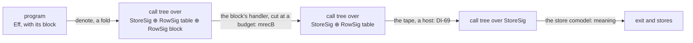
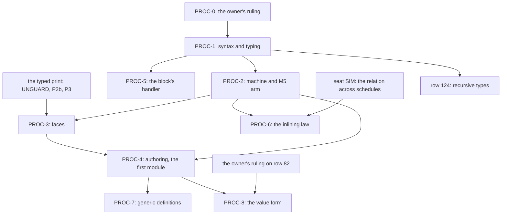

# 2026-10-08 seat PROC design: procedures, a named and typed sub-program of the language

Status: research note (history, not authority). Base: `c51f9e6b` (branch `refactor/phase1-phase3`).
A design seat: nothing in `src/`, `Test/`, `tools/` or `docs/core/` changed. The note rules nothing:
every choice below is a proposal, and the value form of decisions row 82 is the owner's.

Evidence of this note: a reading of the tree at `c51f9e6b`, and four probes. The probes ran in
the seat's scratch directory against the built modules of this checkout, and Appendix A holds
their texts. Six of the modules they read were checked by file time: each was built after its
source's last commit. No `lake build`, no `make` and no generator ran.

## 1. The one thing the coordinator must know first

**The first stage needs no new value, no new type and no new invocation form.** A definition is
a closed `Eff` body with a declared row, kept in a block at the root of the program. An
invocation is a `perform` of that row, and today's checker and printer type and print it
(finite probe PROC-2). Row 82's value form is a later stage, for Cache's stored lookup, and only
the inlining law waits on seat SIM's relation.

## 2. The representation

### 2.1 What the tree has today

- **An authored module holds no definition.** `Module` (`src/Effect4/Program/Authoring.lean`)
  holds host rows, services, shared layers by name and one main program. A service's operations
  are host rows (`Row.host`, the same file), so only the host answers them.
- **A composed module is a Lean builder.** `Queue.take` (`src/Effect4/Modules/Queue/Ops.lean`)
  is a function of Lean that writes the whole wrapper (`waitRetry`,
  `src/Effect4/Modules/Waiting.lean`) at each site that uses it. Probe PROC-4 measured the
  printed text of one use: `take` 7,061 characters, `offer` 3,792, `poll` 2,046 and `size` 95
  (a finite probe). The step `takeStep` alone has 283 term nodes
  (`Test/Program/QueueSteps.lean`).
- **The builders need a hygiene discipline.** A builder places a caller's term under its own
  binders, so every binder is minted (`var_push_minted`, `src/Effect4/Laws/Program/Author.lean`;
  the header of `src/Effect4/Modules/Waiting.lean`).
- **The owner ruled on 2026-09-07 that derived forms are stored expanded** (the grill agenda's
  call 1, `docs/research/2026-09-07-grill-agenda.md` §3, recorded in DI-89). The reason given:
  a stable address whose meaning drifts with the engine is a trap.
- **The literature names the cost of expansion.** Bach Poulsen and van der Rest, *Hefty
  Algebras* (2023), §1.2, is read in `docs/research/2026-09-07-lit-papers.md` Q2. An operation
  expanded in place at each use is part of no effect interface, so a change of it edits every
  program.
- **The machine already has the pieces of a hop.** `Point.redirect`
  (`src/Effect4/Program/Compile.lean`) moves a point to another path of the root, one fuel
  down. A layer reference uses it. `RowKind.program` (`src/Effect4/Program/Eff.lean`) is "a program
  of the Layer or Context model, run as a nested body". Those rows never landed: the header of
  `src/Effect4/Program/Native.lean` says they are "not in this first cut". Both `compileEff`
  (`src/Effect4/Program/Compile.lean`) and `denoteR` (`src/Effect4/Laws/Program/DenoteR.lean`)
  answer the kind with a frontier today.

### 2.2 Words this note introduces

The dictionary (`docs/core/controlled-english.md` §3) has no entry for these words. The
dictionary's **call** is a host call (§3.7), so this note never uses it for a definition.

| Word | Meaning in this note |
| --- | --- |
| **definition** | A declaration (a name, a request type, an answer type, an error type, a requirement row) and a closed `Eff` body that reads one variable, the request. |
| **definition block** | The definitions of one program, in order, stored at the root of its `Eff` tree. Definition `k` answers the operation `call k`. |
| **invocation** (invoke) | A `perform` of a definition's row on a request. The definition's body answers it on the invoking fiber. |
| **procedure** | A definition with its invocations: the brief's named, reusable sub-program. |
| **inlining** | Replacing an invocation by the definition's body, the request bound in its place. |
| **closure record** | Stage P3, form V2: a tagged record of captured values that names a definition by its tag. |
| **code value** | Stage P3, form V1: a value that holds a definition's index and captured values. |

### 2.3 Three stages

The design has three stages, and each later stage keeps the earlier one unchanged.

| Stage | What it adds | Its first consumer |
| --- | --- | --- |
| P1, second-class definitions | the definition block and the invocation; monomorphic definitions | a composed module's operations, written once as definitions |
| P2, generic definitions | type variables in a definition's row, instantiated by the match by bounds | one definition of `Queue.take` at every message type |
| P3, the value form (row 82) | a value that names a definition and holds captured values | Cache's lookup stored at `make` (row 270's later profile); Pool's stored acquisition |

Strachey's split is the reason for the order, as Danvy and Nielsen, *Defunctionalization at
Work* (2001; audit row C3), state it in §1. In P1 and P2 a definition is a second-class
denotable value, and only P3 makes it an expressible one.

### 2.4 The candidates for P1

| Criterion | A: block at the root, `perform` of the row (recommended) | B: a table beside the program, roots by `Point.root` | C: a new `Eff.call` constructor | D: definitions by path, as `LayerTerm.ref` | E: a named elaboration table in the engine |
| --- | --- | --- | --- | --- | --- |
| One program representation | yes: one `Eff` tree, one digest | a wrapper around `Eff` | yes | yes | no: meaning lives in Lean functions |
| Recursion | yes, by declared rows | yes | yes | no: typing expands references | yes |
| Typing | the row check, unchanged | the row check | a new arm that reads a row | by expansion | per form, in Lean |
| Printing and reading | the row call, unchanged | the row call | a new template row | the declaration block | per form |
| Root type of the compile and the proofs | `NativeEff`, unchanged | changes to the wrapper | unchanged | unchanged | unchanged |
| Constructors appended | one `Eff`, one sort, one `NativeOp` | one `NativeOp` and a wrapper codec | two `Eff`, one sort | one `Eff` | one `Eff` |
| Precedent in the tree | DB-12's one tree, layers by path; `Sketch`'s appended rows | direction scout D6 (reserved for injection) | — | `LayerTerm.ref` | refused by the 2026-09-07 call 1 |

**Recommended: A.** The reasons, in order:

1. It keeps one program representation and one digest. A definition's body is part of the
   program's bytes, so the trap of call 1 does not arise: meaning per address stays fixed.
2. It reuses `perform`, which the tree already made "the one invocation form" when it retired
   `callback` (`src/Effect4/Program/Eff.lean`). The checker types an invocation by `rowCheck`
   (`src/Effect4/Program/Checker.lean`), and the printer prints it by `printRow`
   (`src/Effect4/Codegen/PrintLeaf.lean`). The reader reads it by its spelling, and the scope
   fold decides it by `ScopedOp` (`src/Effect4/Program/ScopedOp.lean`; claim
   `operation-data-scoped`). Probe PROC-2 measured the first two on a definition's row. The
   other two are reading.
3. It gives `RowKind.program` a body to run. Its docstring says "run as a nested body", and no
   row of the kind runs one today.
4. It keeps `root : NativeEff` in `compileEff`, `suspendBodyAt` and `denoteR`. So the hop is
   `Point.redirect`'s, and the typed state reads definition bodies as points of the root.
5. It matches the law kit that row 230 and Codex's recommendation 3 chose
   (`docs/research/2026-10-05-codex-foundation-packet/task/review.md`). A module's clients
   perform rows, and the module's expansion implements them.

B is the close second. It fits if the owner wants libraries shared by digest beside a program
rather than copied into its block. C keeps an invocation generic in the alphabet. Its cost is a
second `Eff` constructor, with its own arms in the checker, the printer and the reader. The
programs that run are `NativeEff` programs, so A loses nothing there. D cannot type recursion,
and E is the form call 1 refused.

### 2.5 The form of P1, as a sketch

Not compiled.

```lean
mutual
  inductive Eff (Op : Type)
    -- the 26 constructors of `src/Effect4/Program/Eff.lean`, unchanged
    /-- Appended. The definition block of a program; it stands at the root only. -/
    | defs (block : Defs Op) (main : Eff Op)
  /-- The definitions of a block, in order: definition `k` answers the operation `call k`. -/
  inductive Defs (Op : Type)
    | nil
    | cons (name : String) (request answer error : Ty) (requires : List ServiceKey)
        (body : Eff Op) (tail : Defs Op)
end

inductive NativeOp
  -- the constructors of `src/Effect4/Program/Native.lean`, unchanged
  /-- Appended. The invocation of definition `index` of the root block. -/
  | call (index : Nat)

/-- The row a definition declares: a view of its declaration, never stored. -/
def Defs.rowAt : Defs Op → Nat → Option Row  -- `kind := .program`, `shape := .call`, `cite := ""`
```

- **The declaration.** A definition stores its name, request, answer, error and requirement row.
  Its row is computed from them, so no field without meaning (a citation, a registration) is
  stored. Several parameters are one request of a tuple type.
- **The body is closed.** It reads one variable, the request, at position 0, as a handler reads
  an operation's argument. Every other value it needs is a parameter (lambda lifting).
- **The block stands at the root.** A formation rule refuses a block anywhere else, as
  `layerRefsWF` (`src/Effect4/Program/Refs.lean`) refuses a malformed reference. The main program
  is child 1, and the body of definition `k` is at the path `0 :: replicate k 1 ++ [0]`.
- **A program with no definition is unchanged.** It has no block node, so its bytes, paths and
  proofs stay as they are.
- **Identity.** The program's canonical bytes hold the block, so its digest covers every body. A
  definition's own bytes give it a stable identity across programs, which R10 asks of a form.
- **No growth of `Ty`, `Val`, `Term` or the frame alphabet.** The machine gains no command
  (§4.1).

### 2.6 The value form of P3: two candidates (row 82; the owner's)

Row 234 reserves the contract: the entry, the captures, the invocation context and the
lifetime. Both candidates answer each item, and both stay inside DB-05's first-order contract.

| Item | V2: closure record and a dispatch definition (recommended first) | V1: code value |
| --- | --- | --- |
| The value | a record whose `_tag` names a definition and whose fields are the captures (`Ty.record`, rows 119, 130) | `⟨index, captures⟩`, a new frame of `Store.Val` |
| Its type | the union of the program's closure records of one signature | a new arrow type: structural in `Ty`, or a nominal interface declared in Σ_app through `Ty.app` |
| The entry | the dispatch definition selects on the tag (`Decision.recordTag`) and invokes the definition | the index into the root block |
| Subtyping | today's union and record order | contravariant parameters, covariant answer and error, a closed requirement row |
| Membership | today's `Fits` | a new `Fits` clause that reads the definition's declaration, never its body |
| Identity | structural; `eq` stays refused at records (row 126) | structural or by allocation (row 82 asks which) |
| Digest | the record's canonical bytes; its tag resolves only in its own program, whose digest covers the definition | the frame's canonical bytes; the index resolves only in its own program, whose digest covers the definition; across programs a definition is named by its own bytes' digest, and resolution, never the digest alone, establishes the entry (row 82) |
| Modularity | whole-program: a new closure changes the union | modular: the captures' types are hidden |
| Core growth | none beyond P1 | `Ty`, `Val`, the codecs' refusals, the interim rule's scan, an apply form |
| TypeScript face | data and a dispatch function | an arrow function, as the pin's `Cache.make({ lookup })` takes |

V2 is Reynolds's construction as Danvy and Nielsen describe it in §1.1 to §1.3. This seat read
those sections in the vendored text
`docs/research/2026-09-02-web-standards-sources/text/16-defunctionalization-at-work.txt`
(untracked). The construction has one constructor per abstraction, eliminated by a case
dispatch. Their §1.3 names its price, a whole-program transformation. It names the cause too: a
function type hides typing assumptions, an existential that typed closure conversion makes
explicit. V1 is that closure conversion.

DB-05 asks a public operation that stores an actual subcomputation for an adequate
defunctionalization or a higher-order calculus. V2 stores data. V1 stores a stable block
reference and data, the side of DB-05 that needs neither. Neither needs `HHandler`.

**Recommended: V2 first.** It adds nothing to the core, and its laws are P1's invocation law
and today's select rule. It serves Cache's and Pool's pin profiles inside one program. V1 is owed
only when a function type must be modular or must print as the pin's closure.

## 3. Typing

### 3.1 The rule of an invocation: today's rule of `perform`

The checker types `perform (.call k) request` by the row of definition `k` alone, through
`rowCheck` (`src/Effect4/Program/Checker.lean`) and `checkRow`
(`src/Effect4/Program/Typing/Rules.lean`). The request's type must be below the declared
request. The invocation then has the declared answer and error, in normal form, and the declared
requirement row. An index outside the block is outside the signature's domain (`dom`), which the
checker refuses as `outsideDomain`.

Probe PROC-2 checked this on today's checker, with a definition's row standing in the row table
(a finite probe):

- the invocation `countdown(3, "go")` types at `string ! never`, from the row alone;
- a request outside the declared request is refused (red control).

### 3.2 The rule of a definition block

The block is checked once, by the whole-program check, as `typeOfProgram`
(`src/Effect4/Program/Typing.lean`) checks layer references today. The node `defs` inside the
`check` fold refuses, as `checkLayer` (`src/Effect4/Program/Checker.lean`) refuses a reference.
The block rule:

1. Extend the typing signature by the block's rows: `call k` gets definition `k`'s row, and the
   domain grows by the block's length. This is the hole table's construction
   (`SigApp.withHoles`, `src/Effect4/Program/Sketch.lean`) for a new operation alphabet.
2. Check each body at the environment `[request]`, under the extended signature. The body's
   answer and error must be below the declared ones in the checker's order. Its requirement row
   must be included in the declared one.
3. Check the main program at the empty environment, under the extended signature.

Each body is checked once, whatever the number of invocations. Probe PROC-2 checked a recursive
body this way, and it types at the declared row. A body that answers a number is not below a
declared string (red control).

**Formation of the declaration.** Its columns are formed and closed in P1, and its error column
is a supported error type (`supportedErrTy`, `src/Effect4/Program/Eff.lean`). The empty column
of row 127 is refused as for a host row. The interim rule of row 97 does not apply, since a
definition is internal. So a definition may answer a cell, a deferred or a fiber, as
`Queue.bounded` must.

### 3.3 Recursion and fuel

- **Recursion is typed by declaration.** A body reads the declared rows of the whole block,
  never another body, so mutual recursion checks, and checking terminates. TypeScript asks the
  same of a recursive function: probe PROC-3's red control shows tsgo refuses one with no
  declared result type (TS7023, TS7024).
- **Fuel.** A hop into a body costs one fuel of the point, as `Point.redirect` does. The
  machine counts one operation for the invocation's suspension. A run out of fuel stops at a
  live frontier, never at a failure (DB-04).
- **No termination is checked.** A definition that invokes itself forever runs to the
  frontier of its budget.

### 3.4 Captures

P1 has none: every value a body reads is its request, so a definition is lambda-lifted. In V2 the
captures are the fields of a closure record, typed by the record's type. In V1 they would be
typed by the definition's leading parameters.

### 3.5 Effects in a definition's type

- **The row carries the answer, the error and the requirement row.** No row is polymorphic in
  its error or its requirements: DI-20 and DI-28 refuse that polymorphism in a stored program.
- **Subeffecting is at the declaration.** A body may fail with less and require less than its
  row declares (step 2 of §3.2).
- **Services come from the invoking context.** The body runs on the invoking fiber, in its
  context, as an inlined body would. The row's requirement row therefore joins the invoker's.
  The law that a graded program never dies with `missingService` stays row 117's.

### 3.6 Generic definitions (P2)

A row may hold type variables: it is a template, and the match by bounds instantiates it at each
invocation (`Bounds.matchB`, `src/Effect4/Program/Bounds.lean`; claim `template-match-complete`).
The typed print then writes the bindings on the invocation's head, as for a host row with a
template (`docs/research/2026-10-07-typed-print-design.md` §3). Two obligations come with it:

- **A body checked at rigid type variables.** Today `check_closed`
  (`src/Effect4/Laws/Program/Typing/Closed.lean`) fixes a closed environment. So a generic body
  needs a substitution law: a body typed at the variables is typed at every instance.
- **A host row inside a generic body.** Row 323 admits a reply at its call's checked instance,
  computed at the call's address. Inside a generic body the instance depends on the invocation,
  so the address alone does not fix it.

Until P2, a Lean builder writes one definition per instance that a program uses.

### 3.7 The judgments it touches

| Judgment | What P1 changes |
| --- | --- |
| Formation | the block stands at the root; each declaration is formed and closed |
| Canonical form | none: rows are read in normal form, as today |
| Membership | none in P1 and V2; V1 adds the arrow clause |
| Inhabitance | the row 127 check applies to the declaration's columns |
| Profile support | an invocation is no host call: the session, reply admission and the interim rule never see it |
| Codec admission | none in P1 and V2; V1's values are refused by every codec |
| Reply admission | none |

### 3.8 Conservativity

The checker answers the same on a program that invokes no definition, with or without any
block's rows in its signature. Refusals are included. It is the statement of
`holes_conservative` (`src/Effect4/Laws/Program/Sketch.lean`) for the block's alphabet. Its
argument is the same: the checker reads an operation's row only where the program performs it.
It is goal G1 (§8), the part of R2's C3 that a block owes. The block's own bodies are checked
whether or not the main program invokes them.

## 4. Meaning

### 4.1 The frame machine: one counted step, then the body

Not compiled. An invocation compiles as `suspend`, `select`, `gen` and `iterate` do: one counted
suspension at the invocation's own point, whose body `suspendBodyAt` decides.

```lean
-- compileEff, the perform arm, before the row's kind is read:
| .perform (.call _) _ => Prim.suspend (EffThunk.body p)
-- suspendBodyAt, at an invocation node:
| some (Node.eff (.perform (.call k) request)) =>
  match evalTerm p.env request, Defs.bodyPath root k with
  | some v, some path => resolve root { p with path, env := [v], fuel := p.fuel - 1 }
  | _, _ => badShape
-- compileEff at the block: no step of its own; the main program at child 1.
| .defs _ main => compileEff main (p.child 1)
```

- **The hop is `Point.redirect`'s,** with the environment replaced by the request. The body
  runs on the invoking fiber, with its context, its interruptibility and its stack.
- **`Eff.suspendDecided` gains the invocation.** Its complement law, `suspendBodyAt_of_at`
  (`src/Effect4/Laws/Program/Agreement.lean`), stops building until it does: the tree's own
  tripwire for this change.
- **The frame machine gains no command,** and no new thunk: `EffThunk.body` carries the point.
- **The request is evaluated at the suspension's step.** TypeScript evaluates the argument one
  step earlier, when it builds `name(request)`. A term is pure, so the value is the same. Only
  an ill-typed request would fail at another step.
- **The body is built when the suspension runs,** with the completed-exit view of that moment.
  `fnUntraced` builds its body the same way: each invocation returns a `suspend`
  (`vendor/effect-4.0.0-rc.112/src/internal/effect.ts:1199-1215`).

### 4.2 The reference machine and `denoteR`

`denoteR` (`src/Effect4/Laws/Program/DenoteR.lean`) gets one arm, the shape of its `.suspend`
arm:

```lean
-- denoteEffBody, the perform arm, before the row's kind is read (not compiled):
| .perform (.call k) request, p =>
  match evalTerm p.env request, Defs.bodyAt root k with
  | some v, some (path, body) => suspendR p (constructR fun completed =>
      rec body { p with completed, path, env := [v], fuel := p.fuel - 1 })
  | _, _ => .pure badShapeExit
```

The reference machine (`src/Effect4/Laws/Program/InterpR.lean`) runs a counted suspension and a
construction as it runs them today, so it gains nothing. The unfolding equation `denoteR_call`
holds at a positive fuel by the file's `budget` tactic, as `denoteR_suspend` does.

**The typed state.** By reading, M6 gains no proof. Its clauses `clause_suspend` and
`clause_construction` (`src/Effect4/Laws/Program/Typed/Commands/Evaluate.lean`) type any counted
suspension and any construction from the typing of its continuation. The new arm of `denoteR`
produces only those two operations. M5 gains one arm, goal G3 (§8). The arm needs
the induction hypothesis at the definition's body, not at a child. `childDenotes_upto`
(`src/Effect4/Laws/Program/Typed/Denotation.lean`) already gives it. Its hypothesis covers every
node of the root at every path and every lower fuel. The layer reference's hop uses it so
(`provideLayerArm`, `src/Effect4/Laws/Program/Typed/LayerArm.lean`). This is one more reason
for a block inside the root tree: under candidate B the hypothesis would have to range over other
roots. The arm then uses the block's check, `suspendR_typed` and `constructR_typed` (the same
file as `childDenotes_upto`), and `typedProg_widen` (`src/Effect4/Laws/Program/Typed/Seq.lean`).
M7 follows by the route theorem. `run_eq_ref` gains one case: both machines take one suspension
and then the body (goal G4).

### 4.3 The meaning of the block: a recursive handler cut at a budget

At the level of the free monad, an invocation is an operation, and the block is its handler. The
block's rows form a signature by the construction that DI-69 gave the row table: `RowFamily` and
`RowSig` (`src/Effect4/Laws/Program/DenoteRows.lean`). An operation is a pair `(k, request)`,
answered by an exit. A body may invoke the block again, so the handler is recursive.

The diagram shows the order in which the handlers apply. It claims no theorem.



`Program` is well founded, so the knot cannot be tied inside it: DB-04 says the same of a loop.
Interaction Trees tie it with `mrec`, a recursive event handler after McBride (Xia et al. 2020,
audit P37). This seat read §4.2 and Fig. 14 in the vendored text
`docs/research/2026-09-02-web-standards-sources/text/02-interaction-trees.txt` (untracked). There
`mrec` meets an unfolding equation up to weak bisimulation. Here the budgeted form, `mrecB`,
unfolds at most `k` nested invocations, and a deeper one is the live frontier.

Probe PROC-1 proved three facts of `mrecB` over the pinned algebra package, in the seat's scratch
file (Appendix A.1; no axiom; not in the tree):

- **`mrecB_refines`:** the chain is monotone. One more budget refines every frontier and keeps
  every finished leaf.
- **`invoke_cofinal_left`, `invoke_cofinal_right`:** the chain at an invocation and the chain at its
  unfolding interleave, budget for budget. So every monotone observation of their limits agrees:
  the unfolding law holds at the limit.
- **`budget_not_unfolding`, the red control:** at budget 0 the invocation is the frontier and
  its unfolding finishes, so no single budget satisfies the unfolding equation. It is the
  analogue of `budget_not_fixpoint` for a loop.

### 4.4 The law "an invocation behaves as its body"

The law has three forms, and only the third needs seat SIM.

| Form | Statement | Needs |
| --- | --- | --- |
| (a) unfolding at the point | `denoteR` and `suspendBodyAt` at an invocation are one suspension and then the body at the definition's point | nothing: definitional equations |
| (b) laws once per definition | a property of the body's denotation at its point, for every request that fits, holds at every invocation | (a) and the fundamental property at the definition's point |
| (c) inlining at the site | `C[perform (.call k) r]` and `C[bind (succeed r) (shift body)]` give equal observations, where `shift` moves the body's one variable above the site's environment | seat SIM's relation, and two lemmas of the code |

Form (b) is R10's "laws proved once per definition instead of per expansion". Form (c) is owed
only by an inlining pass, or by a proved cut-over of the composed modules to definitions. That
cut-over's proof is the connector of AGENTS.md's build-in-parallel rule.

**What form (c) needs from seat SIM's relation.** Each item names a difference between the two
runs that the relation must absorb.

1. **Stuttering.** The invocation spends one suspension. The inlined form spends a success and
   the pop of a bind frame. A step with no effect on one side matches none on the other.
2. **Yield points.** Each iteration counts one operation, and the operation budget's yield reads
   that count (`countOp`, `yieldVerdict`, `src/Effect4/Machine/Fibers.lean`). An invocation
   spends one operation more than its inlining, so the two runs can yield at different points.
   The relation must relate runs across schedules, or hold where no such yield falls.
3. **Budgets.** A hop costs one fuel of the point. The relation must hold at the limit of the
   budgets, or carry the offset.
4. **The construction view.** The invocation builds its body one step later, so its completed
   view could hold more exits. A join built after its fiber's exit answers at once
   (`Point.awaitExit`, `src/Effect4/Program/Compile.lean`), so one side could answer where the
   other parks. By reading, only the invoking fiber runs between the two constructions unless a
   yield falls there, so item 2's fragment removes this difference too.
5. **Contexts.** The law is wanted inside every program, so the relation must be a congruence for
   the `Eff` constructors, or name the contexts it covers. Choice Trees §7.2, as
   `docs/research/2026-09-07-lit-papers.md` §0 item 1 reads it: a relation that is a congruence
   before the scheduler is not one after it.
6. **Handle identity.** A hop allocates nothing, so the identity bijection of DI-81 is the
   identity here, and the relation needs no renaming for this law.

**Read against seat SIM's draft of the same day** (`docs/research/2026-10-08-seat-SIM-design.md`,
untracked and in progress at the time of writing). The draft compares two programs at the grain
of a decision, with stuttering inside a decision (its `TapeSim`). It finds that no tape decision
moves the operation budget's yield. So it names the budget-quiet runs as the fragment of every law
between two programs. Read against that draft, form (c) needs:

- the identity decision map, since an invocation allocates nothing (item 6);
- the budget-quiet fragment, or the owner's ruling that makes that yield a tape decision (the
  draft's question 1), for items 2 and 4;
- both compile budgets, with no fiber at a compile frontier (item 3), as the draft's statement
  takes them;
- a machine relation that pairs the invocation's code with the inlined code: relocation and
  shift, below;
- for item 5, either a congruence law of the relation or one statement per context, since the
  draft relates whole programs.

Two lemmas of the code, outside SIM's relation, close the rest of form (c):

- **relocation:** the same subterm at two paths behaves the same;
- **shift:** a shifted program at a longer environment behaves as the program at the shorter
  one. It is a weakening law for `compileEff` and `denoteR`, as `check_weaken`
  (`src/Effect4/Program/Typing.lean`) is for the checker.

## 5. Services as programs

### 5.1 One row, three kinds of handler

The tree already answers an operation in two ways, and P1 adds the third.

| Who answers the operation | Its meaning | Example |
| --- | --- | --- |
| the store | the comodel `storeHandler` (`src/Effect4/Laws/Program/Denote.lean`), lawful on live cells | `Ref.get` |
| the host | the tape, a handler of `RowSig table` (DI-69) | a host row of `Row.host` |
| the program | the block's handler, `mrecB` of §4.3 | `perform (.call k)` |

A service's operation answered by the program is the same row with another handler. Today a
`ServiceDef` (`src/Effect4/Program/Authoring.lean`) lists its operations as host rows. In P1 an
operation may instead be a definition whose request holds the receiver first, as a method row's
request does. The layer builds the receiver as data, and the definitions act on it.

An example, not compiled: a counter whose carrier is a cell (`flatCarrier` admits `refOf nat`,
`src/Effect4/Program/SigApp.lean`).

```lean
-- the layer:        Layer.effect Counter (Ref.make 0)
-- the definitions:  incr : refOf nat → unit,  body  Ref.update(request, succ)
--                   get  : refOf nat → nat,   body  Ref.get(request)
-- a client:         bind (service Counter) (c => perform (.call incr) c)
```

On the TypeScript face the invocation prints as `incr(c)`, a function of the module. It does not
print as the method `c.incr()`, since the receiver's type, `Ref.Ref<number>`, has no such method.

### 5.2 How it relates to DI-69 and to the host

- **One construction for two signatures.** The block's rows form a signature by DI-69's
  construction (`Alphabet.ofTable`, `RowFamily`, `RowSig`). The program's meaning applies the
  block's handler first, then the tape (§4.3). DI-69's first statement, on `StraightRows`,
  extends to invocations once the block's handler is composed in front of the tape (goal G5).
- **Moving an operation from the host to a definition is a change of handler,** not an
  extension of Σ_app. So C2 of DB-01 does not cover it. The law that relates the two is a
  refinement: the definition's behaviour lies in the row's host specification (`HostSpec`,
  `LawfulHostSpec`, `src/Effect4/Program/Profile.lean`). That law is R6's, which the owner
  parked. This note states no goal for it.

### 5.3 Layers, and where P1 stops

In P1 the program fixes the implementation of each operation: an invocation names one
definition, so dispatch is static. A layer builds data, never behaviour. Effect's own pattern,
where several layers implement one service, needs dynamic dispatch: the service's value must name
its behaviour. That is P3: a carrier that holds a closure record (V2) or a code value (V1). Such a
structured carrier waits on row 118. So "code-valued services with a capture law", R5's open
part, is P3's and R7's.

V2 gives the pattern without a code value, inside one program. The carrier holds a closure
record, and each operation is a dispatch definition that selects on its tag. A test layer and a
live layer then build two records of one union type.

### 5.4 A composed module as rows with a handler

Row 230 and Codex's recommendation 3 already state a module this way: its clients perform
application-signature rows, and the module's expansion implements them. P1 makes the expansion a
stored handler: the module's definitions. R10's law then compares two handlers of the same rows
on the profile's observation: the definitions, and the profile's model. That is one refinement
statement per operation, not one per site.

On the TypeScript face the same rows can be printed two ways, and the choice is a profile's:

- **the definitions,** printed once, so the printed program runs our implementation on rc.112's
  primitives (P1's default, §6);
- **the pin's own API,** for example `Queue.take(q)`, so the printed program runs rc.112's
  module, and the module's R10 law is what the truth lane compares.

### 5.5 Posted bodies (row 225)

A posted helper's body may be an invocation. The proposed claim `posted-body-entry-typed`
(`tools/Tools/SemanticsRegistry.lean`, R7) speaks of "its resolved entry": the definition is that
entry, and the posted request is its typed environment. P1 thus gives that claim its entry, and
leaves its world-extension half where row 225 put it.

## 6. Faces

### 6.1 TypeScript: what prints

A definition prints as one constant of the module, before the main declaration, beside the
hoisted layers of `printModule` (`src/Effect4/Codegen/Print.lean`):

```ts
const countdown = (a0: readonly [number, string]): Effect.Effect<string, never, never> =>
  Effect.suspend(() => isZero(fst(a0)) ? Effect.succeed(snd(a0)) : countdown(pair(pred(fst(a0)), snd(a0))))
```

- **The parameter is the request,** the body's one variable, printed at level 1. The result
  type is `declarationType` (`src/Effect4/Codegen/Print.lean`) of the row's columns, the
  annotation the main declaration carries today.
- **The body is a suspension,** so an invocation is one `Effect.suspend`, as the machine's is.
  `fnUntraced` builds its functions the same way (§4.1).
- **An invocation prints as the row's call,** `countdown(request)`, by `printRow`'s `.call`
  shape. Probe PROC-2 printed `countdown(3, "go")` through the `tupleCall` shape of a pair
  request, and the body as `Effect.suspend(() => isZero(fst(a0)) ? … : countdown(pred(fst(a0)),
  snd(a0)))` (a finite probe).
- **Everything above prints with today's TypeScript syntax.** The vendored syntax has typed
  `lambda` parameters (`TypeScript.Parameter`, package `typescript`).

**The idiomatic form is a later refinement.** Several parameters can print as a rest tuple,
`(...a0: readonly [number, string])`, invoked as `countdown(3, "go")`. It needs a rest flag on
`TypeScript.Parameter`, a change of the lean4-typescript package. It also needs an n-ary branch
of `printTupleArgs` (`src/Effect4/Codegen/PrintLeaf.lean`), which handles a pair only today.

**Tested on the target** (probe PROC-3; finite; tsgo `7.0.0-dev.20260629.1`, the harness's pin;
bun 1.4.2 with `effect` 4.0.0-rc.112, the version printed by the run):

- tsgo accepts four forms: the one-parameter form, a recursive rest-tuple form, two mutually
  recursive definitions, and an invocation out of tail position;
- tsgo refuses four red controls: a request of the wrong type in each form and an argument too
  few. The fourth is a recursive definition with no declared result type (TS7023, TS7024);
- the pin runs `countdown1(pair(3, "go"))` and `countdown(3, "go")` to `"go"`, `isEven(100001)`
  to `false` and `sumTo(100000)` to `5000050000`, with no JavaScript stack overflow at those
  depths.

**Two printing rules that the block brings.**

1. **Hoist the layers of a body.** A layer body is closed (`Point.layerBuild`,
   `src/Effect4/Program/Compile.lean`), so a layer inside a definition never reads the request.
   The machine keys its memo by the layer's path (DB-12), so every invocation shares one entry.
   Printed inside the function, TypeScript would build one layer object per invocation, and
   rc.112 keys its memo map on the object (`vendor/effect-4.0.0-rc.112/src/Layer.ts:411`).
   Hoisting the layer to a module constant gives TypeScript the one object too.
2. **Refuse an unsafe definition name.** A name must not be a binder (`aN`), a layer name
   (`L_…`), the export name, a row's spelling, a prelude atom or an Effect module. The checks of
   `printEntry` (`exportNameSafe`, `rowNamesSafe`; `src/Effect4/Codegen/Print.lean`) extend to
   the block.

### 6.2 TypeScript: what reads back

The module reader puts each definition constant back into the block and reads `name(request)` as
`perform (.call k) request`, through the spelling map that the block extends. The read laws
`read_print` and `read_exact` extend on the readable domain: each declared column must be a
readable type (`ReadableTy`, `src/Effect4/Codegen/Classes.lean`; DI-91). A definition with a
declared column outside it is refused by name, as a stated cursor type is today (goal G6).

### 6.3 OCaml: what lowers

Nothing new lowers per definition. OCaml is made only from LCNF, and the LCNF route lowers the
Lean machine, not a program. `docs/core/lcnf-route.md` §8 keeps the two compilations apart:
`compileEff`, and the route. A definition stays data that the engine interprets:

- the program codec gains the new tags (`make gen-eff`, `make gen-wire`);
- the engine gains the new arms of `compileEff` and `suspendBodyAt` (`make gen-lcnf`);
- the case-site policy is re-pinned for the new arms (`make check-cases`);
- `make check-ocaml` runs the engine's fixtures, and the fixtures group gains a program with a
  block.

A definition compiled to an OCaml function would be a specializing stage. It would need its own
connection theorem, which `docs/core/lcnf-route.md` §8 asks of any multistage compiler.

## 7. Authoring and agent usage

### 7.1 The authoring surface

Not compiled. The surface gains one record, one word and one place in `Module`, each the shape of
something that exists.

```lean
/-- A definition an author declares once: its name, its parameters with their names and
types, its declared columns, and its body as a function of the parameters' terms. -/
structure DefSrc (Op : Type) where
  name : String
  params : List (String × Ty)
  answer : Ty
  error : Ty := .never
  requires : List ServiceKey := []
  body : List TermSrc → Src Op

-- `Module` gains `defs : List (DefSrc NativeOp) := []`, and `Package` gains the same field.
-- `Def.invoke name args` resolves a name to its index, as `Row.call` resolves a spelling,
-- and refuses an undeclared name at the site, by name.
```

- **The body's parameters are terms of the request.** The surface elaborates the body at the
  closed scope with one minted name for the request. Each parameter is a projection of it, the
  convention of `bindWith` (`src/Effect4/Program/Authoring/Sugar.lean`) and `iterateWith`
  (`src/Effect4/Program/Authoring/Loops.lean`).
- **`elaborateModule` places the block** at the root when the module declares a definition, as it
  places declared layers.
- **A command `eff_def`** can stand beside `eff_rows` (`src/Effect4/Program/Authoring/Declare.lean`;
  design in `docs/research/2026-10-07-packet-authoring-sugar.md`).

### 7.2 What changes for the composed modules

- **An operation becomes a definition.** It is written once for each instance that a program
  uses. `Queue.take A` writes the wrapper and the steps into one definition's body, and each
  site becomes one invocation.
- **The hygiene apparatus leaves the sites.** An argument is a value passed as the request, so no
  caller's term enters a binder at the site. The minted names stay inside the builders that
  write a definition's body.
- **The step terms and their laws do not move.** `takeStep` and the model relations
  (`src/Effect4/Laws/Modules/Queue/`) are terms inside the body.
- **The finite controls are measured again.** The least fuel of a helper's task
  (`Test/Program/QueueTraces.lean`, the delivery's flush) counts each invocation's suspension and
  hop, so the measured values move.

### 7.3 What it gives an agent

- **Signature first.** An agent declares a definition's name and row, writes invocations that the
  checker types against the row, and writes the body later. The checker checks the body alone,
  against the row.
- **Local answers.** The address table, the focus function and a located refusal work inside a
  body as inside a main program, at the environment `[request]`. They run on each entry of the
  block at the extended signature. `Sketch.table` (`src/Effect4/Program/Sketch.lean`) runs so at
  a sketch's signature, and the block's wrapper is part of PROC-1.
- **Smaller text to read.** The printed module names each operation once. Probe PROC-4 measured
  7,061 characters for one use of `Queue.take` today. With a definition, a use is one invocation.
- **Laws by name.** A law stated once of a definition is cited at every invocation, by form (b)
  of §4.4.
- **A hole with a request.** A definition with no body yet is a hole that takes a request. The
  sketch's hole table (rows 282, 288) and the block are both appended declarations, so the two
  may merge later. This note proposes no merge.

What an agent cannot do in P1: pass behaviour as a value (P3), or write one definition at many
types (P2).

## 8. Placement

Each obligation below is proposed, not installed. Its claim enters `docs/core/semantics.md` and
`tools/Tools/SemanticsRegistry.lean` in the slice that states it. Where the concept lacks the
property, the slice adds it there (AGENTS.md, Trust).

**G1 `defs_conservative`: a block changes no verdict on a program that invokes none of it.**

- Concept: `initial-algebras-folds`; property: a new one, the block's conservativity, beside
  `sketch-conservative`.
- Question: proposed claim `defs-conservative` (role `compatibility`), whose pointer is the
  planned goal `defs_conservative`. Consumers: G2's soundness at the extended signature, and
  `Built.rebuild` (`rebuild`, `src/Effect4/Api/Author.lean`) on a program that gains a block.
- Reach: `Checker.check` at every environment and path, refusals included. The program has no
  `perform (.call _)` node, and the block is any block. Rows 111 and 115; the sketch's rows 282
  and 288.
- Does not establish: anything of the block's own bodies, any run, or C2 (meaning).
- Unlocks: R2 (C3 for a block) and R14 (holes and definitions side by side).

**G2 `invoke_hasTy` and the block judgment: the rules, with the checker sound and complete.**

- Concept: `initial-algebras-folds`; property: the invocation rule and the block rule as rules
  of `HasTy` (`src/Effect4/Laws/Program/Typing/HasTy.lean`).
- Question: proposed claim `invocation-rule` (role `compatibility`), pointer `invoke_hasTy`.
  Consumers: `check_sound` and `check_complete` (`src/Effect4/Laws/Program/Typing/CheckSound.lean`,
  R1's top), the address table, and G3.
- Reach: the declarative judgment over the signature extended by the block. The rows are closed
  (P1), and the block stands at the root only. Rows 42 and 303 own the match the rule reuses.
- Does not establish: any run or meaning, and no generic definition (G8).
- Unlocks: R1 at a signature with a block, and the typing premise of G3.

**G3 `invoke_arm`: an invocation denotes a typed program (M5's arm).**

- Concept: `residual-program-typing`; property: `denote-typed`, M5's fundamental property, at the
  invocation's arm.
- Question: registry claim `denote-typed` (role `fundamentalProperty`), pointer `denotesTyped`
  (`src/Effect4/Laws/Program/Typed/LayerArm.lean`), gains the arm as the planned goal
  `invoke_arm`. Consumers: `childDenotes_upto`, then `loadsTyped` and `m7_proved`
  (`src/Effect4/Laws/Program/Typed/Commands/Clauses/All.lean`).
- Reach: `TypedProg` at the invocation's checked type, at an admitted point. The world's service
  table is the source's, and the hypothesis holds at the definition's body. Rows 170 and 175
  (M5's premises) and row 186 (a hop's point admission).
- Does not establish: progress, liveness or the termination of a recursive definition. Nor the host
  lane: M7 stays at the empty row table. Nor anything of the frame machine without G4.
- Unlocks: the M5 → M6 → M7 spine for programs with a block. M6 needs no new proof, and M7
  follows by `m7_of_ledger` (`src/Effect4/Laws/Program/Typed/Assembly.lean`).

**G4 the invocation case of `run_eq_ref`.**

- Concept: `translation-simulation`; property: `run-eq-ref`.
- Question: registry claim `run-eq-ref` (role `simulation`), pointer `run_eq_ref`
  (`src/Effect4/Laws/Program/RuntimeR.lean`). The goal is one case of its relation (`BMeans`,
  `src/Effect4/Laws/Program/Simulation/Fibers.lean`). It is one case of `suspendBodyAt`'s
  agreement with `denoteR` too (`src/Effect4/Laws/Program/Agreement.lean`). Consumer:
  `replayR_bmeans_reachable` (`src/Effect4/Laws/Program/Typed/Assembly.lean`).
- Reach: the empty row table, no oracle; lock-step, one suspension on each machine. Rows 95 and
  138.
- Does not establish: the table-aware agreement (DI-57), the inlining law (G7) or any face.
- Unlocks: R8, and the agreement half of M7's claim for programs with a block.

**G5 `invoke_unfolds_at_limit`: the block's handler, cut at a budget.**

- Concept: `translation-simulation`; property: a new one, the laws of a recursive handler at the
  limit of its budget chain. DB-04's laws of a loop stand beside it (`conv_fixpoint`,
  `conv_least`, `conv_unique`, `src/Effect4/Laws/Program/IterLimit.lean`).
- Question: proposed claims `block-handler-monotone` (role `monotonicity`) and
  `block-handler-unfolds` (role `compatibility`). Their pointers: `mrecB_refines`, and
  `invoke_cofinal_left` with `invoke_cofinal_right`, proved in probe PROC-1 and owed in the tree;
  `mrecB_limit_unique`, owed. Consumers: `denoteRows` (`src/Effect4/Laws/Program/DenoteRows.lean`)
  extended to invocations, and form (b) of §4.4 at the meaning.
- Reach: the free monad over `StoreSig ⊕ RowSig table ⊕ RowSig block`, in the approximation
  order. Every budget, and any monotone observation of the limit. Rows 30, 41 and 310; DB-04.
- Does not establish: the frame machine's agreement (G4's) or termination. Nor any scheduler: the
  fragment stays `StraightRows`, one fiber.
- Unlocks: DI-69's statement with definitions, R10's per-definition laws at the meaning, and
  R2's C2 for a block.

**G6 the round trip of a module with a block.**

- Concept: `exact-codecs`; property: `read_print` and `read_exact`, on a module that prints a
  block.
- Question: pointers `read_print` (`src/Effect4/Laws/Codegen/ReadPrint.lean`), `read_exact`
  (`src/Effect4/Laws/Codegen/Read.lean`) and `readModule_printModule`
  (`src/Effect4/Laws/Codegen/Module.lean`), extended by the planned goal
  `readModule_printModule_defs`. Consumers: `make check-target` and the truth lane.
- Reach: the readable domain: readable declared columns (DI-91), safe names, the layers of a body
  hoisted.
- Does not establish: tsgo's verdict (a finite check), or rc.112's behaviour (the truth lane,
  finite).
- Unlocks: R8 for programs with a block, and the printed size of §7.3.

**G7 `inline_agrees`: an invocation and its inlining (form (c) of §4.4).**

- Concept: `translation-simulation`; property: a new one, inlining agreement under seat SIM's
  relation.
- Question: proposed claim `inline-agrees` (role `simulation`), pointer `inline_agrees`.
  Consumers: the connector of a module's cut-over to definitions, and any inlining pass. It
  bridges to the proposed claims `queue-expansion-agrees` and `semaphore-expansion-agrees` (R10).
- Reach: SIM's relation, at its fragment, observation and tapes. The six items of §4.4, and the
  lemmas of relocation and shift. Rows 79 and 230; DI-81.
- Does not establish: anything outside SIM's relation, any face, or progress.
- Unlocks: R10's composite contract "by a stuttering route" (its open part, post-Phase C
  §11.4).

**G8 `check_subst`: generic definitions (P2).**

- Concept: `subtyping-algebra` for `sub_subst`, the order closed under a substitution of closed
  types. Concept `initial-algebras-folds` for the checker. Property: substitution, as PLF's
  `substitution_preserves_typing` (audit F15) states it, for a template's type variables.
- Question: proposed claim `checker-substitution` (role `substitution`), pointers `sub_subst` and
  `check_subst`. Consumers: the block rule at a template row, and G3 at an instance.
- Reach: closed instances of formed templates (`Bounds.TemplateOK`,
  `src/Effect4/Laws/Program/Bounds.lean`), and the match by bounds at each invocation. Rows 42, 288 (point 6) and 303.
- Does not establish: the instance of a host call inside a generic body (row 323). Nor tsgo's
  inference at a generic invocation, which is the typed print's.
- Unlocks: P2, R10 (one definition per operation) and R4.

**G9 `resolve_typed`: a resolved entry is typed at its reference's type (P3).**

- Concept: `residual-program-typing`; property: R7's top node.
- Question: R7's open part `resolve_typed` (`tools/Tools/SemanticsRegistry.lean`), whose pointer
  is the planned goal `resolve_typed`. Consumers: V2's dispatch definition or V1's apply form,
  and the typing of Cache's pin profile.
- Reach under V2: a closure record that fits its union type resolves through the dispatch
  definition's select. It reaches a definition whose request holds its captures and the
  argument, and G2's rule types the rest. Under V1, the arrow clause of `Fits` reads the
  definition's declaration. Rows 82, 234 and 270 to 272.
- Does not establish: the lifetime of a captured handle, which keeps its own rules. Nor the
  precedence of two service contexts (§11, question 5), nor any run.
- Unlocks: R7, and R5's code-valued services.

## 9. Slices

Sizes are hours of one seat, estimated by reading. No slice was tried. A gate is named only where
the slice reaches it.

| Slice | What lands | Goals | Gates by reach | Hours |
| --- | --- | --- | --- | --- |
| PROC-0 | the owner's ruling on §11's questions 1 to 4; a DB row and a decisions row, proposed by the coordinator | none | none | 1 |
| PROC-1 | the appends (`Eff.defs`, the `Defs` sort, `NativeOp.call`) with their wire tags and binder row; formation at the root; the extended signature; the checker's arms and the whole-program check; `Api.explain` and `admitProgram`; a battery of readers and red controls | G1, G2 | `lake build` of each touched module and its direct dependents; `python3 scripts/generate.py --only derived`, then `eff`, `wire` and `ts`, byte-identical or committed; `make check-cases`; `lake env lean Test/Program/Definitions.lean` | 10 to 14 |
| PROC-2 | `compileEff`, `suspendBodyAt`, `Eff.suspendDecided` and `denoteR` arms; `denoteR_call`; the source's signature with the block; finite runs (recursion, mutual recursion, a fuel frontier, an invocation inside a fork) | G3, G4 | `lake build` of `Program/Compile`, `Laws/Program/DenoteR`, `Laws/Program/Agreement`, `Laws/Program/Typed/Denotation`, `Laws/Program/Typed/LayerArm`, `Laws/Program/RuntimeR` and their direct dependents; `make gen-lcnf`, `dune build` through `opam exec --switch=effect4`, `make check-ocaml` and `make check-compiler` | 10 to 16 |
| PROC-3 | the printed block and its reader; name safety; hoisted layers of a body; programs with a block in the truth corpus | G6 | `lake build` of the touched `Codegen` modules; `python3 scripts/generate.py --only ts`; `make check-target`; `make check-truth` (tsgo 7) | 8 to 12 |
| PROC-4 | `DefSrc`, `Module.defs`, `Def.invoke`, `Package.defs`; one composed module's operations as definitions; its finite controls measured again; the printed size before and after | none new; G1 to G6 applied | `lake build` of the authoring modules, the module and its batteries; `make gen-fixtures`, then `make check-ocaml` | 6 to 10 |
| PROC-5 | `mrecB` over `RowSig block`, moved from probe PROC-1 into the law graph; `denoteRows` with invocations on `StraightRows` | G5 | `lake build` of `Laws/Program/DenoteRows` and its dependents | 6 to 8 |
| PROC-6 | the inlining law, after seat SIM's relation lands; the lemmas of relocation and shift | G7 | `lake build` of the touched law modules | 12 to 24 |
| PROC-7 | P2: template rows for definitions, a body at rigid variables, the typed print at an invocation, the instance of a host call in a generic body | G8 | as PROC-1 and PROC-3, with `make check-target` | 16 to 30 |
| PROC-8 | P3, after the owner's ruling on row 82: V2's closure records and dispatch definitions from the surface; or V1's value, type and apply form | G9 | V2 as PROC-4; V1 as PROC-1 to PROC-3 together | V2 8 to 14; V1 30 to 50 |

P1 is PROC-1 to PROC-5, about 40 to 60 hours. The whole battery, the axiom gate and `make check`
run at the owner's sweep, not per slice.

**The order.** The diagram shows which slice waits on which. It claims nothing about a slice's
content.



- **Seat SIM.** PROC-1 to PROC-5 need nothing of SIM. PROC-6 waits on SIM's relation, and §4.4
  lists what it needs from it.
- **Row 124.** Recursive types do not wait on procedures, and procedures do not wait on them.
  A recursive data type is consumed by a recursive definition that selects on a tag. So row
  124's first consumer is easier after PROC-2, and its generic types after PROC-7.
- **The typed print.** PROC-3 changes the printer, so it lands after UNGUARD, P2b and P3
  (`docs/STATE.md`, "Next").
- **The session API.** `Built` carries a program with a block unchanged, so DM1 to DM7 do not
  wait.

## 10. What this does not establish

- **No theorem in the tree.** Every goal of §8 is proposed. Probe PROC-1's three facts are
  theorems of a scratch file, with no axiom, over the pinned algebra package. They are facts of a
  model of the block's handler, not of the tree's `denoteRows` (Appendix A.1).
- **The other probes are finite.** PROC-2 checked one definition's row with today's checker and
  printer, standing in the row table. No block exists. PROC-3 is a tsgo verdict and four runs on
  the pin, host-only evidence. PROC-4 measured four printed texts.
- **No law of behaviour for a composed module.** P1 makes such a law statable once per
  definition (form (b) of §4.4). It proves none, and R10's open parts stay open.
- **No termination and no progress.** A recursive definition may run to its budget's frontier.
  M7's claim for a program with a block keeps its fragment: the empty row table, answer-free
  tapes, the observation `obs`.
- **No agreement across schedules.** The inlining law waits on seat SIM's relation, and this
  note does not design that relation.
- **No new host boundary.** An invocation never reaches the host: the session, reply admission
  and the interim rule are unchanged, and `docs/core/host-boundary.md` keeps the boundary where
  it is.
- **No value form.** Row 82 stays open. V1 and V2 are candidates for the owner.
- **No generic definition** before P2, and no claim that the checker commutes with a type
  substitution today.
- **No claim about rc.112's own modules.** Printing a module's rows as the pin's API (§5.4) is a
  profile choice, and its agreement is the module's R10 law, not this note's.
- **No faithful layer identity inside a body without the hoisting rule of §6.1.** Printed inside
  a function, a layer would be one object per invocation on rc.112 and one memo entry on the
  machine.

## 11. Questions for the owner

Each question is one of meaning, of the supported domain or of representation. Each carries the
seat's recommendation. Everything else in this note follows from the tree or is the coordinator's
to decide.

1. **Where definitions live (representation).** (A) a block at the root of the one program tree,
   or (B) a table beside the program, its bodies further roots. **Recommended: A** (§2.4). It
   keeps one representation and one digest, and the compile and the proofs keep
   `root : NativeEff`. M5's fuel induction already covers every node of the root.
2. **The form of an invocation (representation).** A `perform` of the definition's row through a
   new operation `NativeOp.call`, or a new `Eff` constructor. **Recommended: the operation**: it
   reuses the row check, the row call, the reader's spelling and the scope fold. It gives
   `RowKind.program` a body to run.
3. **Stored definitions beside stored expansions (meaning).** The ruling of 2026-09-07 (call 1)
   stores derived forms expanded. Does a composed module's operation become a stored
   definition? **Recommended: yes for composed modules' operations, and DI-89's higher-order
   forms (`retry`, `catchTag`, `forEach`, `all`) stay expanded.** Call 1's trap does not arise:
   a definition's body is in the program's bytes, so meaning per address stays fixed.
4. **The supported domain of P1.** General recursion under the budget, with no termination
   check, and monomorphic definitions until P2's first consumer. **Recommended: both.**
5. **Row 82's value form (representation and meaning).** Four choices, asked when Cache's pin
   profile is scheduled:
   - V2 (closure records and dispatch definitions) or V1 (a code value). **Recommended: V2
     first** (§2.6).
   - Under V1: a structural arrow in `Ty`, or a nominal interface declared in Σ_app through
     `Ty.app`. No recommendation before a consumer needs V1.
   - The identity of a stored behaviour: by structure or by allocation. **Recommended: by
     structure**, with comparison refused, as `eq` is at records (row 126).
   - Which services an invocation of stored behaviour sees when the captured context and the
     invoker's both hold a key. The pin merges them with the invoker's winning,
     `Context.merge(context, input)` (`vendor/effect-4.0.0-rc.112/src/Cache.ts:205-211`, the same
     in `vendor/effect-4.0.1/src/Cache.ts`; the rule at
     `vendor/effect-4.0.0-rc.112/src/Context.ts:1745-1756`). A captured service that the body
     provides again with `provideService` would win instead. **Recommended: the pin's rule**,
     which the profile must then transcribe. Its cost is not measured.
6. **A service implemented in the language (meaning).** In P1 the program fixes each operation's
   implementation, and a layer builds only data. Implementations chosen by a layer wait on P3.
   **Recommended: accept static dispatch for P1.**

**Proposals that follow a ruling (not rulings).**

- A basis row, DB-18, with its witnesses once G1 to G4 land. Its decision: "definitions are a
  block at the root; an invocation is an operation whose handler is the program".
- One decisions row per question above, and row 82's status amended by question 5's answer.
- Dictionary entries for **definition**, **definition block**, **invocation**, **procedure** and
  **inlining** (§2.2), in `docs/core/controlled-english.md` §3.6, and **closure record** and
  **code value** with P3.
- R7's open part `resolve_typed` marked as reachable without a code value under V2, and R10's
  "stable identity" part pointed at a definition's digest.

## Appendix A. The probes

Each probe ran in the seat's scratch directory, which a later session does not keep, so its
text is here. A Lean probe ran as `scratch/lean-slot.sh lake env lean <file>` from the
repository root, against the built modules of this checkout at `c51f9e6b`.

### A.1 Probe PROC-1: the block's handler (`KnotProbe.lean`)

Result: no error, no warning; each of the four `#print axioms` lines answers that the theorem
depends on no axiom.

```lean
import Effects.Algebra.Laws

/-!
# Probe PROC-1: a definition block as a recursive handler, cut at a budget

A probe of seat PROC (2026-10-08). Not a tree module. It models the meaning of the invocations
of a definition block at the denotation level, before the scheduler:

* an invocation is an operation of the block's signature `D`;
* the block is a recursive handler `rh : (d : D.Op) → Program (S ⊕ₛ D) (D.Answer d)`: a body may
  perform the program's own operations (`S`) and invoke the block again (`D`);
* `mrecB rh k p` handles the invocations of `p` by unfolding at most `k` nested invocations
  deep; past the budget an invocation is the frontier `none`, never a failure (DB-04).

What the probe checks:

1. `mrecB_refines`: the budget chain is monotone in the approximation order `Approx` (a frontier
   leaf may be refined by more execution; a finished leaf stays).
2. `invoke_cofinal_left`, `invoke_cofinal_right`: the chain at an invocation and the chain at
   its unfolding interleave, so every monotone observation of the two limits agrees. This is the
   unfolding law of `mrec` (Xia et al. 2020, section 4.2, Fig. 14) at the limit of the chain.
3. `budget_not_unfolding`: no single budget satisfies the unfolding equation (the red control,
   the analogue of `budget_not_fixpoint` for `iterate`).
-/

set_option autoImplicit false

namespace ProcProbe

open Effects

variable {S D : Signature.{0, 0}} {A : Type}

/-- One layer of the knot: the program's own operations pass, and an invocation is handed to
`rec`, applied to the body bound to the invocation's continuation. Structural in the program. -/
def mrecStep (rh : (d : D.Op) → Program (S ⊕ₛ D) (D.Answer d))
    (rec : Program (S ⊕ₛ D) A → Program S (Option A)) :
    Program (S ⊕ₛ D) A → Program S (Option A)
  | .pure a => .pure (some a)
  | .vis (.inl s) next => .vis s (fun x => mrecStep rh rec (next x))
  | .vis (.inr d) next => rec ((rh d).bind next)

/-- The budgeted knot: at budget `0` every invocation is the frontier `none`; at `k + 1` an
invocation unfolds its body and continues at budget `k`. -/
def mrecB (rh : (d : D.Op) → Program (S ⊕ₛ D) (D.Answer d)) :
    Nat → Program (S ⊕ₛ D) A → Program S (Option A)
  | 0 => mrecStep rh (fun _ => .pure none)
  | k + 1 => mrecStep rh (mrecB rh k)

/-- The approximation order on budgeted results: a frontier leaf is below everything, a
finished leaf only below itself, and an operation node below the same operation whose answers
are each above. -/
inductive Approx : Program S (Option A) → Program S (Option A) → Prop
  | frontier (q : Program S (Option A)) : Approx (.pure none) q
  | done (a : A) : Approx (.pure (some a)) (.pure (some a))
  | vis (s : S.Op) {k k' : S.Answer s → Program S (Option A)} :
      (∀ x, Approx (k x) (k' x)) → Approx (.vis s k) (.vis s k')

theorem Approx.refl : ∀ (p : Program S (Option A)), Approx p p
  | .pure none => .frontier _
  | .pure (some a) => .done a
  | .vis s k => .vis s (fun x => Approx.refl (k x))

/-- The unfolding at one budget is definitional: an invocation at `k + 1` is its body at `k`. -/
theorem mrecB_invoke (rh : (d : D.Op) → Program (S ⊕ₛ D) (D.Answer d)) (k : Nat) (d : D.Op)
    (next : D.Answer d → Program (S ⊕ₛ D) A) :
    mrecB rh (k + 1) (.vis (.inr d) next) = mrecB rh k ((rh d).bind next) := rfl

/-- The step is monotone in its recursive argument. -/
theorem mrecStep_mono (rh : (d : D.Op) → Program (S ⊕ₛ D) (D.Answer d))
    {r r' : Program (S ⊕ₛ D) A → Program S (Option A)} (h : ∀ q, Approx (r q) (r' q)) :
    ∀ p, Approx (mrecStep rh r p) (mrecStep rh r' p)
  | .pure a => .done a
  | .vis (.inl s) next => .vis s (fun x => mrecStep_mono rh h (next x))
  | .vis (.inr _) _ => h _

/-- **The budget chain is monotone**: one more budget refines every frontier and keeps every
finished leaf. -/
theorem mrecB_refines (rh : (d : D.Op) → Program (S ⊕ₛ D) (D.Answer d)) :
    ∀ (k : Nat) (p : Program (S ⊕ₛ D) A), Approx (mrecB rh k p) (mrecB rh (k + 1) p)
  | 0, p => mrecStep_mono rh (fun _ => .frontier _) p
  | k + 1, p => mrecStep_mono rh (fun q => mrecB_refines rh k q) p

set_option linter.unusedVariables false in
/-- The chain at an invocation is below the chain at its unfolding, budget for budget. -/
theorem invoke_cofinal_left (rh : (d : D.Op) → Program (S ⊕ₛ D) (D.Answer d)) (d : D.Op)
    (next : D.Answer d → Program (S ⊕ₛ D) A) :
    ∀ k, Approx (mrecB rh k (.vis (.inr d) next)) (mrecB rh k ((rh d).bind next))
  | 0 => .frontier _
  | k + 1 => mrecB_refines rh k _

/-- The chain at the unfolding is below the chain at the invocation, one budget later. -/
theorem invoke_cofinal_right (rh : (d : D.Op) → Program (S ⊕ₛ D) (D.Answer d)) (d : D.Op)
    (next : D.Answer d → Program (S ⊕ₛ D) A) (k : Nat) :
    Approx (mrecB rh k ((rh d).bind next)) (mrecB rh (k + 1) (.vis (.inr d) next)) :=
  Approx.refl _

/-! ## The red control: no single budget solves the unfolding equation -/

/-- A signature with no operation of the program's own. -/
abbrev Empty : Signature.{0, 0} := ⟨PEmpty, fun _ => PUnit⟩

/-- One definition, answering a natural number. -/
abbrev One : Signature.{0, 0} := ⟨Unit, fun _ => Nat⟩

/-- The definition's body answers `7` and invokes nothing. -/
def seven : (d : One.Op) → Program (Empty ⊕ₛ One) (One.Answer d) := fun _ => .pure (7 : Nat)

/-- At budget `0` the invocation is the frontier, while its unfolding finishes with `7`. -/
theorem budget_not_unfolding :
    ¬ ∀ k, mrecB seven k (.vis (.inr ()) (fun n => .pure n) : Program (Empty ⊕ₛ One) Nat) =
      mrecB seven k ((seven ()).bind (fun n => .pure n)) := by
  intro h
  have h0 := h 0
  simp only [mrecB, mrecStep, seven, Program.bind] at h0
  cases h0

end ProcProbe

#print axioms ProcProbe.mrecB_refines
#print axioms ProcProbe.invoke_cofinal_left
#print axioms ProcProbe.invoke_cofinal_right
#print axioms ProcProbe.budget_not_unfolding
```

### A.2 Probe PROC-2: the row machinery on a definition's row (`RowReuseProbe.lean`)

Result: every `#guard` holds. The `#eval` prints
`some "Effect.suspend(() => isZero(fst(a0)) ? Effect.succeed(snd(a0)) : countdown(pred(fst(a0)), snd(a0)))"`.

```lean
import Effect4.Program.Checker
import Effect4.Program.Typing
import Effect4.Program.Native
import Effect4.Codegen.Print
import TypeScript.Render

/-!
# Probe PROC-2: a definition's declared row types and prints its invocations with today's machinery

A finite probe of seat PROC (2026-10-08). Not a tree module, and no tree file changes. The tree
has no definition block yet, so the probe stands a definition's declared row in the row table
at position 0 and invokes it as `perform (.external 0)`. That is enough to measure three things
the design reuses:

1. the checker types an invocation by the declared row alone (`rowCheck`), whatever the body is;
2. a recursive body checks once, against the same declared row, with no expansion;
3. the printer prints the invocation as `name(arg0, arg1)` through the row's `tupleCall` shape.

Two red controls: an invocation whose request is outside the declared request is refused, and a
body whose answer is outside the declared answer is not below it.
-/

set_option autoImplicit false

namespace ProcProbe2

open Effect4 Effect4.Machine Effect4.Program
open TypeScript (house0)
open TypeScript.Render (expr)

/-- The declared row of `countdown : (nat, string) → string`: its request is the pair of its two
parameters, its answer a string, no failure, no requirement. `kind := .program` is the row kind
the design gives a definition; the probe's table does not run it. -/
def countdownRow : Row :=
  { name := "countdown", spelling := "countdown", shape := .tupleCall, trailing := [],
    kind := .program, request := .prod .nat .string, answer := .string, error := .never,
    requires := [], cite := "", typeArgs := [], registration := .external }

def sig : Signature NativeOp := nativeSignature [countdownRow]

def pairT (a b : Term) : Term := .app "pair" (.cons a (.cons b .nil))

/-- An invocation: `countdown(3, "go")`. -/
def invocation : NativeEff := .perform (.external 0) (pairT (.lit (.nat 3)) (.lit (.str "go")))

/-- The body, at the environment `[request]`: if the counter is zero answer the label, else
invoke again at the counter's predecessor. A recursive invocation is typed by the declared row. -/
def body : NativeEff :=
  .select (.app "isZero" (.cons (.app "fst" (.cons (.var 0) .nil)) .nil)) .bool
    (.succeed (.app "snd" (.cons (.var 0) .nil)))
    (.perform (.external 0)
      (pairT (.app "pred" (.cons (.app "fst" (.cons (.var 0) .nil)) .nil))
        (.app "snd" (.cons (.var 0) .nil))))

/-- The type the checker gives a node, as `(answer, error)`, or the refusal's reason. -/
def verdict (env : TyEnv) (e : NativeEff) : String :=
  match Checker.check sig env [] e with
  | .ok t => s!"ok {t.answer.render} ! {t.error.render}"
  | .error _ => "refused"

-- 1. The invocation types at the declared answer.
#guard verdict [] invocation = "ok string ! never"
-- 2. The recursive body types at the declared request, once: its answer is the declared one.
#guard verdict [.prod .nat .string] body = "ok string ! never"
#guard (match Checker.check sig [.prod .nat .string] [] body with
  | .ok t => Ty.sub t.answer.normalize countdownRow.answer.normalize && Ty.sub t.error.normalize countdownRow.error.normalize
  | .error _ => false)
-- Red: a request outside the declared request is refused at the invocation.
#guard verdict [] (.perform (.external 0) (pairT (.lit (.str "x")) (.lit (.str "go")))) = "refused"
-- Red: a body that answers a number is not below the declared answer.
#guard (match Checker.check sig [.prod .nat .string] [] (.succeed (.lit (.nat 1))) with
  | .ok t => !(Ty.sub t.answer.normalize countdownRow.answer.normalize)
  | .error _ => false)

-- 3. The invocation prints as an application of the definition's name to two arguments.
#guard ((print sig 0 invocation).toOption.map (expr house0 0)) = some "countdown(3, \"go\")"
-- The body prints too, at the level of its one binder.
#eval ((print sig 1 body).toOption.map (expr house0 0))

end ProcProbe2
```

### A.3 Probe PROC-3: the printed forms on the target (`defs.typecheck.ts`, `run.ts`)

The type check ran the harness's tsgo on a configuration in the scratch directory. The
configuration holds the harness's compiler options, `"types": []`, and `paths` that map
`effect` to `harness/truth/node_modules/effect/dist/index.d.ts`. Command:
`harness/truth/node_modules/.bin/tsgo -p tsconfig.json`; result: exit 0, so each
`@ts-expect-error` met its error. The run: `bun run run.ts`, which printed
`effect 4.0.0-rc.112`, then `go`, `go`, `false` and `5000050000`.

```ts
// Seat PROC probe 3 (2026-10-08): the printed form of a definition and its invocations, under tsgo 7.
// A definition prints as a constant arrow function with one rest parameter, the tuple of its
// request, and its declared type; its body is a suspension. An invocation applies the name.
import { Effect } from "effect"
import { pred, isZero, fst, snd, succ, pair } from "/Users/pooks/Dev/lean4-effect4/harness/truth/prelude-atoms.gen.ts"

// One recursive definition: the invocation in its body is typed by the declared type.
export const countdown = (...a0: readonly [number, string]): Effect.Effect<string, never, never> =>
  Effect.suspend(() => isZero(fst(a0)) ? Effect.succeed(snd(a0)) : countdown(pred(fst(a0)), snd(a0)))

// Two mutually recursive definitions, each with one parameter.
export const isEven = (...a0: readonly [number]): Effect.Effect<boolean, never, never> =>
  Effect.suspend(() => isZero(a0[0]) ? Effect.succeed(true) : isOdd(pred(a0[0])))
export const isOdd = (...a0: readonly [number]): Effect.Effect<boolean, never, never> =>
  Effect.suspend(() => isZero(a0[0]) ? Effect.succeed(false) : isEven(pred(a0[0])))

// An invocation that is not in tail position: the recursion grows the continuation, not the JS stack.
export const sumTo = (...a0: readonly [number]): Effect.Effect<number, never, never> =>
  Effect.suspend(() => isZero(a0[0]) ? Effect.succeed(0)
    : Effect.flatMap(sumTo(pred(a0[0])), (a1) => Effect.succeed(a1 + a0[0])))

export const main: Effect.Effect<string, never, never> = countdown(3, "go")
export const deep: Effect.Effect<boolean, never, never> = isEven(100001)
export const wide: Effect.Effect<number, never, never> = sumTo(100000)

// Red: an invocation whose argument is outside the declared parameter is refused.
// @ts-expect-error a string is no number
export const bad: Effect.Effect<string, never, never> = countdown("x", "go")

// Red: an invocation with one argument too few is refused.
// @ts-expect-error the tuple has two members
export const short: Effect.Effect<string, never, never> = countdown(3)

void succ

// The form today's printer writes: one parameter, the request; an invocation passes the request.
export const countdown1 = (a0: readonly [number, string]): Effect.Effect<string, never, never> =>
  Effect.suspend(() => isZero(fst(a0)) ? Effect.succeed(snd(a0)) : countdown1(pair(pred(fst(a0)), snd(a0))))
export const main1: Effect.Effect<string, never, never> = countdown1(pair(3, "go"))

// Red: in that form too, a request outside the declared request is refused.
// @ts-expect-error a string is no number
export const bad1: Effect.Effect<string, never, never> = countdown1(pair("x", "go"))

// Red: a recursive definition with no declared result type has no type (TS7023 under strict):
// the printed definition must carry its declaration.
// @ts-expect-error TS7023: 'noDecl' implicitly has return type 'any'
export const noDecl = (...a0: readonly [number]) =>
  // @ts-expect-error TS7024: the function is referenced in its own return expression
  Effect.suspend(() => isZero(a0[0]) ? Effect.succeed(0) : noDecl(pred(a0[0])))
```

`run.ts` repeats the five definitions with imports by absolute path and prints the version and
the four results.

### A.4 Probe PROC-4: the printed size of one use (`PrintSizeProbe.lean`)

Result: `some 7061`, `some 3792`, `some 2046` and `some 95`, in the order of the four `#eval`s.

```lean
import Effect4.Modules.Queue.Ops
import Effect4.Codegen.Print
import TypeScript.Render

/-!
# Probe PROC-4: what one use of a composed module's operation prints today

A finite probe of seat PROC (2026-10-08). Not a tree module. Each operation of a composed module
is a Lean builder expanded at each site that uses it, so each site prints the whole expansion.
The probe renders one use of each Queue operation at the caller's level (the handle bound at
level 0, a message at level 1) and counts its characters. A definition would print that text
once, and each use as one invocation of the definition's name.
-/

set_option autoImplicit false

namespace ProcProbe4

open Effect4 Effect4.Program Effect4.Program.Authoring
open TypeScript (house0)
open TypeScript.Render (expr)

def nodeAt (names : List String) (src : Src NativeOp) : Option (Eff NativeOp) :=
  (src { names := names } []).toOption

def rendered (names : List String) (src : Src NativeOp) : Option String :=
  (nodeAt names src).bind fun p => (print nativeSignature names.length p).toOption.map (expr house0 0)

/-- The length of the rendered text of one use, the cost of a site in the printed module. -/
def chars (names : List String) (src : Src NativeOp) : Option Nat :=
  (rendered names src).map String.length

#eval chars ["q"] (Effect4.Queue.take .nat (var "q"))
#eval chars ["q", "m"] (Effect4.Queue.offer .nat (var "q") (var "m"))
#eval chars ["q"] (Effect4.Queue.poll .nat (var "q"))
#eval chars ["q"] (Effect4.Queue.size .nat (var "q"))

end ProcProbe4
```
