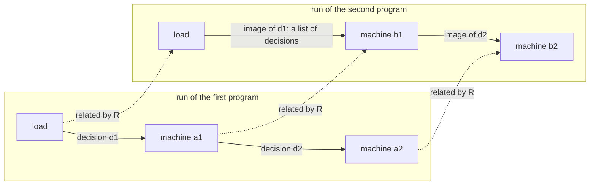

# 2026-10-08 seat SIM design: a simulation between two programs on the reference machine

Status: research note (history, not authority). Base: `c51f9e6b` (branch `refactor/phase1-phase3`).
A design seat: no file of `src/`, `Test/`, `tools/` or `docs/core/` changed, and nothing is
staged. Four scratch probes ran under `scratch/lean-slot.sh lake env lean`, one at a time. Their
files are in the seat's scratchpad: `SIM/TapeSim.lean`, `SIM/BudgetSearch.lean`,
`SIM/ProfileSearch.lean` and `SIM/ProfileVerdict.lean`. This note quotes what a slice needs from
them.

## 1. The one thing the coordinator must know first

An operation count is observable on this machine. The operation budget injects a yield at a
fixed count of operations, and no tape decision moves that yield. Two programs with one meaning
can therefore give disjoint answers inside one fork context (tested at the operation budgets 13
and 14, §2.5). So every two-program law of this design names a fragment, the budget-quiet runs,
unless the owner makes that yield a tape decision (question 1). The relation itself is cheap: its
generic form compiles in scratch at `[propext, Quot.sound]`, with reflexivity and transitivity.

## 2. The relation

### 2.1 The two runs

A loaded program is a program, its row table and its compile budget. Its run on the reference
machine is `replayR` (`src/Effect4/Laws/Program/RuntimeR.lean`): `replayEval` over `interpR`
from `loadR`. One decision runs the machine until its commands are exhausted, each drive within
the command budget (`stepDecisionState`, `src/Effect4/Machine/Fibers.lean`). A tape is settled
at a command budget when every decision's receipt is true (`Suffices`,
`src/Effect4/Laws/Machine/Approximation.lean`).

The relation compares two runs at decision boundaries only. Inside one decision the two runs may
take different numbers of commands. One decision of the first run is answered by a list of
decisions of the second, which may be empty: the second run then stutters. The diagram shows the
shape; it claims nothing.



### 2.2 The definitions (compiled in scratch)

The block below is the core of `SIM/TapeSim.lean`. The kernel accepts it at
`[propext, Quot.sound]`; it is not in the tree. The variables are the book's: two instances of
the shared machine over one decision alphabet (`Machine.Book`,
`src/Effect4/Laws/Machine/Book.lean`). Here `M₁` abbreviates
`RunMachine ν σ β ε δ ι α χ St κ₁ φ₁ η₁`, `M₂` the same at `κ₂ φ₂ η₂`, and `Dec` abbreviates
`RunDecision ν σ β ε δ ι α`.

```lean
-- compiled in scratch (SIM/TapeSim.lean); kernel-accepted at [propext, Quot.sound]

/-- The image of a tape under a decision map: both runs advance, and each decision of the
first adds its image. The image of a prefix is a prefix of the image. -/
def mapTape (fuel₁ fuel₂ : Nat) (D : M₁ → M₂ → Dec → List Dec) : List Dec → M₁ → M₂ → List Dec
  | [], _, _ => []
  | d :: rest, a, b =>
    D a b d ++ mapTape fuel₁ fuel₂ D rest (stepDecisionState i₁ fuel₁ a d).1
      (replayEval i₂ fuel₂ (D a b d) b).machine

/-- A stuttering forward simulation at the grain of one decision. -/
structure TapeSim (R : M₁ → M₂ → Prop) (D : M₁ → M₂ → Dec → List Dec) (fuel₁ fuel₂ : Nat) :
    Prop where
  stuck : ∀ a b, R a b → a.stuck = b.stuck
  finished : ∀ a b, R a b → a.finished = b.finished
  step : ∀ a b d, R a b → a.stuck = none → (stepDecisionState i₁ fuel₁ a d).2 = true →
    Suffices i₂ fuel₂ (D a b d) b = true ∧
      R (stepDecisionState i₁ fuel₁ a d).1 (replayEval i₂ fuel₂ (D a b d) b).machine

/-- Two replay results: the same class with the same reason, and related machines. -/
def ResultRel (R : M₁ → M₂ → Prop) :
    ReplayResult ν σ β ε δ ι α χ St κ₁ φ₁ η₁ → ReplayResult ν σ β ε δ ι α χ St κ₂ φ₂ η₂ → Prop
  | .finished m₁, .finished m₂ => R m₁ m₂
  | .frontier w₁ m₁, .frontier w₂ m₂ => w₁ = w₂ ∧ R m₁ m₂
  | .stuck w₁ m₁, .stuck w₂ m₂ => w₁ = w₂ ∧ R m₁ m₂
  | _, _ => False

theorem tapeSim_replay (h : TapeSim i₁ i₂ R D fuel₁ fuel₂) (tape : List Dec) :
    ∀ a b, R a b → Suffices i₁ fuel₁ tape a = true →
      Suffices i₂ fuel₂ (mapTape i₁ i₂ fuel₁ fuel₂ D tape a b) b = true ∧
        ResultRel R (replayEval i₁ fuel₁ tape a)
          (replayEval i₂ fuel₂ (mapTape i₁ i₂ fuel₁ fuel₂ D tape a b) b)

/-- The relational form: an image that exists, in place of a map. -/
structure TapeSimE (R : M₁ → M₂ → Prop) (fuel₁ fuel₂ : Nat) : Prop where
  stuck : ∀ a b, R a b → a.stuck = b.stuck
  finished : ∀ a b, R a b → a.finished = b.finished
  step : ∀ a b d, R a b → a.stuck = none → (stepDecisionState i₁ fuel₁ a d).2 = true →
    ∃ ds, Suffices i₂ fuel₂ ds b = true ∧
      R (stepDecisionState i₁ fuel₁ a d).1 (replayEval i₂ fuel₂ ds b).machine

theorem tapeSimE_replay (h : TapeSimE i₁ i₂ R fuel₁ fuel₂) (tape : List Dec) :
    ∀ a b, R a b → Suffices i₁ fuel₁ tape a = true →
      ∃ tape₂, Suffices i₂ fuel₂ tape₂ b = true ∧
        ResultRel R (replayEval i₁ fuel₁ tape a) (replayEval i₂ fuel₂ tape₂ b)

theorem TapeSim.toE (h : TapeSim i₁ i₂ R D fuel₁ fuel₂) : TapeSimE i₁ i₂ R fuel₁ fuel₂

theorem tapeSim_refl (i : RunInterp ν σ β ε δ ι α χ St κ) (fuel : Nat) :
    TapeSim i i (fun a b => a = b) (fun _ _ d => [d]) fuel fuel

theorem tapeSimE_trans (h₁₂ : TapeSimE i₁ i₂ R₁₂ fuel₁ fuel₂)
    (h₂₃ : TapeSimE i₂ i₃ R₂₃ fuel₂ fuel₃) :
    TapeSimE i₁ i₃ (fun a c => ∃ b, R₁₂ a b ∧ R₂₃ b c) fuel₁ fuel₃

-- at the value alphabet, with an observation relation that every related pair keeps
theorem tapeSimE_obs (hO : ∀ a b, R a b → O (obs a) (obs b))
    (h : TapeSimE i₁ i₂ R fuel₁ fuel₂) (tape : List Dec) (a b) (hab : R a b)
    (hs : Suffices i₁ fuel₁ tape a = true) :
    ∃ tape₂, Suffices i₂ fuel₂ tape₂ b = true ∧
      O (obs (replayEval i₁ fuel₁ tape a).machine) (obs (replayEval i₂ fuel₂ tape₂ b).machine)
```

The proofs are the book's induction on the tape (`book_replayEval`), at the decision grain. Two
new laws of one instance join the second run's images: `suffices_append` and
`replayEval_append_of_suffices`. The second comes from `replayEval_append_machine`, since a
sufficient tape ends at no fuel frontier. The `finished` field is used only at the empty tape
(reading of the probe's proof). A consumer with private fibers replaces it by a relation on the
two classes, and only that case changes. The probe holds no `first`, `try` or `simp_all`, so it
meets the proof-style ratchet as written.

### 2.3 The observation

The observation relation is `O : Obs → Obs → Prop` over `obs`, every fiber's exit and the whole
stores (`obs`, `src/Effect4/Laws/Machine/Behaviour.lean`). Decisions row 79 (R79.1) keeps `obs`
as the semantic view: a law names a projection of it and never redefines it. Three relations
serve the consumers of §3 to §5.

| Relation | What it compares | Its consumer |
| --- | --- | --- |
| equality of `obs` | every exit and the whole stores | two programs with the same fibers and the same allocations: a straight part replaced by one with the same meaning (§3.2) |
| `rootView` | the exit of the root fiber, when its value holds no handle | a refactor of a whole program; a hole filled by a term (§5) |
| `PublicView ρ` | the exits of the public fibers and the contents of the public cells, through a handle renaming ρ | a module law (§4) |

A handle renaming is a partial bijection between the handles of the two runs: fibers, cells,
deferreds and tokens. A private handle (a helper fiber, a hint, the module's cell) has no
partner, so the view hides it. Decisions row 79's record names this field `handles` (R79.5).
`obs` is not injective, and a projection loses more (row 146). No relation here says that two
runs are equal.

### 2.4 The decision map

A decision names fibers and tokens (`RunDecision`, `src/Effect4/Machine/Fibers.lean`). Two
programs allocate different helper fibers and tokens, so the names of the second run drift from
those of the first. The decision map `D a b d` answers one decision `d` of the first run with a
list of decisions of the second. It does three things:

- it renames a fiber or a token through the handle renaming;
- it gives a decision that touches only private work the empty image, so the second run
  stutters;
- it adds the decisions that the second run needs, for example one `fire` for each waiter that a
  walk resumes.

The map reads both machines, so it can run the first run's decision and read what happened. It
is data: R79.5 names it `decisions`. `mapTape` is prefix-monotone by its definition, so the
images of the prefixes of a longer tape are prefixes of one another.

### 2.5 What "under every schedule" means

A schedule is a tape: every scheduling, timing, interruption and host answer is a decision
(DB-03). "Under every schedule" quantifies over every tape whose command budget suffices on the
first run. DB-03 proposes INV-TAPE-1 (no off-tape choice) and leaves it unruled; the relation
reads the tape as the whole of the choices.

One input of a run is no choice and is not on the tape: the operation budget
(`maxOpsBeforeYield`; rc.112's `MaxOpsBeforeYield` and `shouldYield`,
`vendor/effect-4.0.0-rc.112/src/Scheduler.ts:269-272` and `:174-176`). Its yield is
`injectYield` and its test is `yieldVerdict` (`src/Effect4/Machine/Fibers.lean`). A fiber yields
when its count of operations in one entry reaches the operation budget. A `yieldVerdict`
decision can force a yield at the start of an entry, or switch the count's yield off. It acts
only on a fiber that exists at a decision boundary. So it cannot reach a child that runs inside
the decision that forks it.

**Finding F1 (tested, `SIM/BudgetSearch.lean`).** Two child bodies have one meaning. The first
sets a cell to 1 and then to 2. The second runs three pure steps between the two sets. The root
forks the child under an operation budget, reads the cell, joins the child and answers what it
read. The search replays every tape of length at most 4 over nine decisions (7381 tapes).

| Operation budget | Answers of the first child | Answers of the second child |
| --- | --- | --- |
| 13 | 2, or a failure | 1, or a failure |
| 14 | 2, or a failure | 1, or a failure |
| 2048 (the default) | 2 | 2 |

```lean
-- compiled in scratch and run by the probe (SIM/BudgetSearch.lean); not in the tree
def pad : Nat → Src NativeOp
  | 0 => succeed unit
  | n + 1 => andThen (succeed unit) (pad n)

def writes (n : Nat) (c : TermSrc) : Src NativeOp :=
  andThen (Ref.set c (nat 1)) (andThen (pad n) (Ref.set c (nat 2)))

/-- Raw: the checker refuses the provision of the reserved key `Env.maxOpsKey`. -/
def client (k n : Nat) : Src NativeOp := eff do
  let c ← Ref.make (nat 0)
  let f ← fork (provideService Env.maxOpsKey (nat k) (writes n c))
  let v ← Ref.get c
  let _ ← join f
  return v

-- the bodies of the second control (§3.2), at the default operation budget
def yielding (c : TermSrc) : Src NativeOp :=
  andThen (Ref.set c (nat 1)) (andThen (yieldNow 0) (Ref.set c (nat 2)))
def once (c : TermSrc) : Src NativeOp := Ref.set c (nat 2)
```

A failure is the interrupted child's join. At 13 and 14 the successful answers are disjoint, so
neither program's answers include the other's. The batteries already place a yield by the
operation budget. `Test/Program/SemaphoreTraces.lean` stops a taker between its registration and
its await at the budgets 21 to 25 (its trace 1).

**The fragment.** A run is budget-quiet when no yield of it comes from the operation budget.
The proposed definition reads the run's trace: every `yieldInjected` event records a count below
its fiber's operation budget, so the tape forced that yield. A battery decides it, as `yieldsOn`
already lists the injected yields (`Test/Program/SemaphoreScenarios.lean`).

A sufficient condition, by reading: every fiber's operation budget exceeds the command budget. An
entry starts at `Cmd.evaluate` with its count at zero, and a resume re-enters through
`Cmd.evaluate`. Each `Cmd.loop` command counts one operation. On a settled tape every entry ends
inside the drive that started it, and a drive runs at most the command budget of commands. A
checked program cannot provide the operation budget: the checker refuses the reserved key
(`Test/Program/SemaphoreTraces.lean`, the guard on `verdict (notified 23)`). So, by reading, every
settled run of a checked program at a command budget below 2048 is budget-quiet. Slice S2 proves
it.

### 2.6 Budgets, prefixes and infinite behaviour

- **Command budgets.** Each side has its own (`fuel₁`, `fuel₂`). A statement quantifies over
  tapes whose command budget suffices. Once it suffices, more budget changes nothing
  (`replay_stable`, `stepDecisionState_stable`), and `Beh_fuel_irrelevant`
  (`src/Effect4/Laws/Machine/Behaviour.lean`) gives the behaviour form.
- **Compile budgets.** Each side has its own too. A deeper expansion meets a frontier of reason
  `compileFuel` (`PendingReason`, `src/Effect4/Laws/Program/Sched.lean`) where the other
  program runs on. The statement takes both compile budgets, with the premise that no fiber of
  either run stands at such a frontier.
- **Infinite tapes.** Lean has no coinductive type here, and none is needed. Under a decision
  map every finite prefix of a tape of the first run is related to its image (`mapTape`). The
  images form a chain under the prefix order: DB-03's compatible prefixes. The relational form
  `TapeSimE` chooses an image for each prefix apart, so it gives no chain.
- **Divergence inside a decision.** A decision that never settles on the first run is outside
  the statement: it is a live frontier, never a failure (DB-04). Keeping such divergence on the
  second run needs a measure, which a command budget is not (DB-04's note on CompCert's
  measure). No slice attempts it.
- **Liveness.** No statement says that a decision is ever taken. A waiting request that
  eventually commits is R12's (`FairTape`), not this relation's.

### 2.7 The statement over programs (not compiled)

```lean
-- not compiled
/-- A program at its row table and its compile budget. -/
structure Loaded where
  program : NativeEff
  table : RowTable
  compileFuel : Nat

/-- Its run on the reference machine. -/
def Loaded.run (P : Loaded) (fuel : Nat) (tape : List Api.Decision) : RReplay :=
  replayR P.program fuel tape P.compileFuel P.table

/-- The settled tapes of the run: `Suffices` at the reference instance. -/
def SufficesR (P : Loaded) (fuel : Nat) (tape : List Api.Decision) : Prop :=
  letI := termEvaluatorFor P.program P.table
  Suffices (interpR P.program P.table) fuel tape (loadR P.program fuel P.compileFuel) = true

/-- No yield of the run comes from the operation budget: every `yieldInjected` event of the
run's trace records a count below its fiber's operation budget. -/
def BudgetQuiet (P : Loaded) (fuel : Nat) (tape : List Api.Decision) : Prop

/-- **Behaviour inclusion** on an observation relation `O` and a class relation `K`, over the
budget-quiet fragment: every settled run of the first program has a settled run of the second
with related classes and related observations. -/
def Refines (K : Api.Outcome → Api.Outcome → Prop) (O : Obs → Obs → Prop) (P₁ P₂ : Loaded) :
    Prop :=
  ∀ fuel₁ tape₁, SufficesR P₁ fuel₁ tape₁ → BudgetQuiet P₁ fuel₁ tape₁ →
    ∃ fuel₂ tape₂, SufficesR P₂ fuel₂ tape₂ ∧ BudgetQuiet P₂ fuel₂ tape₂ ∧
      K (classify (P₁.run fuel₁ tape₁)) (classify (P₂.run fuel₂ tape₂)) ∧
      O (obsR (P₁.run fuel₁ tape₁).machine) (obsR (P₂.run fuel₂ tape₂).machine)

/-- The same observation both ways: two inclusions, with two maps. -/
def SameObs (O : Obs → Obs → Prop) (P₁ P₂ : Loaded) : Prop :=
  Refines Eq O P₁ P₂ ∧ Refines Eq (flip O) P₂ P₁
```

The frame machine reads the same: `run_eq_ref_table_noPreload`
(`src/Effect4/Laws/Program/Table/Agreement.lean`) rewrites each side's class and `obs` at every
row table with no preloaded answer. A recorded, funded session reads the same through
`session_eq_ref` (`src/Effect4/Laws/Api/SessionRef.lean`), when its tape is the related tape.

### 2.8 Beside the book, the refinement shapes and the literature

- **The book.** `BookMeans` and `book_replayEval` relate one program on two instances, lock-step
  at the command (`StepAgrees`). The book compares the stores, the counters and the fork ledger
  by equality, and its code relation is one program's (`CodeMeans e`). So it relates no two
  different programs. `TapeSim` is the book's induction at the decision grain, and a book-style
  lemma can serve inside one `TapeSim` step.
- **The refinement shapes.** `Projects` and `Refines` (`src/Effect4/Laws/Machine/Refinement.lean`)
  connect one store step, labelled by an operation; R79.4 owns their use. `TapeSim` is their
  counterpart for whole machines, labelled by decisions, with stuttering.
- **Literature.** The relation is a forward simulation in the sense the dictionary cites (Lynch
  and Vaandrager 1995, audit C4). Here one step is answered by a finite sequence of steps; that
  form is named, not read. The tape puts every choice in the visible position (Xia et al. 2020,
  *Interaction Trees*, §7; read in `docs/research/2026-09-07-lit-papers.md`, Q7). So, given
  INV-TAPE-1, one program's agreement over every tape has bisimulation strength. Under a scheduler, agreement on
  a run's observation is no congruence (Chappe et al., *Choice Trees*, §7.2; read in the same
  note, §0 item 1). F1 and the second control of §3 are that warning on this machine. Two
  implementations of hidden state are related by a binary relation over that state (Ahmed,
  Dreyer and Rossberg 2009, audit P2), by name. The tree's `Fits` is unary.

## 3. Its laws

An interaction point of a fiber is a place in its code where another fiber can run. It is a
yield, a park, a fork that starts its child at once, or the fiber's exit. Between two interaction
points a fiber runs alone. A congruence here is a law about one program context: two parts fill
one address of it (`Sketch.fillAt`, `src/Effect4/Program/Sketch.lean`). When the relation holds
of the two parts, it holds of the two filled programs. Its lemmas carry the registry role
`compatibility`.

| Law | Statement | Evidence | Cost |
| --- | --- | --- | --- |
| reflexivity | `tapeSim_refl`: a run simulates itself, each decision its own image | compiled in scratch | cheap |
| transitivity | `tapeSimE_trans`: two simulations compose through the middle machine | compiled in scratch | cheap |
| a map gives an image | `TapeSim.toE` | compiled in scratch | cheap |
| the observation | `tapeSimE_obs`: `O` at the end of every settled tape | compiled in scratch | cheap |
| the frame machine and the session | rewrite each side by `run_eq_ref_table_noPreload` and by `session_eq_ref` | reading | cheap |
| symmetry | none: the relation is directed, and `SameObs` is two inclusions | — | — |
| congruence under bind | the part's relation holds under every continuation and every stack beneath it | not stated | days |
| congruence under catch (`catchCause`, `catchIf`) | as bind, with the part's failure cause in the relation | not stated | days |
| congruence under scope (`scoped`, `onExit`) | as bind, with the part's finalizer registrations in the relation | not stated | days |
| congruence under mask (`uninterruptible`, a restore site) | as bind, at each interruptibility of the context | not stated | days |
| congruence under fork, for a part with an interaction point | false: the second control below | tested | — |
| congruence under fork, for an atomic part | true on budget-quiet runs, by reading: §3.2 | not stated | days |

### 3.1 Why some laws are cheap

The cheap laws speak of runs, not of code. The decision grain hides how each side reaches its
next boundary, so composition needs no relation between two programs' code. Transitivity takes
the first simulation's image of one decision, a tape of the middle run, and answers it with the
second simulation's replay theorem.

### 3.2 Why the congruences are hard

**The frame congruences** (bind, catch, scope, mask) need a relation between two residual
programs, closed under the frames of one fiber. `denoteR` brackets each scoped construct with
guard markers (`guardR`, `seqR`, `src/Effect4/Laws/Program/DenoteR.lean`). DB-05 records why
sequencing there is no plain bind (`guardR_bind`, and the red control `guardR_not_algebraic`).
So the part's relation must hold for every continuation and every stack beneath it, and the
lemma runs the part inside a fiber's code. The mask adds one more premise: a part's relation can
hold at one interruptibility and fail at the other. Semaphore's written forms stand in for the
mask rightly only under an interruptible caller (the header of
`Test/Program/SemaphoreScenarios.lean`; §4.5).

**Fork** runs a part beside its context, and the context can read shared state at each of the
part's interaction points.

**Second control (tested, `SIM/BudgetSearch.lean`, at the default operation budget).** Take the
body that sets 1, yields and sets 2 (`yielding`, §2.5), and the body that sets 2 (`once`).
Alone they answer alike: the cell
holds 2 at every finished run of the 7381 tapes. Forked under a root that reads the cell and
joins, the first answers 1 or a failure, and the second answers 2. So agreement on a run's
observation is no congruence for fork, even on budget-quiet runs.

**Atomic parts.** A part is atomic on a run when it has no interaction point there. A straight
part (`Straight`, `src/Effect4/Program/Fragment.lean`) has no fiber operation, so on a
budget-quiet run it is atomic. Replace it by a straight part with the same `meaning` from every
environment and store. Where both runs are budget-quiet, that keeps `obs` in every context, fork
included (reading). Its core lemma
runs a straight residual program inside a fiber's code to its meaning. `run_eq_meaning`
(`src/Effect4/Laws/Program/Agreement/Machine.lean`) states that at the root only. Off the
budget-quiet fragment, F1 refutes even this: the operation budget can stop a straight part
between two of its writes.

**Parts with hidden state** (a module's expansion) have interaction points by design. A
congruence for them needs a binary relation over the hidden state and a premise that no other
fiber reads it. The tree has neither. So a module law is not derived from a congruence. It is
one simulation over every client of the module, with the client's own code related to itself
(§4).

## 4. The first consumer: Semaphore

### 4.1 The law's shape

Decisions row 230 rules that a module's clients are programs over application-signature rows,
and that the law relates them to the module's expansion. So a client calls Semaphore's
operations, and each call can be filled by more than one program. Filling every call with the
library's program (`src/Effect4/Modules/Semaphore/Ops.lean`) gives the program a user writes
today: derived forms are stored expanded (DI-89). Filling every call with a second program gives
a second program with the same client code. The law compares the two fillings of one client.

Until Semaphore's operations are rows, a client is written as the batteries write their cases:
a source over a record of operations (`Ops`, `Test/Program/SemaphoreScenarios.lean`). The law
then needs a premise that the client names the handle only as an operation's argument.
Question 3 asks how that premise becomes a typing fact.

### 4.2 The second filling: the spinner model

The second filling is a model of the first profile (decisions rows 259 to 261), proposed here:

- **take**: one `takeIfAvailableStep`. Where it does not take, a private fiber spins: it yields,
  runs one `takeIfAvailableStep`, and on a take resolves the request's hint, else again. The
  request awaits the hint at its restore site. An interrupted wait interrupts the spinner. The
  spinner is a daemon, interruptible, and it starts at once.
- **release**: one `releaseStep`; it posts nothing.
- **withPermits**: `protectedBy` over the model's take and the model's release
  (`src/Effect4/Modules/Waiting.lean`).

```lean
-- compiled in scratch and run by the probe (SIM/ProfileSearch.lean); not in the tree
def spinnerOptions : Effect4.Supervision.ForkOptions := ⟨true, true, .interruptible⟩

/-- Yield, then one take step; on a take, resolve `done`; else again. -/
def spinner (q count done : TermSrc) : Src NativeOp :=
  iterateWith (bool false)
    { while_ := fun took => notT took
      body := fun _ => andThen (yieldNow 0)
        (bindWith (Ref.modifyWith q (takeIfAvailableStep count)) fun took =>
          ifElse took (andThen (Deferred.succeed done unit) (succeed (bool true)))
            (succeed (bool false)))
      step := fun _ next => next }

/-- One attempt; where it does not take, a private spinner takes for the request. -/
def sTakeAt (restore : Src NativeOp → Src NativeOp) (q count : TermSrc) : Src NativeOp :=
  bindWith (Ref.modifyWith q (takeIfAvailableStep count)) fun took =>
    ifElse took (succeed count)
      (bindWith (Deferred.make .unit .never) fun done =>
        bindWith (fork (spinner q count done) spinnerOptions) fun sp =>
          andThen (onInterrupt (restore (Deferred.await done)) (withFiber (Action.interrupt sp)))
            (succeed count))

def pRelease (q count : TermSrc) : Src NativeOp :=
  bindWith (Ref.modifyWith q (releaseStep count)) fun reply => succeed (tupleAt reply 0)

def spinModel : Ops :=
  { take := fun q count => uninterruptibleMaskWith fun restore => sTakeAt restore q count
    release := pRelease
    withPermits := fun q count body =>
      protectedBy (fun restore => sTakeAt restore q count) (fun _ => pRelease q count)
        (fun _ => body) }
```

Each cell step is one transition of the model through the table. The step goals say so, and they
are proved: `takeIfAvailableStep_agrees` and `releaseStep_agrees`
(`src/Effect4/Laws/Modules/Semaphore/Steps.lean`). A waiting request commits at any interaction
point at which its count fits, and the scheduler picks the point. The model has no waiter list,
no stamp, no walk and no wake policy.
Its spinner resumes the request inside the spinner's own task. That is the library's shape too:
a walk resumes a waiter inside the helper's task, ahead of the waiter's own dispatcher.

**Tested (`SIM/ProfileSearch.lean`, bounded).** Six clients write marks into their own log and
never read the semaphore's cell. Four are after the cases P1 to P4, one is after P9, and one (C5)
forks a deferred child before it waits. Each client builds through the checker over both
fillings (`Effect4.Api.Author.build`). The library's runs replay every tape of the root's
evaluation and at most 4 more decisions over 7 (a flush, five fires, B's yield verdict). The
model's runs replay every tape of the root's evaluation and at most 5 fires over 8 fibers.

| Program | Root exits that are no exit of the spinner model |
| --- | --- |
| the library, on each of the six clients | none |
| the variant with no second check (`noSecondCheck`) | `[31, 22]` on the P1 and P9 clients: C holds 1 while B takes 2 of 2 |
| the grant at the wake (`grant`) | `[21, 31]` and `[21]` on the P3 client: a permit commits before its waiter runs |
| the head-only walk (`headOnly`) | none |

So the inclusion refutes the two faults that break the accounting or row 221's rule that a wake
reserves nothing. It lets the head-only walk through, which serves fewer waiters: a difference
of progress, which is R12's and not this law's.

**A first model fails (tested, same probe).** A model whose waiting take yields on the
requester's own fiber is simpler. On C5 the library has the exits `[22, 77]` and `[22]`, which
that model lacks. The walk runs B's retry ahead of the child on B's own dispatcher. A yield on
B's fiber queues the retry behind that child. The spinner model keeps the retry off the
requester's dispatcher.

### 4.3 The law, the relation and the decision map (sketch)

The proposed law is `semaphore_refines_model`. Take a client that names the handle only as an
operation's argument. Then `Refines K (PublicView ρ)` holds from the library's filling to the
spinner model's filling. The observation is the client's: its fibers' exits and its own cells.
The class relation `K` says that a finished library run has a finished model run. A finished
model run may face a library run whose only live fiber is a posted helper. In R79.5's record the
law reads: view `PublicView ρ`, handles ρ, decisions the map below, direction inclusion,
progress none.

A halt reason names a fiber, so the relation asks that neither run halts. Both fillings build
through the checker (tested, §4.2). M7 then gives that neither halts at the empty row table on
answer-free tapes (`m7_proved`, `src/Effect4/Laws/Program/Typed/Commands/Clauses/All.lean`). A
client with host rows needs R6's admission of host answers there.

The simulation relation pairs:

- the client's fibers through ρ, with the same code up to the operation calls;
- the library's cell, holding `cellVal tb s` for a model state `s`
  (`src/Effect4/Laws/Modules/Semaphore/Relation.lean`), with the model's cell at the same total
  and the same `taken`;
- each waiting request of `s` with a model request whose spinner waits at its yield for the
  same count. A request that a visit selected, and whose retry has not run, still counts as
  waiting.

Helpers, identities and hints of the library, and the model's spinners, have no partner. The
decision map renames a client's decisions through ρ. A library decision can run a walk. It then
maps to one `fire` of each spinner whose request the walk resumes and whose retry commits, in the
walk's order. The map reads that order off the library's decision. A decision that only reaches
a helper maps to the empty image. A library flush maps to explicit fires: a model flush settles
only when no spinner waits.

Each step uses the attempt statements, one store step from a cell that encodes a model state
(`take_attempt`, `visit_attempt`, `release_attempt`, `src/Effect4/Laws/Modules/Semaphore/Ops.lean`).
It also needs three parts that no statement holds yet. They are the wrapper's run, the walk
across visits and the work budget of one visit. Semaphore's contract lists them as connectors 2,
3 and 5 (`Test/contracts/semaphore.contract.md`; decisions row 226).

### 4.4 The claim it closes, and what stays open

The law is the inclusion part of the proposed claim `semaphore-expansion-agrees` (R10). It keeps
the permit commits and the accounting. It does not keep the selected identities: the walk's
selection is a law of the library's own run. One visit has it (`visit_selects_earliest`,
`src/Effect4/Laws/Modules/Semaphore/Profile.lean`), and the walk across visits is open.

Through the inclusion, a safety fact proved of every observation of the spinner model's filling
holds of the library's filling. The spinner model is the smaller program to prove it on.

It closes nothing of `semaphore-protected-permit` (R11). Those clauses count releases per
activation across prefixes of one run: an invariant of one program, which waits for the carrying
fact of a region.

### 4.5 The finite controls

The law shrinks no line of today's Semaphore batteries. Those lines test the representation and
rc.112's answers, which the law does not cover. The law adds a battery of its own. Decisions row
301 sorts a battery line as a reader, a control, or a finite evaluation that no theorem covers.

- **They stay, as finite evaluations.** The exits of the cases P1 to P9 in
  `Test/Program/SemaphoreScenarios.lean`. They compare with rc.112's answers, and their clients
  read the cell (`counts`), so they are no clients of the law.
- **They stay, as controls of other claims.** These are the traces of
  `Test/Program/SemaphoreTraces.lean`. Traces 4, 5 and 8 control the protected permit. Trace 7
  measures the work budget that the law takes as a premise. Traces 1 to 3 and 6 control claims
  of R12.
- **The law's battery reuses them, as its controls.** The three variants of the policy:
  `noSecondCheck` and `grant` are red controls of the inclusion, and `headOnly` shows what the
  inclusion lets through. The probe's C5 is the red control of the first model.
- **They stay, as finite evaluations, with no law in reach.** The comparisons of the written
  forms with the library's (`casesWith Written.ops` against `casesWith library`, and the joined
  forms) are two-program checks on one tape. A law for them needs the congruence at the mask with
  an interruptible caller. It has no consumer among the semantics registry's claims, so this note
  proposes none.
- **They are red controls of an equality that no law states.** The joined forms agree with the
  plain forms on the plain tape and differ on P9's tape (`exitOn yieldAtResume p1Joined = none`).

### 4.6 Out of reach

- Liveness: that a waiting request ever commits, and the order of service (R12).
- The live scan's selection across a walk.
- The protected permit's three clauses (R11).
- Agreement with rc.112, which stays with the truth lane (DI-49).
- Runs off the budget-quiet fragment, where an operation count is observable.
- A client that reads the cell, as every scenario client does today.
- `resize`, `releaseAll` and a count that is no natural number (row 260).

## 5. Authoring and usage

### 5.1 Where the relation is needed

On a fragment that has a meaning, two programs compare through their meanings. `run_eq_meaning`
ties a run to `meaning` on `Straight`, and `loopAgreement` does so on `Looped`
(`src/Effect4/Laws/Program/Agreement/Loop.lean`). The planned goal `denoteRows_eq_session`
(`src/Effect4/Laws/Api/SessionMeaning.lean`, slice H8) does so on `StraightRows` with one fiber.
There, equal meanings give equal observations, and no two-run relation is needed. The relation
is for the rest: programs with fibers, where the scheduler decides and no meaning exists (DB-05).

### 5.2 What an author or an agent gets

- **A refactor with its law.** A straight part may be replaced by one with the same meaning, in
  any context, fork included, where both runs are budget-quiet (`straight_replacement`, slice
  S4). The frame machine and the session read the same (§2.7).
- **A module's law, once for each module.** An agent reasons about a client against the spinner
  model's filling: no helper, no hint, no walk. A safety fact of every observation there holds of
  the library's filling (§4.4).
- **Fewer finite tests, with their controls kept.** A two-program check on one tape becomes a
  reader of a law over every tape of the fragment. Its red controls stay (row 301).
- **A hole filled by a term (R14).** A hole is an operation at a hole row (`Row.hole`,
  `src/Effect4/Program/Sketch.lean`): its call parks the fiber, and a host answer resumes it.
  The open part `fill-by-term` asks that the filled program and the sketch answered by the term's
  value have one observation. On one fiber it would follow from the meanings (§5.1). It needs
  one lemma that no statement holds yet: a hole answered by an exit means what the filled
  program means. With a second fiber ready at the park, the sketch has an interaction point that
  the filled program lacks. Then neither inclusion holds in general, by the second control's
  shape. So that law is stated for programs that fork nothing.

### 5.3 The surface (proposed)

| Declaration | Where | What it is |
| --- | --- | --- |
| `TapeSim`, `TapeSimE`, `mapTape`, `ResultRel` and their laws | `src/Effect4/Laws/Machine/Sim.lean` | the generic relation, beside `Machine.Book` |
| `Loaded`, `BudgetQuiet`, `Refines`, `SameObs`, `rootView`, `PublicView` | `src/Effect4/Laws/Program/Sim.lean` | the statement over programs on the reference machine |
| `refines_frame`, `refines_session` | the same file | the reading on the frame machine and on a session |
| the spinner model | `src/Effect4/Laws/Modules/Semaphore/Spinner.lean` | the second filling of a Semaphore client; law-side only, so the `Effect4` root never ships it |

A law states `Refines K O P₁ P₂` with its premises named. Its registry claim names the
observation, the fragment and the direction: R79.5's record (`view`, `handles`, `decisions`,
`direction`, `progress`), written as data in the statement.

A finite companion serves an agent before a proof exists. It replays two programs over every
tape up to a length and compares the two sets of observations, as `SIM/BudgetSearch.lean` and
`SIM/ProfileSearch.lean` do. Its result is tested, never proved. It finds a counterexample
cheaply: one probe run found the first model's failure on C5 (§4.2). No tactic is proposed: a
step obligation is a drive's argument, and each consumer's is its own.

## 6. Placement

Each block gives the five fields of `AGENTS.md`'s placement rule (the dictionary's §6.5). Every
claim id is proposed; the slice that lands it adds it to `tools/Tools/SemanticsRegistry.lean`
and to `docs/core/semantics.md`.

**6.1 The generic relation** (slice S1). These are theorems, landed proved, with no planned
goal: `tapeSim_replay`, `tapeSimE_replay`, `TapeSim.toE`, `tapeSim_refl`, `tapeSimE_trans` and
`tapeSimE_obs`.

- Concept: `translation-simulation`. Property: a new required property, a simulation between two
  runs at the grain of one decision. S1 adds it to the concept's §4 in `docs/core/semantics.md`.
- Question: claim `two-run-simulation` (role simulation, pointer `tapeSimE_replay`) and claim
  `two-run-transitive` (role transitivity, pointer `tapeSimE_trans`). Consumers: `Refines` and
  its readings (S2), `straight_replacement` (S4) and `semaphore_refines_model` (S6).
- Reach: any two instances of the shared machine over one decision alphabet. Any relation that
  keeps the halt reason and the class. Every tape whose command budget suffices on the first run.
  Decisions row 79 bounds the observation (R79.1, R79.5).
- Does not establish: any instance's step obligation, anything at a decision that does not
  settle, divergence or liveness. The host boundary stays where `docs/core/host-boundary.md`
  puts it.
- Unlocks: R10 (a module's law) and R14 (a fill in a program with fibers).

**6.2 The statement over programs and its readings** (slice S2). These are theorems:
`refines_frame`, `refines_session` and `budgetQuiet_below`.

- Concept: `translation-simulation` for the readings, and `reactive-scheduling` for the quiet
  lemma. Properties: a two-run law read on the frame machine and on a session. An entry counts at
  most its drive's commands.
- Question: claim `two-run-faces` (role simulation) and claim `budget-quiet-below` (role
  preservation). Consumers: every law of §4 and §5 read on a session. The fragment premise of
  every `Refines`.
- Reach: `run_eq_ref_table_noPreload`, at every row table with no preloaded answer.
  `session_eq_ref`, on recorded, funded runs whose tape is the image. The quiet lemma, on settled
  tapes at a command budget below every fiber's operation budget.
- Does not establish: the case of preloaded answers (the rest of `run_eq_ref_table`, slice H6b).
  Reply admission. The quietness of a run at a larger command budget, which only `BudgetQuiet`
  decides.
- Unlocks: R10 and R14 on sessions, and R6's reading of a law.

**6.3 The two controls** (slice S3). These are register lines, not goals. The proposed ids are
`E4-SIM-CE-001` and `E4-SIM-CE-002`; the coordinator assigns them.

- Concept: `translation-simulation`.
- Attacked statements: two programs whose parts have one meaning have one observation under every
  tape (refuted by F1). Agreement on a run's observation is a congruence for fork (refuted by the
  second control).
- Witness: `Test/Program/SimControls.lean`, the probes' runs as `#guard`s over a smaller tape set.
- Forced repairs: every two-program law takes the budget-quiet premise, unless question 1 rules
  otherwise. Fork is a congruence for atomic parts only, so a module law is its own simulation.
- Consumers: the premises of `Refines` and of `straight_replacement`.

**6.4 Atomic replacement** (slice S4; planned goal `straight_replacement`).

- Concept: `translation-simulation`. Property: a new required property, replacing an atomic part
  keeps the observation.
- Question: claim `straight-replacement` (role compatibility). Consumers: the refactor law of
  §5.2, and `fill-by-term` for a straight term in a program with fibers.
- Reach: two parts that `Straight` admits, with the same `meaning` from every environment and
  store that fit. Every program context, where both runs are budget-quiet and both compile
  budgets suffice. The observation is `obs`, with the identity decision map.
- Does not establish: a part with a fiber operation. A run off the budget-quiet fragment, where
  F1 refutes it. That the two programs are equal.
- Unlocks: R14, and R10's laws of derived forms whose expansion is straight.

**6.5 A fill on one fiber** (slice S5, after H8; planned goal `fill_by_term_single`).

- Concept: `translation-simulation`. Property: R14's open part `fill-by-term`, on one fiber.
- Question: claim `fill-by-term` (role simulation). Consumer: an author's fill of a hole.
- Reach: `StraightRows` programs with one fiber, and a hole answered by an exit. It reads
  `denoteRows_eq_session` on the sketch and on the filled program, and no two-run relation.
- Does not establish: a program that forks, or a fill by a program that is no term.
- Unlocks: R14.

**6.6 Semaphore's law** (slice S6; planned goal `semaphore_refines_model`).

- Concept: `translation-simulation`. Property: a composed module's law, `Agrees profile module
  expansion` (R10; decisions rows 79 and 230).
- Question: claim `semaphore-refines-model` (role simulation), a part of the proposed
  `semaphore-expansion-agrees`. Consumer: R10's open part for Semaphore.
- Reach: clients that name the handle only as an operation's argument. The first profile
  (decisions rows 259 to 261), where a release asks for at most `taken`. Budget-quiet runs and
  every tape. The observation is `PublicView ρ` with the class relation of §4.3. The direction is
  inclusion.
- Does not establish: liveness, the order of service, the walk's selection or R11's clauses.
  Agreement with rc.112. Anything of a client that reads the cell.
- Unlocks: R10's first module law, and R10's open part "a composite's contract by a stuttering
  route".

## 7. Slices

Sizes are in hours of one seat. Each slice's gates are the ones its diff reaches (decisions row
310, point 10), and every `lake` runs as `LEAN_NUM_THREADS=3 lake build <Module>`, one at a time.

| Slice | Hours | What lands | Gates by reach |
| --- | --- | --- | --- |
| S1 the generic relation | 3 | `src/Effect4/Laws/Machine/Sim.lean`: probe 2 as it compiled, with a class relation in place of the `finished` field; the two claims of §6.1; the property in `docs/core/semantics.md` | the build of `Effect4.Laws.Machine.Sim`; the import at the anchor of `src/Effect4/Laws.lean`; `python3 scripts/generate.py --only semantics`; `python3 scripts/check-language.py --show docs/core/semantics.md` |
| S2 the statement over programs | 6 | `src/Effect4/Laws/Program/Sim.lean`: `Loaded`, `BudgetQuiet` in its trace form (every injected yield stands below its fiber's operation budget), `Refines`, `SameObs`, the views, the two readings, `budgetQuiet_below` | the build of `Effect4.Laws.Program.Sim`; the semantics group |
| S3 the controls | 2 | `Test/Program/SimControls.lean` with F1 and the second control; two register lines | `lake env lean Test/Program/SimControls.lean`; the import at the anchor of `Test/All.lean` |
| S4 atomic replacement | 24 to 32 | a relation between two residual programs that differ in one part; its keeping by every command of a drive; the run of a straight part in a fiber's code to its meaning; `straight_replacement` | the builds of the new law modules and their direct dependents |
| S5 a fill on one fiber | 4, after H8 | the lemma that a hole answered by an exit means the filled program; `fill_by_term_single` | the build of its module |
| S6 Semaphore's law | 40 to 60, split after S4 | first the battery: the probe's six clients and four controls; then the spinner model, the wrapper's run and the walk across visits (connectors 2 and 3); then the relation, the decision map and `semaphore_refines_model` | the builds of the Semaphore law modules; `lake env lean` of the new battery |

S1 to S3 depend on nothing open. S4 is the first slice that relates two programs' code, and S6
reuses its drive-grain lemmas. S5 waits for H8, the next slice of `docs/STATE.md`, and needs no
two-run relation. The sizes of S4 and S6 are estimates by reading: the frame and term simulation
that `run_eq_ref` rests on took eight modules (`src/Effect4/Laws/Program/Simulation/`).

## 8. What this does not establish

- No two-program law here is stated off the budget-quiet fragment: there F1 refutes the general
  claim.
- Fork is no congruence for a part with an interaction point (the second control). A module law
  is therefore one simulation per module, not a corollary of a congruence.
- Nothing here is liveness, fairness, order of service or progress of a waiter. A decision that
  never settles is outside every statement, and no slice keeps divergence across two runs.
- No statement says that two programs or two runs are equal: `obs` is not injective (row 146).
- Nothing relates a run to rc.112 or to the OCaml engine. R8's faces keep their own evidence.
- The host boundary stays where `docs/core/host-boundary.md` puts it: no reply admission, no
  host conformance, and no preloaded answer (H6b).
- The probes are finite: the inclusions of §4.2 are tested on bounded tapes, and the quiet
  condition of §2.5 is reading. The generic theorems compile in scratch and are in the tree only
  after S1.

## 9. Questions for the owner

1. **What "every schedule" ranges over: the operation budget** (meaning and supported domain).
   The operation budget's yield is no tape decision, so an operation count is observable (F1).
   - (a) Every two-program law states the budget-quiet fragment. Nothing in the machine changes,
     and the scenario runs are in the fragment. **Recommended.**
   - (b) The operation budget's yield becomes a tape decision at every iteration. An operation
     count is then unobservable, and the premise goes. It changes `injectYield`'s meaning and
     every tape. rc.112 still yields by the count, so R8's faces read its runs as one tape among
     many.
2. **The second side of a module law** (representation).
   - (a) The spinner model, a program on the reference machine (§4.2). It is tested on six
     clients, and it refutes the grant and the retry with no second check. The law is then an
     inclusion: the model has no wake policy, so the live scan's order stays outside the law.
     **Recommended.**
   - (b) The module's operations as host rows, answered under a `HostSpec` over the model's
     state: R79.5's profile as data. A host call parks, so a take that commits at once gains an
     interaction point that the library lacks. An interrupted waiting call needs R6's per-row
     cancellation, which is open.
3. **Which clients a module law covers** (supported domain). Today the handle is the cell's `Ref`
   (decisions rows 230 and 255), and every scenario client reads the cell.
   - (a) A premise on clients: the handle occurs only as an operation's argument.
     **Recommended now.**
   - (b) The hidden handle type that row 230 defers, so that typing gives the premise.
     Recommended with the second module law (the Queue or Pool).
