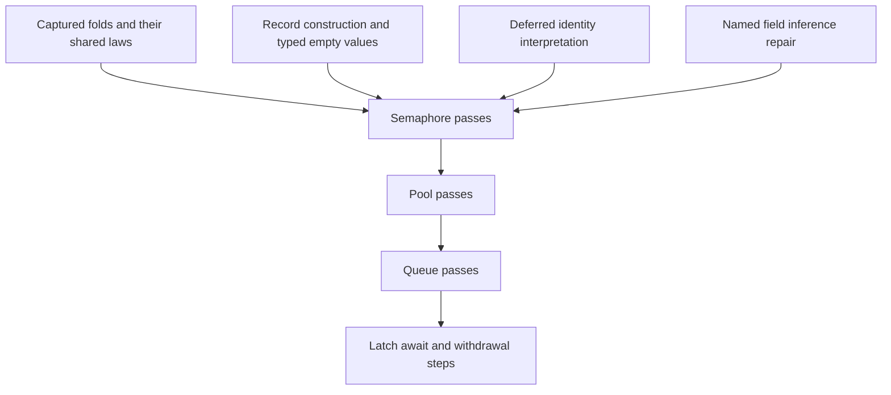

# Module authoring: folds and the remaining construction gaps

The owner authorizes implementation after the L3 review.
The base is `88a660b3`.
This plan extends row 330's step language before the later module simulation slices.

## Contract

`Step` in `src/Effect4/Modules/Step.lean` remains first-order data.
`Term` remains its target, and `Eff` remains the sole program representation.
A constructor stores no Lean function, expression, or runtime object.

A fold stores a list, an initial accumulator, and a body.
The body inputs are the accumulator, the element, and the outer inputs.

```lean
fold {acc item : Ty} :
  Step Γ (.list item) → Step Γ acc →
  Step (acc :: item :: Γ) acc → Step Γ acc
```

The algebra carrier gains the input context as an index.
Every interpretation remains a fold through that algebra.

The translation resolves each used caller input at its original scope.
It inserts binder slots into the resulting term through weakening.
Nested folds repeat this operation on term data.
Unused caller inputs do not cause term translation failure.
A body translates independently of whether its element carrier has an inhabitant.

A fold assigns its binder positions from the scope depth.
Its reading law therefore requires the value environment's length to equal that depth.
Its typing law requires the type environment's length to equal that depth.
A per-step scope proposition requires this equality only when the step contains a fold.
Existing statements about module operations retain their hypotheses.
Their proofs supply the new premise where the step contains no fold.

## Construction and identities

Record construction uses typed field data and required fields only.
The canonical schema owns the field order.
The Lean notation names fields, and its macro supplies their order.
Old builders migrate through explicit reading and typing connectors where their term order differs.
No claim requires byte equality between differently ordered record terms.

Typed empty lists and options use `Authoring.ascribe` in `src/Effect4/Program/Authoring/Ascribe.lean`.
The typing facts retain declaration formation, normality, and the existing subtype check.
A type variable can pass normality while failing formation outside a template.
The checks must retain that refusal.
The list constructor composes the existing native list rule.

Deferred comparison needs an interpretation that encodes deferred identities.
The opaque interpretation admits arbitrary values and cannot justify that comparison.
A context-sensitive reading premise supplies the comparison law only where the step uses comparison.
The deferred-key interpretation supplies it once.
The comparison connects to model request numbers only under the existing table injectivity premise.
It establishes neither allocation validity nor membership.

## Proof placement before implementation

| Obligation | Concept and claim | Reach and premises | Consumer and requirement |
| --- | --- | --- | --- |
| Fold translation reads its denotation | `translation-simulation`, `step-language-sound` | Each step that passes its checks, used input readings, canonical record names, and scope alignment when a fold occurs | Module `*_agrees` statements, then their store-attempt statements, R10 |
| Fold translation has its indexed type | `store-typing`, `step-language-typed` | Each step that passes its checks, input typing, typing facts, and scope alignment when a fold occurs | Module `*_typed` and `*_types` statements, then `step_keeps_cell`, R4 |
| Body translation succeeds without inhabitants | helper of `step-language-sound` | Successful used-source translation, including an empty list over an empty carrier | The fold case of the reading law, R10 |
| Record and empty-value reading | helpers of `step-language-sound` | Required fields, canonical names, and the existing record build and ascription rules | Constructing waiters, offers, and items, R10 |
| Record and empty-value typing | helpers of `step-language-typed` | Declaration formation, normal forms, and the checker's field and subtype rules | Module step typing, R4 |
| Deferred comparison reads the key comparison | helper of `step-language-sound` | An interpretation whose image contains deferred identities | Module removal passes under table injectivity, R10 |
| Module value equations | `translation-simulation`, existing module step agreement claims | The unchanged independent model and each existing statement's premises | Existing module agreement statements, R10 |
| Existing frame laws extend | `translation-simulation`, `step-frame` | An update spine and a field outside the write footprint | Module updates that frame untouched fields, R10 |

These obligations establish no wrapper scheduling law, progress, liveness, allocation theorem, or native compatibility result.
The independent models stay independent of generated implementations.
The Laws graph remains separate from the core import graph.

## Landing order



Each implementation lands after its narrow checks.
Each new shared operation has a concrete module consumer.
The receipt records any remaining wrapper work separately from the step language.

## Finishing criteria

- The author interface supports captured and nested folds without stored functions.
- Positive and negative controls cover capture, scope alignment, empty carriers, formation, and identity roles.
- Shared reading and typing laws cover the extension under its stated premises, without new axioms or planned goals.
- Concrete module steps reuse those laws and retain independent behavior statements.
- Named fields infer their types and retain existing refusals.
- The changed modules and their direct consumers pass narrow builds.
- The receipt names exact commands, changed paths, trust evidence, and remaining boundaries.

No full sweep or push belongs to this request.
