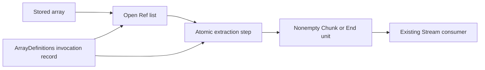

# Stream arrays: the construction plan

Status: proposed production slice, approved by the coordinator. Base: `08431c4e`.

`Stream.fromArray` creates a source from a stored list.
A nonempty source emits its entire list once.
An empty source ends immediately.
Every later pull ends with `unit`.
Effect 4.0.1 owns this behavior in `Stream.ts`, `fromArray`, and `Channel.ts`, `succeed` and `fromEffect`.
The source uses the existing `Program.Stream.pulledTy` protocol under decisions row 331.
Its end remains a value, rather than Effect 4.0.1's `Cause.Done` failure.

The pending list is stored state, not another program representation.
The array step returns the previous batch and clears the pending list.
The source turns that batch into the existing answer protocol.
`ArrayDefinitions` declares open, pull and close through `eff_module`.
The battery assembles a concrete `Stream.Source` from their invocations.
The public module omits that helper until generated records retain type metadata.
`Stream.fromArray` supplies the inline source.

## Proof placement

| Field | Agreement |
| --- | --- |
| Concept and property | `translation-simulation`; a stored step agrees with an independent value transition |
| Question and role | proposed claim `stream-array-step-agreement`, role simulation, pointer `arrayStep_agrees` |
| Reach | every interpretation and element carrier, one existing cell, aligned scope and receiver reading |
| Exclusions | no whole-run agreement, source-control theorem, scheduling, allocation-object correspondence, or TypeScript execution |
| Consumer and requirement | `arrayBatch` feeds `arrayPull`; existing Stream consumers read its batch; R10 |

The independent transition retains both the output batch and next pending state.
`arrayStep_eval` serves `arrayStep_agrees`.
`Ref.modify_callback_agrees` supplies one-cell agreement.

| Field | Typing |
| --- | --- |
| Concept and property | `store-typing`; `step-language-typed` and the typed Ref callback answer |
| Question and role | helper `arrayBatch_answers` of `step-language-typed`; consumer `arrayBatch` |
| Reach | formed normal list type, typed receiver and the array step's facts |
| Exclusions | no membership or typing of a refused source, no whole-run or host claim |
| Consumer and requirement | `arrayPull`, and module-check admission of `ArrayDefinitions`; R4 |

The finite controls use public authoring and running entry points.
They cover collection, repeated pulls, caller variables, missing definitions and incorrect types.
The coordinator owns registration, roots and architecture integration.

## Remaining gaps

This slice adds no generic Channel or upstream reference representation.
The catalogue's pullLoop wrapper G1, scope wrapper G7 and module-run agreement G10 remain open.
The older Stream run obligations remain open.
Finite machine evaluations do not prove those statements.
