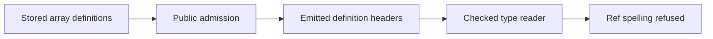

# Definition-backed array source: target header refusal

The coordinator must keep definition read-back separate from target execution until the owner amends the frozen type-reader profile.
No production reader or contract changes in this receipt.

Base: `1d8326cdf7cef2e8cb45c326bbc570ddb15bf9d0` on `codex/stream-array`.
Scope: this receipt, `2026-10-08-stream-defs-target-probe.lean`, and its retained output.
Evidence kind: compiling finite Lean evaluations and source reading.

## Located boundary

`Codegen.Classes.readNamed`, in `src/Effect4/Codegen/Classes.lean`, refuses `Ref.Ref<A>`.
`Program.readDefHead`, in `src/Effect4/Codegen/Read.lean`, reads every definition column through `Codegen.Classes.readTyChecked`.
Thus the array opening answer and both receiver requests refuse as `ReadRefusal.shape "definition"`.

`Api.Author.build` accepts these definitions through program typing.
`Codegen.printModule` emits their target declarations.
Their headers do not read back under the current profile.

The probe retains all three actual emitted header refusals.
A minimal header with the pull union and a unit request reads successfully.
The raw `Program.Stream.pulledTy` orders members differently from its canonical form.
The emitted header reads the canonical end-first union.
This difference causes no header refusal.



## Frozen profile

`Test/contracts/faces.contract.md`, the T5 amendment's readable-types paragraph, explicitly excludes a handle spelling such as `Ref.Ref<A>`.
`Test/Codegen/TypeReader.lean`, `unread`, pins `.refOf .nat` as outside `ReadableTy`.
The contract also requires the TypeScript reader to read the same forms.
`ts/eff/read.ts`, `readTypeChecked`, documents the same handle exclusion.

`Program.readDefHead_printDef`, in `src/Effect4/Laws/Codegen/Module.lean`, requires `DefDecl.readable = true`.
The present refusal violates no premise-satisfied theorem.

## Research candidate

The smallest proposed production change adds this case to the existing `Codegen.Classes.readNamed`:

```lean
| ["Ref", "Ref"], [x] => some (.refOf x)
```

The existing recursive reader reads the argument first.
`Codegen.Classes.readTyChecked` retains its reprint-equality guard.
No second production reader is proposed.

The probe's `candidateType` tests only a top-level Ref with an argument read by the existing checked reader.
`candidateHeader` uses that experiment on the three actual emitted headers.
All three candidate declarations match their expected canonical request, answer and error types.

The controls refuse missing and surplus arguments, wrong qualifiers, an unqualified name, and unknown arguments.
An unknown nested list argument also refuses.
The experiment leaves a list holding Refs unread.
A recursive production extension needs that separate positive control.
These evaluations establish no body or whole-module round trip.

Proposed contract amendment:

> Admit the structured Ref spelling at exactly one readable argument through the existing checked type reader.
> Keep its reprint-equality guard.
> Retain the exclusions for unknown, other handle spellings, collisions, and noncanonical reader choices.

Move structured Ref fixtures from `unread` to readable controls after owner approval.
Update the existing TypeScript twin and its controls in the same slice.
Do not widen a handle to unknown or discard its argument.

## Existing proof placement

No new theorem is stated or proved here.
A production slice reuses the following placement before changing any proof.

| Field | Placement |
| --- | --- |
| Concept and property | exact-codecs; reconstruct an emitted module on its readable domain |
| Question and role | registry claim `module-defs-round-trip`, compatibility; pointer `Program.readModule_printModule_defs` |
| Reach | definition headers at readable columns, empty requirement rows and valid names; body reading remains a separate premise |
| Exclusions | no allocation, value codec, target typing, host execution, progress or whole-stream claim |
| Unlock | R8 reconstruction for module-authored array sources |

`Codegen.Classes.readTyChecked_exact` and `Codegen.Classes.readTyChecked_of_readable` keep their statements.
Their proofs use the checked guard and the readable-domain definition.
`Program.readDefHead_printDef` also keeps its statement.
The approved slice must rebuild these consumers and retain their existing controls.

## Reproduction

Run from the seat worktree:

```sh
LEAN_NUM_THREADS=3 lake build Effect4.Emit
LEAN_NUM_THREADS=3 lake env lean docs/research/2026-10-08-stream-defs-target-probe.lean
```

The narrow build passes with 175 jobs.
The final probe exits successfully.
Its output records the actual refusals and candidate declarations.
No TypeScript compiler, host execution, whole battery or axiom gate runs in this probe.
The coordinator owns the retained emitted TypeScript and target checks.

Open: owner approval for the frozen profile amendment, recursive Ref controls, the TypeScript twin, and the whole-module round trip.
