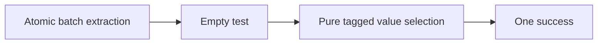

# Array pull: pure value selection on the target

The coordinator can integrate the module repair without changing Codegen or the frozen reader profile.
The two-item tuple distribution failure remains separate.

Base: `7beadadc863b382a32c33014174256d94276c197` on `codex/stream-array`.
Production change: `src/Effect4/Library/Stream/ArrayOps.lean`, `Effect4.Stream.arrayPull`.
Research changes: this receipt, its plan, and `2026-10-08-stream-target-join-evidence/`.

## Change and observation

The old array pull selects between two success effects.
Its target declaration wraps that selection in `Effect.suspend`.
Pinned tsgo chooses the chunk effect and refuses the end effect with `TS2375`.

The repaired pull selects between two pure tagged values through the existing `ite` term.
One success returns the selected value.
Both pair constructions accept the pending batch in either branch.
The atomic extraction and clearing operation stays unchanged.



The independent `ArrayModel` and the three existing array laws stay unchanged.
No new theorem is stated or proved.
The finite target check observes a chunk containing `1,2,3`, then an end with unit leftover.
It agrees with the checked machine observation for the retained two-pull program.
This check establishes no whole-stream or host agreement theorem.

## Evidence

| Check | Result |
| --- | --- |
| Public program admission and machine observation, old and candidate | pass |
| Ordinary emission and exact public read-back, old and candidate | pass |
| Original emitted target under pinned tsgo | `TS2375`, compiler exit 1 |
| Candidate target under pinned tsgo | compiler exit 0 |
| Candidate execution under Effect 4.0.1 | expected chunk and end |
| Final production emission versus tested candidate | byte-identical |
| Narrow modules and unchanged public battery | pass, 942 jobs |
| Existing law and operation axiom dependencies | within `propext` and `Quot.sound` |

Compiler: `@typescript/native-preview` `7.0.0-dev.20260629.1`.
Runtime: Bun `1.4.2`.
Target settings retain strict checking, exact optional properties, and unchecked indexed access checking.
The candidate introduces no target cast or widening to unknown or any.
Retained helper files are the existing target helpers.
`inputs.json` records their hashes and the release package hashes.

`Produce.lean` retains the old pull body explicitly.
It produces a three-item observation containing both pull answers and unit.
That finite observation isolates the effect join from the separately retained two-item tuple failure.
No public caller is removed from the coordinator's catalogue.

## Public emission boundary

`Api.Typed.emit`, in `src/Effect4/Api.lean`, calls `Api.emitModule`.
`Codegen.emitModule`, in `src/Effect4/Codegen/Checked.lean`, uses the ordinary `Program.printEntry`.
Its certificate establishes input formation, typing, and production by `Program.printEntry`.
It establishes no target compiler acceptance.

`Program.printTyped`, in `src/Effect4/Codegen/PrintTyped.lean`, is a separate expression producer.
It is re-exported by `Effect4.Emit`.
The public certificate route does not select it.
The typed-site code explicitly excludes Boolean selection annotations.
Its term application path leaves `tuple` unchanged.
Thus selecting that route does not establish a repair for these two failures.

The two-item tuple helper answers a tuple of union slots on the target.
`Ty.normalize`, in `src/Effect4/Program/Ty.lean`, distributes a product across its factors' unions.
The catalogue's independent source caller exposes that difference at the main annotation.
`independent-original.ts` retains the original emitted case.
The coordinator assigns that shared helper repair separately.
This slice changes neither the tuple helper nor the caller.

The frozen Ref definition-header refusal remains as retained in `2026-10-08-stream-defs-target-receipt.md`.
The module repair neither widens that profile nor bypasses its refusal.

## Reproduction

Run from this worktree:

```sh
LEAN_NUM_THREADS=3 lake build Effect4.Library.Stream.ArrayDefs Effect4.Laws.Library.Stream.Array Test.Program.StreamArray Tools.LoadPaths
LEAN_NUM_THREADS=3 lake env lean --run docs/research/2026-10-08-stream-target-join-evidence/Produce.lean /tmp/stream-join-fresh-emissions
LEAN_NUM_THREADS=3 lake env lean docs/research/2026-10-08-stream-array-audit.lean
python3 docs/research/2026-10-08-stream-target-join-evidence/check-target.py --install /Users/pooks/Dev/lean4-effect4/ts/release/node_modules --out /tmp/stream-join-fresh-check
```

Use fresh output directories.
The target script compiles the retained exact sources, expects the old compiler refusal, and executes the accepted candidate.
`lean-evaluations.log`, `old-diagnostics.log`, `candidate-diagnostics.log`, `observations.json`, and `axioms.log` retain the results.

Open: the separate tuple helper failure, the frozen Ref profile amendment, and whole-catalogue target acceptance.
No sweep, whole battery, owner document change or push occurs in this slice.
