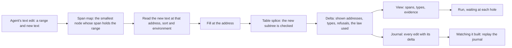

# Tangible authoring: one document, five faces, one journal

Status: design note (history, not authority). Base: `902c7826` (`refactor/phase1-phase3`). It
rules nothing. Section 10 holds the owner's decisions.

On 2026-10-08 the owner asked for the design step, by voice. The coordinator's reading:

- The experience is tangibility. A person or an agent reaches the semantics through the
  object-language syntax, the program's text and its tree.
  They watch the program get built and pieced together, with its proof structures attached. They
  see the data structures, and then they run the program.
- The checker has to work for that experience.
- Agents will use it through MCP and tools that edit code. Code as text, edited by operations,
  may be the useful representation: a file changes, and the checker updates.
- The goal is to manage the composition of general semantics, "the universe of algebra", and to
  focus the design.

## 1. The one thing to know first

- **Every face of a program is a fold of one tree.** The checker's table, the printed text and
  the address list are each a fold of `Eff`, with an inherited context from the earlier
  siblings. So one law shape makes every face local under an edit.
- **The table already has that law.** An edit that keeps its focus's type splices the table
  (`table_splice`, `Sketch.table_fill`, `Sketch.table_omit`). The printer is a fold too:
  `printT` is the fold of `printAlg` with the environment length as its context
  (`src/Effect4/Codegen/Templates.lean`).
- **So a text edit and a tree edit can be one edit.** A text edit inside the span of one node
  is the fill of that node's address. It costs one subtree in every face: text, tree, table,
  evidence and run.
- **The checker must answer five things** for this experience: total, incremental, located in
  the text, evidenced and runnable. Two are landed, one is close, and two need a design step
  (§5).
- **The composition answer**: prove the splice once for the fold's shape, and instantiate it for
  each face (§7). A new face then costs one algebra and one lemma about what its step reads.

## 2. What the tree holds today

| Face | Its data | Its fold | Laws landed | Missing |
| --- | --- | --- | --- | --- |
| text | the TypeScript print: `printT`, then the rendered text | `printAlg`, context the environment length | `read_print`, `read_exact`, `readTyped_exact` (`src/Effect4/Laws/Codegen/`) | a map from addresses to text spans; a splice law for the text; reading at an address in context |
| tree | `Eff`, the sketch, the node lenses | the generated folds | the lens laws, `address-composes`, `sketch-wire` | stable identities across an insertion |
| table | `Sketch.table`, `Sketch.annotate`, the edit session | `Annotate.check.alg`, context the environment and the path | the splice family, `edit-session-coherent`, `edit-session-undo`, `edit-repaint-set`, `omit-splices-table` | an entry past a refused sibling is not reached |
| evidence | the registry's claims; the laws a tool names | none | the deciders' soundness (`fillPremises_sound`, `omitPremises_sound`) | the rule behind each entry, as data |
| run | `Run`, the host session | the machine's step | `run_eq_meaning`, `session_eq_ref`, `journal_replays` | one session for editing and running; filling a hole that has run |

Two readers exist. The Lean reader reads a TypeScript tree at an environment length, and refuses
at a located path (`readEffAt`, `src/Effect4/Codegen/Read.lean`). The TypeScript reader reads
text through oxc, clause for clause with Lean's (`readTypeScript`, `ts/eff/README.md`). Its
refusal is data. oxc gives every node of its tree a span.

## 3. The loop, as the experience

Each arrow is a function with a law, or a law to state. Section 4 places the text arrows, section
5 the checker, section 6 the evidence and the journal.

## 4. A text edit is a tree edit

**The span map.** The print, with a span for each address. It is the printer's fold with one
more output, as `printTypedAt` threads the address today (`src/Effect4/Codegen/PrintTyped.lean`).

**Two laws to state**, both at the readable fragment and a lawful spelling:

| Law | Statement |
| --- | --- |
| print splice | the print of `p` with `q` filled at `a` is the old text, with the span of `a` replaced by the print of `q` at `a`'s environment length |
| read at an address | the text in the span of `a` reads, at `a`'s sort and environment length, as the sub-program at `a`; whatever reads there is that sub-program's print, up to the normaliser |

The first is the table's splice law at the printer's algebra. The second is `read_print` and
`read_exact` at an address. Together they make a text edit inside one span the tree edit that
fills that address.

**The policy for one text edit:**

1. Find the smallest node whose span holds the edited range.
2. Read the span's new text at that node's sort and environment length.
3. If it reads, fill the address, and splice the table.
4. If it does not read, try the parent's span. The file's root is the last step: a whole read.
5. Print the filled subtree again, so the file stays the print of its tree.

**What the policy costs.** An edit that crosses two siblings' spans reads their parent. An edit
that does not read anywhere leaves the file unread, with the reader's located refusal.

**Insertions shift addresses.** A new statement in a statement list moves every later statement
one step down the list's spine. A view keyed by address rebases those keys. Seat ORG's address
algebra holds that operation (`docs/research/2026-10-08-seat-ORG-theory-map.md` §3).

## 5. The checker this experience needs

| Property | Why the experience needs it | State | Next |
| --- | --- | --- | --- |
| total | a half-written file shows a type at every address | an entry after a refused sibling is not reached | marking: a refused node gets a mark, and its siblings read it as a hole (`marking-agrees`, R14) |
| incremental | each edit costs its subtree | landed: the splice family and the edit session | one splice law for the fold's shape (§7) |
| located in the text | a refusal underlines its own text | landed at addresses | the span map (§4) |
| evidenced | each answer says which rule and which law | claims, and the laws a tool names | the rule of each entry, as data (§6) |
| runnable | the document runs, and waits at each hole | a separate run session; a hole is a host row, and a run waits at its frontier | one session for editing and running; the law of filling a hole that has run (`fill-by-term`, R14) |

**Marking needs a type at a marked place.** Its siblings read the marked node's type, as
`Node.childEnv` reads an earlier sibling's. Seat GAP's study gives three candidates
(`docs/research/2026-10-06-seat-GAP-study.md` §4.4): a declared hole row, `never` with uniform
eliminators, or a gap. Decision 3 asks which.

**Marking keeps the program.** The marks stand beside the tree, as the table's refusals do. So
erasing the marks gives the program back with nothing to prove. The laws with content are
totality, agreement with `explain`, and the reading of each mark as a hole.

## 6. The proof structures, attached

**At each edit.** A delta names the law that made the new table: `Sketch.table_fill` or
`Sketch.table_omit` where it spliced, `Sketch.annotate_eq_table` where it checked again. The
session already decides which, so the name is free.

**At each entry.** The entry names its typing rule, the `HasTy` constructor the checker used,
and the addresses its premises read. That is the derivation projected onto the table, as data.
One law makes it trustworthy: the rule named at an entry is a rule that derives the entry's
type (`check_sound`, read at the entry).

**Watching it built.** The journal is the list of edits with their deltas. Its replay shows,
step by step, the text that changed, the subtree, the table's segment and the law. The
journal's laws are the session's: a run of edits is a fold, and an edit can be undone
(`edit-session-undo`).

## 7. Composition: one splice law for the fold's shape

**The shape.** A fold whose context passes from a node to its children through a step. The step
reads only the node's own data and its earlier siblings' answers. Attribute grammars call
such contexts L-attributed (Reps, Teitelbaum and Demers 1983, recalled).

**The law, proved once.** For such a fold, replacing a subtree by one with the same answer in the
same context changes the output only in that subtree's segment. Its one premise is a lemma
about what the step reads: seat ORG's L10, `Node.childEnv` by its reads.

**Its instances:**

| Instance | Context | Answer | Gives |
| --- | --- | --- | --- |
| the checker's table | the environment and the path | the type | `table_splice`, which today proves it by 56 cases |
| the print with spans | the environment length | the printed subtree | the print splice of §4 |
| a page of the native view | the table's entry | the drawn node | the repaint set of the live authoring note, §3 |

A new face costs one algebra and its lemma of reads, and it inherits the splice, the repaint set
and the journal's laws.

## 8. The MCP face

Each tool is a thin wrapper over one Lean function. It takes data and answers data, and each
answer names its laws, as the query tool does today (`tools/Tools/Query.lean`).

| Tool | Takes | Answers |
| --- | --- | --- |
| `open` | a file's text, or a sketch's bytes | a session, its view |
| `edit` | text edits, or tree edits (`fill`, `omit`) | the delta: shown addresses and spans, types, refusals, the law |
| `view` | an address or a span | the focus, the environment, the type, the marks |
| `explain` | an address | the rule, the premises' addresses, the law that names them |
| `journal` | a session | each edit with its delta |
| `run` | a session | the run to its next frontier, with the hole it waits at |

## 9. Slices, in order

| # | Slice | Its law | Size |
| --- | --- | --- | --- |
| 1 | the delta names its law | none; data only | 1 hour |
| 2 | the span map, and the print splice at the printer's fold | print splice | 1 day |
| 3 | a text edit in the session: the span policy of §4, through the Lean reader at an address | read at an address; `edit-session-coherent` restated with text | 1 day |
| 4 | the session's JSON driver, with the MCP tools of §8 | none: each tool names the laws below it | half a day |
| 5 | marking, after decision 3 | `marking-agrees` | 2 days |
| 6 | the rule of each entry, as data | the named rule derives the entry's type | 1 day |
| 7 | one session for editing and running | `fill-by-term`, on a fragment | 2 days |
| 8 | the splice law for the fold's shape, and `table_splice` re-derived from it | the L-attributed splice | 2 days |

Slices 1 to 4 make the loop of §3 run end to end for text an agent writes. Slice 8 can move
earlier, before slice 2, if the print splice should be its second instance.

## 10. Decisions for the owner

1. **Representation: the text an agent edits.** The TypeScript print, which agents already
   write and tsgo already checks; or a smaller syntax of our own. Recommendation: the
   TypeScript print. It has an exact reader, and adds no third syntax.
2. **Representation: the text after an edit.** The session prints the edited span again, so the
   file is always the print of its tree. The agent's spacing in that span and any comment are
   lost. The alternative keeps them in a side table beside the tree. Recommendation: print again
   first, and add the side table when comments are wanted.
3. **Meaning: the type at a marked place.** A gap, a leaf of `Ty` (seat GAP's stage 6); `never`
   with uniform eliminators; or a hole row declared for each mark. Recommendation: the gap. It
   is the one candidate whose graduality laws the study already worked out (§5).
4. **Domain: the first surface a person watches.** The native view's window, a web page from
   the session's JSON, or the terminal. Agents use the MCP face in every case.

## 11. What this note does not establish

- No law is stated or proved here. The print splice, reading at an address and the fold's splice
  are proposals.
- The span map is not built, and nothing measures a text edit's cost.
- The TypeScript reader's agreement with Lean's reader at an address is not checked. It is
  checked clause for clause at a whole program only.
- Attribute grammars and incremental evaluation are recalled, not read. No text is filed here.
- The sizes are the coordinator's estimates, not measurements.
