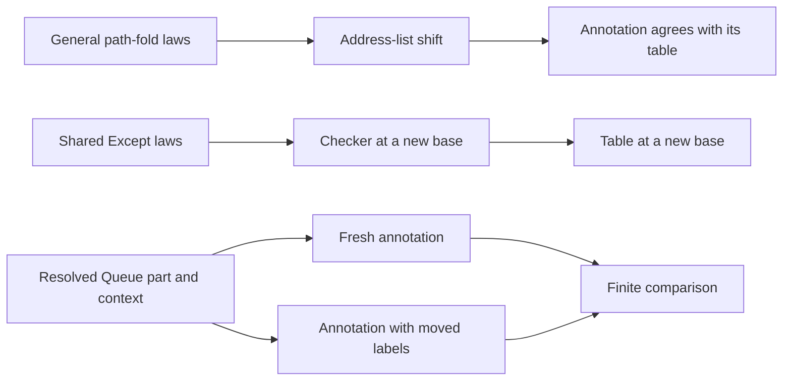

# Module overwatch: shared address laws

The review finds no new defect in the two landed address-law commits.
Exact-source compilations and Queue controls pass.
The laws move address labels while the typing signature, variable context, and program stay fixed.
They establish no cache implementation or relocation of a program between contexts.

## Checkpoint and ownership

Previous reviewed primary commit: `205f4feaaac2041efe4becbe9992ec8f14b077c6`.
Reviewed address commit: `92f51a62d393f9c39970c28e14d33988e7ef2552`.
Reviewed checker commit: `7b73d59cb2ae5b290c87c7f0ba9a6aa77a71fa04`.
Previous review receipt commit: `0715f221435af5a3c7596db1ba4da72717fdb7b6`.

The active Claude session remains `9ebf38b2-8b2f-44e5-8fd9-2dc0cb5a1f50` in the primary repository.
A bounded recent tail confirms its current duplicate-proof cleanup and reported build.
The reader excludes internal thinking fields.
No message steers Claude.

The primary worktree, its production sources, and its rulings remain unchanged by this review.
Two GPT-6.1 Sol agents independently inspect the address laws, checker laws, and selected unfinished module changes.
Review artifacts stay in the existing isolated review worktree.
Compilation outputs stay in temporary directories.
The review runs no Lake process, full sweep, merge, or push.

## What the shared laws establish

| Declaration and source | Proof role | Evidence status | Scope and consumer |
| --- | --- | --- | --- |
| `foldMapAt_eff_base` and its siblings, `src/Effect4/Laws/Program/Address.lean` | Compatibility, `path-fold-natural`, R14 | Exact-source compilation and scoped axiom check pass | A path fold shifts its base; `foldMapAt_eff_paths_shift` and its siblings consume the general law |
| `foldMapAt_eff_hom` and its siblings, the same source | Compatibility helper | Exact-source compilation and scoped axiom check pass | The map keeps the binary operation; the address-list instance consumes it |
| `Checker.check_rebase` and its siblings, `src/Effect4/Laws/Program/Typing/Rebase.lean` | Compatibility, `checker-base-natural`, R14 | Exact-source compilation, independent controls, and scoped axiom check pass | Fixed signature, context, and syntax; `tableAt_rebase` consumes the checker law |
| `tableAt_rebase`, the same source | Compatibility helper | Exact-source compilation and concrete table controls pass | Table paths and nested refusal paths shift together; a production cache or paste consumer remains future work |

The old annotation, agreement, denotation, and reader statements remain unchanged.
Their proofs now use the shared laws.
The map law requires the map to keep the binary operation.
It keeps the fold's parentheses, so it needs no associativity premise.
Each constructor supplies a yield, so it needs no separate identity-preservation premise.

The checker moves both an outer refusal and a refusal held inside a generator return.
It also moves the saved location used when a return has a following statement.
The independent controls include an intentionally incorrect conversion that moves only the outer refusal.
That conversion gives the wrong location.



## Reproduced checks

Lean `4.33.1` compiles the exact `Address`, `ExceptMap`, `Annotate`, and `Rebase` sources from the reviewed commit.
Every command sets `LEAN_NUM_THREADS=3` and `warningAsError=true`.
The retained JSON records the commands, results, source hashes, and existing compiled imports.

The parent Queue probe constructs the existing definition-block client through `Effect4.Author` and `Effect4.Library`.
Its definition body and main program produce the same annotation at a new base after their labels move.
The probe compares fresh annotations with transported results.
It also confirms that structural checking refuses the block while module checking accepts the client.

The same variable-reading program answers `Nat` in one context and `Bool` in another.
It refuses in the empty context.
These finite controls demonstrate why cached results cannot depend on the subtree's bytes alone.

The parent audit checks 200 theorem declarations in the three selected law modules, including generated equations.
They reach only `propext` and `Quot.sound`.
The author entry imports no Laws module.
The independent checker probe passes 19 finite controls and three applications of existing laws.
Its audit checks all 54 declarations in the two new modules against the same axiom ceiling.
These are scoped audits, not the whole-library gate.

Temporary setup attempts miss imported artifacts during the primary build.
The corrected import arrangement and narrower probe imports pass without production changes.
The evidence retains those setup failures separately.

The sibling directory `2026-10-09-address-overwatch/` retains the evidence.
The replay requires existing compiled dependencies in the named repository:

```sh
python3 docs/research/2026-10-09-address-overwatch/replay.py --repo /Users/pooks/Dev/lean4-effect4 --out /tmp/effect4-address-review-replay
```

## Concrete next use and limits

Reuse `Eff.partAt` in `src/Effect4/Program/Typing/Parts.lean` to obtain the declaration rows and variable context before reusing an annotation.
A future cache must bind its entry to those inputs and the hole table, as well as the program bytes.
Changing only the base path then uses `tableAt_rebase`.
Changing rows or variable types requires another check or a separate law.

When a core consumer needs the executable rebase functions, place them beside their data types.
Keep their proofs in Laws.
Add no program constructor or author option for this bookkeeping.
This is a proposed consumer, not a landed cache.

Clarify the prose as “at any base, with signature and context fixed.”
Mark the paste consumer of `Node.at_replaceAt_below` as prospective.
Its source currently names no concrete caller.
The Address header also retains the obsolete phrase that `check_rebase` is not stated.
These are documentation improvements, not theorem defects.

The laws establish no moved variable levels, changed layer-reference targets, module-check relocation, host comparison, or execution agreement.
They do not close the existing module-printer or whole-module execution obligations.

## Unfinished module cleanup

A separate source review covers Claude's uncommitted Pool, Semaphore, typed-printer, and reader cleanup at the same HEAD.
The retained patches and hashes identify that snapshot.
Pool keeps its resource-type premise.
Semaphore keeps its table-injectivity premise.
The template replacements keep binder depth and hole-agreement premises.
Caller searches find no remaining uses of the removed helpers.

No review build certifies those unfinished patches.
Review their landed commit and narrow checks next.
Keep the reviewed primary checkpoint at `7b73d59c` until then.

## Retained patch bytes

The four files under `wip/` retain Git's patch bytes, including spaces that mark empty context lines.
The scoped whitespace check allows those spaces and a terminal context line only in these four files.
Every other retained file uses the ordinary whitespace check.
The evidence hashes bind each patch to the reviewed snapshot.
