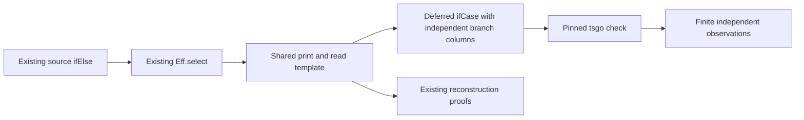

# Shared TypeScript branch printing for module authors

Base: `4a596d5bbcda7d38964735a250471a014484e1a1`.
Branch: `codex/authoring-branches`.
The owner requests authoring repairs before more module implementations.
Decisions rows 218 and 266 already rule the shared branch printer.
The Channel receipt retains its concrete success-column failure.

## Finishing criteria

- Ordinary `ifElse` needs no branch annotations for differing success, error and requirement columns.
- The generated helper defers the condition and constructs only the selected branch when run.
- Existing reader, exactness, typed-erasure and module reconstruction statements retain their premises.
- The shared table remains the owner of printing and reading.
- Name formation refuses collisions with the new printed helper.
- Positive examples pass Lean program admission, pinned tsgo 7 and their finite execution observations.
- Negative controls detect missing union members, eager construction and incorrect branch selection.
- Channel executes without the workaround annotations that the preceding receipt records.
- The narrow builds, generated-table check, axiom gate and receipt pass before a commit.

## Design and ownership

The author continues to use `ifElse` from `src/Effect4/Program/Authoring.lean`.
Its core program remains the existing boolean `Eff.select`.
The template in `src/Effect4/Codegen/Templates.lean` prints this shape:

```typescript
ifCase(() => condition, () => left, () => right)
```

The condition thunk retains the evaluation timing of the previous suspension.
Both branch thunks bind no new program variable.
The helper in `harness/truth/control.ts` infers each branch's three columns independently.
Its answer, error and requirement columns are their respective unions.
The public source surface adds no option and no annotation.

The existing template reader reads the new image.
The old conditional image remains retained historical evidence, not an additional canonical spelling.
The typed printer needs no new boolean head arguments because these callbacks bind no payload.
The current `NoJoin` rule and node erasure remain unchanged unless a concrete control refutes that design.
The generated TypeScript table follows the same Lean table.
The reserved-head inventory owns import and name formation.



Claude owns `tools/Tools/Code/` and the visual pipeline in the primary checkout.
This branch leaves those files, the owner decisions and the primary STATE unchanged.
The parent owns the single Lake lane and commits by explicit paths.
Agents may edit only their assigned paths after reading this plan.

## Proof placement before repair

| Obligation | Concept and property | Claim, role and consumer | Reach and premises | Limit and requirement |
| --- | --- | --- | --- | --- |
| Template reconstruction and separation | `exact-codecs`, exact program printing and reading | Existing R8 top declarations `read_print` and `read_exact`; shared table facts in `src/Effect4/Laws/Codegen/ReadPrint.lean` serve those consumers | Existing readable-program domain and lawful spelling; new helper joins the reserved alphabet; no premise is weakened | Syntax reconstruction does not prove host behavior; R8 and the existing M7 print/read path |
| Typed print agreement | `exact-codecs`, preservation under named erasure | `typed-print-connector`, compatibility, `printTyped_eq_print` in `src/Effect4/Laws/Codegen/PrintTyped.lean` | Existing `NoJoin` and checked printing premises; boolean nodes still insert no generic head arguments | No claim that all target programs typecheck; R8 |
| Typed erasure and reading | `exact-codecs`, reconstruction of a typed print | `typed-print-erasure` and `typed-print-read`, compatibility; existing `eraseJoinArgs_printTyped` and `readTyped_printTyped` | Existing readable program and lawful spelling; table-derived child recursion uses the new template | No arbitrary TypeScript ingestion, codec admission or target simulation; R8 |
| Module reconstruction | `exact-codecs`, printed definition block reconstruction | `module-defs-round-trip`, compatibility; `readModule_printModule_defs` consumes the shared reader laws | Existing readable declaration columns and empty requirement-row premises | Handle headers remain outside the reader domain; R8 |

Every helper repair serves one of these existing consumers.
No new semantic claim or planned goal is required by this target spelling change.
A changed premise or a counterexample returns to the contract boundary before implementation continues.

## Verification and evidence

Use `LEAN_NUM_THREADS=3` for every Lake command.
Build the changed core and proof modules, their direct consumers and the focused authoring batteries.
Run the ts generator through `python3 scripts/generate.py --only ts`.
Keep the retained Channel refusal packet unchanged.
Write the new target packet into this slice's evidence folder.
Check the exact A, E and R columns with tsgo `7.0.0-dev.20260629.1`.
Execute the helper controls and selected generated programs against installed Effect `4.0.1`.
Retain compiler diagnostics, package hashes, emitted bytes and independent expected observations.
Audit compiled declarations and reached axioms with the existing proof tools.
Run no full sweep, merge or push.

## Follow-up backlog

The declaration-to-installed-module check and handle-header reading remain separate authoring gaps.
This slice records their next boundaries without widening its implementation scope.
