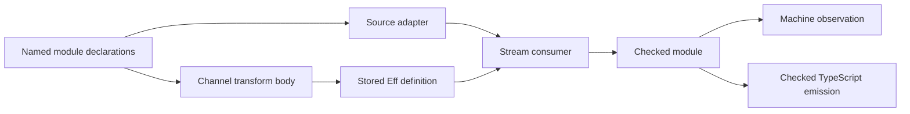

# Channel transformations and declaration-derived source adapters

The slice adds downstream pull builders over stored upstream definitions.
It also removes repeated source metadata from the normal declaration-backed authoring path.
The base is `9d489341525ea4a55bb9da512ae35809c0175093`, including the preceding Pull slice.
The primary checkout and Claude's visual work stay outside this edit scope.

## Contract and representation

Decisions rows 331 and 335 own the representation and module order.
An upstream is an existing stored definition invoked with its captured state request.
Channel helpers author ordinary `Eff` bind, selection and invocation nodes.
No channel syntax, runtime closure, machine operation or second program representation enters the tree.

This first profile treats each Channel output as one list-valued batch.
`map` and `mapEffect` transform that whole batch once per pull.
Their callbacks ignore the output index in latest (Effect 4.0.1).
`mapDone` and `mapDoneEffect` transform only the terminal leftover.
An input failure bypasses the transformation with its full cause and resulting stores.
A selected transformation's failure escapes with its resulting stores.
The helpers perform one upstream invocation and acquire no resource.
The existing Stream consumer owns opening, finalization and stopping after End.
Batch nonemptiness remains the producer's premise, including the mapped batch.

Latest sources are `vendor/effect-4.0.1/src/Channel.ts`, `map`, `mapEffectSequential`, `mapDoneEffect` and `transformPull`.
Their source locations are recorded beside the corresponding definitions.
The signed End-value representation remains row 331's choice.
No native Done-cause correspondence is claimed.

## Authoring surface

The generated sibling `<Module>Declarations` record avoids nested-name collisions.
The generated module exposes `module.definitions.operation` as the existing `DefSrc`.
Its existing `module.defs` becomes the ordered projection of those declarations.
Existing operation calls and installation retain their names.
Direct record construction now supplies `definitions`; `defs` is its read-only projection.
Exact generated references prevent operation and parameter names from capturing the metadata type.
The controls cover relative and explicit root namespaces.
This adds no second metadata list and needs no string lookup or positional index.

`Channel.mapEffect upstream state transform` builds one downstream pull.
`upstream` is a named `DefSrc`; `state` is its entire runtime request.
The pure and completion variants share that same interface.
A downstream `eff_module` declaration states its own output, error and requirement columns once.
The ordinary module checker checks all stored bodies and calls against those columns.

`Stream.Source.fromDefinitions open pull close arguments` derives its element and leftover types from the pull declaration.
It validates the open answer against both state requests, and the close answer against unit.
It invokes the supplied declarations by their own names, never through independently supplied call functions.
A failed adapter identifies the operation and the failed column relationship.
Acceptance concerns the supplied declarations.
Application to an installed module also requires matching declarations at those names.
The adapter extracts tag payloads, then checks equality with the reconstructed normalized `pulledTy`.
This refuses extra variants and accepts declarations with equal normalized protocol types.
Equal normalized endpoint state types are allowed.
The ordinary checker still owns formation, argument typing, errors, requirements and stored bodies.

## Proof placement before implementation

| Obligation | Concept and claim | Reach and premises | Not established | Consumer and requirement |
| --- | --- | --- | --- | --- |
| Accepted source adapter agrees with its declaration columns | `store-typing`, `stream-source-declarations`, compatibility | Accepted constructor; equal normalized protocol shape; equal normalized state requests; unit close answer | Body typing, protocol nonemptiness, progress, host behavior | Source construction and Channel clients; R4 |
| Channel selects the batch or completion transformation once | `translation-simulation`, `channel-batch-transform` and `channel-completion-transform`, compatibility | Exact input observation; actual elaborated handlers; aligned value and source scopes; resulting stores retained | Execution of the upstream stored definition, asynchronous scheduling, whole-stream or target simulation | Channel transforms and Stream clients; R10 |
| Named declarations project to the original ordered block | Helper of the existing module construction claims | Generated record's named `DefSrc` fields and generated calls | Coherence of arbitrary manually forged call fields | Source adapter and module installation; R4 |
| Scope helpers | Helpers of `channel-batch-transform` and `channel-completion-transform` | Scoped state and scoped callback under minted binders | Reading or typing from scope alone | Channel semantic law and public fixtures; R10 |

The existing denotation does not execute stored calls.
Its Channel law remains conditional on the input observation and does not claim that a stored upstream executes.
Finite checked module runs exercise the actual definition-aware machine separately.
A shared law must have one named consumer from this table.

## Work ownership

The parent owns the source adapter, its declaration law, root imports, claim registry entries and receipts.
The module agent owns `Program/Authoring/Module.lean` and focused module metadata controls.
The Channel agent owns `Library/Channel/` and `Laws/Library/Channel/`.
A fixture agent may own `Test/Program/Channel.lean` and `harness/channel-transforms/`.
Only the parent runs Lake in this worktree.
No agent edits the primary checkout, decisions register or Lake configuration.

## Finishing criteria

1. Build the changed modules and their direct consumers with `LEAN_NUM_THREADS=3`.
2. Exercise batches, leftovers, both failure origins, retained state, capture, composition and resource cleanup.
3. Reject malformed protocol declarations, mismatched state endpoints, missing definitions and incorrect bodies.
4. Inspect the new claims and declaration dependencies under the existing axiom ceiling.
5. Typecheck and run emitted examples with pinned tsgo 7 and Effect 4.0.1.
6. Retain controls that distinguish misplaced handlers or lost completion values.
7. Record useful authoring gaps and commit explicit paths without merging or pushing.

The receipt distinguishes Lean theorems, checked modules, finite host observations and open obligations.

## Target boundaries found during verification

The existing header reader refuses the modules' handle requests with `ReadRefusal.shape "definition"`.
Existing Queue and Semaphore controls retain the same refusal.
The packet checks and records this result separately from checked emission, target checking and execution.

The unannotated producer's boolean branch fails tsgo with `TS2375` on its Chunk and End answer variants.
This is another instance of decisions row 218's deferred TypeScript branch printer, already observed for errors in row 266.
The current producer uses existing checked source ascriptions on both values.
The rejected output and its source remain in `docs/research/2026-10-09-channel-transforms-branch-refusal/`.
The ruled shared repair uses `ifCase` and needs its reader, erasure laws and target controls together.
This slice does not change that printer contract.
