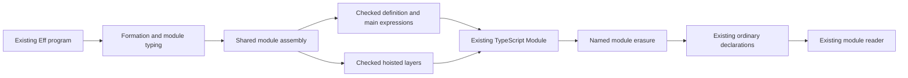

# Proposed checked TypeScript module print connection

The tuple repair needs a certificate-connected module producer before the public catalogue can use it.
Keep the user's `Api.emitModule` and `Api.Typed.emit` interfaces.
Do not add a private packet emitter or an author option.
This plan proposes missing statements; it opens no goal and changes no proof status.

## Evidence and order

The preceding bounded slice owns helper overloads, checked term annotations, absence, and expression erasure.
The module slice starts after that slice passes its controls and existing proof repairs.
The tuple context packet retains the inference counterexamples in `2026-10-09-tuple-context-review/`.
The ordinary callback inference and the checked Cartesian output remain separate controls.
The scout's distinct generic arities select the checked helper without changing the ordinary inference profile.

The expression connector is `Effect4.Codegen.eraseJoinArgs_printTyped` in `src/Effect4/Laws/Codegen/PrintTyped.lean`.
It requires `LawfulSpelling` and the exact existing `Readable` premise.
It establishes ordinary print equality after named erasure.
It establishes no target compiler acceptance or execution result.
The module plan retains those premises for every printed part.

## Existing owners and consumers

`Program.printModule`, `printDef`, `printDefs`, and `printEntry` live in `src/Effect4/Codegen/Print.lean`.
They own the declaration order, hoisting, definition prefix, annotation shape, and located print refusals.
`ModuleEmission` and `emitFormedModule` live in `src/Effect4/Codegen/Checked.lean`.
The certificate indexes the exact program, table, export name, checked type, classes, and generated declarations.
Its current `generated` field indexes ordinary `Program.printEntry`.
`ModuleEmission.module` projects that certificate's declarations.
Replacing only that projection would discard the retained generation relation.

`ModuleEmission.recheck`, `unique`, `annotation_complete`, and `emitModule_erasure` live in `src/Effect4/Laws/Codegen/Checked.lean`.
They consume the current generation equation.
Their checked-module versions must consume the new actual generation equation.
The ordinary erasure equation remains separately visible.

`Program.readModule` lives in `src/Effect4/Codegen/Read.lean`.
`readModule_printModule` and `readModule_printModule_defs` live in `src/Effect4/Laws/Codegen/Module.lean`.
Their reading premises include the printed main, definitions, layers, class declarations, and layer reference names.
The definitions theorem also requires readable declaration heads.
Current heads require an empty requirement row for reading, although printing retains a nonempty row.
Keep that refusal and boundary.

`admitModule` and `ModuleReading` live in `src/Effect4/Codegen/Admit.lean`.
`ModuleEmission.admit` and `ModuleReading.recheck` live in `src/Effect4/Laws/Codegen/Admit.lean`.
Admission validates source bindings on the original module before reconstruction, formation, typing, classes, annotations, and envelope checks.
The module connector must not replace the original binding check with a check of erased TypeScript syntax.
Raw reading still refuses newly inserted generic arguments before the named erasure.
Typed module reading uses the erasure boundary explicitly and retains the original module for bindings and envelope evidence.

## Proposed assembly change

Extract the existing declaration assembly into a shared function parameterized by an expression printer and a layer printer.
The parameters consume actual typing signatures and environments.
Keep one assembly path for ordering, hoisting, export names, classes, and declaration annotations.
Keep ordinary wrappers that reproduce the current output and refusals.
Do not copy the assembly into a second module representation.

The ordinary expression parameter calls `print` at the environment length.
The checked expression parameter calls `Program.printTyped` with that actual environment.
For a block, use `sig.withDefs defs` for each definition, the main expression, and the hoisted layers.
For definition `d`, print `.suspend body` under `[d.request]`.
For the main expression, use the empty environment.
For each hoisted layer, obtain its actual closed context and checked layer annotation fold.
Do not reuse root addresses or root environments after hoisting changes the program.

`moduleHasTy_partAt_typed` in `src/Effect4/Laws/Program/Typing/Parts.lean` supplies typing for original module parts.
It uses each part's signature and request environment.
It does not by itself provide typing for the rewritten hoisted main or layers.
`Eff.restoreAll_hoistAll` in `src/Effect4/Laws/Program/Hoisting.lean` supplies reconstruction, not hoist typing.
The missing hoisted-context obligation must remain explicit.
A slice may retain an ordinary layer printer only through an explicit unchanged-layer premise.
Such a slice does not close checked printing of arbitrary layer contents.

The `.effs` path in `PrintEliminators.layer` currently retains the ordinary template layer.
The module producer must print each definition through the checked expression parameter.
It must not assume the existing expression entry covers that definition list automatically.

## Proposed certificate connection

Keep one `ModuleEmission` indexed by the original program, table, and name.
Its public declarations must come from the connected checked entry equation.
Retain ordinary declarations and their ordinary generation equation as erasure evidence.
Retain the equation from named erasure of checked declarations to those ordinary declarations.
Keep formation, the existing typing certificate, classes, class declarations, and exact main annotation.
These are evidence fields beside existing target syntax, not a second stored program syntax.

Migrate `recheck` to reproduce the exact connected checked entry.
Migrate `unique` through that deterministic entry.
Lift `annotation_complete` through shared assembly without changing its answer, error, or requirement columns.
Keep an ordinary projection theorem through the named module erasure.
Do not reinterpret `emitModule_erasure` as raw checked-byte equality with ordinary output.

Build typed module reading by composing named assembly erasure with the existing module reader.
Keep the exact lawful spelling and readable-piece hypotheses.
Then compose admission using the original module's binding evidence and envelope.
Keep the distinction between raw refusal and typed reading after erasure.
Definition spellings use `defsSpell` and `LawfulSpelling.withDefs` from `src/Effect4/Laws/Codegen/Definitions.lean`.
No equality of arbitrary foreign spellings follows.

## Proposed proof placement

The following names describe missing statements, not new declarations or registered claims.
The coordinator must freeze their statements before proof work.

| Obligation | Concept and required property | Question, role, and consumer | Reach and hypotheses | Exclusions | Requirement and unlock |
| --- | --- | --- | --- | --- | --- |
| Shared assembly erasure | exact-codecs; named erasure and reconstruction | Proposed `typed-module-erasure`, compatibility; checked ModuleEmission and typed module reading consume it | Successful checked assembly; same hoist result; per-piece lawful spelling and readable premises; expression and layer erasure equations | No target acceptance, execution, or raw reader extension | R8; lifts existing `typed-print-erasure` beyond one expression |
| Checked module reading | exact-codecs; exact reconstruction on the named fragment | Existing `typed-print-read` and `module-defs-round-trip`, compatibility; typed module admission consumes the lift | Classes read; declaration heads read; body suspensions, main, layers, and layer names read at their actual signatures | Nonempty definition requirement rows remain outside reading; bindings remain separate | R8; connects emitted module bytes after named erasure to the original program |
| Main annotation lift | context-requirements; explicit requirement row | Existing `emission-requirements-complete`, compatibility; public ModuleEmission.annotation_complete consumes it | Exact connected assembly and its retained checked EffTy | No host package identity or execution | R5/R8; preserves the application's checked annotation |
| Hoisted context transport | residual-program-typing; typing of printed module parts | Proposed helper for `typed-module-erasure`; checked layer fold and assembled main consume it | Typed original module; successful hoisting; actual rewritten contexts and layer bodies | Reconstruction alone does not prove typing; no schedule or locality claim | R4/R8; supplies evidence required by checked assembly |

The exact-codecs registry pointers remain `eraseJoinArgs_printTyped`, `readTyped_printTyped`, and `readModule_printModule_defs` until an owner approves the module statements.
The existing `typed-print-connector` remains the no-annotation compatibility claim.
The proposed module absence statement must require absence in every printed part, including definitions and hoisted layers.
The context-requirements registry pointer remains `ModuleEmission.annotation_complete`.
No new goal is needed solely to change a count or to make the catalogue report a successful read-back.

## Focused controls and finish criteria

- Keep the original tuple, literal, fold, and select positive and refusal controls.
- Preserve Option-valued `Ref.modify` callback inference without explicit user types.
- Compile the independent two-source tuple product through the public checked module producer.
- Reject wrong slot types, wrong generic arities, and extra runtime arguments.
- Check a join inside a definition under its declared request environment.
- Check a join inside a closed hoisted layer and a nested definition invocation.
- Check original source binding evidence before named erasure.
- Retain raw generic-argument refusal and successful typed reading on the exact readable fragment.
- Keep expected frozen definition read-back refusals until the owner changes that boundary.
- Check exact requirement annotations and deterministic certificate reproduction.

Run only narrow owned-module builds and pinned strict tsgo 7 controls.
Retain exact emitted inputs and compiler diagnostics on failure.
Cut over the unchanged public producer only after certificate generation and the module erasure connector agree.
The host execution boundary and compiler acceptance remain separate finite evidence.
