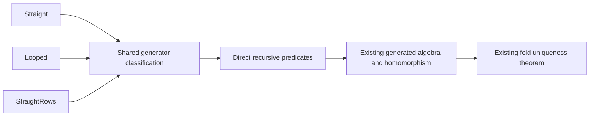

# Shared fragment classification

Retain `1f4ee194deef717a374e348c3bf42fbeebe44d80` as the source baseline.
Adapt the cleanup to the coordinator’s landed H8 commits.
Keep Claude’s active agreement proofs unchanged.

## Design

`Straight`, `Looped`, and `StraightRows` classify the same program forms with different admission choices.
One generator table owns classification of every constructor.
The generator reads constructor arguments from the existing family metadata.
It emits the existing recursive predicates and rejects unknown classifications.
Excluded forms return before visiting children.
The existing fold connectors retain their statements and proof bodies.

Wrapper probes broke existing simplification and recursive proof callers.
The generator retains their direct constructor equations without repairing Claude’s proofs.

## Proof placement

| Obligation | Placement | Consumer | Reach | Exclusions | Requirement |
| --- | --- | --- | --- | --- | --- |
| Generated predicates equal their existing folds | `initial-algebras-folds`, required fold uniqueness, claim `hom-eq-cata-eff`, helper role | Existing predicate fold connectors | Every finite `NativeEff`, fixed existing fragment choices | No execution or host claim | R8 |
| Generated predicate algebras equal the retained baseline algebras | `initial-algebras-folds`, claim `hom-eq-cata-eff`, specialization role | `Straight.eq_cata`, `Looped.eq_cata`, `StraightRows.eq_cata` | Original fragment predicates | No enlargement of any fragment | R6, R8 |
| Existing callers accept the same constructor equations | `translation-simulation`, claims `run-eq-meaning`, `loop-agreement`, `rows-denotation-session`, helper role | Existing theorem bodies | Unchanged statements and premises | Open session goals stay open | R6, R8 |

The claim registry is `tools/ProofGraph/Registry.lean`.
The required properties are in `docs/core/semantics.md`.
The generated predicates live in `src/Effect4/Program/Fragment.lean` and `src/Effect4/Laws/Program/Fragment{Looped,Rows}.lean`.
Decisions row 59 keeps classifiers with only proof consumers in the Laws graph.
`dataRow` retains that placement in `src/Effect4/Laws/Program/FragmentRowAdmission.lean`.
The connectors remain in `src/Effect4/Laws/Program/Folds/{Straight,Looped,DenoteRows}.lean`.
Decisions row 35 requires explicit classification of every program constructor.

## File ownership

Edit the fragment generator, its manifest registration, and the generated predicates.
Move row admission without changing its definition.
Retain the existing fold connectors and proof bodies.
Keep `Laws/Program/Agreement/{Calls,Machine}.lean`, owner rulings, and root imports unchanged.
Keep probes and evidence in this research directory.

## Finishing criteria

- Retain the existing public predicates and connector statements.
- Remove duplicated program-form classification.
- Retain early rejection and explicit constructor coverage.
- Check positive cases and rejection in every composite child position.
- Check registered data rows, handle rows, missing rows, loops, and conditional handlers separately.
- Build the changed modules and representative program admission and agreement consumers.
- Inspect the generated connections and their axiom dependencies.
- Retain a negative constructor-coverage control.
- Commit explicit paths with a receipt.
- Publish the cleanup branch and prepare its pull request over the coordinator’s landed integration base.
- Leave merging to the coordinator.
