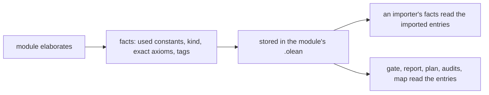

# 2026-10-09 Note: one cache of graph facts, shared by every proof and code tool

Status: a proposal (history, not authority). Base: `refactor/phase1-phase3` after `889c0a74`
and the rebuild cut that lands with this note. The owner asked for it on 2026-10-09: "we should
be creating shared caches for all this build tooling".

## 1. The one thing to know first

Five tools walk the same declarations, each in its own process, from nothing. The tools are:

- the axiom gate (`Test/Audit/AxiomGate.lean`);
- the semantics report and its plan (`tools/Tools/Semantics.lean`, `tools/ProofGraph/Plan.lean`);
- `#axiom_audit` (`tools/ProofGraph/AxiomAudit.lean`);
- `#closure_audit` (`tools/ProofGraph/ClosureAudit.lean`);
- the architecture map (`tools/Tools/Architecture.lean`).

A declaration's facts change only when its module builds. So the facts belong next to the module's
compiled form, computed once when the module builds, and read by every tool.

## 2. What Make and Lake cache today

- **Make** compares file times. It reruns a rule when a prerequisite is newer than the target, and
  it keeps nothing else.
- **Lake** hashes sources and outputs. It rebuilds a module when the module or an import changed,
  and its artifact cache (`lakefile.toml`) restores outputs across worktrees.
- **Nothing caches a tool's derived facts.** Each tool imports its roots and walks the proof terms
  again: the used constants, the axioms reached, the nearest plan nodes, the tags.

## 3. The design: facts as an environment extension

Lean already caches one such fact per module. `Lean.collectAxioms` exports each module's answers
in its `.olean` (`exportedAxiomsExt`, `Lean/Util/CollectAxioms.lean`). On cycles that cache is
short (`tools/ProofGraph/Axioms.lean`, "Cycles"), so the tools do not trust it. The proposal
applies the same mechanism to the exact walk:

1. A small module `ProofGraph.Facts` registers a persistent extension. Each entry is a
   declaration's name, its used constants, its kind, and the axioms and goals it reaches.
2. A hook computes the entries of the declarations that a command added, after the command. The
   axiom walk stops at an imported declaration and reads that declaration's entry, so the cost
   is the module's own proofs. An imported entry is never recomputed.
3. The extension exports the entries with the module. Lake's rebuild rules keep them current:
   an entry changes only when its module rebuilds.
4. Each tool reads the entries instead of walking: the gate checks the axioms column, the plan
   reads the used constants, the audits read the kind. A tool's run is a merge of tables.

## 4. Costs and limits

- Every module that declares a theorem must import `ProofGraph.Facts`, as every law module
  imports `ProofGraph.GoalTag` today. So that module must stay small and stable: an edit to it
  rebuilds the law graph.
- The hook adds work to every build: one walk per declaration over its own proof term. That is
  the work the tools now repeat on every run, done once.
- A cycle closes inside one module, since Lean declares a mutual block in one command. So the
  exact walk's component rule holds per command. This must be checked against the control in
  `Test/Audit/ProofGraph.lean`.
- The gate stays the authority. It keeps its walk and compares, until a slice shows that the
  entries agree with the exact walk on every declaration.

## 5. Slices

1. **F1.** `ProofGraph.Facts` with its entries and the hook, under the law graph's existing goal
   import. Add a check that the entries agree with `exactAxioms` on every declaration.
2. **F2.** The semantics report and the plan read the entries.
3. **F3.** The axiom gate reads the entries and keeps the walk only as the agreement check. Then
   it drops the walk.
4. **F4.** `#closure_audit`, `#axiom_audit` and the architecture map read the entries.

## 6. What this note does not establish

- No timing: the gain is the walks the tools stop repeating.
- Whether a command hook sees every declaration a command adds (auxiliaries, realized names) is
  F1's question.
