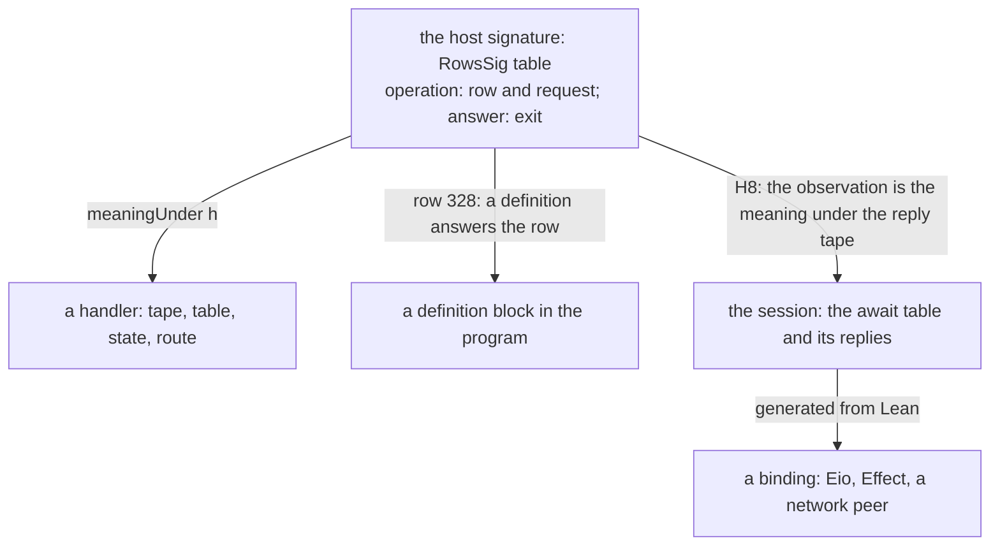

# 2026-10-09 After H8: the trust repair, the cleanup, and one form of a host call

Status: research note (history, not authority). Base: `bd65164b` on `refactor/phase1-phase3`.
It rules nothing. Section 8 lists what the owner must decide.

The owner asked on 2026-10-09, by voice, in four messages:

- review and merge Codex's cleanup branch, then find other places to clean up;
- review the work after H8: gaps, and language and type features to land now;
- audit the proof graph's tooling again, so that the trust rests on solid ground;
- design the host call: one form, clear semantics, a lowering by each stage to every kind of host,
  and answers from utilities that compose. Read the past probes first.

Words of this note, each defined before its first use:

- An **await table** is the list of a run's waiting calls, one entry per call, with the
  session's state of its reply. It plays the part of a promise table in Effect and in Eio.
- A **binding** is the code outside the model that answers one host row in one runtime.
- A **realization** of the host's operation signature (`RowsSig`) is a part that answers its
  operations: a handler, a definition block, the session, or a binding.
- A **component** of the dependency graph is a strongly connected component: a set of constants
  that all reach one another.

## 1. The one thing to know first

- **H8 is a theorem, at every compile budget** (`denoteRows_eq_session`, `0e36b4b9`). On
  `StraightRows`, a recorded run that is funded, at rest and host-driven observes the meaning
  under its reply tape. Its axioms are `[propext, Quot.sound]`.
- **The axiom walk of the gate was inexact, and so is Lean's** (section 3). On a cycle of the
  dependency graph it stored short answers. It omitted `propext` on 505 roots. Lean 4.33's
  `collectAxioms` omits it on 713. Nothing disallowed was hidden. The walk is now exact
  (`bd65164b`).
- **A host call has eight forms today** (section 6.1). The design makes the row signature's
  operation the one form. Each other form becomes a realization with a law to its meaning, and
  utilities that answer calls become handlers that compose (section 6.3).

## 2. What landed on 2026-10-09

| Commit | What | Evidence |
| --- | --- | --- |
| `0e36b4b9` | `denoteRows_eq_session` proved: the local run with calls, the machine's forms under a host's decisions, the session's answered tape | the narrow builds; the axioms of 433 declarations of the four modules |
| `1125b4e1`, `e193da3f` | the claim `rows-denotation-session` proved in `generated/semantics.md`; docstrings | `make gen-semantics` |
| `b69356f5`, `62a62a60` | Codex: the fragment predicates come from one generated classification table | Codex's receipt, `docs/research/2026-10-09-fragment-classification/README.md` |
| `bd65164b` | the exact axiom walk; three tools stop calling Lean's collector; a control | section 3 |

## 3. The trust repair

### 3.1 The crack

The gate's walk (`reachedAxioms`, `tools/ProofGraph/Axioms.lean`) shares one memo across all
declarations. An inductive type names its constructors, and each constructor names the type. So
the dependency graph has cycles. The walk wrote an empty answer for a constant it had
entered and not left. A constant that finished inside an open cycle read that empty answer, and
the memo kept its short answer.

The finite probe: a type `T` with constructors `a : T` and `b : Fin (bad + 1) → T`, where `bad`
uses `Classical.choice`. Entered from `def W := T`, the old walk stored `T.a` with no axiom.
Lean's collector reads `T.a` at `Classical.choice`, through `T` and `T.b`.

The crack stayed masked in practice. A term that uses a constructor names the constructor's type
too, and the type's entry held every axiom. Planned goals are leaves of the same walk, so the crack
reached a node's standing as well.

### 3.2 The repair and its checks

The walk finds the components by Tarjan's algorithm on its explicit stack. It stores no answer
until a constant's whole component has closed. Then it stores the root's answer for every member.

| Check | Result |
| --- | --- |
| the fixed walk against a plain search with no memo, on 2690 roots: every root where the walk and Lean differ, and one in thirty of the rest | equal on every root |
| the old walk against the fixed walk, on the 60541 roots of the law graph | the old walk short on 505, 268 of them in `Effect4` |
| the control `memoEntry`, `MemoCycle` (`Test/Audit/ProofGraph.lean`) | passes; the old walk fails it |

Every short answer lacked `propext` only, which the ceiling admits. The sweep's axiom gate runs
the fixed walk over every declaration (section 3.5).

### 3.3 Lean's own collector

Lean 4.33's `collectAxioms` (`Lean/Util/CollectAxioms.lean`, what `#print axioms` prints) writes
the same empty answer. It caches the answer of each constant it finishes. It also exports those
answers in each module's `.olean`, so a short answer persists downstream. On the law graph it
omits `propext` on 713 declarations that a plain search reaches. Three tools called it:
`ProofRef.validate`, the search's `axiomsOf` and Conform's layout ceiling. They now call
`exactAxioms`, the fixed walk with a fresh memo.

Seat receipts audit with `Lean.collectAxioms` (for example
`docs/research/2026-10-08-seat-deferred-identity-receipt.md`). Such an audit can miss an axiom
behind a cycle. A seat should audit with the gate's walk instead (cleanup C7).

The finding is worth an upstream report to Lean, with the probe of section 3.1.

### 3.4 The rest of the tooling, read

| Module | What it does | Finding |
| --- | --- | --- |
| `ProofGraph.Goal` | `proof_goal`; the standing of a theorem, goals as leaves | sound once the walk is exact; the standing reads the same memo |
| `ProofGraph.Plan` | the plan's nodes, nearest nodes and counts | its own walk keeps a seen set per root and no memo: exact |
| `ProofGraph.Audit` | the facts of every audited declaration | reads the environment's final declaration; no finding |
| `ProofGraph.Proof` | `checked_theorem%` against a frozen proposition | now uses the exact walk |
| `ProofGraph.Search` | proof search under the ceiling | now uses the exact walk |
| `Test/Audit/AxiomGate.lean` | the gate: axioms, closure, roots, resting pin | runs the fixed walk; the sweep checks it |

### 3.5 The sweep

The sweep ran on `bd65164b`, the merged tree with the fixed walk, on 2026-10-09.

| Command | Result |
| --- | --- |
| `make build` (the core, the laws, every battery, the gates) | passes, 1651 jobs, 16 minutes |
| the axiom gate, with the exact walk | 105844 declarations of 1008 modules at `[propext, Quot.sound]`; the named implementation boundary, 47 declarations of 21 modules, also admits `Classical.choice` |
| the goal gate | 30 planned goals; 14 declarations rest on goals; the resting pin unchanged |
| the library-root gate | every library source reachable; `Effect4` never reaches the Laws graph |
| `make check-semantics` | passes: 35 report refusals, 18 register controls, 4 traversal controls, 9 name controls |
| `make status` | the documents resolve; no committed generated file differs |

## 4. Cleanup, found by the tools

| Id | Area | Evidence | Proposal | Size |
| --- | --- | --- | --- | --- |
| C1 | `LoopedRows` stands by hand in `Agreement/Machine.lean` | the generated table has three profiles (`tools/Effect4Gen/Fragments.lean`) | add a fourth profile: loops and every host call; prove the old one equal by fold uniqueness | hours |
| C2 | two drive families | `drive_localRun` and `Owes` beside `drive_seg` and `SegOwes`; `flushAll_Myield` beside `flush_Myield` | derive `run_eq_meaning` and the loop theorem from H8's route; delete the older family | a day |
| C3 | two local runs | `localRun` (no calls) beside `localRunC` | state `localRun` as `localRunC` at the empty reply tape; move its callers | hours |
| C4 | two denotations repeat their control rules | `denote` and `denoteRows` (Codex's H8 review, consolidation 2) | one control algebra over the signature; the operation's handler varies | a day |
| C5 | preloaded answers | `ExternalStore.answers`; H8 needs the premise that it is empty; `run_eq_ref_table` waits on its removal | delete the field (DI-23, row 310) | a day |
| C6 | generated docstrings lost their reasons | the old `Straight` named why each constructor is in or out | a reason column in the classification table | hours |
| C7 | seat audits use Lean's collector | section 3.3 | one command, `#axiom_audit`, over named modules with the gate's walk | hours |
| C8 | the proof-style baseline | 1128 rows holding 1598 uses: 1140 `simp` without `only`, 227 `first`, 155 `try`, 76 `simp_all`; and 53 unread commands (corrected in section 4.1) | cut the file with the most uses each week; the ratchet holds the count | ongoing |

The build profile of the sweep (`make build-profile`) rebuilt 482 modules in 2749 summed
seconds. Its critical path is 269 s over five modules, and one module takes 184 s of it.

| Id | Area | Evidence | Proposal | Size |
| --- | --- | --- | --- | --- |
| C9 | the critical path | `Effect4.Laws.Codegen.PrintTyped`, 184 s, on the path between `Typing.Annotate` and the Laws root | split it by printer phase, so that its parts build in parallel; read its slowest proofs with `#auto_census` | hours |
| C10 | the slowest law modules off the path | `Library.Queue.Typing` 116 s, `Library.Pool.Typing` 94 s, `Library.Queue.Data` 70 s | the same split, by operation | hours each |

### 4.1 C1 to C3, landed on 2026-10-09

The owner asked for C1 to C3 while Codex reviews this note. They landed in one commit after
`673fd9de`. Two rows of the table above were wrong, and this section corrects them.

- **C1.** `LoopedRows` is the fourth profile of the generated table: the group
  `FragmentLoopedRows` writes `src/Effect4/Laws/Program/FragmentLoopedRows.lean`. The three
  other outputs regenerate byte-identical. A scratch check gave both predicates `fold_of` and
  proved their folds equal by `rfl` on the algebras, with the axioms `[propext]`. The hand
  definition is deleted.
- **C2 was no duplicate.** The older family (`drive_localRun`, `Owes`, `flushAll_Myield`) proved
  that a run ends within a fuel bound. H8's family (`drive_seg`) proved only where a segment
  ends, if it ends. Deleting the older family would have lost the fuel bound of
  `run_eq_meaning`. So `SegOwes` now counts the local steps of a segment. Its commands are at
  most twice the steps, plus two, and a yield comes only after the steps the op budget allowed.
  `flushAll_Myield` and `replay_Mexit_of_localRun` are proved again from `drive_seg`. Their
  statements and the fuel bound `2N + 4` are unchanged. The older family is deleted.
- **One drive module.** `src/Effect4/Laws/Program/Agreement/Segment.lean` holds the local run
  with calls, the host-call park, the segment law, the rounds of `flush` and the packet's
  theorem. `Agreement/Calls.lean` keeps the compile law with calls, and `Agreement/Hosted.lean`
  keeps the positions and a host's decisions.
- **C3, the machine half.** `localRunC_of_localRun` connects the two local runs: a finished
  local run is the local run with calls at every reply tape. The machine half reads only
  `localRunC` now.
- **C3, the compile half, is open.** `localRun` stays the run of the two compile laws:
  `localRun_compile` on `Straight` (`Program/Agreement.lean`) and the loop law
  (`Agreement/Loop.lean`). Both carry a step bound and a depth premise that `localRunC_compile`
  lacks, and the step bound is what gives `run_eq_meaning` its fuel. To derive them from
  `localRunC_compile`, that theorem needs a step bound and a clause that a run within the depth
  never reaches the frontier. Size: a day. It would remove about 400 lines of
  `Program/Agreement.lean` and the `Reaches` family.
- **C8's numbers were rows.** The baseline held 1128 rows, one for each declaration and kind,
  and 1598 uses. Moving two lemmas out of `Machine.lean` and deleting `drive_localRun` removed
  three rows; the re-recorded baseline only lost rows.

The checks: the law root and five batteries built (1270 jobs); the ratchet and `check-docs`
passed. The exact walk read 1210 declarations of eight modules on the agreement route, all at
`[propext, Quot.sound]`. The statements of `run_eq_meaning` and `loopAgreement` did not change.
The line count of the four agreement modules barely moved (3828 to 3782 lines with the new
module). The gain is one drive induction where there were two.

**Space.** On 2026-10-09 the data volume held 10 GB free of 460 GB. The cleanup removed eight
merged and clean Claude worktrees and their branches. It then ran `lake cache clean`, which freed
the 9.7 GB that no build directory used. The volume then held 28 GB free. The uncommitted changes
of the seat PILOT worktree are kept as patches under
`docs/research/2026-10-09-cleanup/`, which git ignores. Codex's five merged and clean worktrees
hold about 11 GB more; Codex removes its own (the brief beside this note).

## 5. Gaps that H8 surfaced

| Gap | What exists | What is owed | Unlocks |
| --- | --- | --- | --- |
| loops with host calls | the machine half already holds on `LoopedRows` (`drive_seg`, `holds_*`) | the rows meaning at a budget (`denoteB` with rows), and its compile law | H8 on loops |
| handle rows | `dataRow` excludes rows that answer a handle | the meaning allocates the handle, as `prepareExternalAnswer` does | key-value and resource hosts |
| several fibers | H8 holds on one fiber | the meaning under a scheduling tape | concurrent hosts, the await table with many rows |
| clocks and interruption | `hostDecision` excludes them; the battery holds red controls | a meaning that reads clock and interrupt decisions | timeouts, cancellation |
| a host as a handler | `Run.runWith` drives a session with a `Reactor`; the battery compares it with `meaningUnder` by finite evaluation | the theorem (section 6.4, H9) | composed hosts with a law |
| the next call | the session's waiting call and the call tree's next node are related only through H8's final observation | a law: at a settled form, the await table names the meaning's next operation | agents read what the program asks |

## 6. Host calls: one form

### 6.1 The eight forms today

| Form | Where | What it holds |
| --- | --- | --- |
| the program's operation | `Eff.perform (.external j) request`; `Row` | a row of the row table and a request term |
| the signature's operation | `RowsSig table` (`src/Effect4/Laws/Program/DenoteRows.lean`) | a row position and a request value; its answer is an exit |
| the machine's park | `Prim.async (EffName.external op v path) false none`; the guard token | a parked fiber whose current code is the call |
| the preloaded answer | `ExternalStore.answers` (`src/Effect4/Machine/Stores.lean`) | answers a registration takes at once, before any park |
| the waiting record | `Await` (`src/Effect4/Program/Admit.lean`) | fiber, token, operation and request, read off the machine |
| the session's ledger | `Call`, `BoundCall`, `Key`, `ReplySlot`, `RetiredCall` (`src/Effect4/Api/HostSession.lean`) | the claims of a call, its key, its reply slot, its retirement |
| the driver's host | `Run.Reactor` (`src/Effect4/Run/Basic.lean`); `Move` (`Test/Dogfood/Scenario.lean`) | a function from row, request and state to an answer |
| the TypeScript host | `KeyedRecorder` (`harness/truth/session/keyed-recorder.ts`) | `Effect.callback` with its `resume`, the stored completions |

The forms agree by laws in places: H8, `session_eq_ref`, `funded_replays`, `tape_replays`. No
form is the one that the others realize.

### 6.2 What the past probes settled

| Note | What it settled |
| --- | --- |
| `2026-09-08-host-rows-slice.md` | host rows answered by the tape: a host answer is a decision |
| `2026-09-30-host-answers-and-typed-guarantee.md` | reply admission at the waiting continuation; Route A |
| `2026-10-05-seat-HOST-design.md` | the keyed lane: a host acts out journal rows on the printed module; `Effect.callback` resumes |
| `2026-10-07-packet-host-meaning.md`, `2026-10-07-host-meaning-probe.md` | the row table as an alphabet; a host as a handler; `meaningUnder` |
| `2026-10-07-session-api-design.md` | the deep module: `Live.open`, `start`, `feed`, `view`; receipt and application stay caller choices |
| `2026-10-08-host-authoring-boundary.md` | the boundary is each row's handler: the store, the program or the host (row 328) |
| `2026-10-08-live-authoring.md` | edits and replies are one journal pattern: a free monoid acting through a lens |
| `2026-10-08-seat-deferred-identity-receipt.md` | a deferred compares by its key image, under a capability |

Read together, they agree on one picture: a host call is an operation, and a host is a handler.
What is missing is to make that operation the representation that every layer realizes.

### 6.3 The design: the operation is the call

Each arrow is a realization, and each needs a law to the signature's meaning. Three exist or
are close:

- **a handler**: `meaningUnder h` is the meaning, by definition;
- **a definition block**: the program answers the row itself (row 328); its meaning is `denote`
  of the body;
- **the session**: H8 on one fiber; H9 below for a session driven by a handler.

**The await table** replaces `Await`, `BoundCall`, `ReplySlot` and `RetiredCall` as the one
record type a caller reads. Each entry holds:

| Field | Source today | Meaning |
| --- | --- | --- |
| `key` | `Key`: fiber and guard token | the resume identity; Eio's resolver, Effect's `resume` |
| `callId` | the session's counter | the order of calls; a network message's correlation id |
| `row`, `request` | `Await` | the operation of the signature |
| `origin`, `instance` | `callAt`, the checked call table | the address in the program, and the answer and error types there |
| `state` | the ledger | waiting, received, applied, or retired |

Its laws are three. Each key resumes at most once (at-most-once reply application). A retired
entry never applies. At a settled form the entries are the meaning's next operations (section 5).

**One protocol for every kind of host.** Every host call parks, and every answer is a reply
decision. A synchronous host is a binding that answers before the next scheduling decision. A
networked host answers later, in any order, by `callId`. The model needs no second route.
Preloaded answers are a second route today, and C5 deletes them.

**A synchronous call as a lowering.** An in-process binding may answer at the registration,
with no park. That is a lowering of park-then-apply, and it needs one law: the immediate answer
and the park followed by its application give the same observation. It is a finite statement
over `evaluatePrim`'s async arm and the answer decision, and H8's machine lemmas are its tools.

### 6.4 Answers that compose: utilities as handlers

A host session's answers come from handlers, and handlers compose. `Effects.interpret` folds a
program by a handler, so each combinator's law follows from the fold.

| Utility | Form | Law |
| --- | --- | --- |
| a table of canned answers | a handler indexed by row and request | `meaningUnder` reads the table |
| the reply tape | `tapeHandler` (exists) | H8 |
| a stateful host | `reactorHandler` (in the battery) | the repository section of `Test/Api/SessionMeaning.lean`, finite today |
| routing by row | the sum of two handlers over a split of the rows | the meaning splits by row |
| retry, timeout, fallback, cache | a definition block that answers a row by a program over other rows | `denote` of the body; Cache's profile is ruled (rows 270 to 272) |
| a recorder | a handler that also writes the tape it gave | its tape replays it |

**H9, the host as a handler.** For a session driven by a handler, the observation is the meaning
under that handler. The proof is H8 with one more step. The handler's answers along the run form
the reply tape, and the meaning under a handler equals the meaning under the tape it gives. This
turns the battery's finite repository comparison into a theorem. Composed hosts then carry a law.

### 6.5 Lowering

The session is Lean, so its OCaml form is generated from LCNF, as the engine is
(`ocaml/README.md`). The binding is the one part written by hand for each runtime. Its contract
is one function type for each row: a request, and a resume to call once with an exit.

| Runtime | The resume | Order |
| --- | --- | --- |
| OCaml with Eio | `Eio.Promise.resolve` on the call's resolver, kept by `key` | any; the session applies by key |
| Effect TypeScript | the `resume` of `Effect.callback` (exists in `KeyedRecorder`) | any |
| a network peer | a reply message with `callId` and `key` | any; out of order is the normal case |
| an in-process function | called at once | before the next decision |

The await table is a list today. A keyed map keeps lookups fast for a large table. Lean's
`Std.TreeMap` keyed by `key` gives a deterministic order for printing, with a law that its list
of entries is the list form.

### 6.6 The session drawn

H8's forms are the frames of a picture: loaded, parked on a yield, parked on a host call, exited.
A picture of a session draws one frame for each decision of the tape. It draws the await table
beside it, and the call tree with the path that the replies take. The next-call law of section 5
lets the picture mark the call tree's node that the waiting call is. This serves the owner's aim
of 2026-10-09: write a program, then watch its session answer calls and schedule.

### 6.7 Slices, in order

1. **HC-1** (hours): the await table, one record type over the machine and the ledger, and a
   field of the view. `Await` and the ledger's records stay as its sources.
2. **HC-2** (a day): delete preloaded answers (C5); `run_eq_ref_table` loses its waiting premise.
3. **HC-3** (a day): H9, the host as a handler; the battery's repository lines become readers.
4. **HC-4** (hours): the handler combinators of section 6.4 with their laws.
5. **HC-5** (a day): the next-call law at a settled form.
6. **HC-6** (a day): the immediate-answer lowering law.
7. **HC-7** (days): the OCaml session from LCNF, and an Eio binding over it.

## 7. What this note does not establish

- No law of section 6 is proved here. H8 is the only theorem the design rests on today.
- The cross-checks of section 3 are finite evaluations over the law graph at one commit.
- The await table's fields are a proposal. Their names are not ruled.
- Nothing here covers several fibers, clocks or interruption. Section 5 lists them as gaps.

## 8. What the owner must decide

1. **One form for a host call** (representation): the row signature's operation, with the
   session, the definition block and the binding as its realizations. Recommended.
2. **Delete preloaded answers** (representation, DI-23): one route for every answer. Recommended.
3. **The await table's name and fields** (meaning): section 6.3. Recommended as written, with
   `state` in four values.
4. **The order of HC-1 to HC-7** (domain): recommended as listed, after cleanup C1 to C3.
