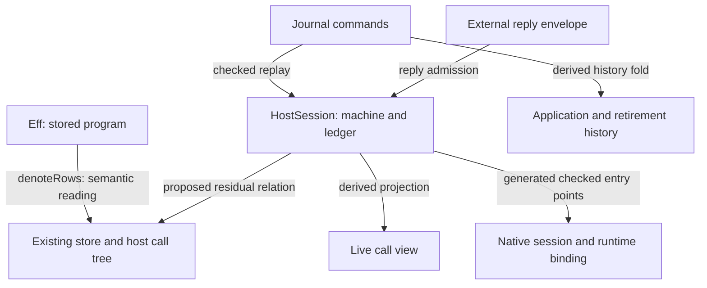

# Review: host calls and cleanup after H8

Revise the host contract and slice order before implementation. The shared operation meaning is useful, but it cannot replace identity, reply admission, and lifecycle evidence.
The review confirms two counterexamples to the proposed handler comparison. It also confirms an automatic-yield difference between immediate and parked answers.

## Evidence and scope

| Item | Pin or scope |
| --- | --- |
| Reviewed note | `docs/research/2026-10-09-host-calls-and-cleanup.md`, initial capture `note.md`, landed capture `note-landed.md` |
| Initial note hash | `c10a85cc01284b2d58b739731e1487bf92f49f880d743b391834c6cb50eaa950` |
| Landed note hash | `bc58fff25de4a28aaed040371c6336b2e192834e94a0406db5f5eb103a9a1404` |
| Note landing | `673fd9dea4e8551a9c221c176c6d46169f4d18c2`, documentation only |
| Reviewed code commit | `bd65164b9fbe0803bde474bb7e12b1849a9673d8` |
| Probe worktree commit | `62a62a602818400b7222948a7b93891901c55259` |
| Relevant code | Byte-identical at the reviewed code, note landing, and probe commits; recorded in `pins.json` |
| Evidence status | Finite Lean controls and source inspection |
| Proof role | Design review of proposed simulation, view, and lifecycle obligations |
| Execution scope | Existing Lean model only |

The initial note is ignored at capture. Claude then commits the updated note at the landing above.
The update adds sweep results, build-profile proposals C9 and C10, and disk cleanup. It changes no host-call proposal.
Three GPT-6.1 Sol agents independently review lifecycle, handler proofs, and OCaml lowering. The parent reproduces the controls in this worktree.
No production file, ruling, registry claim, or implementation session changes during this review.

The bounded recent Claude tail identifies the repository working directory and records the note update and cleanup.
The landed note reports a completed broader sweep. This review does not reproduce that sweep or certify physical hosts, native artifacts, or all schedules.

## Findings that affect the design

### HC-R1: H9 needs a stopped-prefix contract and call-instance reply admission

Severity: P1. Evidence: finite Lean controls in `Probe.lean`.

`Run.runWith` (`src/Effect4/Run/Basic.lean`) bounds the number of driver rounds separately from command fuel.
A scalar call with zero driver rounds satisfies `StraightRows`, `funded`, `atRest`, and `hostDriven`.
The run has no exit. The total semantic handler returns success and advances its state.
With four driver rounds, both controls return the expected success and host state.

H8 remains correct: its meaning reads the applied reply tape, which is empty in the stopped run.
The proposed H9 instead reads the handler, which can still answer. H8's premises do not establish sufficient driver rounds.

There is a second disagreement inside the current fragment.
The `List<A>` to `Option<A>` program receives `some 1` and finishes through the checked session.
The battery's `reactorHandler` (`Test/Api/SessionMeaning.lean`) returns no answer for the same call.
It checks only `externalAdmits`, which checks the row template.
`HostSession.preflight` (`src/Effect4/Api/HostSession.lean`) also admits replies through the checked call instance.
The generic run satisfies all four fragment and H8 conditions. The mismatch is therefore not an excluded handle case.

The isolated `rawExitHandler` control removes the duplicate template reply admission check and reports the same generic result as the session.
This is a candidate adapter correction, not a theorem about arbitrary reactors.
Keep actual reply admission in the relation to the session, including its call-instance path.
A request value alone cannot recover the static instance, as `Test/Program/CallInstance.lean` already demonstrates with empty lists.

Start H9 with finished runs from a fresh open, an explicit initial host state, accepted completions, and funded execution.
Compare the exit, stores, and final host state. State the progress condition separately.
A law for stopped runs needs a prefix observation that retains state and the outstanding operation.

### HC-R2: H9 needs the next-operation connection before its handler-to-tape step

Severity: P1. Evidence: exact statement and representation inspection.

`RunEnd.waits` (`src/Effect4/Laws/Program/Agreement/Calls.lean`) contains no request, row, stores, address, or continuation.
`ReachesC` in that file deliberately relates waiting calls over different stores.
`denoteRows_eq_session` (`src/Effect4/Laws/Api/SessionMeaning.lean`) compares only the final observation, with no exit represented by `none`.

Recording the handler's exits does not establish that it receives the semantic tree's requests.
HC-5 supplies evidence that HC-3 needs. Move the request correspondence before H9, or make it an explicit dependency within H9.

Use a relation to the existing residual semantic tree. Retain the current stores, next row and request, continuation, and transcript position.
Relate the machine's guard and program address to that position separately.
Project this relation to H8's existing observation. Do not replace H8 with a stronger statement silently.
This adds a proof relation, not stored program content.

### HC-R3: HC-1 cannot project all mandatory fields from its stated sources

Severity: P1. Evidence: lifecycle and binding-order controls in `Probe.lean`.

`HostSession.bindCall` assigns a call ID when it binds an already waiting machine call.
The control has one waiting call, zero bindings, and a next-call counter of zero.
That waiting call has no assigned call ID.

`HostSession.applyReply` removes the applied binding and reply slot. `Session.consumed` retains only the call ID.
`Program.originOf` (`src/Effect4/Program/Admit.lean`) no longer reads the old address after its guard disappears.
Therefore an applied row's mandatory key, request, address, and instance cannot come from those remaining records alone.

`RetiredCall.pending` retains an accepted completion after cancellation. The control confirms that payload remains available.
A payload-free four-state enum would discard information that the cleanup driver needs.

Make HC-1 a reading of live external waits. Include optional binding information and any received completion.
Keep historical applications and retirements as readings of the journal and existing retired records.
If one historical table must retain every field, name its reconstruction from the journal as a separate obligation.

The same control confirms that applying again along the updated session refuses the reply.
Applying from the earlier immutable snapshot succeeds again. At-most-once application is a property of one advancing session lineage.
It is not durable uniqueness across replayed snapshots or physical host side effects.
State lifetime laws over reached runs with active, retired, and consumed identities kept consistent.

### HC-R4: immediate replies require an observation and a scheduling correspondence

Severity: P1. Evidence: both Lean probe files.

On one scalar call, preloaded execution and park-then-answer return the same exit.
Their traces differ: the controls contain three and six events respectively.
This uses today's preloaded route as a semantic control. It does not test a future binding implementation.

`ImmediateBudget.lean` sets the loaded root's operation budget to two.
The immediate route injects a yield and has no exit at the compared point.
The parked route resets the operation counter on re-entry and exits without that injected yield.
At an operation budget of one hundred, both controls finish with the expected exit.
These are raw machine controls with an explicitly changed operation budget, not a claim about every reached session.

The relevant definitions are `evaluatePrim`, `countOp`, `injectYield`, and `driveStep` in `src/Effect4/Machine/Fibers.lean`.
Answering before another scheduling decision does not establish identical execution.
Name the compared observation and the correspondence between control decisions and budgets.
Keep logical call, receipt, and application accounting when a target avoids physical suspension.
Start with a scalar profile and explicit yield restrictions or matched yield decisions.

### HC-R5: cleanup must retain progress and existing semantic cuts

Severity: P1 for deleting stronger results. Evidence: theorem statements and import structure.

`run_eq_meaning` (`src/Effect4/Laws/Program/Agreement/Machine.lean`) proves termination, exit agreement, and store agreement under an explicit fuel bound.
`loopAgreement` (`src/Effect4/Laws/Program/Agreement/Loop.lean`) proves termination at every fuel beyond a bound.
H8 assumes funded execution and a machine at rest. It does not supply those progress conclusions, and its fragment excludes loops.
C2 may consolidate the machine proof, but it must retain those stronger statements and their quantitative lemmas.

| Cleanup | Required condition |
| --- | --- |
| C1, generated `LoopedRows` | Retain its table-free classification, all external indices, loops, and `catchIf`; do not substitute `StraightRows`'s `dataRow` test |
| C2, shared drive proof | Keep the existing fuel and eventual-termination conclusions before deleting their implementation |
| C3, one local run | Project `localRunC`'s exit result to the old pair and its wait to old `none`; extract the shared substrate before creating an import cycle |
| C4, shared denotation | Keep the different support cuts: `denote` refuses `catchIf`, while `denoteRows` interprets it; varying only an operation handler is insufficient |
| C6, classification reasons | Keep reasons as metadata in the existing generated table |
| C7, one axiom gate | Reuse the repaired collector after the previously recorded axiom-type correction and environment-contract clarification |
| C8, proof-style cleanup | Keep separate from host-call semantic changes and keep each theorem's statement |

The old local run stands in `src/Effect4/Laws/Program/Agreement.lean`.
The new local run stands in `src/Effect4/Laws/Program/Agreement/Calls.lean`, which already imports the machine proof.
Moving a wrapper without extracting their common substrate creates an import cycle.
Use the existing generated program algebra and fold for C4. Introduce no second program representation.

### HC-R6: HC-2 includes fixture migration and a planned-statement amendment

Severity: P1 for deleting preloads before the ruled migration. Evidence: DI-23 and current consumers.

DI-23 in `docs/DESIGN-ISSUES.md` requires keyed fixture migration with retained provenance before deleting the answer queue.
`Truth.fixtureRun`, `runJson`, and `runSyncJson` (`harness/truth/Truth.lean`) still pass preloaded answers.
`tapeAnswer` in that file extracts completions without enforcing keyed call claims.
Deletion must include their migration, original evidence retention, and OCaml regeneration.

`RunEqRefTable` (`src/Effect4/Laws/Program/Table/Agreement.lean`) quantifies over preloaded answer lists.
It does not merely have a waiting premise to remove.
Narrowing that domain changes its planned statement and semantics registry description. Record that amendment explicitly.
The existing `run_eq_ref_table_noPreload` is the connector for the session's current route.

### HC-R7: HC-7 should first generate a checked scalar session

Severity: P2. Evidence: generation roots, adapter source, and existing authority.

`ocaml/gen/roots.json` names the raw machine API, but no checked `HostSession`, `Runner`, or `Run` entry points.
The session does not become an available OCaml interface merely because its implementation is Lean.
Generate its actual roots, inspect the resulting dependency closure, and test the generated artifact.
Keep the evidence stages in `docs/core/lcnf-route.md` separate.

`e4_sched.mli` (`ocaml/engine/e4_sched.mli`) assigns each machine to one owning domain.
Keep that ownership rule when a binding reports replies from another domain.

`KeyedRecorder` (`harness/truth/session/keyed-recorder.ts`) separates receipt from application.
A general late completion still requires a binding's cleanup policy.
Request plus resume is adequate only for a named simple profile. It does not specify cancellation, compensation, resource ownership, or recovery.

H8 excludes handle rows. Stable host identity and machine allocation identity remain separate under `docs/core/host-boundary.md`.
`externalValue` (`src/Effect4/Program/Compile.lean`) still checks a fresh resource index against the current allocation count.
The earlier resource and ownership obligations therefore remain explicit future work, not regressions introduced by this note.
Begin HC-7 with one checked scalar binding and journal-prefix comparisons. Add resource and network profiles with their own obligations.

### HC-R8: repair the build-profile graph before choosing the performance split

Severity: P2. Evidence: Python controls in `ProfileProbe.py` and the recorded build profile.

`imports_of` (`scripts/lib/build_profile.py`) reads plain imports but drops `public import` declarations.
It also stops inside a multiline comment before reaching imports below that comment.
The actual `src/Effect4/Program/Ty.lean` has four public imports. The profile reads none.
The plain-import control reads all four. Both the public-import and header-comment controls reproduce the omissions.

The retained `build-profile-reported.md` supports the note's quoted module timings.
Its critical path covers only rebuilt modules and the dependencies that this parser finds.
The controls establish missing graph edges, not a corrected duration or proof that the reported longest chain is wrong.
Repair the import reading before treating that chain as an analysis of all imports.
Reuse canonical module-import data if available; otherwise share a tested reader that handles this repository's Lean import syntax.

For C9, separate shared template and erasure facts from operation cases and final assembly in `src/Effect4/Laws/Codegen/PrintTyped.lean`.
The final `sitesErasesUpTo` and `readTyped_printTyped` consumers still need the earlier facts.
For C10, extract shared record and builder facts before separating operation proofs in Queue and Pool.
Keep declaration names and a compatibility import. Keep these moves separate from changed proof statements.
A sequence of mutually dependent files gives no parallel work. Measure the new dependency graph under comparable load before claiming a speedup.

## The smallest shared interface

`RowSig table` describes host operations. `RowsSig table` also includes store operations.
Both stand in `src/Effect4/Laws/Program/DenoteRows.lean`. Their carriers deliberately forget membership.
The note should use `RowSig` when it means only the host operation.

Keep these data roles and their arrows distinct:



HC-1 can use existing core `Await` and `CallInstance` values. Its semantic connector belongs in the law graph.
Do not import the law graph into the public run interface to expose `RowsSig`.
If an executable consumer later needs the pure row alphabet, extract only that data and keep its proofs in the law graph.

A proposed live view needs three groups of information:

| Group | Proposed reading | Owner |
| --- | --- | --- |
| Current request | Existing await key, row, and request | Machine |
| Checked source | Available origin and call instance, with lookup gaps visible | Existing call table and origin reading |
| Binding | Optional call ID and optional received completion inside that binding | Session ledger |

Nesting the receipt under the optional binding avoids inventing an unbound received state.
A live-view classifier can derive waiting and received labels from these groups.
It does not need to store another lifecycle enum.
Keep retired payloads in the historical reading.

An illustrative caller flow uses the existing operations:

```lean
-- Proposed reading only; this definition does not exist yet.
let waiting := run.calls
-- Existing commands retain the receipt/application choice.
let received := run.receive waitingKey completion
let advanced := received.step (.apply waitingKey)
```

The caller should not assemble call envelopes or repeat type checks.
The shared driver owns correlation, reply admission, and the journal. A runtime binding supplies external work for the selected row profile.

Call IDs follow binding order. The reverse-binding control has machine order `[0, 1]`, pending order `[1, 0]`, and call IDs `[0, 1]`.
A key-sorted map cannot reproduce that pending list by literal equality.
Use lookup agreement and a named ordering policy. Keep application order explicit in the journal.

A picture with one frame per machine decision cannot display every receipt transition.
`Run.decisionOf` (`src/Effect4/Run/Tape.lean`) omits bind and submit commands because they leave the machine unchanged.
Use journal-command frames for lifecycle displays, with the machine-decision projection available separately.

Internal waits remain the separate obligation of row 333 and the proposed `view-names-waits` claim.
A host-call view must not present an internal queue or deferred wait as an externally answerable call.

## Proof obligations to place before implementation

These are proposed placements, not new semantics registry entries or proved results.
The semantic authority is `docs/core/semantics.md`. Requirement ownership is `docs/core/system-map.md`.

| Proposed obligation | Concept and role | Reach and premises | Exclusions | Consumer and requirement |
| --- | --- | --- | --- | --- |
| Live view projects the current waits and retained receipts | `host-session-protocol`, inversion/compatibility | Reached run, live external guards, existing binding and call-table lookups | No host progress, ownership, or historical completeness claim | HC-1 readers; R6 and R12 |
| One lineage consumes each guard at most once | `host-session-protocol`, preservation | Fresh run, valid journal extensions, guard freshness, disjoint active/retired records | No durable uniqueness across restored snapshots; no exactly-once host work | Binding lifecycle; R6 |
| `rows-next-call` | `translation-simulation`, simulation/inversion | One fiber, `StraightRows`, funded/rest/host-driven position, residual-tree relation, exact next row/request and stores | No loops, several fibers, clocks, interruption, or handle preparation | H9 and session rendering; R6, serving R12 |
| Handler transcript replay | `initial-algebras-folds`, compatibility helper of H9 | Initial and final host state; ordered row/request/exit transcript; explicit correspondence at each request | An exit list alone does not identify requests | Handler-to-tape step of `rows-denotation-reactor`; R6 |
| `rows-denotation-reactor` | `translation-simulation`, simulation | Fresh open, finished funded drive, `StraightRows`, actual call-instance reply admission, exit completions, matched transcript and host state | No driver progress theorem, resources, delayed reads, loops, concurrency, clocks, interruption, or native-runtime claim | Repository and composed host laws; R6 |
| Disjoint handler routing | `initial-algebras-folds`, compatibility | Explicit row embeddings, covering split, common target monad, state lifting | No operation reordering or reply-application commutativity | Routing utility and H9; R2, serving R6 |
| Definition-backed utility realizes its body | `translation-simulation`, simulation | Block signature, body environment, invocation relation, recursive budget policy, admitted tapes, ordered client calls under row 333 | Current `denote` rejects definition invocation; timeouts also require clock semantics | Retry, cache, fallback, timeout profiles; R10 |
| Immediate-answer lowering | `translation-simulation`, simulation | Named observer, scalar/data profile, settled points, matched budgets and scheduling, admitted reply, logical call accounting | No trace equality or lifecycle equality by erasure alone | Optimized runtime binding; R6 |
| Generated session agreement | `translation-simulation`, simulation, with target evidence stages | Checked roots, exact artifacts and toolchain, carrier and journal correspondence, runtime ownership | No generic compiler or physical-host theorem follows from generation | HC-7 scalar target; R6 |

C1, C3, and C4 connectors serve the existing `rows-denotation-session`, `run-eq-meaning`, and `loop-agreement` claims.
They introduce no independent theorem without a consumer.
C2 must retain the progress conclusions of its current consumers.
Resource support additionally needs the store-typing and ownership obligations already named by the host-boundary authority.

## Recommended landing order

1. Correct the note's `RowSig` terminology and define the view as a projection.
2. Land C1 and the minimal HC-1 live view independently, with their local connectors.
3. Extract the local-run substrate for C3 and state its endpoint projection.
4. Land the request-retaining residual relation needed by HC-5 and H9.
5. Land H9 for finished drives with admitted replies, plus the transcript-recording helper and generic-call controls.
6. Add disjoint routing and recording from the existing handler algebra.
7. Migrate keyed fixtures before deleting preloads under DI-23.
8. Consolidate C2 and C4 while retaining their progress conclusions and support cuts.
9. State the immediate-answer observation and prove its restricted lowering law.
10. Generate the checked scalar session and test one native binding before widening its profile.

Routing by `Handler.sum` already has a reusable algebraic basis in `Effects.Algebra.Sum`.
Retry, timeout, fallback, and cache require their own behavioral statements. Fold equations do not establish those behaviors automatically.
C2's larger deletion need not block the smaller view improvement or the missing semantic connector.

## Verification and checkpoint

Commands run sequentially in `/Users/pooks/.codex/worktrees/module-design-review/lean4-effect4` with `LEAN_NUM_THREADS=3`.

| Command | Result | Retained evidence |
| --- | --- | --- |
| `lake build Effect4.Api.Author Effect4.Laws.Api.SessionMeaning` | Exit 0 | `build.log`, `results.json` |
| `lake env lean -DwarningAsError=true docs/research/2026-10-09-host-calls-review/Probe.lean` | Exit 0 | `probe.log`, `results.json` |
| `lake env lean -DwarningAsError=true docs/research/2026-10-09-host-calls-review/ImmediateBudget.lean` | Exit 0 | `immediate-budget.log`, `immediate-budget-result.json` |
| `python3 docs/research/2026-10-09-host-calls-review/ProfileProbe.py` | Exit 0 | `profile-probe.log` |
| `python3 scripts/check-language.py --strict docs/research/2026-10-09-host-calls-review/README.md docs/research/2026-10-09-host-calls-review/PLAN.md` | Exit 0 for both review documents | `language.log` |

The main probe retains stopped-drive, generic-instance, refusal-state, lifecycle, order, and trace controls.
The first main attempt has harness reporting errors. The corrected attempt passes.
The first lowering attempt assumes one flush restores the result. That assertion fails and remains in `attempt1-immediate-budget.log`.
The final lowering control instead varies the operation budget explicitly and verifies both paths at each selected budget.
It makes no one-flush or eventual-termination claim.

The refusal-state control shows changed host state even when both coarse observations are `none`.
This exposes information loss at frontiers. It does not refute equality of those coarse observations.

No new library theorem or proof goal enters the tree. This slice runs no axiom-gate sweep.
No observation here establishes native host behavior or universal equivalence.
The prior cycle review remains the checkpoint for the collector's outstanding axiom-type omission.

The next review starts from the pinned note and commit above. It checks whether HC-R1 through HC-R8 receive explicit contract changes.
