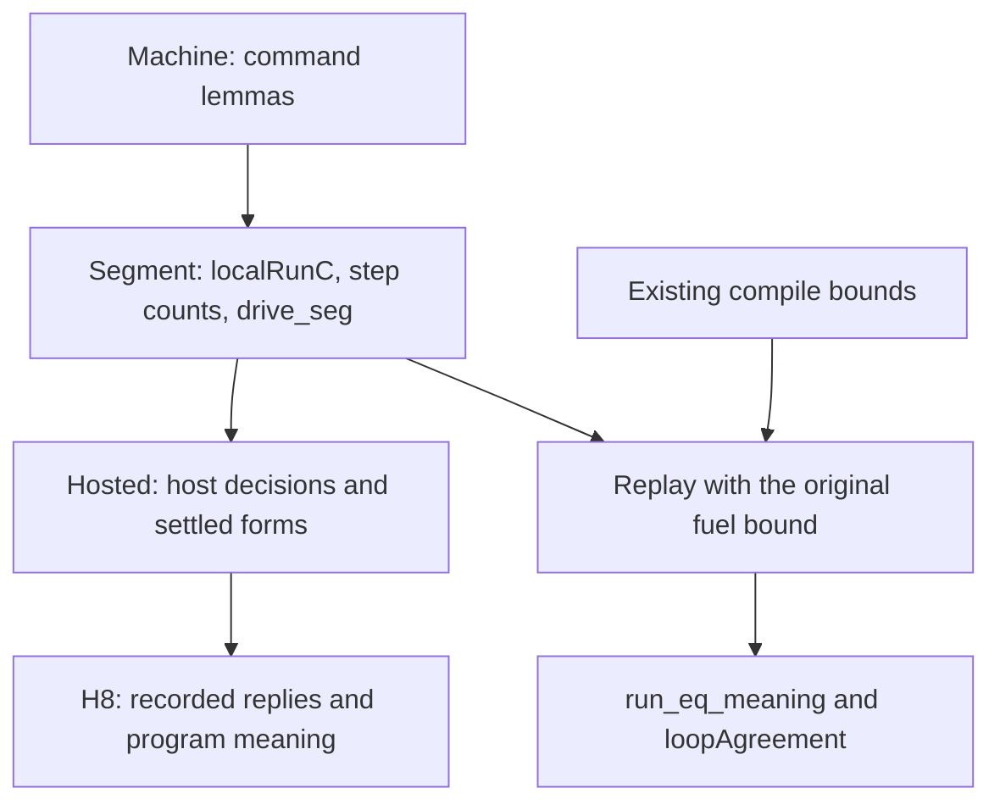

# Review of the C1 to C3 host cleanup

The shared execution proof keeps the existing termination guarantees. Repair the concept-placement entry, qualified predicate name, and helper-statement receipt before further cleanup.

## Snapshot and scope

| Item | Value |
| --- | --- |
| Base | `673fd9dea4e8551a9c221c176c6d46169f4d18c2` |
| Reviewed landing | `321cda73d2d9ae8567d5b4bcd4da283df89d9618` |
| Review worktree before this receipt | `b39f566b737e791fba9d6ed85d712f58a9da843f` |
| Evidence status | Narrow Lean builds, finite controls, selected-module axiom reading, source comparisons, deterministic generation |
| Proof role | Review of the existing `run-eq-meaning`, `loop-agreement`, and `rows-denotation-session` claims |
| Scope | C1, C2, and the landed machine half of C3 |

Claude's bounded session tail identifies `/Users/pooks/Dev/lean4-effect4` and the ongoing C1 to C3 cleanup.
The work lands during review. The reviewed sources match the landed commit.
Three GPT-6.1 Sol agents independently inspect the profile, quantitative proof, and contracts.
The parent reproduces the narrow checks in the existing isolated worktree.
No production repair, owner ruling, or message to Claude occurs in this review.

## Meaningful resolution: HC-R5's termination concern

`run_eq_meaning`, `replay_Mexit`, and `replay_Mexit_of_localRun` retain their statements, modulo whitespace.
They move from `src/Effect4/Laws/Program/Agreement/Machine.lean` to `src/Effect4/Laws/Program/Agreement/Segment.lean`.
`run_eq_meaning` still concludes finished execution, the meaning's exit, and the meaning's stores.
Its hypotheses still include `depth e ≤ fuel` and `2 * steps e + 6 ≤ fuel`.

`loopAgreement` (`src/Effect4/Laws/Program/Agreement/Loop.lean`) keeps its statement.
`LoopAgreement` (`src/Effect4/Laws/Program/LoopAgreement.lean`) still requires completion at every fuel beyond a bound.
`localRun_compile`, `localRun_compileB`, and `localRunC_compile` keep their statements too.
`statement-comparison.json` retains both versions of every compared statement.

`SegOwes` now records the local steps consumed and the commands used by a segment.
The yield case records the progress that the former family supplied.
`flushAll_Myield` uses it to prove that repeated dispatcher rounds reach the finished local run.
The surviving `replay_Mexit_of_localRun` consumer keeps the bound `2 * N + 4`.
This is shared proof work with retained guarantees, rather than deletion justified only by H8's conditional observation.

The generated `LoopedRows` keeps the old table-free profile.
All external row indices remain accepted, including indices outside a table; loops and `catchIf` remain included.
Definition blocks and other asynchronous operations remain excluded.
The source comparison covers every old clause. The Lean controls also test rejected conditional children.
All four generated fragment outputs reproduce byte-identically.

## HCC-01: the new proof module is absent from concept placement

Priority: P2. Evidence: source inspection and the Lean metadata control in `Probe.lean`.

The `translation-simulation` concept in `Tools.Semantics.registry` (`tools/ProofGraph/Registry.lean`) lists `Agreement.Machine` but omits `Agreement.Segment`.
`Tools.Semantics.buildReport` (`tools/Tools/Semantics.lean`) filters declaration modules against this list before reading their tags.
The control finds the moved `run_eq_meaning` in Segment and exercises that exact module-selection condition.
It selects none of Segment's 36 available theorems.
Adding Segment to a local copy of the selection list selects all 36.

The named `run-eq-meaning` claim pointer remains valid. Its theorem and the termination result do not disappear.
Explicit declaration tags alone do not bypass this filter.
The separate requirement-node scan reads tags before this filter; this finding does not say those requirement nodes disappear.
The control does not regenerate the full semantics report.

Next action: add `Effect4.Laws.Program.Agreement.Segment` to the concept's default modules, then regenerate and check the semantics report.
Keep Machine in the list because it still owns the primitive command lemmas.

## HCC-02: the generated profile changes its qualified name

Priority: P2 for declaration compatibility. Evidence: expected failure and positive Lean controls.

The old predicate is `Effect4.Program.Agreement.LoopedRows`.
The generated predicate is `Effect4.Program.Denote.LoopedRows` in `src/Effect4/Laws/Program/FragmentLoopedRows.lean`.
After importing the old entry module, `NameOld.lean` fails with an unknown identifier at the old name.
`NameNew.lean` imports the same module and resolves the new name.
Existing helper names remain under `Effect4.Program.Agreement.LoopedRows`.

No existing in-tree consumer fails the narrow builds. The break affects callers that use the former qualified predicate name.
This is a naming issue; the generated classification keeps the previous behavior.

Next action: retain the old name as a transparent alias, or make the generator retain the predicate's original namespace.
An alias keeps one implementation and requires no second classification table.

## HCC-03: the receipt overstates statement stability

Priority: P2 for evidence accuracy. Evidence: `statement-comparison.json` and source inspection.

Section 4.1 of `docs/research/2026-10-09-host-calls-and-cleanup.md` says both reconstructed helper statements are unchanged.
`replay_Mexit_of_localRun` is unchanged, but `flushAll_Myield` changes.
The latter adds `s.externals.answers = []` and replaces its finished `localRun` premise with a finished `localRunC` premise.
`Quiet` (`src/Effect4/Laws/Program/Agreement/Machine.lean`) constrains deferred waiters and due resumes; it does not require empty external answers.

The final termination guarantees retain their statements. This review finds no incorrect execution result from the helper change.
Next action: correct the receipt and name the helper's narrower domain.
If callers still need its original domain, retain that statement through a compatibility theorem before removing their route.

## C3 remains deliberately partial

`localRunC_of_localRun` in Segment connects each finished old run to the same exit and stores, with the reply tape unchanged.
It does not replace `localRun` with a total projection, nor map every waiting result to the old result.
The compile laws still use `localRun` and their quantitative bounds.
The landed note explicitly records that remaining work. It is not a regression.

The import direction is `Calls → Segment → Machine → Agreement`.
The static review finds no cycle in the relevant closure.
The core root still has no path to the law graph under that source inspection.
No new program representation enters the tree.

## Checks and retained evidence

Every Lake invocation uses `LEAN_NUM_THREADS=3`, sequentially in the review worktree.

| Check | Result | Evidence |
| --- | --- | --- |
| `lake build Test.Program.AgreementContract Test.Program.FragmentCensusContract Test.Program.QueueWorkload Test.Api.SessionMeaning Effect4.Laws.Program.LoopAgreement` | Pass | `build.log`, `build-result.json` |
| `lake build Tools.Semantics effect4gen` | Pass | `tools-build.log`, `followup-results.json` |
| `lake env lean -DwarningAsError=true docs/research/2026-10-09-host-cleanup-review/Probe.lean` | Pass | `probe.log` |
| Old and new qualified-name controls | Expected refusal; positive control passes | `NameOld.log`, `NameNew.log`, `name-results.json` |
| Four generator groups, using their manifest arguments | Pass; byte-identical outputs | `followup-results.json`, each group's log |
| Statement comparison against the base | Seven unchanged; the flush helper differs | `statement-comparison.json` |

The existing agreement battery includes the long program that yields twice before finishing.
The metadata control reads `exactAxioms` for 147 declarations owned by Segment; all fit `[propext, Quot.sound]`.
This is a selected-module reading, not a whole-library axiom-gate sweep.
The collector's earlier axiom-type omission remains outside this cleanup, as recorded in the prior review.

The first probe attempt lacks the built reporting module. The second lacks a numeric annotation in the review's reporting counter.
Their logs remain as `attempt1-probe.log` and `attempt2-probe.log`. The corrected probe passes.
These are probe setup failures, not failures of the library statements.
No TypeScript, OCaml, physical-host, or full-sweep result is claimed.

## Checkpoint

Reviewed through `321cda73`. HC-R5's completion and fuel-bound concern is resolved for C2 and the machine half of C3.
HCC-01, HCC-02, and HCC-03 remain open at that commit.
The host-call review's other findings remain unchanged; this cleanup does not implement HC-1 through HC-7.
Next: the small metadata, naming, and receipt repairs, followed by the request-retaining relation needed for H9.
