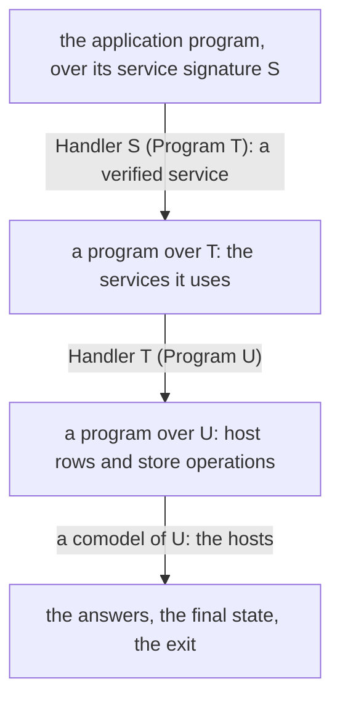

# 2026-10-09 The host session as a coalgebra: theory, the proof graph, and the plan

Status: research note (history, not authority). Base: `df9d1c40` on `refactor/phase1-phase3`.
It rules nothing. Section 8 lists what the owner must decide.

The owner asked on 2026-10-09, by voice, after Codex's review of the host-call note:

- handle host calls in general and composable ways, not one call and one promise at a time;
- relate that handling to the program's types and semantics, as deep modules;
- ask whether the algebra gives a coalgebra that unfolds the host session beside the program;
- ask whether that gives the powerful interfaces we need;
- think about what we model: a protocol of a higher order on top of promises and progress;
- improve the algebraic side of the `Effects` package, and settle the coalgebraic side there;
- let Effect4's laws instantiate that side, and not repeat generic derivations.

Words of this note, each defined before its first use:

- A **signature** (`Effects.Signature`) is a set of operations, each with its answer type. Read
  as a polynomial, its operations are positions and its answers are directions.
- A **system** over a signature is a coalgebra: a state type and a step. From a state, the
  step ends with a result, or issues one operation and continues for each answer.
- A **comodel** of a signature is a host. For each operation, it answers from a state of its
  own and gives the next state. A comodel is a handler into `StateT σ M`.
- A **bisimulation** between two systems is a relation between their states. Related states end
  alike, or issue the same operation and stay related after every answer.
- A **protocol** of a signature says, for each operation, which answers a host may give. A
  protocol of a higher order also lets an answer open new operations, as a promise does.

## 1. The one thing to know first

The algebra already gives the coalgebra, and the payoff is concrete. A program's call tree is
the initial algebra (`Effects.Program`), folded by handlers. A host session is a system: a
coalgebra. One bisimulation between the session and the call tree gives agreement with the
meaning under every host at once. The hosts include the reply tape, a stateful host, a router
and a recorder. Today
H8 proves one host, the tape, by a proof built for it. The plan puts systems, comodels,
bisimulations and protocols in `Effects`, generic and proved once. Effect4 then states one
relation, `rows-next-call`, and gets H9 for every comodel as a corollary.

## 2. What we model

A run of a program is an interaction. The program is one side. The other side is a team: the
scheduler that chooses which fiber evaluates and when to flush, the clock, and the hosts that
answer calls. The decision tape (`Api.Decision`) already lists every move of that team. The
rule that "full meaning is relational over explicit decisions" (AGENTS.md) says the same thing.

At each settled point, the session offers the team a set of moves. `Run.work` lists them today:
runnable fibers, armed dispatchers, waiting calls, received replies, timers. That set is the
session's **position**. A move changes the position. So the session is a system whose
positions are its work and whose directions are the moves.

One host call is the smallest case: one fiber, one waiting call, one move (the reply). A
promise generalizes it: the answer to one call can be a capability for later moves. The program
may start a job, receive a handle, and await it later; the host answers when it is ready. The
protocol then changes with the state. Which moves exist depends on which promises are open. The
type of an await's answer is the type recorded when its promise opened. That is the
protocol of a higher order the owner names.

Progress is a property of the interaction, not of one side. The program cannot finish unless the
team moves. "Funded" (`Laws/Run/Tape.lean`) is the budget form of progress: the tape answers
every decision. A fair team, one that eventually answers every waiting call and runs every
runnable fiber, is its general form.

## 3. The theory

### 3.1 Algebra and coalgebra of one signature

| Notion | Side | In `Effects` or Effect4 today |
| --- | --- | --- |
| the free monad: finite call trees | initial algebra | `Effects.Program` (well-founded, `pure` and `vis`) |
| a handler | an algebra, a model | `Effects.Handler`; `interpret` is its fold; `program_is_initial_in_models` |
| a renaming of operations | a lens between signatures | `Signature.Hom`, `Program.map`, `Handler.pull` (experimental root) |
| routing by operation | the sum | `Signature.sum`, `Handler.sum`, `Effects.Algebra.Sum` |
| a host with state | a comodel | `Handler (RowSig table) (StateT σ Option)` in `meaningUnder`; `Run.Reactor` |
| a session, a machine | a system, a coalgebra | the machine forms of `Agreement/Hosted.lean`; nothing generic |
| behaviour: possibly infinite call trees | final coalgebra | the fuel and frontier approximations (`denoteB`, `Approximation`) |
| agreement of a machine with a meaning | bisimulation | `ReachesC`, `Leads`, `ReplayRel`; built per theorem |

Jacobs' book (filed: `docs/research/2026-09-05-effects-papers/text/intro_coalgebar_mathematics_state.txt`)
states the connection. Its section 5.5, "Bialgebras and operational semantics", reads the
algebra as the language and the coalgebra as its operational semantics (page 231 of the book).
Its Theorem 5.5.5 (page 234) assumes a distributive law of the program's terms over the
behaviour. It then says two things. The semantics by initiality and the semantics by finality
coincide, and bisimilarity is a congruence. In our terms, the meaning by fold equals the
behaviour of the session. A part can be replaced by a bisimilar part inside any program.

### 3.2 Hosts as comodels

A comodel of a signature answers each operation from a state and moves the state. Running a
program against a comodel is interpreting it in the state monad. Comodels compose:

- **routing**: two hosts for two signatures make one host for their sum, over the product of
  their states;
- **renaming**: a host for `T` and a lens from `S` to `T` make a host for `S`;
- **implementation**: a handler implements `S` by programs over `T`, such as a retry, a cache
  or a fallback. With a host for `T`, it makes a host for `S`. Running through it is running the
  translated program against the host for `T`;
- **recording**: a host can write a transcript of row, request and answer beside its state.

Each construction has one law at `interpret`. These are the composable utilities the host-call
note listed. The literature names this structure: Plotkin and Power's comodels, Uustalu's
stateful runners, and Ahman and Bauer's runners. None of these texts is filed here, so this note
cites none of their statements; filing them is section 8's third question.

### 3.3 Protocols, of the first and of a higher order

De Vilhena's thesis (filed: `docs/research/2026-09-05-effects-papers/text/verification_with_effects.md`)
gives effects protocols in separation logic, section 2.2. A protocol relates an effect's payload
to a predicate on the value the continuation receives. Protocols combine by a sum, the bottom
protocol permits no effect, and protocols are ordered by weakening. Its chapter 4 specifies an
asynchronous library with promises. There `async` takes a computation that itself follows the
protocol `Coop`, and returns a promise. The promise carries the predicate its fiber's result
satisfies, and `await` returns a value satisfying it (Figure 4.3).

Our first-order form is reply admission: at a call instance, a reply must fit the answer and
error types there (`HostSession.preflight`). As a protocol, it is a predicate on answers for
each operation. A host meets it when every answer it gives is admitted; a program respects it
when its continuations are typed for every admitted answer.

The higher-order form needs operations that depend on the state of the protocol. That is an
indexed signature: a set of worlds, the operations and answers of each world, and the world
after each answer. A promise is then an answer that adds an operation, its await, typed by the
promise. The program's own fibers and deferreds are internal promises (row 333). Host handles
(the handle rows excluded from H8) are external ones. One indexed interface covers both.

### 3.4 Approximation, not coinductive types

Lean 4.33 has no coinductive types in its core. The plan does not need them. A system's
behaviour is read through its finite unfoldings: depth `n` gives a finite call tree whose cut
branches end in `none`. Our fuel and frontier rules already work this way: a frontier is a live
cut, never an error. Two bisimilar systems have equal unfoldings at every depth, and this is the
theorem everything else uses.

## 4. The proof graph today, read against the theory

| Today | Its role in the theory | After the plan |
| --- | --- | --- |
| `denoteRows`, `meaningRows`, `meaningUnder` | the fold, and runs against the tape and a comodel | unchanged |
| `localRunC`, `ReachesC`, `RunsToD`, `localRunC_compile` | a system (the local run) and a simulation of the meaning | the call-tree side of the bisimulation |
| `drive_seg`, `SegOwes`, `Settled`, `Holds`, `holds_*` | the machine's system at settled forms, and its simulation by the local run | the session side of the bisimulation |
| `denoteRows_eq_session` (H8) | agreement under one comodel, the tape | a corollary of the bisimulation at the tape comodel |
| the battery's `reactorHandler` comparison | agreement under one stateful comodel, by finite evaluation | H9, a corollary at every comodel |
| `HostProtocol` (four states, five labels) | a finite abstraction of the session's positions | the position's coarse label |
| `Run.work`, `Run.outstanding` | the session's position | read off the session system |
| `Signature.Hom`, `Handler.pull` (experimental) | lenses | promoted; renaming hosts |

Two gaps are not about the session. The generic layer holds no system, no bisimulation and no
comodel construction, so each Effect4 agreement theorem builds its own. And no protocol is a
value: reply admission is code in the session, and nothing states it as a predicate a host
meets.

## 5. The design

### 5.1 `Effects`, version 0.9.0: the coalgebra layer

New modules under `Effects/Coalgebra/`, outside the nine frozen `Effects/Algebra/` modules, so the
parity receipt stays byte-identical. Each binds its universes explicitly.

| Module | Declarations | Laws |
| --- | --- | --- |
| `Step` | `Step S A X`: `done a`, or `call o k`; `Step.map`; `Step.Lift R` | functor laws; lifting of the identity and of a composite |
| `System` | a system `X → Option (Step S A X)`, where `none` is a cut; `Program.system`; `unfold n` into `Program S (Option A)` | `unfold` of `Program.system` at the program's depth is the program; unfoldings grow with depth |
| `Bisim` | `IsBisim c d R`; `IsSim c d R` (a partial system simulated by another) | bisimilar states have equal unfoldings at every depth; a simulated state's unfolding approximates the other's |
| `Comodel` | `Comodel S M σ`, a handler into `StateT σ M`; `run`; `route`, `rename`, `through`, `record` | one law each at `interpret`, through `interpret_map` and the handler category |
| `Run` | a system run against a comodel with a depth | the run is `interpret` of the unfolding; bisimilar states run alike against every comodel |
| `Protocol` | `Protocol S`, a predicate on answers per operation; `Comodel.Meets`; sum, bottom, ordering | a host that meets a protocol answers only admitted answers; sum and ordering laws |

`Signature.Hom` moves from the experimental root to `Effects/Coalgebra/Lens.lean` with its law,
since renaming hosts needs it. The experimental module keeps a re-export.

Then version 0.10.0 adds the indexed layer. It holds `Indexed` signatures with worlds and a
next world, programs and systems over them, and promises as answers that open operations. It lands after the
first-order layer has its Effect4 consumer.

### 5.2 Effect4: one relation, every host

1. **The call-tree system.** The meaning under a reply tape is already a fold. Its system hides
   the store operations by their handler and issues the host operations: a state is a residual
   call tree with its stores.
2. **The session system.** A state is a settled form of `Holds`. Its step ends at `Mexit`,
   issues the waiting call at `Mcall`, and is a cut at a frontier. An answer's continuation is
   `holds_answer`'s next settled form. This is the machine half of H8, read as a system.
3. **`rows-next-call`.** The relation between the two: the position the local run with calls
   leads to, with the stores, the next row and request, and the continuation. It is a simulation
   of the session by the call tree (`IsSim`). Codex's HC-R2 asked for exactly this relation.
4. **Corollaries.** H8 is the simulation run against the tape comodel. H9 is the same run against
   any comodel, once reply admission is the session's (HC-R1). The battery's repository lines
   become readers of H9.
5. **Host utilities.** `Run.drive` takes a comodel. Routing, renaming, implementation by a program
   over other rows, and recording come from `Effects` with their laws.
6. **The typed protocol.** The call table gives each call instance its answer and error types.
   As a `Protocol` of `RowSig`, it is what the session admits. A host that meets it is never
   refused.

### 5.3 Program in, program out

The owner's preferred abstraction (2026-10-09): a handler that takes a program over one signature
to a program over another. `Effects` has it: a `Handler S (Program T)` implements each operation
of `S` by a program over `T`, and `interpret_through` composes two such layers. A stack reads
top to bottom:

Each arrow has one law at `interpret`, and the bottom arrow is the comodel of section 3.2. A
picture of a session draws the same stack. The program stands at the top, then each layer's
translation, then the hosts' answers at the bottom, joined by the session's moves.

### 5.4 Types meet the coalgebra

A signature's operations and answers carry types from the type algebra (`Ty`). A typed
signature reads each operation's request type and answer type from the program's call table.
Its protocol is membership: an answer is admitted when it is a member of the answer type at the
call instance. So the protocol of section 3.3 is not written by hand; it is the type algebra's
membership judgment, read at each call. A handler that implements `S` by programs over `T` is
well typed when each implementation checks at the types `S` declares. The indexed layer of CO-7
extends this to promises: an answer of a promise type opens an operation whose answer type is the
promise's.

### 5.5 Effect TypeScript: a verified service

An Effect service is a signature: a record of operations, each returning an `Effect` with its
answer and error types. A `Layer` that provides the service is a handler. So a stack of section
5.3 prints as an Effect service: a `Context.Tag` for `S` and a `Layer` built from the handler's
programs over `T`. A regular Effect TypeScript program then uses the verified service through
its tag, with no knowledge of the proofs. The definition blocks of row 328 already print as
functions. Slice CO-6b, after CO-6, prints a block as a service and its handler as a layer. The same shape serves standards libraries: a WHATWG interface is a
signature, and its implementation a handler.

## 6. Placement of the obligations

| Obligation | Concept and role | Reach | Not established | Consumer |
| --- | --- | --- | --- | --- |
| `Effects`: bisimilar states unfold alike | `initial-algebras-folds`, compatibility (generic) | any signature, any depth | no coinductive equality; no fairness | every bisimulation below |
| `Effects`: comodel constructions and their laws | `initial-algebras-folds`, compatibility (generic) | lawful target monads | no operation reordering | host utilities; H9 |
| `rows-next-call` | `translation-simulation`, simulation | one fiber, `StraightRows`, settled forms, funded decisions | no loops, fibers, clocks, interruption or handle rows | H8 restated, H9, the session picture; R6 |
| H9, `rows-denotation-reactor` | `translation-simulation`, simulation | as above, with reply admission at the call instance and a finished run | no progress theorem; no physical host | host laws; R6 |
| the typed protocol of a call table | `host-session-protocol`, compatibility | admitted programs, the session's admission | no handle rows; no indexed protocols | typed hosts; R6, R12 |

## 7. Slices, in order

1. **CO-1** (`Effects`): `Step`, `System`, `Bisim`, `Lens`, with the contract packet, the battery
   and the axiom report. A local commit in a clone of `lean4-effects`; Effect4's pin moves to it.
2. **CO-2** (`Effects`): `Comodel`, `Run`, `Protocol`, with their laws and falsifiers.
3. **CO-3** (Effect4): the call-tree system and the session system, with their unfolding facts.
4. **CO-4** (Effect4): `rows-next-call` as a simulation; H8 as its corollary at the tape.
5. **CO-5** (Effect4): H9 at every comodel; reply admission at the call instance; the battery's
   repository lines as readers.
6. **CO-6** (Effect4): host utilities on `Run.drive`; the typed protocol of a call table.
   **CO-6b**: a definition block printed as an Effect service with its `Layer`.
7. **CO-7** (`Effects`, then Effect4): indexed signatures; promises and handle rows.

This order replaces HC-1, HC-3, HC-4 and HC-5 of the host-call note. HC-2, HC-6 and HC-7 stand.

### 7.1 Progress on 2026-10-09

- **CO-1 and CO-2 landed** in `lean4-effects`, branch `coalgebra`, commits `8ddb936` and `b0dd607`
  (local; push them before this repository's branch). Version 0.9.0 adds `Effects.Lens` and
  `Effects/Coalgebra`: `Step`, `System`, `Bisim`, `Comodel`, `Protocol` and `Run`. It adds a
  contract packet, a battery, four counterexample rows and an axiom report. The package's gate
  now reads axioms with the exact walk, backported with its two controls. Its default build, the
  algebra parity receipt and the trust-gate probes pass. Effect4 pins `b0dd607`; the move
  rebuilt no existing module.
- **CO-3 landed** in Effect4: `src/Effect4/Laws/Program/HostRuns.lean`. The meaning under a host
  is a run of the call tree against the stores routed beside the host (`meaningUnder_eq_run`).
  The reply tape is the reply host (`meaningRows_eq_run`).
- **CO-4 is revised.** A reply tape answers a call without reading its request. So no relation
  built on H8's tape can show that the session asks the meaning's requests (HC-R2). The robust
  route generalizes H8's local run with calls from a reply tape to a host. `localStepC` asks a
  comodel of `RowSig table` at its state, and `ReachesC` and `Leads` carry the host's state.
  The compile law compares with the host's run of the call tree. The compile law's `perform` case
  then proves that the requests agree. H8 is the instance at `tapeHost`, and H9 is the theorem
  at every host. The session's system for the picture is built on the same local run after it.

- **CO-4 landed.** The local run with calls asks a host, a comodel of `RowSig table`, where it
  read a reply tape (`localStepC`, `hostAnswer`, `Agreement/Segment.lean`). `ReachesQ` and
  `LeadsQ` say "reads no reply, under every host". The compile law holds under every host
  (`localRunC_compile`), and its `perform` case shows that the run asks the meaning's row and
  request. `holds_answer` and `meaning_settled` hold under every host. H8 is now the instance
  at the reply host (`meaning_settled_tape`, `tape_holds`), with its statement unchanged. The
  session's admitted reply is on a table row (`preflight_row`), so the reply host answers it
  (`Holds.tapeAnswer`).

- **CO-5 landed: H9 is a theorem** (`denoteRows_eq_session_host`,
  `src/Effect4/Laws/Api/SessionMeaning.lean`). Take a finished, funded, host-driven run at rest, and
  any host whose answers are the run's (`HostAnswered`). Then the
  host's run of the call tree is the root's exit with the stores. The host ends where the
  answers left it. One induction (`tape_holds_host`) serves H8 and H9. Its axioms are
  `[propext, Quot.sound]`. Still owed: its registry claim, a battery reader, and the proof that
  `Run.drive` with a reactor makes its run `HostAnswered` (slice CO-6).

- **A checker brings a run under H9.** `hostAnsweredCheck` runs a host along a run's tape, and
  `hostAnsweredCheck_sound` gives `HostAnswered`. The battery shows that eight
  repository-driven to-do runs meet H9's premises under the repository host. `reactorHost` reads
  a driver's `Reactor` as a comodel.
- **CO-6, the typed protocol** (`src/Effect4/Laws/Program/RowProtocol.lean`). A row's answer
  and error columns make a protocol of the row signature: the row's template admission
  (`externalAdmits`). `guardRows` makes a host meet it. Take a run answered by a host, with each
  answer admitted by its row. The guarded host also answers it (`hostAnswered_guardRows`), so H9
  holds for the typed host. The session's reply admission also reads a call's checked instance,
  which depends on the call's site. A protocol at sites needs a signature indexed by the call site: the program's
  call tree labelled by addresses, and a lens that forgets them. That is part of CO-7.

## 8. What the owner must decide

1. **`Effects` as the home of the generic layer** (representation). The coalgebra layer lands
   there as version 0.9.0. Effect4 pins a local commit until you push `lean4-effects`. This
   reverses the leaning of 2026-09-16 toward retiring the package. Recommended, as you asked.
2. **The breaker for `Effects`** (process): the package's rules ask for a contract from a
   separate breaker before the build. I write the contract and its falsifiers, and Codex reviews
   it after. Recommended, since you are away.
3. **Filing the comodel and runner papers** (domain). The texts: Plotkin and Power on comodels,
   Uustalu on runners, and Ahman and Bauer's runners. Also Hancock and Setzer on interaction
   structures, and Niu and Spivak on polynomial functors. Filed texts allow cited statements.
   Recommended.

## 9. What this note does not establish

- No theorem of section 5 exists yet.
- The bialgebra statement of section 3.1 is Jacobs'; nothing here shows that our machine has a
  distributive law. The plan uses bisimulation, which needs no such law.
- Fairness, liveness and several fibers are named, not designed.
