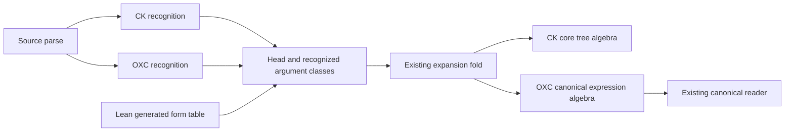

# Shared derived-form selection

Base implementation: `e3eda3b2e193b81e17f6f0453c245f46589f1da7`.
The user requests further TypeScript authoring consolidation between CK and OXC.
The two readers already share the Lean-owned form expansion algebra.
They still choose generated form identifiers by hand.
This slice removes that second mapping.

## Design

Deepen `ts/eff/ingest/forms.ts` instead of adding another program representation.
Its `expandForm` accepts a head and the argument classes already recognized by a reader.
It selects exactly one generated row and folds that row's expansion with the existing algebra.
The generated table owns the connection between a head, its argument classes and its expansion.
The argument-class type projects the generated table.
The existing table contains nineteen distinct combinations of heads and argument classes.
An absent or ambiguous combination refuses explicitly.
Do not retain a second public string-identifier expansion route.

Both readers retain TypeScript syntax recognition, local binders, capture checks and refusal ordering.
They supply recognized argument classes to the common expansion interface.
A zero-parameter `tap` arrow keeps its existing effect classification.
The same change covers simple forms, handlers, default forks, service yields and one-argument release.
Explicit options and other direct core operations keep their current paths.
No foreign input profile expands.
No existing refusal code or source observation changes.

## Placement and limits

The consumer is the existing foreign source route through `Forms` into the sole core `Eff`.
The existing consumers include `Forms.andThenEffect_typed` and `Forms.tapEffect_typed` under R10.
`read_print` separately serves `exact-codecs` under R8.
The source paths are `src/Effect4/Laws/Codegen/Forms.lean` and `src/Effect4/Laws/Codegen/ReadPrint.lean`.
This TypeScript implementation receives finite controls against independent core trees and retained source verdicts.
It states no new Lean theorem and creates no planned goal.
It does not discharge R10's foreign source admission boundary or claim parser independence.
Decisions rows 168, 215 and 295 retain the shared parse and separate walks.

## Finishing criteria

- Both readers stop constructing derived-form identifiers by hand.
- One existing expansion entrypoint selects by generated head and argument classes.
- Every generated combination is unique and exercised by a control.
- Unknown heads, wrong argument classes and wrong order refuse.
- Before and after full verdict records match independently for each reader on the retained corpus.
- Explicit expected trees cover captured and inserted binders at several depths.
- Direct calls, data-last calls, zero-parameter tap and handler forms keep their observations.
- Focused ingest tests and pinned tsgo 7 pass.
- A receipt records exact commands, counts, evidence and remaining gaps.

The broader canonical reader migration remains outside this slice.
CK's printed reader lacks optionCase and caseTag cases that the canonical reader supports.
Changing that domain needs an explicit follow-up contract and controls.
A shared verdict-construction boundary is another candidate after this slice.
