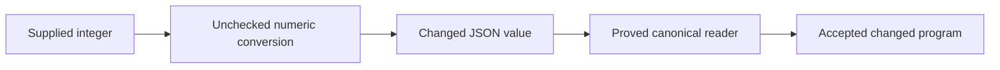

# Module integration and JSON authoring review

The JSON authoring tool admits an integer after changing its value.
Reject inexact number conversion before the session consumes the program.
The proved canonical reader remains correct on its own input.

## Reviewed state and ownership

Reviewed primary commit: `ebc497c770a2c0d1be1c49bcd40d6055af1d488c`.
Reviewed incoming module commit: `3b3d135c61af0d4f876accc99f1e60336e0e9a7b`.
The primary checkout remains in an active merge during this review.
The review reads its source and the repository-specific implementation-session tail.
The session records the primary repository as its working directory.
Internal thinking fields are excluded.
No message steers that session.

The review worktree starts at `a29508f53ea9832f8e2a393763783b63bb21d78f` on `codex/edit-session-overwatch`.
Only this receipt and its finite evidence change there.
Production, owner rulings, and the implementation session remain unchanged by this review.
No Lake build, sweep, merge, or push runs from the review.

## JSON-01: changed input accepted as a program

Evidence kind: finite tool execution, independently reproduced.
Scope: the schema JSON entry of the edit-session tool at the reviewed primary commit.
Observation: accepted requests, reported refusals, returned program JSON, and stored canonical program bytes.

The request opens a program that returns the natural `9007199254740993`.
The answer reports success, no typing refusals, and the law `Canonical.ofJson_exact`.
The following sketch request returns a program containing `9007199254740992`.
Opening that smaller value produces identical stored canonical bytes.
The parent independently repeats the four requests and obtains byte-identical answers.
Both reviewers also repeat six controls through the tool.
The values `7`, `9007199254740992`, and `9007199254740994` retain their values.
The values `3.5` and `-1` refuse and leave the preceding session unchanged.

`Tools.JsonBridge.ofLeanJson` in `tools/Tools/JsonBridge.lean` converts the supplied natural through `binary64OfNat` without checking equality afterward.
That conversion rounds this value before the canonical reader sees it.
`Tools.Session.programOfJson` and `programFrom?` in `tools/Tools/Session.lean` admit the result and name the reader law.
`Canonical.ofJson_exact` in `src/Effect4/Laws/Store/ShapeRead.lean` concerns the converted JSON value.
It establishes no equality with the natural supplied to the tool.



The core reader explicitly limits its program JSON print round trip for large naturals and null-printing option values.
The tool admits a changed source value before invoking that reader.
The core round-trip restriction does not authorize changed source values.
The probe introduces no counterexample to the proved reader statement.
It exercises authoring and storage, rather than running the resulting Effect program or an MCP transport.

## Smallest repair and placement

Require the converted number to recover exactly the supplied natural.
Refuse a request when this equality fails.
Keep canonical bytes available for values outside the JSON profile.
Retain the exact reading theorem at its existing boundary.
Connect any new conversion law to the tool consumer before reporting exact JSON value admission.

| Placement | Scope |
| --- | --- |
| Concept and requirement | `exact-codecs`, R14 |
| Existing question | `json-read-exact` in `tools/ProofGraph/Registry.lean`; its current theorem concerns the canonical reader only |
| Proposed helper consumer | `Tools.Session.programOfJson` after `Tools.JsonBridge.ofLeanJson` |
| Required property | Every accepted natural conversion recovers the supplied natural |
| Limits | No full print round trip, option disambiguation, JSON transport, or execution agreement |
| Unlocks | Agent edits retain supplied numeric data before existing session and typing laws apply |

No new theorem or planned goal is added during this review.
The repair uses the existing program representation.
It needs no new program constructor or second stored syntax.

## Module integration checkpoint

The first merge uses `d1533b0c` and omits the later integration commit.
The implementation build reports an unreachable Stream law module.
Claude aborts that merge and restarts from `3b3d135c`.
The new source comparison retains every parent import in both roots, the library entry, and the test entry.
It also retains every parent registry claim identifier.
All 54 incoming-only production files and 28 primary-only production files match their respective parents.
The only overlapping production files are the test entry, law root, printer laws, and semantics registry.
These checks inspect source composition and establish no merged compilation result.
The implementation log later reports a successful 1,617-job build and passing library, axiom, and goal gates.
The review retains that log separately and does not reproduce the build.
The merge and report generation remain active at the observed checkpoint.

An independent GPT-6.1 Sol review reconstructs the merged printer law file from both parents exactly.
The four shared address laws retain their statements and proofs under their new names.
The product annotation, erasure, and control files retain the incoming bytes.
The merged printer law SHA-256 is `ed2cd2dd6d06f85dc32dfc98481ed7906f9b61a9e52a75ae1b6047d2f7310b1e`.
No introduced printer integration defect is found within that source comparison.

The public module printer connection remains open, as the prior integration receipt records.
This review does not repeat that existing finding as a regression.
The incoming commit remains the module-review checkpoint.
The active primary merge remains separate from that checked isolated commit.

## Evidence

The sibling directory `2026-10-09-json-authoring-overwatch/` retains the driver, requests, responses, reproduction command, source pins, and independent replay.
The driver imports the existing compiled session tool and writes no production artifact.
The parent sets three Lean threads and runs from a temporary directory.
The compiler is Lean `4.33.1`, commit `819816b2e0a3bf405af45ae5c7af2491d8f5bee6`.
No new proof or axiom gate runs from this review.
The retained logs distinguish tool execution from the implementation session's separate build.
The finite counterexample remains open at this checkpoint.

Replay against the pinned source and its existing compiled imports:

```sh
LEAN_NUM_THREADS=3 python3 docs/research/2026-10-09-json-authoring-overwatch/replay.py --repo /Users/pooks/Dev/lean4-effect4 --out /tmp/effect4-json-review-replay
```

Use a fresh output path.
The replay refuses changed audited source before executing the driver.
It records source, compiled import, compiler, and script hashes.
It asserts all six observations and the two programs' identical stored bytes.
