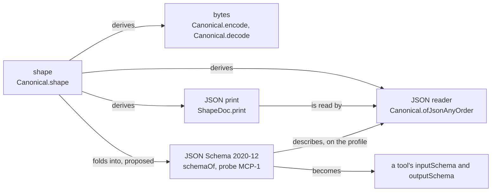
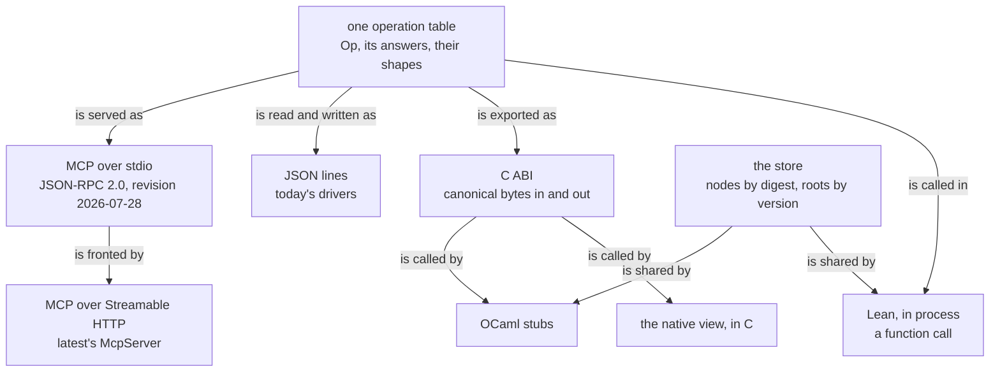
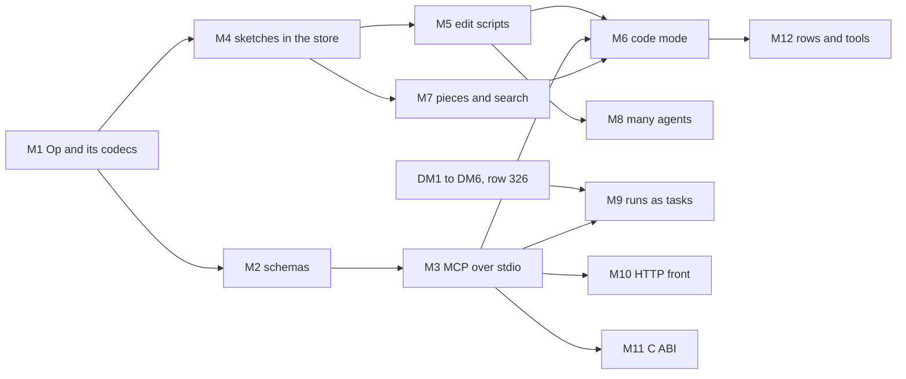

# 2026-10-09 MCP and code mode: an authoring surface generated from the algebra

Status: research note (history, not authority). Base: `78f7bcbe` on `refactor/phase1-phase3`. The
brief named `3fa881d2`; the coordinator's commits since then touch the view, the code plane and
`docs/STATE.md`. Seat MCP wrote it, and it rules nothing. Section 10 holds the questions for the
owner. The evidence folder is `docs/research/2026-10-09-mcp-code-mode/`.

## 0. The one thing to know first

- **MCP's current revision fits the tree.** Revision 2026-07-28 removes the protocol's
  connection state. State that spans requests travels as an identifier that the client passes
  back. The tree's state is content-addressed data: a sketch has a digest, a run has a journal,
  and a store root (`Root`) has a version. So the server needs no state of its own. A cache of
  edit sessions by digest changes no answer, by a law that §9 proposes (O2).
- **The surface is generated, not written.** The tools are the cases of one request sum. Their
  JSON Schemas are a fold of the store's shape alphabet (probe MCP-1). The resources are the
  faces of a sketch at its digest. Code mode's API comes from the program's syntax signature (the
  builders) and from the address table (the state API).
- **Code mode produces data.** An agent's code runs in the agent's own sandbox and builds an edit
  script, which is first-order data. The server reads the script exactly, applies it to a copy,
  and commits it by compare-and-set on a root. The server never runs agent code.
- **One finding bounds the JSON face.** The tool's JSON bridge admits some natural values from
  `2^1024` up, such as `2^2048`, whose JSON datum is non-finite or negative (probe MCP-2). So the
  MCP face reads only on its profile: naturals up to `2^53`, as the derived schema states.

## 1. The question, and what the tree already has

The owner's request of 2026-10-09, by voice, as the brief paraphrases it:

- Tie the system to MCP and to the network. Components run through a foreign function interface
  and become generated MCP protocols.
- Each part carries its semantic layer and its human-readable layer, as a matter of source.
- Both layers come from the algebra: the program's initial algebra and its folds. They align
  with the MCP standard and with authoring semantics for MCP.
- Code mode is first class. Agents navigate the program graph with tools. To author, they write
  graph-splicing code against generated APIs that follow the checker's answers.
- Map this to single-agent and multi-agent authoring, and to language models: completions,
  search and semantic search.

This note reads "a level above a language server" in two parts. The program's typed state, not
its text, generates the API that the agent writes against. An update that keeps its focus's type
is a splice by a law (`table_splice`).
The note reads "as a matter of source" so: descriptions, law names and printed TypeScript come
from the declarations, never from text written beside them.

MCP is the Model Context Protocol (§2). A tool, a resource and a prompt are MCP's three server
features. Code mode is the use of MCP in which a model writes code against a generated API (§3).
Four more words of this note:

- **content-addressed**: named by a SHA-256 digest, of its canonical bytes (`Canonical.digest`)
  or of its stored node (`address`);
- **root**: a store root (`Root`, `src/Effect4/Store/Domain/Store.lean`), a name for a stored node
  with a version, moved by compare-and-set;
- **piece**: a sub-program stored with its typing environment and its type, named by its digest
  (row 336, point 7);
- **commit**: one edit script applied to a root, stored with its parent's digest, the script and
  the result's digest.

### 1.1 The assets

| Asset | Path | What it gives an MCP surface |
| --- | --- | --- |
| the program IR and its folds | `Eff`, `EffAlgebra`, `cata_eff`, `hom_eq_cata_eff` (`src/Effect4/Program/Fold.lean`) | every face is a fold, and two faces agree when their algebras do |
| the syntax signature as data | `ctorNames`, `argSorts`, `makers`, `build`, `view`, `build_view`, `cata_build` (`src/Effect4/Program/LayerView.lean`) | code mode's builders, one per constructor; argument completion over constructors |
| the view's fold laws | `cata_fusion`, `cata_prod`, `cata_keeps` (`tools/Tools/View/Algebra.lean`); `lines_at` (`tools/Tools/View/Program.lean`) | several readings in one fold; a subtree's lines anywhere are its lines at the root, moved |
| canonical carriers | `Canonical`, `Canonical.print`, `Canonical.digest` (`src/Effect4/Store/Domain/Canonical.lean`); `Canonical.ofJson`, `Canonical.ofJsonAnyOrder` (`src/Effect4/Store/Domain/ShapeRead.lean`); `Canonical.ofJson_exact` (`src/Effect4/Laws/Store/ShapeRead.lean`) | bytes, a JSON print and a JSON reader from one shape; the JSON Schema is a third image of that shape |
| generated codecs | `tools/Effect4Gen/manifest.json`, its groups `Runner` and `Refusals` | a request and answer family gets its codecs from one manifest entry |
| sketches and holes | `Sketch`, `Row.hole` (`src/Effect4/Program/Sketch.lean`); `Sketch.check_fill_focusAt`, `Sketch.check_omit_focusAt`, `holes_conservative` (`src/Effect4/Laws/Program/Sketch.lean`) | typed holes: the units of work, and the typed parameters of the state API |
| the focus and the table | `focusAt` (`src/Effect4/Program/Typing/Focus.lean`); `Node.addresses` (`src/Effect4/Program/Typing/Table.lean`); `table_splice` (`src/Effect4/Laws/Program/Typing/Splice.lean`); `Checker.check_rebase`, `tableAt_rebase` (`src/Effect4/Laws/Program/Typing/Rebase.lean`) | the type at every address, kept by splicing |
| the edit session | `EditSession`, `Edit`, `Edit.Delta` (`src/Effect4/Program/Edit.lean`); `EditSession.reached_view`, `EditSession.feed_undo`, `EditSession.feed_repaint`, `EditSession.run_coherent` (`src/Effect4/Laws/Program/Edit.lean`) | the edit operations with their laws: coherence, undo and the repaint set |
| the session tool | `Tools.Session.answer`, `Tools.Session.answerLine` (`tools/Tools/Session.lean`); the driver `tools/Drivers/Session.lean` | JSON lines today; each answer names its laws |
| the query tool | `Tools.Query.answer`, `fillPremises_sound`, `omitPremises_sound` (`tools/Tools/Query.lean`) | an answer names a law only where a decider of its premises answered |
| `#explain` and `#obligations` | `Tools.Explain` (`src/Effect4/Laws/Author/Explain.lean`) | a part's standing and laws, as data with a JSON form |
| the content-addressed store | `Store.put`, `Store.get`, `get_put`, `Store.putRoot`, `putRoot_root?` (`src/Effect4/Store/Domain/Store.lean`); `address` (`src/Effect4/Store/Domain/Node.lean`) | immutable values by digest and roots moved by compare-and-set: the identifiers of a stateless protocol |
| the host session and runs | `Run`, `journal_replays` (`src/Effect4/Laws/Run.lean`); `session_eq_ref` (`src/Effect4/Laws/Api/SessionRef.lean`); the face `open`, `start`, `feed`, `view` (row 326, not built) | runs as tools and tasks; a run is named by its journal |
| the printers | `Tools.Code.Ts.docAlg`, `flat_fold_expr` (`tools/Tools/Code/TypeScript.lean`); `undo_layout` (`tools/Tools/Code/Doc.lean`); `Effect4.Codegen.Types.ofTy` (`src/Effect4/Codegen/Types.lean`); `readTyChecked_exact` (`src/Effect4/Laws/Codegen/Classes.lean`) | the human-readable layer: printed TypeScript and printed types |
| the generated TypeScript surface | `ts/eff/eff.gen.ts`, `json.gen.ts`, `wire.gen.ts`, `templates.gen.ts`, written by `tools/Drivers/TsGen.lean` | the IR's families as Effect Schema types: the base of the code-mode library |
| a JSON Schema written by a producer | `Tools.HostProtocol.schema` (`tools/Tools/HostProtocol.lean`), written to `harness/truth/session/tape.schema.json` | the precedent: a schema computed from a protocol datum, by a hand mapping |
| MCP in latest (Effect 4.0.1) | `vendor/effect-4.0.1/src/ai/McpServer.ts`, `McpProtocol.ts`, `McpSchema.ts` | a server for revision 2026-07-28: tools from Effect Schemas, resources with argument completion, elicitation, stdio and HTTP |
| the OCaml route | `ocaml/README.md`: the LCNF route to OCaml (`gen/`), the engine and its store (`engine/`, `engine/cas/`) | a lowered host session later (slice DM7), and a store with the same bytes |
| the program graph design | `docs/research/2026-10-09-program-graph-design.md` | an agent's place: a focus, an attention mark and a status line |

### 1.2 What was read or run

| Item | Evidence |
| --- | --- |
| `docs/STATE.md`; rows 14, 15, 326, 333, 334, 336 and 337; `docs/core/api-surface.md` §2 (D-F, D-J); `docs/core/host-boundary.md` §§1–2 | reading |
| the tangible authoring, live authoring, session API, agent authoring, view algebra, JavaScript audit and program graph notes of 2026-10-07 to 2026-10-09 | reading |
| the sources of the assets table above | reading |
| the MCP specification, revision 2026-07-28: 15 pages and three extension pages (`sources.json`) | read, the pages' own text, fetched 2026-10-09 |
| SEP-2567, the two Cloudflare posts, Anthropic's post, two abstracts | read through a fetch tool's summary |
| Hazelnut (the filed text in the tree); seat GAP's study and the type slicing plan | reading |
| probe MCP-1: a JSON Schema fold of the shape alphabet, checked on the wire corpus | tested, a finite probe (`ShapeSchemaProbe.lean`, its output beside it) |
| probe MCP-2: the JSON bridge above `2^1024` | tested, a finite probe (`JsonBridgeProbe.lean`, its output beside it) |

## 2. MCP in brief: revision 2026-07-28

MCP sends JSON-RPC 2.0 messages between an agent's client and a server. The server offers tools,
resources and prompts. The current revision is 2026-07-28, which follows 2025-11-25 (the
changelog). Its source of truth is a TypeScript schema, `schema/2026-07-28/schema.ts` in the
specification's repository. Latest transcribes it in
`vendor/effect-4.0.1/src/ai/internal/mcpSchema/v2026_07_28.ts` (reading). The anchors of every
rule used below are in `docs/research/2026-10-09-mcp-code-mode/mcp-2026-07-28-anchors.txt`.

| Feature | What revision 2026-07-28 defines | What this design uses it for |
| --- | --- | --- |
| no connection state | no `initialize` handshake; the protocol version and the client's `capabilities` travel in each request's `_meta`; the `Mcp-Session-Id` header is gone; state across calls is named by a server-minted identifier passed as a tool argument (SEP-2567) | digests and roots as those identifiers; caches keyed by digest |
| `server/discover` | required: the supported versions, `capabilities`, the server's identity and `instructions` | the server's identity and the operation table's summary |
| tools | `tools/list` in a fixed order, not varying by connection or by earlier requests, with `ttlMs` and `cacheScope`; `tools/call`; names of 1 to 128 characters from letters, digits, `_`, `-` and `.`; `inputSchema` and `outputSchema` in JSON Schema 2020-12; `structuredContent` that conforms to `outputSchema`, with a text block for older clients; `isError` for a tool execution error; annotations are hints | the operation algebra (§4.2) |
| resources | `resources/list`, `resources/read`, `resources/templates/list` with RFC 6570 templates; custom URI schemes; text or base64 contents; a missing resource is error `-32602` | the faces of a sketch at a digest (§4.3) |
| argument completion | `completion/complete` for prompt arguments and URI template variables, at most 100 values | holes, addresses, constructors and law names (§4.4) |
| prompts | templates that a person chooses, with arguments; messages that embed resources | a few workflows (§4.5) |
| subscriptions | `subscriptions/listen`: one long-lived stream; the client opts in to list changes and to updates of named resource URIs | a root's moves and presence (§6) |
| multi round-trip requests | a result of `resultType` `"input_required"` with `inputRequests` and an opaque `requestState`; the client retries with `inputResponses`; only on `tools/call`, `resources/read` and `prompts/get` | a person's confirmation; a form for a host answer at a flat type (§4.6) |
| elicitation | form mode, a flat object of primitive properties; URL mode for secrets | answers at flat record types |
| tasks, the extension `io.modelcontextprotocol/tasks` | a durable task identifier; `tasks/get` polls; `tasks/update` answers an `input_required` task; the statuses working, input_required, completed, failed and cancelled | runs that wait at host calls |
| caching | `ttlMs` and `cacheScope` on the discover, list and read results; the cache key is the method with its parameters | a digest's resource stays fresh; a root's does not |
| transports | stdio: one JSON-RPC message a line, stdout for messages only, logs on stderr; Streamable HTTP: one POST endpoint, `Mcp-Method` and `Mcp-Name` headers, `Origin` validation, localhost binding for a local server; a custom byte-stream transport reuses the stdio framing | stdio first (§8) |
| JSON Schema use | 2020-12 by default; a `$ref` to a network URI is never fetched by default; bounds on composition keywords | `$defs` local to each schema |
| deprecated | Roots, Sampling and Logging (SEP-2577): new implementations do not adopt them | the server never asks the client's model |
| extensions | Tasks; Skills, whose files carry SHA-256 digests; MCP Apps, `ui://` resources that a client renders in a sandboxed frame | runs; workflow guides; the view inside a chat |
| progress and cancellation | progress notifications on the request's own stream; cancellation by `notifications/cancelled` on stdio, or by closing the stream on HTTP | long scripts and runs |
| authorization | an OAuth-based framework for HTTP transports, whose pages this note did not read; stdio takes credentials from the environment; the changelog tightens issuer checks and deprecates dynamic client registration | stdio first; HTTP follows the framework (M10) |

Latest implements five revisions (`ProtocolVersion`, `vendor/effect-4.0.1/src/ai/McpProtocol.ts`;
reading). Its adapter `v2026_07_28` keeps no connection state and delivers change notifications on
`subscriptions/listen`. Its server writes a tool's two schemas from Effect Schemas through
`Schema.toJsonSchemaDocument`, and it requires an object root (`toolJsonSchema`,
`vendor/effect-4.0.1/src/ai/McpServer.ts`; reading). It registers a resource template with a
completion handler for each variable, and it elicits a form from an Effect Schema
(`McpServer.elicit`).

## 3. Code mode in brief

Three sources define code mode. Each was read through a fetch tool's summary (`sources.json`), so
each claim below is the source's claim, not a measure of this note.

| Source | Its claim | Its reason | Its mechanism |
| --- | --- | --- | --- |
| Varda and Pai, Cloudflare, *Code Mode: the better way to use MCP* (2025-09-26) | models write code against an API better than they make tool calls | training data holds much real TypeScript and few tool-call examples; a chain of calls through the model wastes tokens | one tool runs TypeScript; each MCP tool becomes a typed function with its description as a doc comment; a fresh V8 isolate for each snippet; bindings and no network; results by `console.log` |
| Carey, Cloudflare, *Code Mode: give agents an entire API in 1,000 tokens* (2026-02-20) | two tools, `search()` and `execute()`, give a 2,500-endpoint API in about 1,000 tokens | the full tool list would not fit a context window | JavaScript filters a typed specification object, then a second snippet calls the API; no type check of the snippet is described |
| Jones and Kelly, Anthropic, *Code execution with MCP* (2025-11-04) | one example workflow drops from about 150,000 tokens to about 2,000 | tool definitions and intermediate results fill the context | servers as a tree of TypeScript files, read on demand; data filtered in code and kept out of the model; working code saved as skills; a sandbox with limits and monitoring |

This design takes three ideas from them. The first is a typed API generated from the server's
own data. The second is a reading of only the parts needed. The third is data filtered before
it reaches the model.

It changes three things, for reasons of the tree:

1. **The agent's code produces data, and the server never runs it.** AGENTS.md makes canonical
   program content first-order data. An edit script is data with an exact reader; a closure is not.
2. **The checker types the result.** A type check of the snippet itself is advice. The authority
   is the checker's answer on the edited sketch.
3. **The API is the program's typed state.** Cloudflare's API is fixed for a server. Here the
   state API changes with each commit, as the holes and their types change.

Structure editors with typed holes bear on the operations and on the model's context:

- **Hazelnut** (Omar et al., POPL 2017; read, the filed text
  `docs/research/2026-10-05-codex-foundation-packet/implementation-audit/capability-design-2026-10-06/papers/hazelnut-1607.04180v5.txt`).
  An edit is an action on a zipper: move, construct, delete or finish. Its theorems are action
  sensibility, reachability, constructability and determinism. Section 5.2 maps our operations
  onto them.
- **Hazel's live programming with typed holes** (Omar, Voysey, Chugh and Hammer, POPL 2019) and
  **total marking** (Zhao et al., POPL 2024). Seat GAP's study read both
  (`docs/research/2026-10-06-seat-GAP-study.md`). A run proceeds around holes, and a marked
  program stays checkable.
- **ChatLSP** (Blinn, Li, Kim and Omar, *Statically Contextualizing Large Language Models with
  Typed Holes*, OOPSLA 2024; the abstract read). A language server gives the model the hole's
  expected type, its typing context and the type definitions it reads. The model's draft is
  repaired in rounds with the server.
- **Type-constrained decoding** (Mündler et al., *Type-Constrained Code Generation with Language
  Models*, PLDI 2025; the abstract read). Prefix automata and a search over inhabitable types keep
  generated TypeScript well typed. The abstract reports compile errors cut by more than half.
- **Search by type**: Hoogle (Mitchell; the package page read) searches by name or by an
  approximate type signature. Rittri (1989) and Di Cosmo (1995) use type isomorphisms as search
  keys (by name).

## 4. The surface, generated from the algebra

### 4.1 One shape, three images

Every canonical carrier states its shape (`Canonical.shape`). The tree derives two images from
it: the canonical bytes with an exact decoder, and the JSON print with an exact reader. This
note adds a third image: the JSON Schema of the print, by one fold over the shape alphabet
(`Shape`, `src/Effect4/Store/Domain/Shape.lean`). The fold follows the printer's rules case by
case. A unit is `null`, a natural an integer, and bytes a hex string. A sum case is an object
with `_tag`, and a named shape is a `$ref`.

The diagram shows the images of one shape and the arrows between them. It claims no law; §9
places the law that joins the schema to the reader.



Probe MCP-1 (`docs/research/2026-10-09-mcp-code-mode/ShapeSchemaProbe.lean`) writes the fold and
a validator of the keywords it emits. It checks them at the program shape
(`Canonical.shape (Eff NativeOp)`) on the eight programs of the wire corpus
(`Effect4.Program.Wire.Corpus.all`). It is a finite probe.

| Input | The derived schema | The reader |
| --- | --- | --- |
| the print of each corpus program | accepts 8 of 8 | reads 8 of 8 back to the program |
| an extra field at the root | refuses | refuses |
| an unknown constructor tag | refuses | refuses |
| the number `-1` as a natural | refuses | reads it, as the natural `2^2048` |
| the natural `2^53` | accepts | reads |
| the natural `2^53 + 2`, which binary64 holds | refuses | reads |
| objects out of the shape's order | accepts 8 of 8 | `ofJson` refuses; `ofJsonAnyOrder` reads 8 of 8 back |
| the measure | 11 definitions; 26,645 bytes rendered | — |

Three findings follow from it.

- **The reader with the normaliser matches the schema on these inputs.** JSON Schema ignores the
  order of an object's members, and the plain reader does not. So the MCP face reads with
  `Canonical.ofJsonAnyOrder` (the normaliser `ShapeDoc.order`), as the session tool already does.
- **The reader is wider than the schema in two places.** It reads naturals above `2^53` that
  binary64 holds, and it reads datums outside binary64's finite range (finding F1). So the law of
  §9 makes the schema the face's domain, rather than the reader's whole domain.
- **The program schema is large.** At 26,645 bytes it would cost context on every `tools/list` if
  each tool that takes a program embedded it. So a tool's field for a program refers to the
  resource `e4://schema/Eff`, and code mode builds programs with builders instead.

### 4.2 Tools: the cases of one request sum

Today the session tool reads a flat record: an operation's name as a string and optional fields
(`Tools.Session.Request`). Its answer carries an untyped JSON result (`Tools.Query.Answer`).
Neither has a canonical shape, so neither has a schema (finding F3).

The proposal is one Lean sum, `Op`, with one case per tool and the case's fields as the tool's
arguments. Each case has an answer carrier, and every carrier gets `Canonical` from one manifest
group. The surface then follows from the sum:

- `tools/list` is the list of `Op`'s cases in declaration order, which is a fixed order.
- A tool's name is its case's name. Its `description` is the case's docstring, read from the
  Lean environment by the producer.
- A tool's `inputSchema` is the fold of §4.1 at the case's fields. Its `outputSchema` is the fold
  at the case's answer carrier.
- A call with a name and its arguments is the case's print, `{"_tag": name, …arguments}`.
  `Canonical.ofJsonAnyOrder` reads it, and the sum's one eliminator dispatches it.
- Each answer names its laws as `Lean.Name` literals, which the compiler resolves. A law is
  named only where a decider of its premises answered, as `fillPremises_sound` makes the query
  tool's `fill` answer an instance of a theorem.

Errors take three forms. A request that does not read is the JSON-RPC error `-32602`. An
operation that cannot apply, such as a stale root or an unknown digest, is a tool execution
error (`isError: true`), so the model can recover. A refusal of the checker is an answer: it stands
in `structuredContent` with its address and reason.

| Tool | Arguments | Answer | Annotations | Today |
| --- | --- | --- | --- | --- |
| `sketch.put` | a program (its JSON print or its hex bytes); a hole table | the sketch's digest, its type, its refusals, its holes with their types | idempotent | `open` |
| `sketch.view` | a sketch digest; an address | the table's entry, the focus, its printed TypeScript, its tree lines | read-only | `view` |
| `edit.apply` | a sketch digest, or a root with its version; a script; whether refusals may enter the root; whether to rebase a stale script | the new digest, a delta for each operation, the laws, the refusals, the root's new version | idempotent on digests; moves a root | `fill`, `omit` |
| `edit.undo` | a root and its version | the root moved to its parent commit | moves a root | `undo` |
| `root.move` | a root, its version and a digest; whether to discard a newer version | the root's new version; a person's confirmation first when it discards (§4.6) | moves a root | new |
| `presence.set` | a root; a focus, an attention address and a status line | the root's presence record | idempotent | new |
| `search.type` | a sketch digest; a hole; a limit | suggestions: variables, constructors, rows, definitions and pieces, each with its type and the law of its use | read-only | new |
| `search.text` | a query; a limit | pieces and laws whose text matches | read-only | new |
| `piece.put` | a sketch digest; an address | the piece's digest, its environment, its type | idempotent | new |
| `explain` | a law's name, or a sketch digest with an address | a law's standing and placement; or the rule at the address, its premises' addresses and the law | read-only | `#explain` for a law; the rule at an address is the tangible authoring note's slice 6 |
| `run.start`, `run.feed`, `run.view` | a sketch digest; a journal digest; an event, any but `wire`, whose claims an agent could forge (the session API note, §3.3) | the run's view; the new journal digest | `run.view` read-only | `Run`; row 326's face |

### 4.3 Resources and templates

A resource is named by a URI of the custom scheme `e4:`, which RFC 3986 allows. A digest names
immutable data, so its resources are fresh for long: a large `ttlMs`. A root names changing data,
so its resources carry a `ttlMs` of zero, and a client subscribes to them.

| Template | Contents | Its fold or law | Cache |
| --- | --- | --- | --- |
| `e4://sketch/{digest}` | the program's JSON print and the hole table | `Sketch.decode_exact` | long, private |
| `e4://sketch/{digest}/table` | the address table | `annotate_eq_table`; `EditSession.reached_view` | long, private |
| `e4://sketch/{digest}/ts` | the printed TypeScript module, with its header and layout | `flat_fold_expr`, `undo_layout` | long, private |
| `e4://sketch/{digest}/tree` | the tree's lines | `lines_at` | long, private |
| `e4://sketch/{digest}/at/{path}` | the focus at an address | `focusAt_typed` | long, private |
| `e4://sketch/{digest}/api.d.ts` | the state API (§5) | proposed `state-api-agrees` | long, private |
| `e4://sketch/{digest}/graph.svg` | the program's graph, drawn | the view's folds | long, private |
| `e4://piece/{digest}` | a piece: its environment, program, type and printed text | proposed `piece-fills-hole` | long, private |
| `e4://root/{name}` | the root's digest and version | `putRoot_root?` | zero; subscribe |
| `e4://root/{name}/presence` | each agent's focus, attention and status | none: advisory data | zero; subscribe |
| `e4://root/{name}/commits` | the root's commit chain | `get_put` | zero |
| `e4://schema/{carrier}` | the JSON Schema of a carrier: `Eff`, `Ty`, each case of `Op` | proposed `shape-schema-exact` | long, public |
| `e4://signature/{digest}/builders.d.ts` | the builders (§5.1) | generated from `LayerView` | long, public |
| `e4://law/{claim}` | a claim: its concept, role, title, witness and status | the semantics registry; `generated/semantics.md` | per build, public |

Row 336, point 7, rules that pieces are stored by content address at every depth. The key of a
piece is ruling 3 of §10.

### 4.4 Argument completion

MCP completes prompt arguments and template variables, not tool arguments. Each variable of the
templates above completes from data the tree holds:

| Variable | Its values | From |
| --- | --- | --- |
| `{digest}` | the digests that roots name, and recent sketches | the store's roots |
| `{name}` | root names | the store's roots |
| `{hole}` | the sketch's hole names | the hole table (`Sketch.hole`) |
| `{path}` | the child addresses below the typed prefix | `Node.addresses` |
| `{carrier}` | the carriers with a shape | the manifest's groups |
| `{claim}` | claim ids | the semantics registry |

A tool's arguments complete through code mode's API (§5) and through `search.type` (§7).

### 4.5 Prompts and skills

A prompt is a workflow that a person chooses. A few cover the common work: fill a hole, explain a
refusal, extract a piece, review a commit. Each takes a digest and an address or a hole, and its
messages embed the resources of the focus, the printed code and the laws. Their text is one hand
input, a small table.

The Skills extension serves workflow guides as files with SHA-256 digests. A code-mode guide is
such a skill: the builders and the operations with their docstrings, generated. Its digests are
the store's own. This is a later slice.

### 4.6 Input during a request: multi round-trip requests, elicitation and tasks

- **Confirmation.** A root move that would discard a newer version asks a person first. The
  server answers `"input_required"` with an elicitation, and the retry carries the answer.
- **A host answer at a flat type.** A run that waits at a host call can ask a person for the
  answer through a form. The form's schema is a restricted fold of the call instance's answer
  type: a record of naturals, strings, booleans and literal unions as enums. Any other type has no
  form. Reply admission at the call's checked instance still decides the reply (row 323).
- **`requestState`.** It holds digests only, since a request's state is already in the store. A
  digest names data and grants nothing, so authorization checks each call on HTTP.
- **Tasks.** A run is a task. It is `working` while fibers can step, and `input_required` while
  it awaits host calls, each call an input request. It is `completed` at an exit, a success or a
  typed failure. It is `cancelled` after the client's interrupt, and `failed` only for a fault of
  the server. A frontier for fuel is `input_required`, with a request for more budget. AGENTS.md
  makes fuel exhaustion a live frontier, never a failure.

### 4.7 The generators

| Output | Producer | Inputs | Check |
| --- | --- | --- | --- |
| `Canonical` for `Op` and its answers | `tools/Effect4Gen/Driver.lean`: one new manifest group | the manifest; `tools/Effect4Gen/wire-tags.json` | `make check-gen` |
| `generated/mcp/tools.json`: the tool list with its schemas | a new producer, `tools/Drivers/McpGen.lean`, in a new group `mcp` | the sum `Op`, its docstrings, the carriers' shapes | `make check-gen` (reproduced) |
| the schemas of `e4://schema/*` | the same producer | the carriers' shapes | reproduced |
| `ts/eff/builders.gen.ts` and `ts/eff/mcp.gen.ts` | `tools/Drivers/TsGen.lean`, extended | `OCaml5.Eff.World`, the template table, `tools.json` | `make check-gen`; tsgo 7 on a battery of snippets |
| a sketch's state API | the server, at request time | the address table and the row table | the law of §9; never committed |

The sum `Op`, its answers and the dispatcher of their semantic layer are pure. So they live in
the core, inside the axiom gate, as row 15 recommends. The human-readable layer is added in
`tools/`, where the code plane and the view's folds live, and so are the drivers. The three
rules of D-J (`docs/core/api-surface.md` §2) hold. Each TypeScript file names the canonical
source it is generated from. Types and schemas come from one shape. The TypeScript side applies
nothing that has a law in Lean: it builds data, and the server applies it.

## 5. Code mode for this language

### 5.1 The generated API, in three layers

| Layer | What the agent sees | Generated from | Changes when |
| --- | --- | --- | --- |
| builders | one function for each constructor of each family, with the print's field names: `succeed(value)`, `bind(first, rest)`, `perform(op, request)` | the syntax signature (`ctorNames`, `argSorts`) and the program shape's cases; probe MCP-1 lists the 27 constructors of `Eff` | the syntax signature changes |
| the state API | each hole as a typed constant; the typing environment at each hole as typed variables `a0`, `a1`; the row table's operations as typed functions; the services in scope | the address table and the row table of one sketch, at its digest | each commit |
| operations | `fill`, `omit`, `construct`, `wrap`, `usePiece`, `extract` and later `inline`, each recording one step of a script; each read-only tool as a typed function | the sum `Op` and the edit sum `Edit` | the operation table changes |

A builder that binds a variable takes a function, which it calls once with a fresh variable at
the right level. So the builder's output stays first-order data, the program's JSON print.

The operations layer wraps each read-only tool as a typed function. So one snippet can search,
read and then build its script, as Anthropic's pattern does. The snippet's one write is the
script that it passes to `edit.apply`.

People and seats of this repository write the same programs in Lean, through `Effect4.Author`
and its authoring lifts. Both routes give the same `Eff` data, so a Lean author and an agent
writing TypeScript edit one sketch.

The sketch below is unchecked, and its names are working names.

```ts
// UNCHECKED SKETCH. state.d.ts is the resource e4://sketch/<digest>/api.d.ts, saved.
import { holes, base } from "./state.d.ts"
import { bind, succeed, lit, app } from "./builders.gen.ts"
import { script } from "./mcp.gen.ts"

const s = script(base)
s.fill(holes.h0, bind(succeed(lit.nat(1)), (a1) => succeed(app("succ", [a1]))))
s.omit({ path: [1, 0] }, "h1")
console.log(JSON.stringify(s.done()))
```

The snippet runs in the agent's sandbox, for example under bun, and prints a script. The agent
passes the script to `edit.apply`.

### 5.2 The operations, as Hazelnut's actions

| Hazelnut | Our operation | What exists | The law at each step |
| --- | --- | --- | --- |
| move to a child or the parent | an address, or a hole's name | `Node.addresses`; `focusAt` | `mem_addresses_iff`; `focusAt_typed` |
| construct | `construct`: one layer at a hole, its children fresh holes | `build`, `makers` (`LayerView`); the view's build requests (`Tools.View.Build`) | `Sketch.check_fill_focusAt`, where the layer has the hole's type |
| delete | `omit`: the sub-program becomes a hole at its type | `Edit.omitAt` | `Sketch.check_omit_focusAt`; `Sketch.table_omit` |
| finish | removing a mark from a node that now checks | marking (R14), open | `marking-agrees`, proposed in the tangible authoring note |
| — | `fill`: a whole sub-program in a hole's place | `Edit.fill` | `Sketch.check_fill_focusAt`; `Sketch.table_fill` |
| — | `wrap`: the sub-program at a slot of a context | a word of omit and fill | the two laws above, in turn |
| — | `usePiece`: a stored piece, weakened to the focus's environment | `check_weaken` | proposed `piece-fills-hole` |
| — | `extract`: a sub-program stored as a piece | `Canonical.digest` | `get_put` |
| — | `inline`: an invocation of a definition replaced by its body | the definition block (`Eff.defs`, row 328) | the inlining law G7, which waits for row 329's relation |
| action sensibility | an edit that keeps its focus's type keeps the sketch's type | `EditSession.feed` | `edit-session-coherent` |
| constructability | every program is built layer by layer | `build_view` | the view's slice B (algebra audit) |
| determinism | an edit has one result | `EditSession.feed` | by definition |

A layer's children get their types from its typing rule's premises. Where a premise's type is not
fixed by the hole's type, as for the answer of `bind`'s first part, the agent names that type.

### 5.3 A snippet is data: the edit script

A script is a base digest and a list of operations, with a `Canonical` instance. A target is a
hole's name or an address of the base. A hole's name is stable, since the hole table only grows.

1. The server reads the script with `Canonical.ofJsonAnyOrder` (`json-read-exact`).
2. It opens the base's edit session, from its cache or from the store.
3. It reduces each operation to edits (`Edit.fill`, `Edit.omitAt`) and folds `feed` over them on
   a copy (`EditSession.run_coherent`).
4. If an operation does not apply, the server stops and names the operation's index and the
   reason. Nothing is committed.
5. It stores the new sketch, and it moves the root with the expected version (`Store.putRoot`).
6. If the version is stale, the answer is a tool execution error with the root's current
   version.

A script acts on sketches as the journal acts on a run: the script `s ++ t` acts as `s`, then
`t`. `EditSession.run` is a left fold, so this holds by its definition. Each commit is stored as
a node: its parent's digest, its script, its result's digest, its deltas and its agent's label.
The commits of a root form a chain, as git's commits do. The node's kind is the slice's choice:
the kind table is appended to, never renumbered (`src/Effect4/Store/Carrier/Kind.lean`).

A root takes a new digest only when the script adds no refusal, unless the request allows it. A
digest is always returned, so an agent can keep a sketch with refusals and repair it.

### 5.4 Typing before the commit

Two checks have two roles. tsgo 7 checks the snippet against the generated declarations, in the
agent's sandbox: that is advice. The checker checks the script's result in the dry run: that is
the authority.

The state API declares each hole at its checked type's TypeScript print
(`Effect4.Codegen.Types.ofTy`). A readable type reads back to the checked type
(`readTyChecked_exact`). A hole whose type is not readable is declared `unknown`, with the type's
JSON print in a comment.

In the first version the builders' results are untyped programs, and only holes carry types. In
the second, each builder's TypeScript type follows its printed Effect form, from the template
table (`ts/eff/templates.gen.ts`). Then tsgo reasons with Effect's own types. The agreement of
tsgo with the checker is tested, never proved: the truth lane's tsgo checks the printed corpus.

### 5.5 How the API follows the checker

- A commit gives a new digest, with its own state API. The old API stays valid for the old
  digest, since a digest names immutable data.
- An edit that keeps its focus's type splices the table (`Sketch.table_fill`). So the state API
  changes only at the new subtree's addresses (`edit-repaint-set`). The answer lists them, and
  the agent reads only the changed declarations.
- An agent that watches a root subscribes to `e4://root/{name}`. Each move of the root sends
  `notifications/resources/updated`, and the agent reads the new digest's API.

The tangible authoring note's composition answer extends here (§7 there). The splice is one law
for the shape of an L-attributed fold. It has one instance per face: the table, the print, the
lines, and now the state API.

### 5.6 What a language server does not have

| A language server | This surface |
| --- | --- |
| a position is a line and a column of text | a position is an address of the free object, with the lens laws and the address algebra |
| a version is an integer for one connection | a version is a digest: immutable, shared and stored |
| diagnostics come from checking the text again | refusals come from the address table, spliced by a law |
| a completion item is a text edit | a suggestion is a typed sub-program or constructor, with the law of its use |
| it answers about one client's open documents | any agent names any state by its digest |
| no API is generated from the program | the program's typed state generates the API for the next snippet |
| an answer carries no evidence | an answer names its laws, each decided at its premises |

### 5.7 Later: a snippet as a program

A later stage writes a snippet as an `Eff` program whose operations are the edit operations,
declared as host rows of an authoring row table. The checker types the snippet, and the machine
runs it. The edit session answers its operations, as a host answers rows. The journal records
it.

Then one snippet can branch on answers: search, then fill with the first piece that fits. The
stage needs a type for a sub-program in `Ty`. `Ty` never mentions `Eff` (AGENTS.md, the Schema
and program rule), so a piece's digest as an external handle would stand in. Section 10 asks for
this ruling (point 1).

## 6. Multi-agent authoring

Several agents edit one program through one store. The store keeps immutable nodes by digest and
moves roots by compare-and-set on a version. A root is a branch: a name, a digest and a version
(`Root`, `src/Effect4/Store/Domain/Store.lean`).

| Concept | Representation | Law or rule |
| --- | --- | --- |
| a program in progress | a root: name, digest, version | `putRoot_root?`; a stale version is refused (`Admission.staleRoot`) |
| a state | a sketch's digest | `get_put`; digests are collision-free (assumed: SHA-256) |
| a change | a script with its base digest | the monoid action of §5.3 |
| a history | a root's commit chain | each commit names its parent's digest |
| a unit of work | a hole: a typed place where no program is written yet | `holes_conservative`; `Sketch.hole_hasTy` |
| presence | an agent's focus, attention and status on a root | advisory: no law |
| a conflict | two scripts from one base whose touched addresses overlap | the later commit is refused, and its agent rebases |
| a merge | the later script replayed on the newer digest | proposed `edits-commute-disjoint` and `sketch-renumbering` |

The sequence shows two agents on one root, with a stale commit rebased by replay. It claims no
law; §9 places the two laws that a rebase rests on.

```mermaid
sequenceDiagram
  participant A as Agent A
  participant B as Agent B
  participant S as Server
  participant D as Store
  A->>S: edit.apply(root r, version 4, script sA)
  S->>D: store the new sketch; move r from version 4 to 5
  S-->>A: digest dA, version 5, deltas, laws
  S--)B: notifications/resources/updated for e4://root/r
  B->>S: edit.apply(root r, version 4, script sB, rebase)
  S->>D: move r from version 4
  D-->>S: refused: the root is at version 5
  S->>S: replay sB on dA, its new holes renumbered
  alt sB touches no address that sA touched
    S->>D: move r from version 5 to 6
    S-->>B: digest dB, version 6, rebased
  else the touched addresses overlap
    S-->>B: isError, with the overlapping addresses
  end
```

**Holes are the units of work.** Two scripts that fill different holes by name are meant to
commute: that is O4, with O5's renumbering, both proposed. An agent claims a hole in its
presence, and the others see the claim. A claim is advice; only the compare-and-set guards the
root.

**Each agent's edit session is the one at a digest.** The server's cache keeps it, and any agent
may open the edit session at any digest (O2). No edit session belongs to a connection.

**Presence follows the program graph note** (§3 there). An agent's place is a focus, a zipper over
the program. Its attention is the address it reads, apart from the one it edits. Its status is a
short line in the tool's words, such as "fill h3: checking". The server writes a record per
agent and root, from a tool `presence.set` and from each `edit.apply`. Presence never blocks a
commit.

**Identity is display data.** An agent's label comes from the request's `clientInfo` and from an
argument. MCP marks `clientInfo` as self-reported, for display and logs only. On HTTP,
authorization uses the credentials.

**What the view shows.** The program's graph carries each agent's caret at its focus and its
attention mark. Holes are drawn as places of work, a claimed hole in its agent's mark. Under the
graph, a timeline holds each agent's commits. A node that a commit touched carries recency on the
Z-plane (row 337, point 2), and a refused rebase marks the overlapping nodes. The program graph
note's slice D5 draws the first three. An MCP Apps resource can show the same page inside a chat.

## 7. Language-model alignment

| What a model needs | What the surface answers | From |
| --- | --- | --- |
| the context at a hole | the expected type, the typing environment, the rows and services in scope; later, a minimal analysis slice | `focusAt`; the row table; `SliceView.lattice_minimal` (`src/Effect4/Laws/Slice/Lattice.lean`), generic |
| suggestions by type | variables whose type fits; constructors whose rule can give the type; rows whose answer fits; the block's definitions; pieces | the typing environment; `argSorts` with the rules; the row table; `Eff.defs`; the piece index |
| search by type | pieces whose answer and error lie at or below the hole's, whose requirement is included, and whose environment is a prefix | normal forms (`Ty.normalize`); `subN` |
| search by explanation | pieces and laws whose printed text, docstring, row citation or claim title matches | the human-readable folds; the semantics registry |
| repair | a located refusal with its reason, as a tool execution error | `TypeRefusal`; `explain` |
| the two layers | in `structuredContent`: digests, types, laws and refusals; in `content`: the changed subtrees' printed TypeScript, their tree lines and one line for each law | the code plane, the lines fold, the law names |

- **The context.** ChatLSP's abstract finds the type definitions that a hole reads especially
  helpful. The focus function answers the hole's type and environment. Type slicing gives the
  least context: a minimal slice of the program that still gives the hole's expected type. No
  slice view of a real program exists yet (R14), so the first version sends the focus and the
  rows.
- **Constrained decoding.** It needs the model's token probabilities, which MCP does not carry.
  The server can publish, at a hole, the builders whose result can have the hole's type, with
  their argument types. That is a grammar a client could constrain with. The server's own answer
  stays the dry run's verdict.
- **Search by type is exact.** Each hit names the law of its use. A hit at the hole's type fills
  by `Sketch.check_fill_focusAt` after weakening. A hit at a smaller type waits for the checker's
  monotonicity (`checker-monotone`, an open part of R14).
- **Search by explanation is lexical on the server.** Embeddings need a model, and revision
  2026-07-28 deprecates Sampling. So embeddings stay in the client, over the text resources that
  the server serves (ruling 4).
- **Few tokens.** The tool list holds about ten tools with small schemas. The program schema is a
  resource, read once and cached. The builders are a file that the agent reads when it needs
  them, as in Anthropic's tree of files.
- **One text for model and person.** Every answer's text is a fold's output. A model reads what
  the view shows a person: the printed TypeScript, the tree's lines and the law names.

## 8. Networking and the foreign function interface

The diagram shows one contract and the bindings that carry it. It claims no law; the
differential named below is the check that the bindings agree.



- **One contract.** Each binding carries the same values with the same exact codecs. Bytes cross
  the C ABI, and the JSON print crosses JSON lines and MCP. One transcript replayed through each
  binding gives the same answers. That differential is tested, not proved.
- **The first server: a Lean executable on stdio.** Only Lean holds the checker, the edit
  session and the laws' names. Row 15 gave the same reason: `open_total` takes a `Built`, which
  holds Lean functions and a certificate. The session tool's driver already reads one JSON object
  a line. The MCP binding adds the JSON-RPC envelope, the `_meta` checks, `server/discover`, the
  tool list, resources and argument completion.
- **A compiled server.** The server is a `lean_exe` target, since the interpreter is slow on the
  machine. Row 327 measured one battery at 504 s interpreted and 42 s native.
- **The network: latest's server in front.** Streamable HTTP needs an HTTP server, `Origin`
  checks and authorization. Latest ships them (`McpServer.layerHttp` with the `v2026_07_28`
  adapter). A bun process fronts the Lean executable over a Unix socket with the stdio framing,
  as the revision allows. The front holds no semantic state.
- **The OCaml engine later.** A lowered host session (slice DM7, row 326) can serve the run tools
  natively. The edit session waits until the checker's algebras lower through LCNF. The session
  API note (§3.6) records that limit as finding F3 of the probe of 2026-10-03.
- **The store is the shared medium.** Nodes are immutable and named by digest, so writers never
  conflict on them. Roots need one authority for compare-and-set: a file lock over a store
  directory on one machine, and one store service across machines. The OCaml engine's store
  (`ocaml/engine/cas/`) holds the same bytes (the `cas` group, reproduced).
- **What crosses the wire.** Digests as lowercase hex, JSON prints on the profile, bytes as hex
  or as a base64 `blob`, law names and refusals cross it. A Lean closure, an `Expr`, a runtime
  object and agent code never do, by AGENTS.md's representation rules.
- **Security.** The server runs no agent code. The store only grows, and a root moves by
  compare-and-set. Over stdio the server takes its credentials from its environment, as the
  revision advises. Over HTTP it follows the revision's authorization and validates `Origin`.

**Rows and tools: one boundary.** A host row has a name, a request type, an answer type and an
error type. An MCP tool has a name, an input schema, an output schema and error results. Where
the Schema bridge is exact (`ofSchema_exact`, `ofSchema_schema`, `src/Effect4/Schema/Bridge.lean`),
each maps to the other.

- **Import.** An MCP server's tool list becomes a package of host rows (`Package`,
  `src/Effect4/Program/Packages.lean`). A program performs them, and the host session answers
  them by calling the tools. Reply admission at the call's checked instance decides each answer
  (row 323).
- **Export.** A module's operations, such as the Queue's, become the tools of a generated server.
  Each call runs the operation's definition. Latest's `McpServer` serves the printed program.
  This is one reading of "generated MCP protocols" (ruling 6).

## 9. Placed obligations

Each obligation below has the five placement fields of AGENTS.md. None is stated in Lean yet,
and this note adds no claim to the semantics registry. Each new operation also lands with its
decider's soundness lemma, as `fillPremises_sound` does for `fill`.

**O1. `shape-schema-exact`.**

- Concept: `exact-codecs`; property: a carrier's JSON Schema is a third exact image of its shape,
  and its language is the face's domain.
- Question: proposed claim `shape-schema-exact` (role compatibility), a planned goal over the fold
  `schemaOf` and a validator `Validates` that gives the keywords their meaning. Consumers: the
  tool table's producer and the face's reader.
- Reach: the shape alphabet `Shape` and the keywords that `schemaOf` writes. The JSON profile
  holds naturals up to `2^53`, no option over a shape that prints `null`, and each name's first
  binding. A fitting value in the profile prints valid JSON; valid JSON reads, through
  `ShapeDoc.order`, as a fitting value in the profile.
- Does not establish: that a client's validator agrees with `Validates`, which is assumed of JSON
  Schema 2020-12 as clients implement it. Nor that a request that reads also types. Nor anything
  above the profile, where the reader is wider (probe MCP-1).
- Unlocks: R14, agent authoring through tools; R8, a face's codec named and exact on its profile.

**O2. `cache-invisible`.**

- Concept: `initial-algebras-folds`; property: an edit session's table is a memo of a fold, so a
  cache of edit sessions by digest changes no answer.
- Question: proposed claim `cache-invisible` (role compatibility). Consumer: the server's cache.
- Reach: the edit tools; a store built by `putNode` (`Store.Sound`); collision-free digests
  (assumed). The route is `EditSession.reached_view` with `get_put`.
- Does not establish: progress or cost; anything about two writers on a root (O4); the run tools,
  before the host session's face lands.
- Unlocks: R14; the revision's statelessness; row 15's point that the server holds journals and
  not runs.

**O3. `edit-script-action`.**

- Concept: `initial-algebras-folds`; property: a script acts on coherent edit sessions as a word
  of a monoid. Each derived operation is a word of fill and omit.
- Question: proposed claim `edit-script-action` (role preservation). Its lemmas: each operation's
  reduction to edits, and hole-name resolution, the one address where a hole row is performed.
  Consumer: `edit.apply`.
- Reach: sketches whose hole rows are each performed at most once; no layer reference inside a
  moved subtree (row 336, point 6; seat ORG's L9). Each step's typing rests on
  `Sketch.check_fill_focusAt` and `Sketch.check_omit_focusAt`, and coherence on
  `EditSession.run_coherent`.
- Does not establish: commutation (O4); a script's cost; a filling free of refusals, which the dry
  run reports instead.
- Unlocks: R14, code mode.

**O4. `edits-commute-disjoint`.**

- Concept: `initial-algebras-folds`; property: edits at disjoint addresses commute, in the
  program and in the table.
- Question: proposed claim `edits-commute-disjoint` (role compatibility). Its lemma: two
  replacements at disjoint paths commute, beside `at_replaceAt_disjoint`
  (`src/Effect4/Laws/Program/References.lean`). Consumer: the rebase of a stale script.
- Reach: fills at two addresses, neither a prefix of the other, in coherent edit sessions; two
  omissions commute up to hole renumbering (O5).
- Does not establish: a merge of overlapping edits; an insertion into a statement list, which
  shifts later addresses and so counts as overlap.
- Unlocks: R14, many agents on one program.

**O5. `sketch-renumbering`.**

- Concept: `initial-algebras-folds`; property: an order-preserving renaming of hole rows, a fold
  over `perform` nodes, keeps a sketch's check, with its refusals renamed.
- Question: the open part `sketch-renumbering` of R14 (seat ORG's note, §3.3), as a claim (role
  substitution). Consumers: the rebase of two scripts' omissions; a piece with holes of its own.
- Reach: hole rows only, with the application's rows fixed (DI-22's link table untouched).
- Does not establish: a renaming of application rows; a stored sketch after its application
  changes.
- Unlocks: R14.

**O6. `piece-fills-hole`.**

- Concept: `initial-algebras-folds`; property: a piece typed in an environment fills a hole whose
  environment extends it, at the same type.
- Question: proposed claim `piece-fills-hole` (role weakening). Consumers: the hits of
  `search.type`, and `usePiece`.
- Reach: a piece `(Γ, q, T)` and a hole whose focus is `(Γ ++ Δ, T)`. The piece `q` is weakened
  by the length of `Δ` at position `|Γ|`, by iterated `check_weaken`
  (`src/Effect4/Program/Typing.lean`). The typing signature has `Signature.WeakenNatural`. A
  smaller type waits for `checker-monotone`.
- Does not establish: reuse under a permuted or thinned environment; layer references inside the
  piece; anything about the piece's runs.
- Unlocks: R14; row 336, point 7.

**O7. `state-api-agrees`.**

- Concept: `exact-codecs`; property: the state API is a fold of the address table, and each
  hole's declared type reads back to its checked type.
- Question: proposed claim `state-api-agrees` (role compatibility). Consumer: the code-mode
  generator.
- Reach: holes whose types are readable types (`readTyChecked_exact`); the type printer
  `Effect4.Codegen.Types.ofTy`.
- Does not establish: that tsgo's acceptance of a snippet implies the checker's. That is a
  widening, tested by a battery and never proved. Nor anything about a hole of an unreadable type.
- Unlocks: R14, code mode; R8.

**O8. `task-status-faithful`.**

- Concept: `host-session-protocol`; property: a run's task status reads the host session's view,
  and a frontier is never a failure.
- Question: proposed claim `task-status-faithful` (role compatibility). Consumer: the run tools'
  tasks binding. It waits for the view of row 326's face (slices DM3 and DM4).
- Reach: runs reached by an open and events; `input_required` lists exactly the awaited calls,
  each with its checked instance; `completed` holds exactly at an exit.
- Does not establish: host progress (assumed: the claim `host-progress`); that a client answers;
  when a cancellation takes effect.
- Unlocks: R6; R12.

**O9. `row-tool-exact`.**

- Concept: `exact-codecs`; property: a host row and an MCP tool correspond through the Schema
  bridge where the bridge is exact.
- Question: proposed claim `row-tool-exact` (role compatibility). Consumers: the importer of a
  tool list as a package; the exporter of a module's operations.
- Reach: closed, reserved-free types (the premises of `ofSchema_schema`); object roots, which MCP
  requires; records in canonical field order (row 119).
- Does not establish: a tool's behaviour, since host conformance stays with the host (R6). Nor
  handles across processes: row 7 refuses a described handle from another process.
- Unlocks: R5; R6; R8.

## 10. Slices, and the rulings the owner must make

### 10.1 Slices

The sizes are estimates. Each slice lands by explicit paths after a narrow build.

| # | Slice | Its law | Consumer | Size |
| --- | --- | --- | --- | --- |
| M0 | vendor the MCP schema (`schema/2026-07-28/`, MIT) at a pinned commit, after the owner's yes on the download | none | every later slice's citations | an hour |
| M1 | the sum `Op` and its answers with `Canonical`, from one manifest group; the session tool reads and writes through them, its transcript byte-identical | `json-read-exact` | M2, M3 | a day |
| M2 | `schemaOf` and `Validates` beside `ShapeDoc`; the producer `tools/Drivers/McpGen.lean` and `generated/mcp/tools.json`; probe MCP-1's controls as a battery | O1, a planned goal, tested first | M3 | a day |
| M3 | the MCP binding over stdio: JSON-RPC, `_meta`, `server/discover`, the tool list, calls, resources, templates and argument completion; a `lean_exe` | O2 | agents | two days |
| M4 | `Content` for programs and sketches; roots for edit work; commits as nodes; `edit.apply` with compare-and-set | `get_put`, `putRoot_root?` | M5, M8 | a day |
| M5 | the edit script: targets by hole name, reduction to edits, the dry run, refusal by index | O3 | M6 | a day |
| M6 | code mode: builders and operations generated into `ts/eff/`; the state API resource; a battery of snippets checked by tsgo 7 and applied | O7 | agents | two days |
| M7 | pieces and search by type: `piece.put`, `usePiece`, `search.type` | O6 | M6's suggestions | two days |
| M8 | many agents: rebase by replay, presence, subscriptions; the view's marks (the program graph note's D5) | O4, O5 | the view; two agents on one root | three days |
| M9 | runs as tools and tasks, after the host session's face (DM1 to DM6) | O8 | running to a hole | two days |
| M10 | the HTTP front on latest's `McpServer`, over a Unix socket | none: a transport | remote agents | a day |
| M11 | the C ABI: one exported function over canonical bytes; the view calls it | the differential of one transcript through every binding | the view's interaction (the visual pipeline note, §6a) | a day |
| M12 | rows and tools: a package from a tool list, and a server from a module's operations | O9 | R5, R6 | after the module form (row 331) |

The order shows which slice waits for which. It claims nothing about sizes.



### 10.2 Rulings the owner must make

Rows 14 and 15 hold the earlier questions on the MCP server, open since 2026-09-17. They ask
for the row table by digest, and for a Lean driver over a table of tools. Rulings 1, 2 and 5
restate them for revision 2026-07-28 and for code mode.

1. **Representation: what an agent's code produces.** (a) An edit script, data that the server
   reads and applies. (b) Code that the server runs in a sandbox, Cloudflare's way. (c) Later, a
   snippet as an `Eff` program over an authoring row table (§5.7). Recommendation: (a) now and (c)
   later. Option (b) puts untrusted code in the server and adds no typing.
2. **Domain: the first server.** (a) A Lean executable over stdio, at revision 2026-07-28 only.
   (b) The same, and 2025-11-25 for older clients through latest's adapters. (c) Latest's server
   first, with Lean behind it. Recommendation: (a). Its state model is ours, and HTTP follows in
   M10.
3. **Representation: a piece's key.** (a) The digest of the environment's types and of the
   sub-program at that environment's length. (b) The digest at its place, which moves with the
   place (seat ORG's finding). (c) A nominal key. Recommendation: (a). Reuse then needs weakening
   only, a landed law.
4. **Domain: search by explanation.** (a) No model in the server: exact search by type, lexical
   search by text, and embeddings in the client. (b) An embedding service as a host row.
   Recommendation: (a). The revision deprecates Sampling, and the server stays deterministic.
5. **Meaning: two commits from one base.** (a) Compare-and-set; a stale script is replayed when
   its touched addresses are disjoint, and refused otherwise. (b) The last writer wins. (c) Locks
   on holes. Recommendation: (a). It needs O4 and O5.
6. **Domain: "generated MCP protocols".** (a) The authoring server first, then programs exported
   as servers after the module form. (b) The authoring server only. Recommendation: (a).

## 11. What this note does not establish

- No obligation of §9 is stated in Lean or proved. Each is a proposal with its placement.
- The probes are finite: one shape, eight programs, and six numbers at the bridge. They prove
  nothing about other inputs.
- The MCP pages were read from the site on 2026-10-09. The blog posts and abstracts were read
  through a fetch tool's summary, and their token figures are their claims.
- No MCP client, server, transport or tsgo check of a snippet was run. The sketch of §5.1 is
  unchecked.
- The literature marked "by name" was not read. The Hazelnut theorems are named from the filed
  text, without locators.
- The host session's face (`Live`) is ruled and not built (row 326), so the run tools wait.
- The sizes are estimates, not measures.

## Appendix A. Findings

| # | Finding | Evidence |
| --- | --- | --- |
| F1 | The tool's JSON bridge (`Tools.JsonBridge.ofLeanJson`) admits a natural value whose binary64 datum reads back to it. Some naturals from `2^1024` up pass: `2^1024` gets the datum of `+Infinity`, and `2^2048` the datum of `-1.0`. Inside Lean the round trip holds. A binary64 host reads another number. The docstring of `Effect4.Arch.binary64OfNat` (`src/Effect4/Data/JsonNumber.lean`) says that it truncates toward zero above `2^53`, which fails above `2^1024`. Repair options, for the coordinator: the face refuses a natural above `2^53` at the bridge; or `natOfBinary64` refuses non-finite and negative datums | tested, probe MCP-2; probe MCP-1's `-1` control |
| F2 | The plain reader `Canonical.ofJson` refuses objects out of the shape's order, and the schema accepts them; `Canonical.ofJsonAnyOrder` reads them. The face must read with the normaliser | tested, probe MCP-1 |
| F3 | The session tool's request is a record with an operation's name as a string, and its answer's result is untyped JSON. No schema can be derived from either before slice M1 | reading, `tools/Tools/Session.lean`, `tools/Tools/Query.lean` |
| F4 | The tool list may not vary by connection or by earlier requests. So a sketch's API is a resource, not a tool list | reading, the revision's tools page |
| F5 | Over stdio, one server process has one client. Several agents need a shared store or the HTTP front | reading, the revision's stdio page |
| F6 | The program's JSON Schema has 11 definitions and renders to 26,645 bytes | tested, a measure of probe MCP-1 |
| F7 | Latest implements the 2026-07-28 adapter, `v2026_07_28`, with no connection state | reading, `vendor/effect-4.0.1/src/ai/McpProtocol.ts` |

## Appendix B. Commands

Each was run on 2026-10-09 at `78f7bcbe`, with Lean 4.33.1, through the shared Lean slot.

1. `scratch/lean-slot.sh lake env lean docs/research/2026-10-09-mcp-code-mode/ShapeSchemaProbe.lean`
   wrote `ShapeSchemaProbe.out.txt` beside it, with exit status 0.
2. `scratch/lean-slot.sh lake env lean docs/research/2026-10-09-mcp-code-mode/JsonBridgeProbe.lean`
   wrote `JsonBridgeProbe.out.txt` beside it, with exit status 0.
3. `python3 scripts/check-language.py --show docs/research/2026-10-09-mcp-code-mode-design.md`
   checks this note's language.
