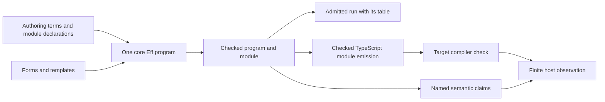

# Module authoring and compiler-stage inventory

The smallest next improvements reuse declared operation columns and existing checked packages.
No finding here requires another program representation.
This inventory records observations and proposals, not owner rulings or compatibility grades.

Base: `7334f1197cf5b535541ce1dfc7789a5082c07115`.
The accompanying implementation is the Pull protocol slice on `codex/pull-protocol`.
Its receipt is `docs/research/2026-10-09-pull-protocol-receipt.md`.
The existing module survey reads latest (Effect 4.0.1), under decisions rows 331 and 335.
`tools/ModuleSurvey/README.md` states its commands and limits.
A dependency edge identifies implementation candidates, not shared meaning or a proof obligation.

## Alignment with the active visual work

The primary checkout advances independently to `beee8ccc` during this slice.
Its owner ruling is `git:beee8ccc:docs/core/decisions.md`, row 336.
Agents edit graphs through session operations; TypeScript remains an output and a view.
Stored pieces use content addresses at every depth.
The module work continues to construct ordinary core programs that those operations can inspect and reuse.
No proposal here makes arbitrary TypeScript text the authoring authority.
The visual work owns rendering and interaction; this inventory leaves those files unchanged.

## Existing compilation stages



The final arrow does not identify a Lean theorem with a host observation.
A comparison needs its own observation, assumptions and retained evidence.

| Stage | Existing data and owner | Evidence and limit | Useful next change |
| --- | --- | --- | --- |
| Authoring | `TermSrc`, `Src`, `DefSrc`; `src/Effect4/Program/Authoring.lean` | Source functions elaborate to stored data; they are not stored closures | Keep author helpers here |
| Declared operations | `Def.of`, `eff_module`; `src/Effect4/Program/Authoring/Defs.lean` and `Module.lean` | Each operation declares request, answer, error and requirement columns once | Derive invocation and adapter metadata from those declarations |
| Form expansion | `Forms.Form`, `Template.expand`; `src/Effect4/Codegen/Forms.lean` | Foreign spellings expand into the existing core | Add a Forms row only when admitting that spelling is required |
| Stored program | `Eff`; `src/Effect4/Program/Eff.lean` | Binders and calls remain first-order data | Reuse bind, selection and cause matching for Pull and Channel |
| Type checking | `TypedProgram`; `src/Effect4/Program/CheckedTyping.lean` | Its certificate names one program and signature | Keep expected columns available at source composition boundaries |
| Execution admission | `Api.Built`; `src/Effect4/Api/Built.lean` | The program retains its table, admission certificate and row names | Reuse the package for runtime consumers |
| Target production | `ModuleEmission`; `src/Effect4/Codegen/Checked.lean` | Exact generated declarations retain formation and typing; imports remain separate | Expose projections from this package instead of introducing another checked carrier |
| Source reading | `ModuleReading`; `src/Effect4/Codegen/Admit.lean` | Reading and source admission remain separate from production | Retain located refusals and source binding evidence |
| Target checking and execution | Existing tsgo 7 and host harnesses; `docs/GENERATED.md` | Printing, target acceptance and finite execution are different observations | Record each stage's command and result |
| Evidence reporting | `Reach`, `PartReach`; `Test/Dogfood/Stage.lean` | Existing reports already distinguish admission, output, printing and reading | Extend projections and receipts when a consumer needs them |

## Observed authoring gaps

| Observation | Kind and evidence | Smallest useful response |
| --- | --- | --- |
| A lone Chunk has no End type member | Helper gap; `Decision.arms` and `Ty.payloadTy` reject the End selection | For inline sources, use the existing `ascribe` at `Program.Stream.pulledTy` |
| An always-failing inline source has no successful protocol column | Checker-context limit; the Pull battery retains the rejection | Invoke an operation with a declared answer column; investigate expected-type propagation only for a concrete inline consumer |
| Declared operations avoid both workarounds | Existing capability; `ProtocolDefinitions` in `Test/Program/Pull.lean` | Prefer one `eff_module` declaration list over repeated annotations |
| Source element metadata can disagree with declared operations | Duplicated metadata; `metadataMismatch` in `Test/Program/StreamArray.lean` runs through a consumer that ignores the conflicting field | Generate a definition-backed Source adapter and check its column relationships once |
| A raw tag selector accepts another declared union | Protocol premise; `other` in `Test/Program/Pull.lean` types and runs outside the Pull protocol | Offer a protocol-checked entry only when raw callers need admission; generic typing is not protocol admission |
| Empty batches inhabit the list type | Data-language limit; `pulled?` rejects the empty batch that generic typing admits | Keep the producer's nonempty premise explicit; do not introduce a refinement type without its consumers and lowering plan |
| Generic handler proofs need errors and requirements | Proof-helper gap; `Answers` covers empty columns, while `Has` covers full effect types | Add consumed `Has` rules for cause and tag matching before generic Channel typing proofs |
| Semantic proofs expose minted scopes | Proof-helper gap; `matchEffect_protocol` composes `Reads` and `reads_minted_last` | Reuse `TypedScope`, `Kept` and capture laws; package repeated binder reasoning only after another consumer appears |
| Stored declarations have closed types | Language limit; `DefDecl.formed` owns admission | Continue author-time specialization; record polymorphic stored-definition requirements separately |
| Printed syntax is not a target compatibility grade | Evidence boundary; `ModuleEmission` certifies production | Keep source reading, tsgo acceptance, runtime comparison and simulation separate |

A protocol-typed literal helper remains a candidate for inline authoring.
The declared-operation example already removes those annotations from module bodies.
Do not add another public protocol record solely to carry the same two type columns.

## Concrete authoring example

`ProtocolDefinitions` in `Test/Program/Pull.lean` compiles this shape through the shared module command:

```lean
eff_module ProtocolDefinitions where
  emit (items : .list .nat) : protocolTy := succeed (Pull.chunkValue items);
  finish (leftover : .nat) : protocolTy := succeed (Pull.endValue leftover);
  reject (message : .string) : protocolTy error .string := fail message
```

The caller supplies the success, completion and failure handlers to `Pull.matchEffect`.
The declarations own the answer column; the helpers own the tag layout and branch selection.
A handler's failure escapes without entering another handler.
The battery also consumes stored array operations through the same interface.

## Useful next module slices

| Slice | Existing building blocks | Required behavior before a broader claim |
| --- | --- | --- |
| Channel transformations | Pull handlers, declared calls and existing Eff composition | Specify batch transformation, leftovers, failures, resource lifetime and captured caller values |
| SynchronizedRef effectful modification | Ref, Semaphore and the existing protected-acquisition helper | Connect successful client completion to the write; account for interruption, cleanup and failed clients |
| PartitionedSemaphore waiting | Existing scalar bookkeeping, identity tables and waiter helpers | Model keyed waiter identity, partial reservation, ordered selection, cancellation and protected execution |
| PubSub waiting and lifetime | Existing capacity-one, replay-zero steps and shared wait machinery | State subscription identity, delivery, backpressure, cancellation and scoped lifetime |
| Stream and Sink combinations | Pull, Channel and the existing Stream source/consumer interface | Connect repeated pulls, leftovers and finalization to an independent whole-run observation |

Queue, Semaphore, Pool, Latch and Ref already supply substantial shared operation machinery.
Their existing bounded claims do not establish every wrapper, schedule or host behavior.
The current PartitionedSemaphore and PubSub profiles remain narrower than their full vendor modules.
Pull selection adds no new machine primitive or new stored data type.
