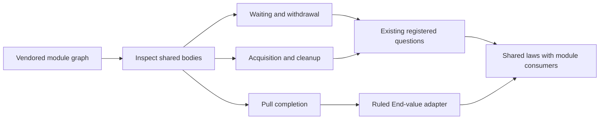
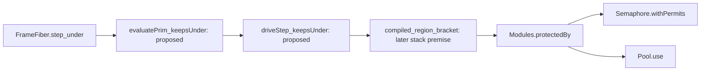

# Module catalogue integration receipt

The public TypeScript module packet still refuses the independent two-source product.
Do not describe these bounded additions as a finished module release.
The next connection must retain the emission certificate and existing reconstruction premises.

## Commits and ownership

Base: `08431c4e81c5f48be2ae8ba810e4fecad8c58139`.
Branch: `codex/partitioned-bookkeeping`.
The shared capture implementation lands at `0c0dcc20`.
This integration adds root imports, semantics registry placement, generated evidence, architecture entries, and the public caller packet.
The checked product expression slice lands at `d5ee9c21`; its replay version checks land at `d1533b0c`.
Its receipt is `docs/research/2026-10-08-checked-product-print-receipt.md`.

The primary checkout remains owned by the active implementation session.
The last inspected primary commit is `de9ec72555823ea825da1b4b6af4c42128470927`.
Its dirty JSON session, shape-reading, root, and semantics registry files remain untouched.
The bounded Claude session inspection records shape-reading and JSON session work.
It reports a running primary build; this integration does not reproduce or certify that build.
No message steers that session.
No merge, push, full battery, or sweep runs.

## Implemented operations and shared structure

| Addition | Author-facing behavior | Reused structure | Boundary |
| --- | --- | --- | --- |
| Named input values | Supply values by declared names, with order and types checked | Existing input declaration and `Inputs` carrier | Contextual identity interpretation remains explicit |
| Stream array source | Open a source, return its batch once, then return End | Ref callback interpretation, typing, and existing module declarations | Whole-run, finalization, and outside-runtime agreement remain open |
| SynchronizedRef | Construct, read, and modify through a pure callback | Ref model, Semaphore protection, shared callback and capture laws | Effectful callbacks and protected-run agreement remain open |
| PubSub | Six capacity-one, replay-zero bookkeeping transitions | Derived model images, named inputs, list folds, and shared laws | Logical subscription names and natural messages; no runtime wrapper |

`Eff` and `Step` retain their constructor signatures.
The new operations compose existing program data.
Independent models remain separate from stored implementation syntax.
The library root imports no Laws module.

`Step.relocate` and `Step.freeze` now live in `src/Effect4/Step/Callback.lean`.
Their typing laws live in `src/Effect4/Laws/Step/Callback.lean`.
Ref callbacks and SynchronizedRef wrappers share those definitions.
The capture move leaves all twelve emitted callers and their manifest byte-identical.
Its receipt is `docs/research/2026-10-09-shared-capture-receipt.md`.

The stored Stream declaration uses the existing surface in `src/Effect4/Library/Stream/ArrayDefs.lean`:

```lean
eff_module ArrayDefinitions (A : Ty) where
  openArray (items : .list A) : (arrayHandleTy A) := arrayOpen A items;
  pull (receiver : arrayHandleTy A) : (Program.Stream.pulledTy A .unit) := arrayPull A receiver;
  close (receiver : arrayHandleTy A) : .unit := arrayClose receiver
```

The declaration supplies operation names and signatures once.
The module machinery produces stored definitions and invocation builders.
This example passes the module's focused Lean controls.
It does not remove the frozen Ref declaration-head reading exclusion.

## Proof placement

| Registry claim or consumer | Declaration and path | Role | Scope |
| --- | --- | --- | --- |
| `stream-array-step-agreement` | `Stream.arrayStep_agrees`, `src/Effect4/Laws/Library/Stream/Array.lean` | simulation | Reply and next allocated backing cell, under receiver reading and aligned scope premises |
| `pubsub-single-steps-agree` | `PubSub.Model.single_steps_agree`, `src/Effect4/Laws/Library/PubSub/Steps.lean` | simulation | Six source readings, with fresh subscription and fold scope premises |
| Proposed SynchronizedRef expansion | `make_answers`, `get_answers`, `modify_answers`, `src/Effect4/Laws/Library/SynchronizedRef/Ops.lean` | typing helpers | Conditional operation typing; composed execution remains open |
| Existing callback and wrapper typing consumers | `relocate_types`, `reached_slots`, `freeze_kept`, `src/Effect4/Laws/Step/Callback.lean` | compatibility helpers | Existing captured-source and reached-scope premises |

The first two claims belong to `translation-simulation` and requirement R10.
The typing helpers serve `store-typing` and R4.
The semantics registry separately records the unstated whole-module questions for Stream, SynchronizedRef, and PubSub.
No open planned goal changes status merely because a finite comparison succeeds.
`generated/semantics.md` derives its statements and statuses from the registry and compiled declarations.

## Checked evidence and remaining refusals

The integration build passes with 1,185 jobs.
The final scoped audit passes for 3,112 compiled declarations across 25 selected modules.
Its allowed axioms are `propext` and `Quot.sound`.
The focused commands and exact outputs are retained in `docs/research/2026-10-09-module-catalogue-integration-evidence/`.
`docs/research/2026-10-09-module-catalogue-audit.lean` checks compiled bodies and allowed axioms.
It also checks root reachability, independent model imports, and the core/law import boundary.
Its log retains the measured declarations, axioms, proof consumers, and dependency measurements.
Those measurements describe the selected imported environment, rather than runtime coverage or proof quality.

`harness/module-catalogue/Produce.lean` constructs twelve callers through the public author API.
Each caller passes program admission and its bounded machine observation at fuel 2000.
Nine callers require exact reading of their emitted module.
Three definition-backed Stream callers require the existing Ref-header refusal.
The manifest records each result explicitly.
Unexpected acceptance or a changed refusal fails the packet.

The public packet's strict compiler failure remains visible.
Its runtime observer cannot run after that failure.
A repaired expression experiment and public module emission remain separate results.
The frozen Ref-header candidate remains research in `docs/research/2026-10-08-stream-defs-target-receipt.md`.
The connected module plan is `docs/research/2026-10-09-checked-module-print-plan.md`.

The shared target packet now retains early helper-loading failures and their exact available inputs.
Five controls run against Bun and pinned tsgo `7.0.0-dev.20260629.1`.
The repair receipt is `docs/research/2026-10-09-ts-packet-retention-receipt.md`.
The successful path still refuses a missing required input.

PubSub's source comparison explores 2,090 states and 12,888 transitions in the retained finite challenge.
It compares extracted vendored code with an independent BigInt transcription, rather than executing the Lean model.
An oversized live counter exposes the need for exact numeric host admission.
That limit remains separate from the natural-number model theorem.
Its evidence lives in `docs/research/2026-10-09-pubsub-single-source-review/`.

The Stream metadata challenge remains separate from that compiler failure.
A false element descriptor produces inconsistent program admission between entry points, but the accepted consumer still uses the inferred payload type.
No wrong-type execution follows from that probe.
The existing receipt places retained module descriptors as the next design connection.

## Survey and next shared obligations

`tools/ModuleSurvey/survey.mjs` uses the existing Oxc parser entry.
It measures 496 vendored Effect 4.0.1 modules and 3,796 dependency declarations.
Its ten tests and 25 assertions pass.
Repeated report generation produces byte-identical output.
Unresolved calls remain visible; dependency frequency establishes no semantic primitive.
The report and limits are recorded in `docs/research/2026-10-09-module-survey-receipt.md`.



The next TypeScript slice connects checked expressions to the existing module certificate, assembly, and named erasure.
It stores one declaration list and derives the ordinary projection.
Hoisted contexts and definition request environments remain explicit obligations.
The current public packet supplies its independent two-source control.

The next shared execution work connects waiting and withdrawal to notification debt, then acquisition to installed cleanup.
The existing semantics registry questions already place those obligations under R10 through R12.
Pull completion uses the ruled End-value adapter and retains ordinary failures.
None of these findings requires a new Eff constructor.
A new primitive needs an observation that existing composition cannot express under the ruled atomicity and ownership constraints.

## Smallest shared cleanup connection

The next carrying statement serves `saved-mask-region-bracket` in `tools/ProofGraph/Registry.lean`.
Concept: `scope-lifetime-finalization`; role: preservation; requirement R11.
Its consumer is `Program.compiled_region_bracket` in `src/Effect4/Laws/Program/MaskBracket.lean`.
That theorem assumes the later stack shape `g.frame.stack = above ++ f.frame.stack`.
The proposed connection carries the suffix through execution until the command ends the region.

`FrameFiber.step_under` in `src/Effect4/Laws/Machine/MaskBracket.lean` supplies the existing frame-step fact.
The retained research statements are `evaluatePrim_keepsUnder` and `driveStep_keepsUnder` in `docs/research/2026-10-06-seat-BRACKET-carry.lean.txt`.
They remain unproved research statements, rather than new goals or fresh proof evidence from this slice.
The command statement retains evaluator preservation, allocated identity bounds, live-copy stack shape, and its exited-fiber premise for `exitDone`.
Parking, resumption, and delivered interruption require evaluator coverage beyond the frame-step fact.



`Modules.protectedBy` lives in `src/Effect4/Library/Waiting.lean`.
Its consumers include `Semaphore.withPermits` and `Pool.use` in their respective `Library` operation modules.
Their typing and atomic-attempt laws do not establish cleanup installation or completed cleanup.
A running step retains the suffix; a terminating step can consume it through the region exit.
Failed conditional acquisition commits no resource acquisition.
Pending interruption and a fuel frontier establish no completed cleanup.

This connection removes one shared premise without adding stored program syntax.
Release multiplicity, notification delivery, and enough work to finish cleanup remain separate obligations.
The plan must freeze any new theorem statement before proof work starts.

## Dependency boundary for the organization seat

`AtomRow.prelude` stores TypeScript helper text beside semantic atom metadata in `src/Effect4/Machine/Term.lean`.
`Effect4Gen.PreludeAtoms.entry` reads that text in `tools/Effect4Gen/PreludeAtoms.lean`.
Changing the helper text therefore changes a foundational module input.
The integration build rebuilds machine and program laws beyond the TypeScript modules.
This is a dependency observation, not a measured performance regression.

A later organization slice can separate target helper bodies from the semantic atom metadata.
It must retain the one `NativeAtom` alphabet, generated inventory checks, and exact name and arity correspondence.
It must not copy the operation inventory or add stored program syntax.
The current slice keeps the existing ownership to avoid combining that move with the product repair.

## Final commands and results

The integration build uses one Lake process with three Lean threads:

```sh
LEAN_NUM_THREADS=3 lake build Effect4.Laws Test.Codegen.PrintTyped Test.Program.StreamArray Test.Program.SynchronizedRef Test.Program.PubSubSingle Test.Program.StepInputs Tools.LoadPaths Tools.ArchitectureRoles Drivers.Semantics Effect4Gen.CatalogueExe
```

The build succeeds with 1,185 jobs.
The following commands then run sequentially with `LEAN_NUM_THREADS=3`:

```sh
lake env lean -DwarningAsError=true docs/research/2026-10-09-module-catalogue-audit.lean
lake env lean --run tools/Drivers/Semantics.lean /tmp/effect4-module-integration-final/semantics
python3 scripts/generate.py --only derived --output-dir /tmp/effect4-module-integration-final/derived
python3 scripts/generate.py --only derived --output-dir /tmp/effect4-module-integration-final/derived-recheck
python3 harness/module-catalogue/run.py --install /Users/pooks/Dev/lean4-effect4/ts/release/node_modules --out /tmp/effect4-module-integration-final/public-catalogue --skip-build
```

The audit and semantics producer succeed.
The first derived-family comparison identifies one stale carrier-origin comment in `src/Effect4/Api/RunnerDerived.lean`.
The exact generator output changes that comment from `Effect4.Run` to `Effect4.Run.Basic`.
All bytes outside that comment match the original file.
The integration installs that generated output, then the derived-family comparison succeeds.
No other derived output changes.
The retained diff records this additional generated path explicitly.
The generated comment changes no declaration and requires no dependent proof build.

The public caller packet still exits with its sole `TS2375` at `streamIndependent.ts`.
Its retained compiler inputs contain twenty files.
It records program admission for twelve callers, nine exact readings, and three expected frozen Ref-header refusals.
It writes no success receipt and runs no runtime observer after the compiler failure.

The independent target replays also succeed:

```sh
python3 docs/research/2026-10-08-checked-product-print-evidence/version-controls.py
python3 docs/research/2026-10-08-checked-product-print-evidence/reproduce.py --install /Users/pooks/Dev/lean4-effect4/ts/release --out /tmp/effect4-module-integration-product-release
python3 docs/research/2026-10-08-checked-product-print-evidence/reproduce.py --install /Users/pooks/Dev/lean4-effect4/ts/eff --out /tmp/effect4-module-integration-product-pin --helpers-only
EFFECT4_TS_INSTALL=/Users/pooks/Dev/lean4-effect4/ts/release/node_modules python3 harness/test_ts_packet.py
```

The parent replays use Bun `1.4.2` and tsgo `7.0.0-dev.20260629.1`.
The earlier scout evidence uses Bun `1.3.14` with the same compiler.
Both supported Effect installations accept the helper controls.
The manually annotated twelve-case experiment matches its expected observations.
The ordinary public packet's failure remains separate.
Four wrong-version controls and five packet-retention tests succeed.
The integrated product slice matches all 59 relative source and evidence hashes in its retained manifest.

The final check leaves `Eff`, `Step`, the decisions register, and the Lake configuration unchanged from the expansion base.
The branch remains separate from the primary checkout.

## Exact evidence whitespace

The raw whitespace check reports terminal blank lines in these exact source or evidence files:

- `harness/truth/control.ts`
- `docs/research/2026-10-08-checked-product-print-evidence/catalogue-baseline/control.ts`
- `docs/research/2026-10-09-pubsub-single-source-review/single-extract.ts`
- `docs/research/2026-10-09-module-catalogue-integration-evidence/public-catalogue/compiled-inputs/control.ts`
- `docs/research/2026-10-09-module-catalogue-integration-evidence/public-catalogue/failure.txt`

The control helper keeps the extracted source bytes.
Both retained control copies match that helper exactly.
The PubSub extraction keeps the vendored interval exactly.
The failure file keeps the compiler diagnostic bytes exactly.
Every other difference passes the whitespace check.
This exception changes no source or diagnostic normalization policy.
