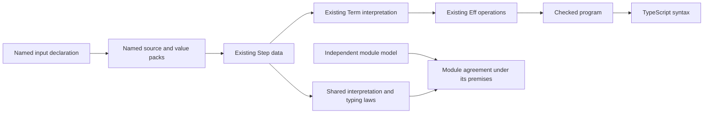

# Module survey and shared semantics

Use the source graph to choose bodies to inspect, then place each semantic question before adding representation.
The graph itself states no behavior theorem.

Base: `08431c4e81c5f48be2ae8ba810e4fecad8c58139`.
The implementation uses `tools/ModuleSurvey/survey.mjs` and the existing `ts/eff/ingest/oxc.ts` entry.
The retained summary records source hashes, parser and survey hashes, dependency edges, and selected helper sites.
The full report remains reproducible rather than committed.

## Measured checks

Bun 1.4.2 runs the survey with Oxc 0.147.0.
The retained summary measures 496 modules, 3,796 dependency declarations, 31,150 direct call candidates and 19,127 unresolved call candidates.
These counts describe TypeScript syntax, not runtime coverage.

The following commands pass:

```sh
bun test tools/ModuleSurvey/survey.test.mjs
bun tools/ModuleSurvey/survey.mjs vendor/effect-4.0.1/src /tmp/effect4-module-survey-recheck.json /tmp/effect4-module-survey-summary-recheck.json
cmp docs/research/2026-10-08-module-survey.json /tmp/effect4-module-survey-recheck.json
cmp docs/research/2026-10-08-module-survey-summary.json /tmp/effect4-module-survey-summary-recheck.json
```

The test command reports ten tests and 25 assertions.
The comparisons report byte identity for both outputs.
Independent review finds lexical-shadowing and computed-key omissions in the first version.
The final version repairs them and retains their positive and negative controls.
It also records local export aliases separately from directly exported declarations.
The scout receipt retains the original findings and exact source probes.

## Existing representation and shared consumers



`input_values%` shares declaration order and field types with `step_inputs%` and `input_sources%`.
Its consumer receives the existing `Inputs` carrier.
Contextual identity interpretation remains explicit.
PartitionedSemaphore and PubSub use this surface without positional proof tuples.

Stream's array extraction consumes `Ref.modify_callback_agrees` and the shared callback typing law.
SynchronizedRef composes Ref and Semaphore and reuses `Ref.Model`.
Its capture freezing resolves caller inputs before wrapper bindings appear.
PubSub uses the existing list operations and their shared fold laws.
Its independent model retains broadcast ownership, rather than substituting Queue consumption.
None of these module slices adds an Eff or Step constructor.

## Next semantic connections

| Shared behavior | Existing question and consumer | Evidence that remains necessary |
| --- | --- | --- |
| Waiting, delivery and withdrawal | `waiting-request-obligation-preserved`; `waitRetryAt`, `waitAnswer`, `postAll` in `src/Effect4/Library/Waiting.lean` | Carry notification debt until accepted continuation or valid withdrawal; retain committed state after interruption |
| Acquisition and installed cleanup | `semaphore-protected-permit`, `pool-lease-return`; `protectedBy` in the same file | Connect one committed acquisition to its installed cleanup, at most one release, and retained unfinished work |
| Completion and ordinary failure | Proposed `pull-completion-adapter`; latest (Effect 4.0.1) Pull's `filterDone` and `doneExitFromCause` | Preserve the first leftover and remaining failures through the ruled End-value adapter |

The first two questions already belong to R10 through R12 in `tools/ProofGraph/Registry.lean`.
Their wrapper-run statements remain open.
`protectedBy_has` proves typing, and `compiled_region_bracket` retains its explicit later-stack-shape premise.
Neither fact alone proves protected acquisition or cleanup delivery.

The Pull proposal remains a research question without a registered theorem pointer.
Decisions row 331 keeps clean End as a value.
The finite source controls distinguish Done alone, Done with interruption, Done with ordinary failure, and ordinary failure alone.
No new Cause constructor follows from those controls.

## Minimality criterion

Add a derived operation when the existing Eff and Term constructors express the required observation.
Use an existing fold and its algebra law before writing a second traversal or agreement proof.
Keep independent specifications outside the generated implementation.
A smaller representation must still retain interruption, committed state, cleanup debt, and unfinished work where the observation requires them.
A new primitive needs a behavior that composition cannot express under the ruled atomicity and ownership constraints.
The ruled multi-cell transaction attempt remains a separate example; this survey does not change its representation decision.

## Limits

The survey does not resolve callback targets, dynamic dispatch, local aliases, nested helper targets, execution order, or behavior.
Helper frequency does not rank semantic primitives.
The full module form and its generated implementation map remain later consumers.
The findings propose shared laws and tooling functions, without broadening the current module claims.
