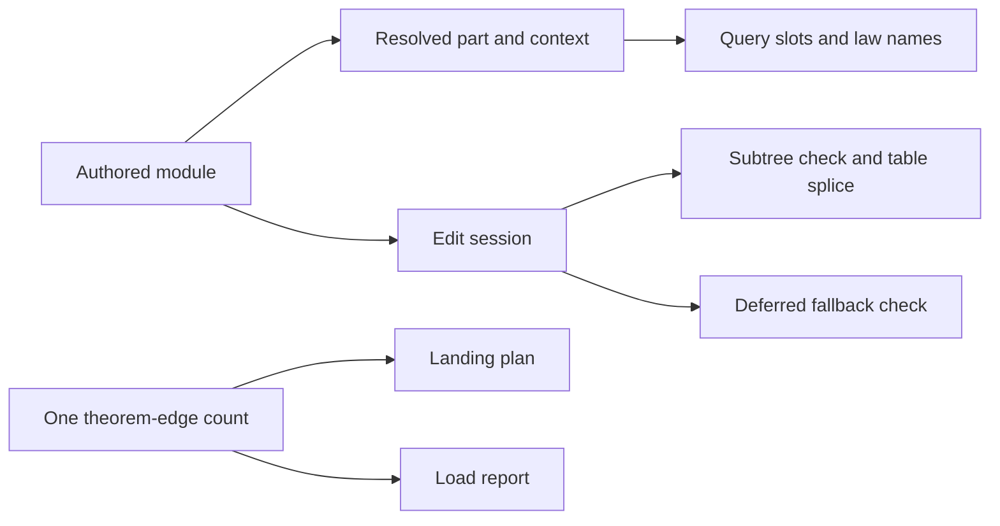

# Authoring overwatch: verified repairs

Close the JSON conversion, edit-session, query-law, and proof-planning findings listed below.
Focused replays confirm their repairs through the public functions.
The core program representation and the existing theorem statements remain unchanged.

## Checkpoint and ownership

Previous review: `2cf0ee49859bd9b114c91db1ef95545bbaa1bb8a`.
Reviewed primary checkpoint: `205f4feaaac2041efe4becbe9992ec8f14b077c6`.
The edit-session repair is `90940a5408c4fa789223b4301ef0094ed75725a3`.
The JSON runtime repair is `8811a61bab98a6d07e897c3361a703f5729c9c82`.
The test-text repair is `2bc084d9`.
The query and planning repairs are the reviewed primary checkpoint.

The active Claude session remains `9ebf38b2-8b2f-44e5-8fd9-2dc0cb5a1f50` in the primary repository.
Its bounded recent tail records the repairs and their checks.
Internal thinking fields are excluded.
No message steers that session.

The review changes only this receipt and its evidence in the existing isolated review worktree.
Production files, owner rulings, and the implementation session remain unchanged by this review.
No Lake build, sweep, merge, or push runs from the review.
Two independent GPT-6.1 Sol agents review the JSON and planning repairs.

## Resolutions

| Finding | Repair and source | Reproduced evidence | Status |
| --- | --- | --- | --- |
| JSON-01 | `Tools.JsonBridge.ofLeanJson`, `tools/Tools/JsonBridge.lean`, checks that conversion recovers the supplied natural | Nine request controls, independently repeated; rounded opens and fills refuse without changing stored bytes | Resolved at `8811a61b` |
| EDIT-OW-01 | `EditSession.feed`, `src/Effect4/Program/Edit.lean`, defers the fallback annotation | Compiled C shows successful fill and omission splices returning before their fallback annotations | Resolved at `90940a54` |
| EDIT-OW-02 | `Effect4.Author` and `Effect4.Laws.Author` expose the existing edit modules | The Queue definition-block fixture compiles using only public entries; main-program and definition-body edits splice | Resolved at `90940a54` |
| S1-QUERY-01 | `Tools.Query.answer`, `tools/Tools/Query.lean`, distinguishes module roots from structural parts | Existing query controls compile, including root law names, part slots, and refusal controls | Resolved at `205f4fea` |
| S1-PLAN-01 | `Tools.LoadPaths` uses `ProofGraph.standing` for tops, helpers, and outside joints | The unfinished helper and its top remain labelled modulo their planned goal | Resolved at `205f4fea` |
| S1-PLAN-02 | `countEdges`, `tools/Tools/LoadPaths.lean`, supplies both reports | Independent plan and report return 50% from two tree edges and two local edges | Resolved at `205f4fea` |
| S1-PLAN-03 | The planning command requires an authored theorem | The existing data control and independent `Nat` and `Nat.zero` controls refuse | Resolved at `205f4fea` |

The JSON controls retain `7`, `9007199254740992`, and `9007199254740994` exactly.
They refuse `9007199254740993`, `3.5`, and `-1` without replacing the preceding program.
The fill controls retain `11` and the exact large value.
A rounded fill refuses and leaves the stored literal `11` byte-identical.
The parent replay produces byte-identical answers to the independent scout.

`Test/Dogfood/EditSession.lean` supplies the Queue fixture.
Its three finite guards and its existing-law reader compile from a temporary copy.
Its imports are `Effect4.Author`, `Effect4.Library`, and `Effect4.Laws.Author`.
The fixture constructs the Queue definitions through the same authoring surface an application uses.

The C inspection concerns removal of the unnecessary whole-sketch annotation on successful splice branches.
It establishes no constant-time edit or measured end-to-end speedup.
Other editing, lookup, and rendering costs remain outside that inspection.

## Shared structure and proof boundaries

The query now resolves a module part through `Eff.partAt` before reading its slots.
That supplies the part's typing signature and environment from the same owner that the module checker uses.
The planning reports share one counting function rather than maintaining different definitions of reuse.
These repairs reuse existing data and laws without adding a program constructor.



The compiled import audit finds no Laws import reachable from `Effect4` or `Effect4.Author`.
The selected existing laws retain their permitted dependencies:

| Declaration | Axioms reached |
| --- | --- |
| `EditSession.reached_view` | `propext`, `Quot.sound` |
| `EditSession.feed_undo` | `propext`, `Quot.sound` |
| `EditSession.feed_repaint` | `propext`, `Quot.sound` |
| `Canonical.ofJson_exact` | None |

The edit laws live in `src/Effect4/Laws/Program/Edit.lean`.
The canonical reader law lives in `src/Effect4/Laws/Store/ShapeRead.lean`.
This is a scoped compiled audit, not the whole axiom gate.

`Tools.JsonBridge.ofLeanJson_num` covers one accepted numeric conversion.
It depends on `Classical.choice` through Lean's tool-side JSON definitions.
The `Tools` namespace stands outside the ordinary core and test axiom gate.
This dependency is an explicit tool boundary, not a core gate violation.
The law neither states a whole recursive JSON bridge theorem nor changes the core reader's statement.
If a core consumer needs the numeric proposition, place a pure numeric helper under the existing `exact-codecs` question before moving it.
The current runtime repair needs no further representation change.

## Checks and limits

All review compilations use Lean `4.33.1` with `LEAN_NUM_THREADS=3` and existing compiled imports.
Commands run from temporary directories and produce no primary build artifact.
The evidence records source and compiled-import hashes.
The parent replays JSON requests, the public-entry Queue fixture, and the existing query controls.
The independent planning probe compiles the exact report source and exercises both public reporting commands.

The initial query replay lacks its relative transcript fixtures and fails during setup.
Retaining the two original fixture files repairs that setup; the unchanged control source then passes.
That setup failure supplies no evidence of a production defect.

The sibling directory `2026-10-09-overwatch-resolutions/` retains sources, requests, responses, commands, hashes, and exact logs.
The JSON replay accepts a fresh output directory:

```sh
python3 docs/research/2026-10-09-overwatch-resolutions/json/replay.py --repo /Users/pooks/Dev/lean4-effect4 --out /tmp/effect4-json-resolution-replay
```

The public module-printer connection and whole-module execution obligations remain as the earlier catalogue receipt records.
This review neither repeats those unchanged findings nor closes them through finite authoring checks.
The earlier module checkpoint remains `3b3d135c`, merged by `d0577867`.

## Exact evidence whitespace

`edit/Edit.c` retains the compiler's trailing spaces.
`json/replay.py` retains the independent scout's checked script bytes, including one trailing space.
The scoped whitespace check allows trailing spaces only in these two retained files.
Every other retained file uses the ordinary whitespace check.
