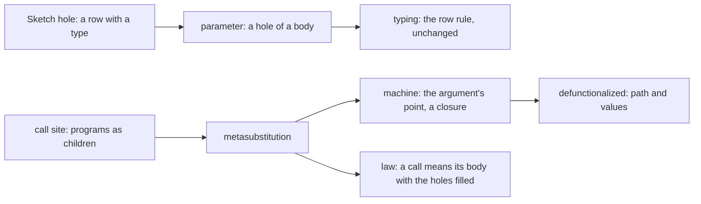

# 2026-10-09 Note: definitions whose parameter is a program

Status: ruled 2026-10-09 (decisions row 340): §8's three questions, each as recommended. Base:
`refactor/phase1-phase3` at `ec08fe86`. The owner asked for it on 2026-10-09: "we need that
program composition … figure out the proper abstractions and math to allow that".

## 1. The one thing to know first

A program parameter is a hole in a definition's body, and each call fills it. The tree already
has both halves:

- A hole is a row with a declared type, which the checker reads as it reads any row
  (`Program/Sketch.lean`, decisions row 288).
- The machine's `Point` is a closure: a path into the root program and an environment
  (`src/Effect4/Program/Compile.lean`).

So the change is one operation for the hole, one call form that carries the programs, and one
field on the point.

## 2. What Effect asks for

- `Pool.use(self, f: (item: A) => Effect<B, E2, R2>): Effect<B, E | E2, R2>`
  (`vendor/effect-4.0.0-rc.112/src/Pool.ts`, `use`).
- `withPermits(permits): <A, E, R>(self: Effect<A, E, R>) => Effect<A, E, R>`, a method of the
  service (`vendor/effect-4.0.0-rc.112/src/Semaphore.ts`, `interface Semaphore`).

Both take a program, and both are generic in its answer, its error and its requirement. Today
`Pool.use` (`src/Effect4/Library/Pool/Ops.lean`) is a Lean function from a reader to a program.
It expands at each call, so the program holds no `use` to print as a method.

## 3. The mathematics

1. **Algebraic operations** (Plotkin and Power). An operation `P → T A` commutes with
   sequencing. Shape (b)'s methods are such operations, and the layer's state runs them (row
   338).
2. **Higher-order operations** (Wu, Schrijvers and Hinze 2014; Piróg, Schrijvers, Wu and
   Jaskelioff 2018; Bach Poulsen and van der Rest 2023). `use pool f` does not commute with
   sequencing: the return runs before the continuation. Its node holds a program.
   - Expanding the node at each call is the hefty paper's elaboration of an operation, not Lean
     elaboration nor authoring elaboration. Its §1.2 names the cost: the operation leaves every
     interface.
   - The repository note (`docs/research/2026-09-08-effectful-repository-notes.md`, §6) reached
     the same verdict: store the term, not the expansion.
3. **Second-order syntax** (object-language syntax; Fiore and Hur 2010; Hamana). A term may hold a metavariable with an
   arity, `M[x]`, and a metasubstitution instantiates it.
   - A definition with a program parameter is a term with a metavariable of arity 1.
   - A call is a metasubstitution.
   - The substitution lemma makes metasubstitution compose associatively, with `M[x]` as its
     unit. This is the law of program composition.
4. **Second-class values** (Osvald, Essertel, Wu, Alayón and Rompf 2016; Algol 60's procedure
   parameters). A parameter that is never stored or returned needs no function type.
   - So `Ty` gains no arrow, and no codec admits a function.
   - The separation gates stand: no alphabet is instantiated at a function type.
5. **Defunctionalization** (Reynolds 1972; Danvy and Nielsen 2001). A closure is a code label
   and its free values. `Point` is exactly that: its path is the label and its environment holds
   the values. The invocation hop already moves a point to a definition's body (`suspendBodyAt`).



The papers are not filed. Filing them needs the owner's permission for each download.

## 4. The representation

- **`DefDecl.params : List ParamDecl`**. Each parameter has a name, a request, an answer and an
  error, and its row is a program row (`ParamDecl.row`), as `DefDecl.row` is.
- **`NativeOp.param (index : Nat)`**. In a body, `perform (.param i) x` runs parameter `i` at
  `x`. The body's signature is the block's signature extended by its own parameters
  (`Signature.withParams`), as `Signature.withDefs` extends it by the calls.
- **`Eff.invoke (index : Nat) (request : Term) (args : Effs Op)`**. It calls definition `k`
  with its request and one program for each parameter. It is appended, with a new wire tag.
  Argument `j` reads the caller's environment extended by one variable, parameter `j`'s request.
- **One form per call** (canonical form). `invoke k` stands exactly where definition `k` has
  parameters, and their count equals the arguments'. `perform (.call k)` stands exactly where it
  has none, so no stored program's bytes move.
- **Formation.** `perform (.param i)` stands only in a body whose definition has more than `i`
  parameters. The main program has no parameter.

### 4.1 Typing

`Θ` is the parameters in scope, and `Γ` the variables.

```text
(param)   Θ[i] = A ⇒ B ! E     Γ ⊢ x : A
          ──────────────────────────────────────
          Θ ; Γ ⊢ perform (param i) x : B ! E

(invoke)  defs[k] = A ⇒ B ! E with parameters P₁ … Pₙ     Γ ⊢ r : A
          Pⱼ = Aⱼ ⇒ Bⱼ ! Eⱼ     Θ ; Γ, Aⱼ ⊢ argⱼ : Bⱼ' ! Eⱼ'     Bⱼ' ≤ Bⱼ     Eⱼ' ≤ Eⱼ
          ──────────────────────────────────────────────────────────────────
          Θ ; Γ ⊢ invoke k r [arg₁ … argₙ] : B ! E

(body)    P₁ … Pₙ ; A ⊢ body_k : B' ! E'     B' ≤ B     E' ≤ E
```

- `(param)` is the row rule at the extended signature, so the checker gains no rule for it.
- An argument is typed at the caller's parameters, so a body may pass its own parameter on.
- An argument's requirements are the caller's, since it is a subterm of the call. A parameter's
  row requires nothing.

### 4.2 The machine

- **`Point.params`**: the points of the arguments in scope, empty by default.
- **At `invoke k r args`**: evaluate `r`, then move to body `k` at the environment of the request.
  The new point's parameters are the arguments' points, each with the caller's environment and
  parameters. This is the invocation hop of `suspendBodyAt` with one more field.
- **At `perform (.param i) x`**: evaluate `x`, then move to parameter `i`'s point, its
  environment extended by `x`'s value, one fuel down. A missing parameter is the wrong shape,
  which formation rules out.
- The invoking fiber runs both hops, as it runs a call. A body may fork a parameter's run: the
  point holds only values, so its lifetime needs no rule.

### 4.3 The print and the read

- A definition with parameters prints them after its request, as functions:
  `export const poolUse = (a0: …, f0: (a: A) => Effect.Effect<B, E, never>) => …`.
- `perform (.param i) x` prints as `fᵢ(x)`, and `invoke k r [arg]` as `poolUse(r, (aN) => arg)`.
- A service method passes its functions on: `use: (f0) => poolUse(a0, f0)`. The key's shape
  names each function's type.
- The reader reads each form back. `isMethodRequest` gains the parameters, passed unchanged.

## 5. Pool and the Semaphore as services

- **`Pool.serviceDefs`**: `use` is a definition with one parameter, its body today's `Pool.use`
  with the parameter at the hole. The acquisition is a plain definition of the block, which
  `make` calls. So the service's initial program takes no parameter.
- **The Semaphore**: `withPermits` is a definition with one parameter of unit request, its body
  today's protected form.

## 6. Slices and their obligations

| Slice | Content | Concept | Proposed claim | Unlocks |
| --- | --- | --- | --- | --- |
| HO-1 | `params`, `NativeOp.param`, `Eff.invoke`, formation, checker, codec, generated folds, case policy | `residual-program-typing` | `invoke-typed`: the module check refuses exactly the programs outside §4.1's judgment | every later slice |
| HO-2 | `Point.params`, the two hops, the reference machine, the meaning | `translation-simulation` | `invoke-unfolds`: a call means its body with the holes filled; on a definition that calls none, the expansion | the laws of today's `Pool.use` carry over |
| HO-3 | print and read of definitions, calls and methods with parameters | `exact-codecs` | the module round trip and `printServices_ok` over parameters | R2 services |
| HO-4 | generic definitions: type parameters, type arguments at each call (row 42's instantiation) | `subtyping-algebra` | `invoke-typed` at instantiated rows | a usable generic `use` |
| HO-5 | `Pool.serviceDefs`, `withPermits`, truth fixtures | `context-requirements` | the truth lane's finite check, host-only | Pool's service |

Each slice places its theorems by AGENTS.md's five points before it starts. The points are the
concept, the claim and its consumer, the reach, the limits and the unlock.

## 7. What this note does not establish

- No first-class function. A parameter is never a value: no `Ref` holds one, no answer returns
  one. `Cache`'s stored `lookup` needs a value that carries a point, a later step.
- No equal-observation theorem: `invoke-unfolds` is HO-2's goal, and on a recursive definition
  it holds only up to fuel.
- No generic definition before HO-4. Until then a parameter's types are closed, as the first
  stage's declarations are (`Program/Definitions.lean`).
- No timing and no size of the change: HO-1 touches every hand match on `Eff`, which the
  traversal census lists.

## 8. Questions for the owner (representation)

1. **Where a call's programs live.** (a) As children of the call node, `Eff.invoke`, printed
   inline as arrows. (b) Lifted to definitions of the block, with captured values passed as a
   tuple. Recommended: (a). A call's program is a region that the views show at the call, and
   Effect code writes it inline.
2. **Second-class or first-class.** (a) A parameter is never a value: no arrow in `Ty`. (b) A
   function type with closures as values. Recommended: (a) now; (b) waits for `Cache`, built on
   the same point.
3. **Generic definitions.** (a) HO-4, after HO-3, by row 42's instantiation. (b) Closed types
   only. Recommended: (a). Effect's `use` and `withPermits` are generic, so a closed method
   serves one client type.
