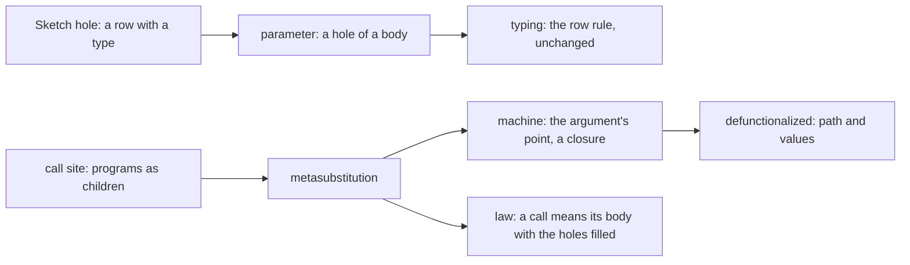
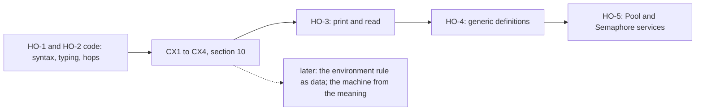

# 2026-10-09 Note: definitions whose parameter is a program

Status: ruled 2026-10-09 (decisions row 340): §8's three questions, each as recommended. Base:
`refactor/phase1-phase3` at `ec08fe86`. The owner asked for it on 2026-10-09: "we need that
program composition … figure out the proper abstractions and math to allow that".

## 1. The one thing to know first

A program parameter is a hole in a definition's body, and each call fills it. The tree already
has both halves:

- A hole is a row with a declared type, which the checker reads as it reads any row
  (`Program/Sketch.lean`, decisions row 288).
- The machine's `Point` is a closure: a path into the root program and an environment
  (`src/Effect4/Program/Compile.lean`).

So the change is one operation for the hole, one call form that carries the programs, and one
field on the point.

## 2. What Effect asks for

- `Pool.use(self, f: (item: A) => Effect<B, E2, R2>): Effect<B, E | E2, R2>`
  (`vendor/effect-4.0.0-rc.112/src/Pool.ts`, `use`).
- `withPermits(permits): <A, E, R>(self: Effect<A, E, R>) => Effect<A, E, R>`, a method of the
  service (`vendor/effect-4.0.0-rc.112/src/Semaphore.ts`, `interface Semaphore`).

Both take a program, and both are generic in its answer, its error and its requirement. Today
`Pool.use` (`src/Effect4/Library/Pool/Ops.lean`) is a Lean function from a reader to a program.
It expands at each call, so the program holds no `use` to print as a method.

## 3. The mathematics

1. **Algebraic operations** (Plotkin and Power). An operation `P → T A` commutes with
   sequencing. Shape (b)'s methods are such operations, and the layer's state runs them (row
   338).
2. **Higher-order operations** (Wu, Schrijvers and Hinze 2014; Piróg, Schrijvers, Wu and
   Jaskelioff 2018; Bach Poulsen and van der Rest 2023). `use pool f` does not commute with
   sequencing: the return runs before the continuation. Its node holds a program.
   - Expanding the node at each call is the hefty paper's elaboration of an operation, not Lean
     elaboration nor authoring elaboration. Its §1.2 names the cost: the operation leaves every
     interface.
   - The repository note (`docs/research/2026-09-08-effectful-repository-notes.md`, §6) reached
     the same verdict: store the term, not the expansion.
3. **Second-order syntax** (object-language syntax; Fiore and Hur 2010; Hamana). A term may hold a metavariable with an
   arity, `M[x]`, and a metasubstitution instantiates it.
   - A definition with a program parameter is a term with a metavariable of arity 1.
   - A call is a metasubstitution.
   - The substitution lemma makes metasubstitution compose associatively, with `M[x]` as its
     unit. This is the law of program composition.
4. **Second-class values** (Osvald, Essertel, Wu, Alayón and Rompf 2016; Algol 60's procedure
   parameters). A parameter that is never stored or returned needs no function type.
   - So `Ty` gains no arrow, and no codec admits a function.
   - The separation gates stand: no alphabet is instantiated at a function type.
5. **Defunctionalization** (Reynolds 1972; Danvy and Nielsen 2001). A closure is a code label
   and its free values. `Point` is exactly that: its path is the label and its environment holds
   the values. The invocation hop already moves a point to a definition's body (`suspendBodyAt`).



The papers are not filed. Filing them needs the owner's permission for each download.

## 4. The representation

- **`DefDecl.params : List ParamDecl`**. Each parameter has a name, a request, an answer and an
  error, and its row is a program row (`ParamDecl.row`), as `DefDecl.row` is.
- **`NativeOp.param (index : Nat)`**. In a body, `perform (.param i) x` runs parameter `i` at
  `x`. The body's signature is the block's signature extended by its own parameters
  (`Signature.withParams`), as `Signature.withDefs` extends it by the calls.
- **`Eff.invoke (index : Nat) (request : Term) (args : Effs Op)`**. It calls definition `k`
  with its request and one program for each parameter. It is appended, with a new wire tag.
  Argument `j` reads the caller's environment extended by one variable, parameter `j`'s request.
- **One form per call** (canonical form). `invoke k` stands exactly where definition `k` has
  parameters, and their count equals the arguments'. `perform (.call k)` stands exactly where it
  has none, so no stored program's bytes move.
- **Formation.** `perform (.param i)` stands only in a body whose definition has more than `i`
  parameters. The main program has no parameter.

### 4.1 Typing

`Θ` is the parameters in scope, and `Γ` the variables.

```text
(param)   Θ[i] = A ⇒ B ! E     Γ ⊢ x : A
          ──────────────────────────────────────
          Θ ; Γ ⊢ perform (param i) x : B ! E

(invoke)  defs[k] = A ⇒ B ! E with parameters P₁ … Pₙ     Γ ⊢ r : A
          Pⱼ = Aⱼ ⇒ Bⱼ ! Eⱼ     Θ ; Γ, Aⱼ ⊢ argⱼ : Bⱼ' ! Eⱼ'     Bⱼ' ≤ Bⱼ     Eⱼ' ≤ Eⱼ
          ──────────────────────────────────────────────────────────────────
          Θ ; Γ ⊢ invoke k r [arg₁ … argₙ] : B ! E

(body)    P₁ … Pₙ ; A ⊢ body_k : B' ! E'     B' ≤ B     E' ≤ E
```

- `(param)` is the row rule at the extended signature, so the checker gains no rule for it.
- An argument is typed at the caller's parameters, so a body may pass its own parameter on.
- An argument's requirements are the caller's, since it is a subterm of the call. A parameter's
  row requires nothing.

### 4.2 The machine

- **`Point.params`**: the points of the arguments in scope, empty by default.
- **At `invoke k r args`**: evaluate `r`, then move to body `k` at the environment of the request.
  The new point's parameters are the arguments' points, each with the caller's environment and
  parameters. This is the invocation hop of `suspendBodyAt` with one more field.
- **At `perform (.param i) x`**: evaluate `x`, then move to parameter `i`'s point, its
  environment extended by `x`'s value, one fuel down. A missing parameter is the wrong shape,
  which formation rules out.
- The invoking fiber runs both hops, as it runs a call. A body may fork a parameter's run, and a
  finalizer may run one after the call returns. The stack is machine state, carried by the
  point and by a release's capture (`Capture.params`). Typing covers them (§10, CX2).
- A call (`perform (.call k)`) pushes no frame, so its body keeps its caller's stack. A body
  with no parameter never reads the stack, so the frame is inactive there.

### 4.3 The print and the read

- A definition with parameters prints them after its request, as functions:
  `export const poolUse = (a0: …, f0: (a: A) => Effect.Effect<B, E, never>) => …`.
- `perform (.param i) x` prints as `fᵢ(x)`, and `invoke k r [arg]` as `poolUse(r, (aN) => arg)`.
- A service method passes its functions on: `use: (f0) => poolUse(a0, f0)`. The key's shape
  names each function's type.
- The reader reads each form back. `isMethodRequest` gains the parameters, passed unchanged.

## 5. Pool and the Semaphore as services

- **`Pool.serviceDefs`**: `use` is a definition with one parameter, its body today's `Pool.use`
  with the parameter at the hole. The acquisition is a plain definition of the block, which
  `make` calls. So the service's initial program takes no parameter.
- **The Semaphore**: `withPermits` is a definition with one parameter of unit request, its body
  today's protected form.

## 6. Slices and their obligations

| Slice | Content | Concept | Proposed claim | Unlocks |
| --- | --- | --- | --- | --- |
| HO-1 | `params`, `NativeOp.param`, `Eff.invoke`, formation, checker, codec, generated folds, case policy | `residual-program-typing` | `invoke-typed`: the module check refuses exactly the programs outside §4.1's judgment | every later slice |
| HO-2 | `Point.params`, the two hops, the reference machine, the meaning | `translation-simulation` | `invoke-unfolds`: a call means its body with the holes filled; on a definition that calls none, the expansion | the laws of today's `Pool.use` carry over |
| HO-3 | print and read of definitions, calls and methods with parameters | `exact-codecs` | the module round trip and `printServices_ok` over parameters | R2 services |
| HO-4 | generic definitions: type parameters, type arguments at each call (row 42's instantiation) | `subtyping-algebra` | `invoke-typed` at instantiated rows | a usable generic `use` |
| HO-5 | `Pool.serviceDefs`, `withPermits`, truth fixtures | `context-requirements` | the truth lane's finite check, host-only | Pool's service |

Each slice places its theorems by AGENTS.md's five points before it starts. The points are the
concept, the claim and its consumer, the reach, the limits and the unlock.

## 7. What this note does not establish

- No first-class function. A parameter is never a value: no `Ref` holds one, no answer returns
  one. `Cache`'s stored `lookup` needs a value that carries a point, a later step.
- No equal-observation theorem: `invoke-unfolds` is HO-2's goal, and on a recursive definition
  it holds only up to fuel.
- No generic definition before HO-4. Until then a parameter's types are closed, as the first
  stage's declarations are (`Program/Definitions.lean`).
- No timing and no size of the change: HO-1 touches every hand match on `Eff`, which the
  traversal census lists.

## 8. Questions for the owner (representation)

1. **Where a call's programs live.** (a) As children of the call node, `Eff.invoke`, printed
   inline as arrows. (b) Lifted to definitions of the block, with captured values passed as a
   tuple. Recommended: (a). A call's program is a region that the views show at the call, and
   Effect code writes it inline.
2. **Second-class or first-class.** (a) A parameter is never a value: no arrow in `Ty`. (b) A
   function type with closures as values. Recommended: (a) now; (b) waits for `Cache`, built on
   the same point.
3. **Generic definitions.** (a) HO-4, after HO-3, by row 42's instantiation. (b) Closed types
   only. Recommended: (a). Effect's `use` and `withPermits` are generic, so a closed method
   serves one client type.

## 9. The missing layer: contexts and closures (owner, 2026-10-09)

The owner asked whether the change needs too many jumps because a layer of theory is missing.
It does. The representation of §4 stands. Three connections are missing.

### 9.1 One structure: the context

A **context** is a program with typed holes, each hole taking one argument: second-order syntax
with metavariables (§3, point 3). Four parts of the tree encode it apart:

- a sketch's hole (`Program/Sketch.lean`), a row with a declared type and a unit request;
- a definition's parameter (§4), a row with a declared type and a request;
- an authoring combinator, a Lean function from a reader to a program (`Pool.use`,
  `src/Effect4/Library/Pool/Ops.lean`);
- a service's method whose parameter is a program (§5).

Two laws make it one structure:

- **The substitution lemma** (typing): a context filled with programs typed at its holes is
  typed. The checker's `invoke` arm is its instance at a definition.
- **The unfold law** (meaning): a call means its body with the holes filled. On a definition
  that calls none, the expansion.

### 9.2 A point is a closure

`Point` (`src/Effect4/Program/Compile.lean`) is a code address and its environment: a path into
the root program, which never changes, and the values in scope. The stack of §4.2 is the static
chain of an Algol display. The tree has half of the theory:

- `PointTyped` (`src/Effect4/Laws/Program/Typed/Admission.lean`) is the closure's typing: the
  values fit the checker's environment at the path.
- The invocation's arm (`call_arm`) keeps a point typed across the call's hop.

What the theory adds:

- **Stack typing**: each entry's sites fit the parameters of the definition that the
  invocation entered. `PointTyped` gains it.
- **Preservation by hop**: every hop is a new path and an environment built from the old one by
  a rule that the node fixes. `invoke` and `param` keep a point typed, as `call` does.
- **Unloading**: a point means its subterm under its environment, with its holes filled.
  `DenoteR` computes it, and the unfold law follows from it under a named observation and a
  budget relation (§10). The attribution to Plotkin 1975 is not checked.
- **No value holds a site**: `invoke` alone pushes and `param` alone pops. Machine state still
  holds sites past the call, in a fork and in a release's capture, so typing must cover them.

### 9.3 Why a new construct costs many edits

Most edited files are generated: the codec, the folds, the lenses, the LCNF roots. The hand
cost is the rule "the environment of child `i`", read by several consumers, each with its own
law. The review (§10) finds the count lower than six: the compile and the reference denotation
share `Point.childWith`. An inventory comes before any consolidation:

- the checker (`Program/Checker.lean`);
- the address table (`Program/Typing/Annotate.lean`);
- the focus (`Node.childEnv`, `Program/Typing/Focus.lean`);
- the compile (`Point.childWith`, `Program/Compile.lean`);
- the reference denotation (`Laws/Program/DenoteR.lean`);
- the printer's variable names.

Two known results remove most of it:

- **The environment rule as data**, an attribute grammar (Knuth 1968): the environment is an
  inherited attribute, given once for each constructor. `Node.childEnv` asks the checker for
  earlier siblings' types, so the checker cannot call it without a cycle. The binder table
  would describe which child receives which binders, interpreted apart over types, values and
  printed names, with the synthesized types fed in.
- **The machine from the meaning**, the functional correspondence (Ager, Biernacki, Danvy and
  Midtgaard 2003): the machine is the meaning, put in continuation-passing style and
  defunctionalized. A point is a defunctionalized closure. A new construct's hop then follows
  from its meaning clause.

### 9.4 The payoff: laws of reusable modules

A combinator becomes a definition when it is applied to the generic hole,
`fun x => perform (.param 0) x`. This holds only for a combinator with a compatibility
certificate: its construction commutes with filling the hole. A Lean function may inspect its argument's
syntax, so typing alone gives no certificate (the review's `inspectBuilder`). The shared
authoring operations carry the certificate, and a composition of them inherits it.

The unfold law then relates the call to the program that the combinator builds today, under
its observation and its budget relation. A law of `Pool.use` or `protectedBy` transfers to the
module's call only with its own premises, and a behavior law only under that observation.

### 9.5 The order after this section



The papers of this section are not filed, as §3's are not.

## 10. The review, and the order it sets (owner, 2026-10-09)

Codex's review, relayed by the owner, scopes the context layer:
`git:b459daec:docs/research/2026-10-09-context-layer-scope/README.md`. It keeps row 340's
representation, and its finite controls pass against the captured sources. Its six corrections
stand, and §4.2, §9.2, §9.3 and §9.4 now read with them:

1. **Hole extraction needs a law.** A builder converts only with a compatibility certificate,
   which the shared authoring operations carry.
2. **Substitution names its typing judgment.** Filling relates the result to the declared upper
   bound, not to an equal inferred type: the review's `exit` control widens differently.
3. **Typed points need the lexical scope.** A point is typed at the signature of the body it
   stands in, extended by that body's parameters. An empty scope allows inactive frames.
4. **Unfolding needs an observation and a budget relation.** A call spends two more
   suspensions than its inline program.
5. **Law reuse keeps each law's premises.** A behavior law transfers only under the unfold
   law's observation.
6. **Sites outlive a call in machine state.** A fork and a delayed finalizer keep sites through
   `Capture`, and typing covers both.

The order, each slice placed before it is worked:

| Slice | Content | Claim |
| --- | --- | --- |
| HO-1, HO-2 | syntax, checker and judgment, machine hops, agreement of the compile and the reference denotation | `invoke-typed` (the checker sound and complete for `invoke`) |
| CX1 | typed points at their path's lexical scope; the stack's frames typed, inactive frames allowed | helpers of `denote-typed` |
| CX2 | the typed run's `invoke` and `param` arms, captures and forks; proves the planned goal `invoke_arm` in place | `denote-typed` |
| CX3 | substitution at the declared bound; the builder certificate from shared composition rules | `context-substitution`, `authoring-context` |
| CX4 | bounded unfolding with its observation and budget relation; Pool and Semaphore as readers | `invoke-unfolds` |
| HO-3 | one descriptor in `Def.of` and `eff_module` drives authoring, print and read | `module-defs-round-trip` |

Until CX2, `denote-typed` rests on the planned goal `invoke_arm`
(`src/Effect4/Laws/Program/Typed/Denotation.lean`). The parameter's arm (`param_arm`) is proved:
the source's signature keeps every run of a parameter outside its domain, so no typed point
stands at one.
