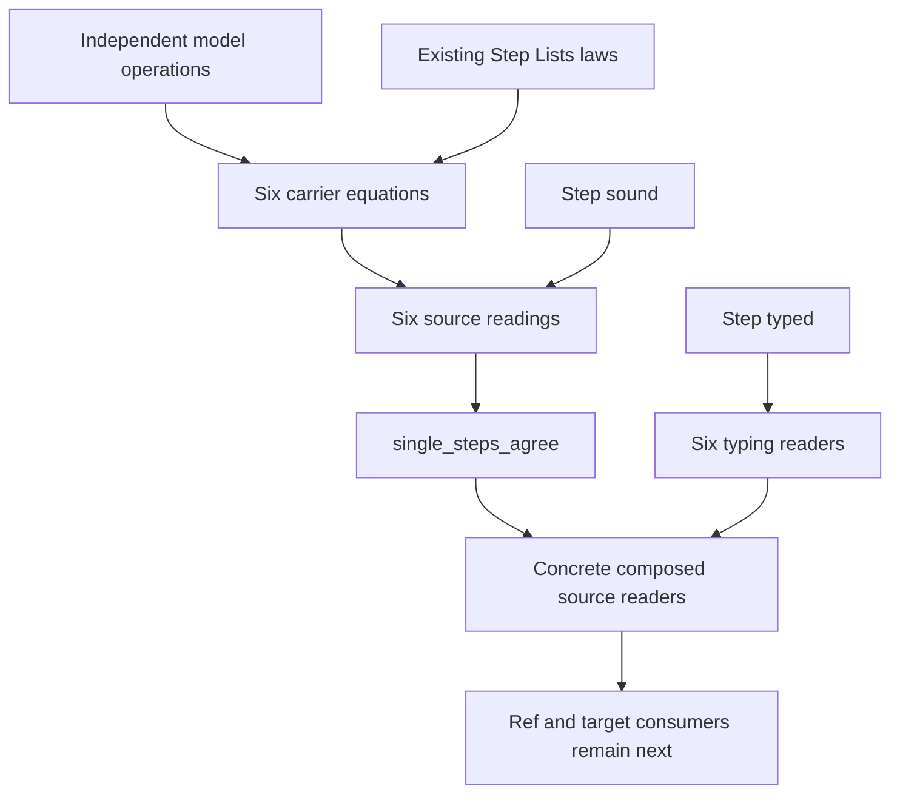

# PubSub single-slot receipt

The coordinator can integrate the pure natural-message slice.
The six source readings connect stored steps to an independent model; they claim no latest-host observation across runs.
A latest-host interpretation also requires exact numeric admission, beyond `Model.Live`.
Root still owns the library imports, battery import, semantics registry pointer, and architecture entry.

## Commits and files

Base: `08431c4e81c5f48be2ae8ba810e4fecad8c58139`.
Shared dependency: coordinator commit `e14ce773`, reused here as `a12963285539be53706507a09e6b040474857302`.
Checked implementation head: `aa277ed7dc613d16833e4c8d9a93a684a1e61229`.
This receipt lands in a subsequent documentation commit on `codex/pubsub-single`.
Integrate the implementation and receipt commits only; the coordinator already owns the shared dependency.
The prior `codex/module-waiting-probe` and `codex/s1-load-review` branches remain.
The primary checkout receives no edits or builds from this slice.

| Path | Change |
| --- | --- |
| `src/Effect4/Library/PubSub/Model.lean` | Independent natural-message state, source interpretation predicate, and six pure operations |
| `src/Effect4/Library/PubSub/Cell.lean` | Derived model images and named record fields |
| `src/Effect4/Library/PubSub/Data.lean` | Stored steps, named inputs, and shared subscriber-list operations |
| `src/Effect4/Library/PubSub/Steps.lean` | Six source builders |
| `src/Effect4/Laws/Library/PubSub/Data.lean` | Six value equations and four shared-list helpers |
| `src/Effect4/Laws/Library/PubSub/Steps.lean` | Six readings, six typing readers, and the aggregate |
| `Test/Program/PubSubSingle.lean` | Real source consumers and finite positive and wrong controls |
| `docs/research/2026-10-09-pubsub-single-plan.md` | Pre-proof scope and placement |
| `docs/research/2026-10-09-pubsub-single-audit.lean` | Scoped compiled-declaration and dependency audit |
| `docs/research/2026-10-09-pubsub-single-receipt.md` | This receipt |

## Observation and limits

The source profile names `BoundedPubSubSingle` and `BoundedPubSubSingleSubscription` in `vendor/effect-4.0.1/src/PubSub.ts`.
Capacity is one; replay is disabled; messages are natural numbers.
The observation is each pure operation's reply and next state, read through the exact derived model image.
The source builders fit existing `Ref.modifyWith` callbacks.
The battery composes their terms directly; machine callers and emitted TypeScript remain the coordinator's next consumers.

`Model.Live` requires distinct logical names and cursors bounded by the publisher index.
It equates zero retention with an absent value.
For a present value, it counts exactly the live registrations whose cursors differ from the publisher index.
After slide, stale cursors can remain unread while retention is zero and the value is absent.
The count equation therefore stays conditional on a present value.

All Model/Step equations hold on arbitrary data states.
The subscribe reading retains `Model.Fresh`; its data equation needs no allocation assumption beyond that recorded source premise.
The battery rejects duplicate-name source interpretation and a positive-retention state without a value.
It still applies the pure publish equation at that impossible state.
These controls distinguish the total data model from its proposed source interpretation.

`Model.Live` does not admit a latest-host interpretation by itself.
Exact host numeric admission must cover messages, publisher indices, subscriber cursors, and counts.
Every numeric value and each increment must remain within the safe-integer admission.
An independent coordinator review identifies index `2^53` as a boundary where JavaScript addition fails to advance.
The coordinator retains that host evidence separately.
This slice executes no host probe and proves no numeric transport theorem.
The Lean statements retain their unbounded natural-number domains.

Logical natural names identify model registrations.
They do not encode host subscription objects or establish their contextual identity correspondence.
The source profile excludes replay, other capacities, ended or shutdown states, active waiting pollers, and pending publishers.
It establishes no public subscribe or publish wrapper, delivery, finalization, cancellation, progress, or fairness statement.

## Proof placement

The coordinator registers `pubsub-single-steps-agree` with role simulation, concept `translation-simulation`, and requirement R10.
Its pointer is `Effect4.PubSub.Model.single_steps_agree` in `src/Effect4/Laws/Library/PubSub/Steps.lean`.
The pre-proof plan records the five fields before proof work.

| Declarations and path | Concept and property | Question and role | Reach and hypotheses | Exclusion | Consumer and requirement |
| --- | --- | --- | --- | --- | --- |
| `Model.initial_eval`, `subscribe_eval`, `tryPublish_eval`, `poll_eval`, `unsubscribe_eval`, `slide_eval` in `src/Effect4/Laws/Library/PubSub/Data.lean` | `translation-simulation`; pure stored steps read the independent model values | Helpers of `pubsub-single-steps-agree`, simulation | Arbitrary natural-message states and exact derived carriers; subscribe retains freshness | Source execution, numeric transport, runtime identity and waiting | Corresponding six reading laws; R10 |
| `Model.unread_eval`, `markRead_eval`, `registered_eval`, `remove_eval` in the same file | `translation-simulation`; shared list-fold carrier equations | Helpers of the same claim, simulation | Logical registration records; any, map, and removal | Delivery order, cancellation and allocation | `poll_eval` and `unsubscribe_eval`; R10 |
| Six `Model.*_reads` and `Model.single_steps_agree` in `src/Effect4/Laws/Library/PubSub/Steps.lean` | `translation-simulation`; source readings of reply and next state | `pubsub-single-steps-agree`, simulation | Exact input-image readings; fresh subscribe name; aligned fold scopes for poll and unsubscribe | Latest-host agreement, public wrappers and progress | Composed source battery; later Ref and target consumers; R10 |
| Six `*_types` in the same file | `store-typing`; declared types of stored source steps | Readers of `step-language-typed`, compatibility | Native atom signature, typed inputs, and aligned fold scopes | Membership, codec admission and behavior agreement | Concrete source typing battery; R4 |

The existing registry pairs are `step-language-sound` / simulation and `step-language-typed` / compatibility.
Their pointers are `Effect4.Modules.Step.sound` and `Effect4.Modules.Step.typed` in `src/Effect4/Laws/Step.lean`.



## Checks and results

All Lake commands run in the isolated worktree with `LEAN_NUM_THREADS=3`.
Only one Lake process runs there at a time.

| Command | Result |
| --- | --- |
| `LEAN_NUM_THREADS=3 lake build Effect4.Library.PubSub.Steps` | Pass after local syntax repairs |
| `LEAN_NUM_THREADS=3 lake build Effect4.Laws.Library.PubSub.Data` | Pass after exact carrier and Boolean comparison repairs |
| `LEAN_NUM_THREADS=3 lake build Effect4.Laws.Library.PubSub.Steps` | Pass |
| `LEAN_NUM_THREADS=3 lake build Test.Program.PubSubSingle` | Pass, with warnings as errors |
| `LEAN_NUM_THREADS=3 lake env lean -DwarningAsError=true Test/Program/PubSubSingle.lean` | Pass without diagnostics |
| `LEAN_NUM_THREADS=3 lake build Effect4.Laws.Library.PubSub.Steps Test.Program.PubSubSingle` | Final narrow build passes |
| `LEAN_NUM_THREADS=3 lake env lean -DwarningAsError=true docs/research/2026-10-09-pubsub-single-audit.lean` | Pass: 167 compiled declarations; only permitted axioms |
| `python3 scripts/check-language.py --strict docs/research/2026-10-09-pubsub-single-plan.md` | Pass |
| `git diff --cached --check` | Pass before the implementation commit |

The battery contains 36 guards, including 11 wrong-prediction guards, eight finite `Live` checks, and three negative source-interpretation controls.
The guards cover multi-reader retention, repeat poll, late subscribe, last unsubscribe, full publish, successful discard, and slide before replacement.
Real source reading and typing consumers exercise all six operations.
Two guards evaluate and type the composed poll term.
These results are finite Lean checks, not host checks.

The scoped audit requires all seven new source and battery modules to contribute compiled declarations.
It refuses forbidden compiled bodies and axioms beyond `[propext, Quot.sound]`.
It checks that core modules never reach Laws.
It checks that the independent model imports no Effect4 program machinery.
The aggregate's exact axiom output is:

```text
'Effect4.PubSub.Model.single_steps_agree' depends on axioms: [propext, Quot.sound]
```

No full battery, closure gate, target compiler, runtime sweep, merge, or push runs in this slice.
Root import integration remains open under the coordinator's ownership.

## Smallest reusable interface and next contract

Reuse existing `Step.Lists.any`, `Step.Lists.map`, and `Step.Lists.removeBy` with item binders and explicit outer inputs.
PubSub consumes them for ownership lookup, cursor updates, and removal.
Queue and Pool already consume the same laws for their waiting and selection lists.
Keep each module's retention and cancellation rule above that list interface.

`input_values%` now consumes the same declared context as `step_inputs%` and `input_sources%`.
The PubSub named and publish carrier bundles use that checked helper.
The two bundles add no second input metadata list or positional proof tuple.

The next contract needs a Ref-backed single-slot cell and contextual subscriber-object correspondence.
It must retain exact numeric admission and source allocation freshness.
G1 remains open for poller registration, delivery traversal, and reentrant release.
G7 remains open for scope registration and unsubscribe finalization.
G9 remains open for logical-name allocation and contextual host identity correspondence.
G10 remains open for the module observation across admitted decisions.

Dropping can consume full rejection; sliding can compose eviction and publication.
A public strategy wrapper also owns delivery and capacity notifications, which these pure equations leave open.
Backpressure additionally needs pending publisher registration and cancellation ownership.
No strategy wrapper lands here.

Generic message parameters remain an API extension.
This slice keeps the approved natural-message profile and derives its record image without expanding Step or typing trust.
The coordinator can next assess a parameterized derived image and explicit message interpretation.
