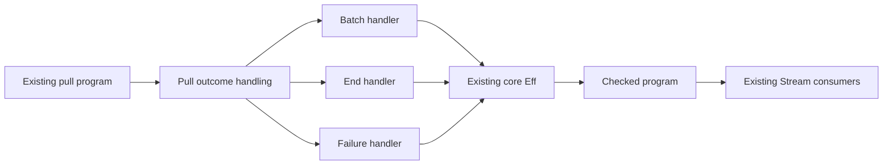

# Pull protocol construction

Base: `7334f1197cf5b535541ce1dfc7789a5082c07115`.
The owner resumes module implementation and asks for the next shared building blocks.
Claude currently investigates native rendering and session tooling in the primary checkout.
This slice uses the isolated `codex/pull-protocol` branch.

## Behavior and interface

Implement Pull outcome handling for the existing chunk protocol.
A successful pull answers a tagged batch or a clean End with its leftover.
An ordinary failure retains its full cause.
`Program.Stream.pulledTy`, `chunkVal`, `endVal`, and `pulled?` remain the protocol owners.
The producer or binding supplies the nonempty-batch premise.
The Pull handlers neither impose nor prove that premise.

`chunkValue` and `endValue` construct source terms.
`matchAnswer` selects a batch handler or an end handler.
`catchDone` unwraps an ordinary batch and handles clean completion.
`matchEffect` selects exactly one success, completion, or failure handler.
Its failure handler surrounds only the input program.
A selected handler's failure escapes without entering another handler.
The selected handler receives the stores left by the input program.

Latest (Effect 4.0.1) owns the source behavior in `vendor/effect-4.0.1/src/Pull.ts`, `catchDone` and `matchEffect`.
Decisions row 331 signs the use of an End value instead of a Done failure.
Combined Done causes remain a separate adapter obligation.
This slice proves no correspondence for Done mixed with interruption, defects, or ordinary failures.

## Proof placement

| Field | Selection laws |
| --- | --- |
| Concept and property | `translation-simulation`; composition of the existing straight-fragment denotation |
| Question and role | proposed `pull-protocol-selection`, role compatibility; `matchEffect_protocol` composes the source selection laws |
| Reach | authoring elaboration, exact Chunk or End value, aligned source and value scopes, and the supplied input and handler meanings |
| Exclusions | no arbitrary schedule, asynchronous progress, host Done adapter, nonempty admission, or stream-loop agreement |
| Consumers and requirement | `Pull.catchDone`, `Pull.matchEffect`, and `Stream.drain`; R10 |

The `matchEffect_protocol` consumer composes the handler rules for an input that answers an exact protocol value or fails.
Its input observation names the full cause or payload and the resulting stores.
It uses `reads_minted_last` under aligned source and value scope lengths.

The selection laws reuse `meaning_bind`, `meaning_select_true`, `meaning_select_false`, and `meaning_matchCause`.
They retain the input program's final stores and the selected handler's exit.
The `pull-completion-recovery` compatibility claim names `catchDone_meaning`.
It serves R10 under the same source elaboration premises and observes bind failure propagation with retained stores.
It leaves exact answer selection to `matchAnswer_meaning` and establishes no host completion correspondence.
Source-term readings connect the constructors to the existing protocol values.
The constructors' typing helpers serve `step-language-typed`, `store-typing`, R4.
Scope helpers serve the selection claim and existing `elaborate_scoped`.
Their hypotheses require scoped caller programs, terms, and handlers.
Their consumers are `Stream.drain_scoped` and the public Pull operations.
Scope alone establishes neither evaluation nor typing.

## Integration and completion

Move `Stream.drain` to `Pull.matchAnswer` and array construction to the shared value constructors.
Keep their existing behavior and theorem statements.
Expose Pull through `Effect4.Library` and its laws through `Effect4.Laws`.
Register the new source files and the bounded claim at their existing integration points.
Keep production code, rulings, and the active session unchanged in the primary checkout.

Compile the new library, its laws, the Stream consumers, and the public battery.
Check batch selection, leftovers, ordinary failure, failing handlers, retained state, and captured caller names.
Check malformed shapes through public program admission and keep the producer's nonempty-batch boundary.
Use one Lake process, `LEAN_NUM_THREADS=3`, and no full sweep.
Audit the compiled declarations at `propext` and `Quot.sound`.
Record the exact checks, remaining obligations, and authoring changes before committing explicit paths.
