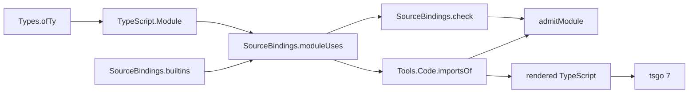

# Shared binding inventory: map annotations

Repair CP-01 in the shared inventory before another module depends on map output.
The base is `ecba8f5dddf0183f0c14e0c4bc3d9619d0d330d1`, on branch `codex/shared-bindings`.
The primary checkout is `0246b6c7` at initial inspection and `89dd732a` at the ownership refresh.
Its intervening commits do not change the binding or code-generation files.
The primary checkout and Claude's view-algebra work remain untouched.

## Design

`SourceBindings.builtins` in `src/Effect4/Codegen/SourceBindings.lean` owns the selected standard globals and their type or value availability.
`Types.ofTy` in `src/Effect4/Codegen/Types.lean` projects string maps to `Readonly<Record<string, A>>`.
The inventory omits both type names.
`Tools.Code.importsOf` therefore imports them from the prelude, which exports neither.

Add both names with type availability only.
Keep lexical resolution, origin checks and shadowing in their existing owners.
Keep all consumers on `SourceBindings.moduleUses`.
Add no renderer exception, second inventory, new traversal or author option.

The view-algebra audit names a generated TypeScript algebra as slice F.
Claude lands its first step at `89dd732a` and works on the renderer next.
`tools/Tools/Code/TsFold.lean` covers expressions, statements and object entries.
It retains types and parameters as payloads, with module declarations outside that family.
This repair changes the environment data that such an algebra consumes.
A future binding fold must retain local masking, pending declarations and type or value availability.
The TypeScript syntax recognizers remain independent consumers until that carrier has its own agreement obligation.

## Existing proof placement

No theorem statement or proof body changes in this slice.
The concept is translation and simulation, at the source-binding part of R10.
`check_iff`, `validate_iff` and `Checked.use_binding` remain the binding judgment's laws.
Their path is `src/Effect4/Laws/Codegen/SourceBindings.lean`.
`admitModule_bound` consumes that judgment in `src/Effect4/Laws/Codegen/Admit.lean`.
The API consumer is `checkSourceBindings_iff` in `src/Effect4/Laws/Api/Codegen.lean`.
The registry does not name a separate source-binding claim.
This repair changes the selected ambient environment, without proposing a wider source-admission theorem.

The judgment concerns retained structured syntax and the conservative lexical profile.
It does not establish annotation correctness, package exports, source-text reconstruction or target execution.
The independent target check establishes only the named emitted files' TypeScript acceptance.

## Files and checks

Production changes add the two bindings in `src/Effect4/Codegen/SourceBindings.lean`.
`ClassTable.takenNames` in `src/Effect4/Codegen/ClassTable.lean` already consumes that inventory.
Remove its duplicate `Readonly` and `Record` literals, retaining its export name.
Existing payload-class controls must still refuse both colliding tags.
Controls extend `Test/Codegen/SourceBindingsContract.lean` and exercise the actual map type projection.
A retained harness under `harness/codegen-bindings/` generates the five CP-01 callers through `Tools.Code.generate`.
It checks module admission, recovered program equality and actual emitted imports.
It compiles the unmodified emitted files with pinned tsgo `7.0.0-dev.20260629.1`.
It retains negative controls for missing exports and type names used as values.
Research files retain commands, outputs and the source hashes.
Historical CP-01 evidence remains unchanged.

Finishing criteria:

- Both map callers compile without copied-output repairs.
- Scalar, lookup and key-list callers still pass.
- Unknown types, unavailable values, disallowed origins and masked bindings still refuse.
- The shared binding laws and direct source-admission consumers build without proof changes.
- A scoped compiled audit checks changed declarations and the existing binding laws.
- The independent review finds no remaining defect in the repair.
- The receipt names evidence limits and the next algebra-aligned consolidation.

No whole-tree sweep, merge or push belongs to this slice.
