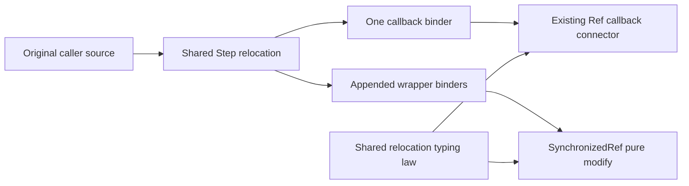

# Shared captured sources

Move callback relocation and wrapper capture handling into the existing Step callback module.
Keep the sole Term and Eff representations.

Base: `d58d8d9d` with the coordinator's uncommitted module integration.
The production files are `src/Effect4/Step/Callback.lean` and its law module, plus the two SynchronizedRef operation modules.
No operation signature, result type, source refusal, or stored program changes.

## Placement before proof changes

1. Concept: `store-typing`, the R4 property for composed library programs.
2. Question: existing `step-language-typed`, `fold-typed-atomic-update`, and `waiting-wrapper-typed` compatibility consumers.
   Move the existing relocation and capture proofs without changing their statements.
   `Step.callback_capture_types` and `SynchronizedRef.modify_answers` consume the shared law.
3. Reach: typing after appended scope slots, with aligned source and type lengths and the original source's typing premise.
   `Step.freeze_kept` retains the original resolution environment and refusal path.
4. Exclusion: no new value interpretation, membership, allocation, lock ownership, scheduling, or host theorem.
   The existing one-slot callback reading theorem keeps its hypotheses and observation.
5. Unlock: R4 consumers reuse one capture implementation and proof before additional module wrappers compose callbacks.

## Shape

`Step.relocate` iterates the existing `Term.weaken` operation.
It does not traverse Term by a second constructor match.
`Step.freeze` resolves a source at its original environment and path before relocating its internal binders.
The callback connector uses one relocation.
The wrapper computes the number of appended slots from the reached environment.
The shared `Step.freeze_kept` proof retains the existing typed-scope reach premise.

## Finishing checks

Build the Ref, Stream, and SynchronizedRef caller modules and their affected laws.
Run the retained nested-fold, caller-name collision, and depth-sensitive controls.
Run the existing refusal-path control.
Audit the changed shared modules and their module consumers for forbidden compiled bodies and axiom dependencies.
Measure proof reuse again after the move.
No full battery or push belongs to this slice.
