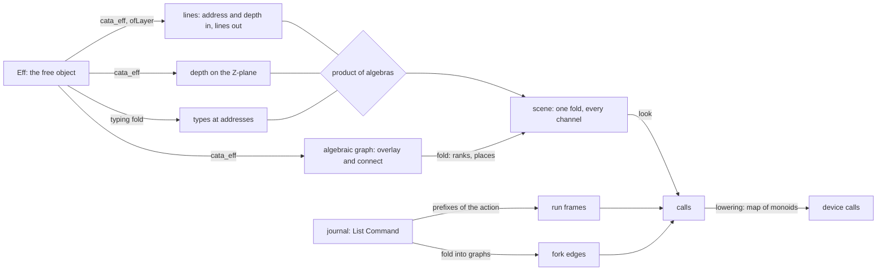

# The view plane's algebra: an audit of its folds

The owner's question of 2026-10-09, by voice: can the view's semantics be tied to the initial
algebras of the program language? Which operations of the view plane are folds, and which could be
stated at the level of the initial algebra? The aim is composition held by structure and by
proof, not by care.

This note audits every operation of `tools/Tools/View/` and `tools/Tools/Code/` against the free
objects it reads. It names each operation's fold, or the fold it should be. It lists the laws
that each fold gives for free, and it places each new obligation before any work on it. The rule
it applies is the theory note's first: every visual channel is the image of a fold
(`docs/research/2026-10-09-visual-language-theory.md`, section 1).

## 1. What the core gives

The program is the free object `Eff`, a family of seven sorts (`EffFam`: `eff`, `stmt`, `stmts`,
`effs`, `action`, `layer`, `layers`). Its algebra and its fold are generated from the program syntax signature.

| Declaration | Path | What it is |
| --- | --- | --- |
| `EffAlgebra`, `cata_eff`, `cataFam` | `src/Effect4/Program/Fold.lean`, `LayerView.lean` | an algebra: a carrier with one field per constructor; its fold, the unique map out of `Eff` |
| `hom_eq_cata_eff` | `src/Effect4/Program/Fold.lean` | uniqueness: every map that respects the constructors (`EffHom`) is the fold |
| `EffAlgebra.ofLayer` | `src/Effect4/Program/LayerView.lean` | a generic layer: one function of a sort, a constructor's name and its arguments by sort (`ArgF`) |
| `view_eff`, `build`, `build_view_eff` | `src/Effect4/Program/LayerView.lean` | one layer out of a program and one layer in; out then in is the identity |
| `cata_build` | `src/Effect4/Program/LayerView.lean` | the fold of a built node is the layer function on its folded arguments |
| `foldMap_eff`, `foldMapAt_eff` | `src/Effect4/Program/Fold.lean` | the fold into a monoid, and the same with each node's address |
| `foldM_eff`, `foldM_eq_cata_eff` | `src/Effect4/Program/Fold.lean` | the monadic fold, and its agreement with the pure fold |
| `TermAlgebra`, `cata_term`; `TyAlgebra`, `cata_ty` | `src/Effect4/Program/Fold.lean` | the same for terms and types |
| `replay_unique`, `journal_replays` | the run's laws | the journal `List Command` acts on the run: a run is a word of a monoid |

`view_eff` and `build` are the two halves of Lambek's lemma for this initial algebra: a program
is the same thing as one layer of programs. The core has no product of two algebras and no fusion
law. Section 5 adds the product on the view's side, where no core module rebuilds.

## 2. The audit

Each row is one operation of the view plane. *Today* says how its code reads the free object.

| Operation | Where | Reads | Today | The fold it is |
| --- | --- | --- | --- | --- |
| a program's lines | `Program.lines` | `Eff` | **fold**: `cata_eff (EffAlgebra.ofLayer layer)` | the same; its carrier takes the address and the depth in |
| a term's text | `Program.termText` | `Term` | **fold**: `cata_term termAlgebra` | the same |
| a line's mark | `Program.layer`, `argOp` | `Eff` | inside the lines' fold | a component of a product with the lines |
| a line's type | `Program.sessionPage` | the checker's table | joined to the lines by address | the typing fold, paired with the lines by a product |
| the build's fillings | `Build.filling` | `Eff` | a search over every address for the nearest children | **one layer**: `view_eff` with each child replaced by its hole |
| the build's order | `Build.requests` | `Eff` | the core's address list, filtered | `foldMapAt_eff` into the free monoid of layers, in the fold's order |
| the splice check | `Motion.keptUnchanged` | two pages | a finite check in the driver | a consequence of the lines' fold: a subtree's lines depend on the subtree alone |
| the code plane | `Tools.Code.Ts.expr` | the TypeScript syntax | a hand mutual traversal, mirroring the pinned printer | the fold of a TypeScript algebra, which lean4-typescript does not have yet |
| the code's layout | `Doc.go`, `Doc.flat` | `Doc` | structural folds of the document | the same; `Doc.flat` is a fold, `undo` a map of monoids (`undo_append`) |
| the drawing | `Page.pageCalls`, `Laid.calls` | the scene | lists of calls joined by `++` | the free monoid of calls; the drawing of a whole is the join of its parts' drawings |
| the lowering | `Picture.lowerAll` | `List (Keyed Call)` | `flatMap` | a map of monoids (`lowerAll_append`) that commutes with the move (`lowerAll_move`) |
| a moment of motion | `Motion.sample` | two pages | per element, by key | a map on each kept, entered and exited element; the step's end is the next frame (`sample_end`) |
| a run's frames | `Run.frames` | the journal | one frame after each control | the prefixes of the journal's action, one picture each |
| the fiber graph's forks | `Run.fiberGraph` | the machine's fork records | a function of the state | a fold of the journal into the monoid of graphs: forks only grow |
| the fiber graph's waits | `Run.fiberGraph` | the observers | a function of the state | a function of the state: a wait ends, so it is no monoid's image |
| a graph's layout | `Graph.layout`, `Place.centres` | a graph | ranks, order and places | no fold: an optimisation over a whole graph. Section 4 gives the program's own graph as a fold |
| a look | `Look`, `Tokens` | none | data | the interpretation of the fold's semantic classes as channels |

## 3. Findings

**F1. The lines are already a fold, and their carrier is an attribute grammar.** `Program.lines`
folds the generic layer into the carrier `List Nat → Nat → List Node`. The address and the depth
flow down; the lines flow up. A fold into functions is how an inherited attribute is a fold. So
every top-down measure of the theory note is the same shape: the Z-plane's depth (section 4 of
that note) and a scope's nesting.

**F2. The lines are equivariant: a subtree's lines anywhere are its lines at the root, moved.**
The fold at address `p` and depth `d` is the fold at the root, moved. Each address gains `p` as a
prefix, and each depth gains `d`. This is the move law's twin for the program (`lowerCall_move`). It is
why a splice redraws the edited subtree and nothing else. Today the driver checks that by finite
evaluation (`kept-lines-unchanged`). Section 5 states the law.

**F3. A build step is one layer of the initial algebra.** `Build.filling` searches every address
for the nearest children and replaces each with its hole. One layer out (`view_eff`) gives the same
node directly: its constructor, its leaves, and its children, each to be replaced by its hole. So the
top-down build is the program read layer by layer, and filling every layer in order gives back
the program. That last fact is `build_view_eff` with the identity algebra's fold.

**F4. Several readings of one program should be one fold.** A line's text, its mark, its type,
and later its depth are separate readings of one program at the same addresses. A product of
algebras computes them in one fold, and the product law (banana split) says the product's fold
is the pair of the folds. Today the type is joined to the line by an address lookup.

**F5. The code plane breaks the agreement rule.** AGENTS.md says: two folds agree when their
algebras do, and no pairwise agreement proof is written. `Ts.flat_expr` is such a pairwise proof:
the layout's flat form against the pinned printer, case by case. The repair is upstream: a
generated algebra for lean4-typescript's syntax. Then the printer and the layout are two algebras
of it, and their agreement is a statement about the algebras (section 6).

**F6. The picture is a monoid, and its laws are monoid laws.** Calls form a free monoid, and
the lowering is a map of monoids (`lowerAll_append`). The move is an action that commutes with it
(`lowerAll_move`). A later call answers the pointer first (`pick_append`). This part is already
algebraic, and needs nothing.

**F7. A run is a word, and a frame is a prefix.** The journal acts on the run
(`journal_replays`), so the run's frames are the action's prefixes. A fork only adds, so the fork
edges are the image of the journal in the monoid of graphs. A wait ends when its fiber exits, so
the wait edges are a function of the state, not a monoid's image. The view should draw the two
kinds as what they are.

**F8. The program's own graph is a fold, and its layout composes.** The graph view today draws
a run's fibers, an arbitrary graph, by Sugiyama's method: an optimisation over the whole graph,
which is no fold. A program has a graph of its own: what must happen before what. `bind` puts its
two parts in series. A fork starts a branch beside its parent, and an await joins it back. For the
fragment without loops these graphs are series-parallel. A series-parallel graph is a term of
two operations, so its graph, its ranks and its layout are folds (section 4).

## 4. The program's graph as a fold

Mokhov's algebraic graphs (2017, recalled, not read here) build every graph from four
operations. They are the empty graph, a vertex, an overlay (`+`, the union), and a connect (`→`).
A connect is the union with every edge from its first graph to its second. Series composition is connect, and parallel composition is overlay. So the
happens-before graph of a program is one fold of `Eff` into that algebra:

| Constructor | Its graph |
| --- | --- |
| a leaf (`succeed`, `sync`, `perform`, …) | one vertex, at its address |
| `bind a k` | `graph a → graph k` |
| `gen` statements | the statements in series |
| `fork e` (an action) | a fork vertex, with `graph e` overlaid beside the parent's continuation |
| `raceAll`, `awaitAll` | the branches overlaid, between a fork vertex and a join vertex |
| `catchCause a h`, `matchCause` | `a`, then the handlers as alternatives |
| `scoped e`, `uninterruptible e` | `graph e`, one level deeper on the Z-plane |

Each measure the layout needs is a fold of the same shape, and so composes:

- the rank of an exit is a fold into the semiring of `max` and `+`: series adds, parallel takes the maximum;
- the width, the most branches at once, is the same with the roles of `+` and `max` exchanged;
- the depth on the Z-plane is an inherited attribute (F1);
- the places across are a fold too: series stacks, parallel puts side by side.

A series-parallel graph has an upward drawing with no crossings. Di Battista, Tamassia and
Tollis give one for series-parallel digraphs (recalled, not read here), and it is computed from
the term. So the program's graph needs no crossing reduction. Its layout is a fold, and the
layout of a composite is built from the layouts of its parts. A splice relays out one subterm,
and the motion follows. The run's graph of fibers keeps the Sugiyama pipeline, since a run's
graph is arbitrary.

Two points are the owner's to rule (section 7). One is which constructs are series and which
parallel. The other is how a fiber identity used across branches is drawn. A fiber is a first-class value, so an
`await` may name a fiber forked in another branch. The static graph then holds an edge that the
series-parallel shape does not, and it is drawn as a cross edge.

## 5. The laws this buys, and the first slice

Composition by structure means four laws, each a statement about algebras, not about pairs of
functions:

1. **Uniqueness** (`hom_eq_cata_eff`). Any reading of a program that respects its constructors is
   the fold. Two readings agree when their algebras agree: one proof per algebra.
2. **The product** (banana split). The fold of a product of algebras is the pair of the folds. So
   every channel of a line comes from one fold, and each channel can be stated alone.
3. **Equivariance** (F2). A subtree's view at an address is its view at the root, moved. A splice
   changes the view of its subtree alone.
4. **Lambek** (`build_view_eff`). A program is one layer of programs; a build is the program read
   layer by layer.

The first slice lands laws 2 and 3 in the tools library, in `tools/Tools/View/Algebra.lean`. No
core module rebuilds.

- **`cata_prod`.** The fold of the product of two generic layers is the pair of their folds, for
  every sort of the family. Proof: the pair of the folds is a homomorphism of the product's
  algebra, so `hom_eq_cata_eff` and its siblings make it the fold.
- **`lines_at`.** `Program.lines`' fold at any address and depth is its fold at the root,
  re-addressed and shifted. Proof: the same route, with one lemma about the layer function, used
  at every constructor.

The placement of both, as AGENTS.md asks before any proof:

1. Concept: neither is a judgment of `docs/core/semantics.md`. They are laws of a tool.
   Decisions row 334, point 3, places such laws outside the semantics registry, as the picture's
   other laws.
2. Question: the view's composition claim of the theory note, section 1: a channel composes as the
   semantics composes. No registry claim states it, and none is proposed.
3. Reach: the fold of `EffAlgebra.ofLayer` for any layer function, over all seven sorts. No
   judgment, no fragment, no hypothesis.
4. What they do not establish: that a page draws a program faithfully, that a type shown is the
   checker's, or anything about a run. The splice check of the driver stays a finite check until
   a law about `replaceAt` joins `lines_at` to it.
5. Consumers: `cata_prod` serves each channel computed beside the lines (the depth of the Z-plane,
   the type, the mark). `lines_at` serves the splice check and the motion of a splice.

## 6. The next slices

| Slice | What | Consumer |
| --- | --- | --- |
| A | `cata_prod` and `lines_at` (this note, section 5) | the line channels; the splice |
| B | `Build.filling` as one layer through `view_eff`; the build order by `foldMapAt_eff` | the build frames; a law that the build gives back the program |
| C | the splice law: `lines_at` with the core's `replaceAt`, so the driver's check becomes a reader of a law | the motion of an edit |
| D | the program's graph as a fold into algebraic graphs, with ranks and places as folds | a new view, after the rulings of section 7 |
| E | the depth of the Z-plane as an inherited attribute, in the product with the lines | the Z-plane, after its ruling |
| F | upstream: a generated algebra for lean4-typescript's syntax; the printer and the layout as two of its algebras | replaces `Ts.flat_expr`'s pairwise proof |
| G | the fork edges as a fold of the journal into graphs | the run's graph, drawn as forks and waits |

## 7. Rulings the owner must make

1. **The program's graph** (slice D). `bind` and statements are series. The branches of `raceAll`
   and `awaitAll` are parallel, and so is a forked fiber beside its parent. Is that the reading?
2. **A cross edge**: an `await` of a fiber forked elsewhere is drawn as an edge across branches,
   in the back edge's lane. Is that the mark?
3. **Two graphs or one**: the program's graph and the run's graph of fibers, drawn side by side or
   one at a time.

## 8. What this note does not establish

- The audit reads the code at `f8292923`. It measures nothing; the traversal census is the
  measure of the core's own traversals (`docs/core/traversal-census.md`).
- The graph drawing results of section 4 are recalled, not read here. A slice that relies on one
  files the text first.
- A law of section 5 is a law of the tool. It makes no claim about the semantics, the checker or a
  run.
