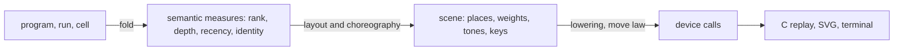

# The visual language: theory, and how the picture follows the semantics

The owner's steer of 2026-10-09, by voice, in several messages: learn from theory and from
industry practice for graph drawing and animation; remove bends that mean nothing; use curves;
let motion settle with physical weight, as natural forms do; relate a graph's properties to the
program's semantics; use the Z-plane for depth, with subtle and coherent cues, as chemistry
draws three dimensions in two; raise the density and the typography of the data, after
Observable; keep the modules deep, and follow the organization of the module code.

This note is the design. It places each visual channel on a fold of the program or the run, and
names the rulings the owner must make. What landed with it is in
`docs/research/2026-10-09-visual-pipeline.md`, section 5.

## 1. The one rule

**Every visual channel is the image of a fold.** A place, a weight, a tone, a motion: each is
computed from the program, the run or a module's cell by a fold over its free object, or by a
function of such folds. So a channel composes as the semantics composes: a spliced subprogram
brings its own picture, and the picture of the whole is built from the pictures of its parts.
No channel is decided by a renderer, and no channel holds a meaning twice.

## 2. Graph drawing: the theory, and where the tree stands

The layered method of Sugiyama, Tagawa and Toda (1981) has five phases. Graphviz's `dot`
(Gansner, Koutsofios, North and Vo, 1993), ELK and dagre are instances of it.

| Phase | The standard | The tree (`tools/Tools/View/`) |
| --- | --- | --- |
| Cycles | reverse a small set of edges | an edge against the nodes' order is a back edge (`Graph.lean`) |
| Ranks | longest path, or network simplex | longest path; every forward edge descends (`ranks_forward`) |
| Order | barycentre or median sweeps, then transpose | barycentre sweeps down and up; transpose is next |
| Places | Brandes and Köpf (2001) | Brandes and Köpf, four ways balanced, then `spread` (`Place.lean`, `spread_apart`) |
| Routes | splines through the dummy points | cubic segments, vertical at both ends; one arc for a back edge |

**Which aesthetics matter.** Purchase (1997) measured comprehension against five criteria.
Crossings mattered most, then bends; symmetry mattered less. Ware, Purchase, Colpoys and McGill
(2002) found that a reader follows a path by its continuity: a path that keeps its direction is
read faster than a short one that turns. So the order of the work is crossings first, then
continuity, then bends.

**The choices that follow, and their reason in that order:**

- **A step is vertical at both ends.** A segment's tangents are vertical where it leaves and where
  it enters, so a path never turns sharply. Two ends in one column give a straight segment, so a
  path bends only where it moves across.
- **An edge leaves from the middle of a box.** Brandes and Köpf align middles, so the edge to the
  median neighbour runs straight, and the others branch from it. Spread ports were tried; they
  fought the alignment and made an S-bend of every aligned edge. Branching from one point is the
  form of a tree's limbs and of a river's tributaries: forms a reader parses without effort.
- **A back edge is one arc.** A return is drawn as a curve that leaves to the right and comes back,
  never as a staircase. It reads as a return before its ends are read.
- **A long edge's run is straight.** Brandes and Köpf align the points of a long edge first, and
  an edge that crosses such a run is not aligned. A long dependency is one straight line.

**Next, by the same order:** transpose after the sweeps, which swaps neighbours while that removes
crossings (`dot`'s second step); then edge ends that meet a box with its tangent, and a gap of one
pixel where a curve passes under another (section 4).

## 3. Graph properties as program semantics

A graph of the view is a fold's image, so its shape states facts about the program or the run.
Each row names the property, the semantics it shows, and the channel.

| Property of the drawing | What it shows | Where it comes from |
| --- | --- | --- |
| A node's rank | the length of the longest chain of forks or binds before it: its depth in happens-before | `ranks`, the order of the fiber identities |
| A straight vertical run (a block) | a sequence with no branch: one fiber's own continuation | Brandes and Köpf's alignment |
| The width of a rank | the fibers that can run at once at that depth | the rank's items |
| The height of the graph | the longest chain: the span of the computation | the number of ranks |
| Width against height | parallelism: the work over the span (Blumofe and Leiserson) | the whole layout |
| Fan-out from one box | a fork: a parent and its children | fork edges (`Run.fiberGraph`) |
| Fan-in into one box | a join or an await: several exits observed by one fiber | exit edges to waiters |
| A back edge | a wait against the order, or a loop's return | the order |
| A cycle of back edges | a cycle of waits: a deadlock, visible as a closed loop | the run's observers |
| Mirror symmetry | two subprograms of one shape: the branches of a race, of a zip | the layout of isomorphic subgraphs |

Two consequences for the work:

- **A deadlock must look like one.** A cycle of waits closes into a loop of arcs. The view can
  test for it (a cycle in the exit edges) and light the cycle. That is a fact of the run, and the
  picture only shows it.
- **Symmetry must be kept when it is there.** Brandes and Köpf balance four ways, which keeps a
  symmetric graph symmetric when its order is symmetric. The order's sweeps may break a tie
  asymmetrically; a later slice can break ties by the subprograms' structure.

## 4. The Z-plane: depth from the semantics

**The tradition.** Drawings have long carried a third dimension in two:

- **Line weight.** Illustrators thicken a near contour and thin a far one.
- **Stereochemistry.** A wedge bond comes toward the reader and a hashed wedge goes away (IUPAC's
  recommendations of 2006 on the graphical representation of stereochemical configuration).
- **Haloed lines.** A line passing behind another is broken by a thin gap on each side (Appel,
  Rohlf and Stein, 1979). Knot diagrams use the same gap: the strand underneath is broken.
- **Aerial perspective.** Contrast falls with distance, so far things are fainter.

**Depth in the model.** A program has a depth that composes: the nesting of its regions. Each
constructor that opens a region adds one level to what is inside it:

- a scope (`scoped`, `acquireRelease`);
- a forked fiber's program;
- an uninterruptible region;
- a provided service or layer.

Depth is a fold of the program (`cata_eff` with one algebra), like every other traversal. So the
depth of a spliced subprogram is its own depth plus the depth of the hole it fills. That is the
composition the owner asked for: depth composes as the program composes.

A run has a second depth, **recency**: the step being shown is in front, and what happened earlier
recedes. It composes along the journal, the monoid action of the run.

**The channels, each monotone in depth:**

| Channel | Nearer | Farther |
| --- | --- | --- |
| Line weight | the base weight | thinner, down to a floor of one device pixel |
| Tone | full ink | lower contrast, in steps |
| Crossing | drawn whole | broken by a haloed gap where a nearer line passes over it |

**Laws to state with it:**

- **Monotone:** a deeper item is never heavier and never in front of a shallower one.
- **Composition:** the depth of a spliced subprogram is the depth of its hole plus its own depth.
- **Move:** depth changes no place, so the move law holds unchanged.

**The open choice.** Which constructors open a region, and how many levels the weight and the
tone have. Depth is a new meaning of a mark, so it waits for the owner's ruling. The proposal is
the four regions above, and three levels of weight and of tone.

## 5. Motion with weight

**The principles.** Each of these is recalled from its source, not read for this note:

- **Staging and object constancy** (Heer and Robertson, 2007, on animated transitions): one change
  at a time, and each element stays itself across the change. The data join by key is object
  constancy.
- **Congruence and apprehension** (Tversky, Morrison and Bétrancourt, 2002): a motion helps only
  when its structure matches the structure it shows, and it is slow and simple enough to be
  followed.
- **The mental map** (Misue, Eades, Lai and Sugiyama, 1995): a layout adjusted after a change keeps
  what the reader has learned. Positions that move little are part of the meaning.
- **Weight and arcs** (Lasseter, 1987, after Thomas and Johnston): a thing with mass slows into its
  rest, and a moving thing follows an arc.

**What landed.** Two easings are a mass on a damped spring released toward its rest
(`Tools.View.Motion`):

- `settle` is critically damped, the fastest approach with no overshoot: kept elements move with
  weight;
- `spring` has a damping ratio of 0.7: a box expands, overshoots by 4.5 percent, and settles.

Both are tabulated in integers and end at exactly one, so the end law holds (`sample_end`).

**Next.** Kept boxes move along a shallow arc rather than a straight line. Then the meaning of a
motion: section 6.

## 6. A module's characteristic motion, from its cell

The module code is organized by layer: each module in `src/Effect4/Library/<Module>/` has a cell
(its state, one record type), its data (field references and records), a model (its abstract
transitions), steps (the pure step terms), operations, and definitions. The visual plane takes
the same organization:

| The module's layer | The plane's form |
| --- | --- |
| `Cell` | the state, drawn by its type: a record's fields, a list's items as boxes in a row |
| `Steps` | a step's motion: the data join of the cell before and after, keyed by identity |
| `Model` | the same motion over the abstract state, beside it: the agreement made visible |
| `Ops` and `Defs` | the program that calls them, in the tree and the code plane |

**No module draws its own motion.** A cell's value is drawn by its type, and a step's motion is the
join of two values, keyed by the identities the value holds (a request's `Deferred`, a list
item's place). Each module's motion then follows from its data:

- **Queue:** an offer adds a box at the end of `msgs`; a take removes the first, and the rest slide
  forward; a waiting taker appears in `takers` with the wait mark and leaves when woken.
- **Semaphore:** permits are a count of tokens; an acquire takes some, a release returns them, and
  a waiter parks in line.
- **Deferred:** a hollow promise fills when it is completed.
- **PubSub:** one published message fans out to each subscriber's list.
- **Stream, Channel and Pull:** a chunk moves one stage down at each pull.

So a reader learns a module by its motion. And two modules with the same motion have the same
shape of state change, which is a fact about their models.

## 7. Density and typography, after Observable

**What Observable does well.** Its inspector shows a value compactly, one line until it is opened.
Code and output stand together. The type is set with care: a proportional face for prose,
monospace for code and values, small sizes with generous line height, and secondary information
in lower contrast.

**What the tree does now.** It has one face for data, a proportional face for titles and labels,
24 pixels a row, and a fixed gutter. The code plane stands beside the tree.

**Proposals, each a small slice:**

- **Values by the inspector's rule:** one line, cut with an ellipsis at its room, and opened on
  demand. This needs the host's interaction state (`docs/research/2026-10-09-visual-pipeline.md`,
  section 6a).
- **Types in a lower tone than the node text.** A tone for secondary text is a new meaning of a
  mark, so it waits for a ruling.
- **A denser row of 20 pixels** for the tree and the code, with the same baseline rule.
- **Numerals in tabular figures** in the gutter, so the addresses align.
- **The code plane by token role:** a head of `effect`, a binder, a literal, a hole. Each class is
  a mark, so it waits for a ruling. With the printer's span map, a token's role is its node's
  constructor, a fact of the program rather than of a lexer.

## 8. The proof graph and the semantic layers in the view

**Facts the view already has:**

- each generated module's reading verdict (`admitModule`);
- whether `run_eq_meaning` covers its program (`Straight`);
- each edit's laws, in the build frames' foot.

**The next facts, each from a function the core already has:**

- **On a program's page:** its fragment and the equal-observation theorem that covers it.
- **On a node:** the semantics concept of its constructor and the registry claims about it
  (`tools/ProofGraph/Registry.lean`, `generated/semantics.md`).
- **On a step:** the machine rule that fired and its laws.

These are the inspector's facets, one per key. The C host shows them on demand.

## 9. Code organization

| Module | Owns |
| --- | --- |
| `tools/Tools/Code/Doc.lean` | the document algebra and its layout; `undo_layout` |
| `tools/Tools/Code/TypeScript.lean` | printed TypeScript as a document; `flat_expr` |
| `tools/Tools/Code/Module.lean` | a generated module: imports, header, checks; the code plane's text |
| `tools/Tools/View/Picture.lean` | calls, curves, the lowering, the move law, one `lerp` |
| `tools/Tools/View/Place.lean` | places across, Brandes and Köpf; `spread_apart` |
| `tools/Tools/View/Graph.lean` | ranks, order, routes as curves |
| `tools/Tools/View/Motion.lean` | the join, transitions, easings with springs, `sample` |

**Lean's own idiom.** Lean prints with `Std.Format`, Wadler's document with `group`, `nest`,
`line` and `tag`. Its layout is written with `partial` functions, so no law can be proved of it.
The document here follows the same shape and stays total, so its laws hold. Two steps follow from
the idiom:

- a `tag` constructor carrying a program address, which is how Lean's infoview links text to
  terms: the printer's span map;
- the document and its TypeScript layout, moved into `lean4-typescript` beside the renderer, with
  the house print defined as the flat print. Then `flat_expr` holds by definition, and one
  renderer remains.

## 10. Rulings the owner must make

1. **Arrowheads** on edges whose direction the layout does not show: back edges and arcs.
2. **Depth** (section 4): which constructors open a region, and the levels of weight and tone.
3. **A lower tone** for types and other secondary text.
4. **Token classes** in the code plane.
5. **The choreography's values**: the springs' damping and the durations (already open).

## 11. What this note does not establish

- No measurement of comprehension was made. The aesthetic order (crossings, continuity, bends)
  is the literature's, and the tree only follows it.
- The citations are recalled, not read from filed texts. No locator is given.
- Brandes and Köpf without classes can leave a layout wider than the paper's. `spread_apart`
  guarantees separation, not compactness.
- The semantic reading of a graph's shape (section 3) holds for the fiber graph of a run. A
  program's tree is a different graph, and its rows need their own statement.
