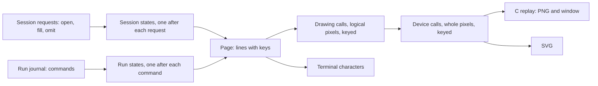
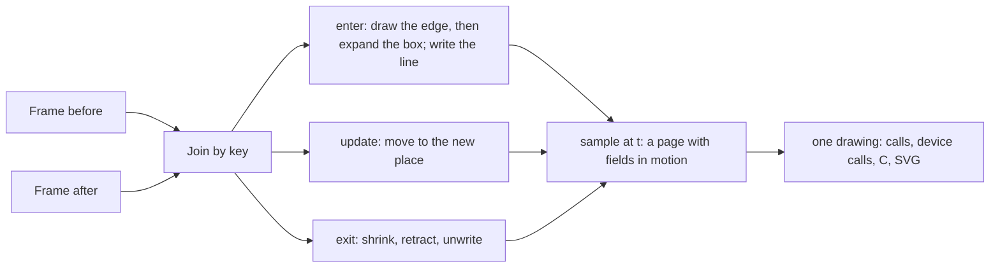

# The visual pipeline: frames of a program built and run, and vendored C

Status: plan note (history, not authority). Base: `7334f119` (`refactor/phase1-phase3`).
Decisions row 336 records the rulings it follows.

## 1. The one thing to know first

- **An agent edits the graph, not the text.** The reader reads back exactly what the printer
  writes, and refuses most hand-written Effect. So the TypeScript print is an output and a view.
  An agent edits by operations on the tree, through the session tool: open, fill, omit, undo.
- **The views come before the interaction.** Every stage of a program shows as a frame: each edit
  of its construction, and each step of its run. Interaction comes after the frames exist.
- **The picture is data computed in Lean.** A page lowers to drawing calls and then to device
  calls. C replays the device calls, draws text and reports input. SVG and the terminal are two
  more outputs of the same calls.
- **Most of the drawing exists** as the native view probe of 2026-10-06 and 2026-10-07
  (`docs/research/2026-10-06-native-view-probe/`, outside the tree). This plan lands it in the
  tree and adds steps.

## 2. The owner's steer (2026-10-09, by voice; the coordinator's reading)

- Agents author graphs, through the tool interface, by graph operations. They look up pieces by
  content address and by meaning, at any depth, and build by reuse and modularization.
- To build verified code is to write or rearrange the graph, which carries the proof structure.
- Get the basic views first. See a program go through its steps, and see a graph built step by
  step, before the agent's interaction is designed.
- Native C, with a simple interface, perhaps a terminal one. Model the data of rendering,
  animation and typography in Lean. Keep the ability to translate to web standards, SVG first.
- Vendor good C libraries that fit our semantics, especially for interaction.

## 3. What exists

| Piece | Where | State |
| --- | --- | --- |
| a page as rows, its drawing calls, its device calls, `lowerAll`, `pick`, five laws | probe `Scene.lean` | probed; string roles, no key on a drawing call |
| a program as lines: one generic layer, folded (`EffAlgebra.ofLayer`) | probe `Lines.lean`, section `ViewLines` | probed |
| the replay of device calls through cairo and pango | probe `draw.c`, `paint.h` | probed |
| a window with pan, zoom, pages and a console mode | probe `view.c`, `canvas.c`, SDL2 | probed |
| the edit session and its journal; the session tool over JSON lines | `src/Effect4/Program/Edit.lean`, `tools/Tools/Session.lean` | landed (row 334) |
| a run's journal and its replay | `src/Effect4/Run/Basic.lean`, `journal_replays` | landed |

## 4. The pipeline

Each form is first-order data, and each arrow is a function in Lean.

| Form | Its constructors | Arrow out | Kind of the arrow |
| --- | --- | --- | --- |
| `Page` | a title block, lines, a foot | `pageCalls` | projection |
| `Call` | fill, two rules, frame, two texts, cut, end of cut, pointer box; each with a key | `lower` | translation, call by call |
| `Dev` | fill, two texts, cut, end of cut, pointer box; each with a key | `Dev.row`, `Dev.svg` | projection |

The layout is a tool's, as row 334 rules: its laws are tests until a person uses the window. The
lowering keeps its five proved laws as statements of the tool.

## 5. Slices

| Slice | What lands | It shows |
| --- | --- | --- |
| V0 | `tools/Tools/View/`: the three forms with keys, the lowering and its laws, the SVG and terminal outputs; `tools/view/draw.c` and `paint.h` from the probe | one page in three outputs |
| V1 | the frames of a session: one page after each request. A generator writes the requests that build a program top-down: every hole is declared at `open`, and each fill puts one node with its children as holes. | a program built step by step, with the type at each address and the lit edit |
| V2 | the frames of a run: one page after each command | fibers, calls and exits at each step |
| V3 | motion: two pages joined by key, with the calls that stay, enter and leave | a step that moves |
| V4 | the graph operations of the agent: content-addressed pieces, search, wrap, extract, inline | each operation as V1's frames |

**V2's gap.** The machine records no program address for a fiber. A frame of a run can show the
fibers, the calls and the exits, but cannot light the running node. V2 adds that address, or
reads it from the journal.

**V3's open meanings.** What moves between two frames, and how, is the owner's to walk with the
coordinator before it is drawn (the design steer: a mark or a motion enters with a meaning only).

### What landed (2026-10-09)

| Slice | Commit | What it holds |
| --- | --- | --- |
| V0, V1 | `586349d9` | `tools/Tools/View/`: `Picture`, `Page`, `Program`, `Build`; `tools/Drivers/View.lean`; `tools/view/draw.c`, `paint.h` |
| V3 | `57107359` | `Motion`: the move law and `tween`; `tools/view/replay.h`, `play.c`, `v` |
| marks | `0c460f4f` | the design language's marks as plain fills, by each operation's row; `--plain` |

**The laws of the picture**, statements of the tool (`tools/Tools/View/Picture.lean`,
`Motion.lean`):

- `lower_key`: each device call keeps its call's key.
- `lowerCall_move`, `lower_move`, `lowerAll_move`: a call moved by whole pixels lowers to its own
  device calls, moved.
- `pick_append`, `box_holds`, `span_pos`, `frameSides_pairwise`, `lowerAll_append`.

**The minimal representation.** A rule is a fill whose height is its weight, and a mark is fills
and frames on the grid. So a drawing call has seven constructors, and the move law covers every
picture with no case for a rule or a mark.

**Finite checks** (`v -p NAME` over the eight programs of the wire corpus):

- the splice, read on frames: 21 spliced edits keep all 72 lines outside their subtree, with
  their text, type and note;
- 182 streams hold only known rows, and close every cut (`draw --count`);
- the pointer answers a line's key on its row (`draw --pick`).

**The one command.** `tools/view/v NAME` builds a corpus program top-down and plays its frames in
a window: Right or Space plays to the next frame, Left steps back. `v -t` prints the frames in a
console, `v -p` writes PNG files, `v -f FILE` reads any session request file, and `v -P` draws no
mark.

### The graph, the run and the motion (2026-10-09, later)

| Part | Commit | What it holds |
| --- | --- | --- |
| vendoring | `8a36f200` | `vendor/termbox2-2.5.0/` in full; `vendor/SDL3-3.4.16/` by pin: the tarball's SHA-256, two signing keys, `fetch.sh` |
| the graph | `d60bbc04` | `Graph.lean`: back edges by the order, ranks (`ranks_forward`), barycentre order, points for long edges, routes as paths; `Specimen.lean` (`v -g`) |
| V2 | `d60bbc04` | `Run.lean`: a run's frames, the program with the step's fork sites lit, and the graph of fibers (`v -r NAME`) |
| motion | `d60bbc04` | `Motion.lean`: the join by key, transitions, easings and the choreography as data; `sample` |

**The motion's semantics**, after D3's join and transitions (the owner's steer):

- The laws: `join_new` and `join_old` (every element is in a selection), `Ease.at_start` and
  `Ease.at_end`, `Transition.within_at_end`, `ranks_forward`, `lowerCall_move`.
- **The end law** (`sample_end`, proved): sampling the step from any page to a page at rest, at
  its end, gives that page. Its parts: `lineAt_end`, `sampleLines_end`, `placedAt_end`,
  `routeAt_end`, `sampleLaid_end`. The finite check that preceded it (27 of 27 steps) is retired.
- Every law of the view rests on `[propext, Quot.sound]` or less; `frameSides_move` lost its
  `omega` call, which had reached `Classical.choice`.

**Tracked, at the owner's word, for after this core:**

- the graph view's next consumers: the proof graph, the lowering, and how the building blocks and
  the proof graph imply behaviour, all in the visual language;
- Effect schemas drawn beautifully, where the interop with Effect in TypeScript shows;
- D3 as a representation layer in HTML, from the same scene data.

## 6. Vendoring C libraries

**The fit test.** A library fits when:

- it takes data and answers data: a list of drawing calls in, input events out;
- it makes no layout decision that a law of ours would have to cover;
- it is C with a permissive licence, and it builds under strict warnings;
- it makes no network call and keeps no hidden global state that a frame depends on.

This is the shape of the pipeline: Lean computes the picture and the next state, and C draws and
reports.

**Candidates.** Versions and licences are as listed by package indexes and project pages read on
2026-10-09. Each is confirmed against its own repository before a download.

| Need | Candidate | Licence (as listed) | What it would give |
| --- | --- | --- | --- |
| window and input | SDL3 (3.4.6 listed) | zlib | the window, the pointer, keys, high-density displays; SDL2 is installed today |
| window and input | sokol_app (single header) | zlib (to confirm) | a smaller window layer, Metal on macOS |
| terminal | termbox2 (2.5.0 listed, single header) | MIT | a cell grid with keys and the pointer; our data face is already a cell grid |
| text | HarfBuzz (14.4.0 listed) with FreeType (2.14.3 listed) | MIT; FreeType licence | shaping and glyphs without pango and glib |
| vector drawing | PlutoVG (1.3.3 listed) | MIT | paths and fills in a small C library, in place of cairo |
| vector drawing and motion | ThorVG (1.1.2 listed, C interface) | MIT | SVG and Lottie playback: a bridge to web standards for motion |
| interaction | Clay (single header) | to confirm | a layout pass that answers a list of render commands, and pointer queries by element id |
| interaction | microui | to confirm | a small immediate-mode interface that answers a command list |

**Recommendation.**

- Now: keep cairo, pango and SDL2, which are installed. V0 and V1 need no download.
- First vendoring, after the owner's yes on the list: termbox2 for the terminal, and SDL3 for the
  window. Both answer events as data, and neither lays anything out.
- Then text: HarfBuzz and FreeType in place of pango, so the window has no glib.
- Clay and microui are read for their interaction design: a frame as a list of commands, and the
  pointer answered by element id. Our pages already have both, so neither is vendored unless the
  window needs widgets that Lean does not draw.
- ThorVG when motion is ruled, as the player of SVG and Lottie exports.

### Graph layout libraries: evaluated, not vendored (2026-10-09)

The owner asked for the best library where one fits our semantics, and our own work where it does
not. Read on 2026-10-09: Graphviz (C, `dot`; orthogonal routing ignores ports), OGDF (C++, the
richest layered and orthogonal layouts), libavoid of Adaptagrams (C++, connector routing around
obstacles), igraph (C, a Sugiyama layout with bend points).

**Decision: none is vendored now.** The layout is the picture's semantics, and its laws are ours
(`ranks_forward`, boxes apart). An engine in C++ would compute the picture outside them. The
pieces of value are published algorithms of modest size: crossing reduction by the transpose
heuristic, and coordinate assignment by Brandes and Köpf. They land in `Graph.lean`, each with
its law. A layered graph routes in the channels between ranks, so libavoid's obstacle routing
answers no need here. Lean compiles to C, so the layout already runs natively.

**If an outside comparison is wanted** (crossings of our layout against `dot` or OGDF), the
pins read on 2026-10-09 are: OGDF `foxglove-202510` (commit `5b679565`, tarball SHA-256
`e0496c2a…99b5`); Adaptagrams commit `840ebcff` (tarball SHA-256 `a9de2720…f3b`). Neither
tarball carries an agent instruction file.

## 6a. Interaction: the requirements, and how they keep the semantics

The owner's next requirements for the window: tooltips, overlays, statistics, sidebars, and a
side-by-side view of the Effect code, the graph, and the meta representation.

**The split.** Lean owns what is shown and why; the C host owns the moment of the person's
attention.

- The *scene* (pages, layouts, motion) is computed in Lean, as now.
- The *inspector* is data computed in Lean: for each key of a frame, its facets (address, type,
  refusal, the laws named, a fork site, counts). It travels beside the frame's stream.
- The *interaction state* is data held by the host: the pointer, the hovered key, the selection,
  the open panels, the camera, the moment on the timeline.
- The host draws the ephemeral chrome (a tooltip box, a sidebar's list) with the same painter and
  tokens, from the inspector. `pick` and `pick_append` say which key the pointer is on.

| Requirement | What it needs | Owner of the data |
| --- | --- | --- |
| a tooltip on hover | the pointer's key (`pick`); its facets | Lean (facets), host (pointer) |
| a selection lit everywhere | one key joins the program, the graph and the print | Lean (keys) |
| overlays toggled (types, marks, laws, refusals) | a layer per overlay, each a list of keyed calls | Lean |
| statistics | counts and sizes per frame and per sequence | Lean |
| a sidebar | a list of keys with their facets; a click selects | Lean (list), host (scroll) |
| the side-by-side view | the Effect print with a span for each address | Lean: the printer's span map |
| a timeline | the frames and their steps as data; scrubbing is sampling | Lean (`sample`) |

**The side-by-side view needs one core piece**: the span map of the printer, the print with a
span for each address (the tangible authoring note, section 4). With it, a key lights its span
in the Effect code, its node in the graph and its facts in the meta view. Its law, the print
splice, is a planned R14 step. So the view's next requirement and the core's next step are one.

## 7. What this note does not establish

- A run's frame shows where fibers were forked, not where each runs: the machine records no
  program address for a running fiber.
- The motion is the plainest the laws give: a line slides to its new row, and a new line enters at
  the end. Its speed, its easing and any other motion are the owner's to walk.
- The marks are drawn for a ruling (the forms note's proposal A, 1); `--plain` removes them.
- No library is downloaded, and no version or licence is confirmed against its repository.
- The layout's laws are tests. A view is no face with claims (row 334).
- The construction order of V1 is one order, top-down and left to right. An agent may build in
  any order, and the frames follow its requests.
