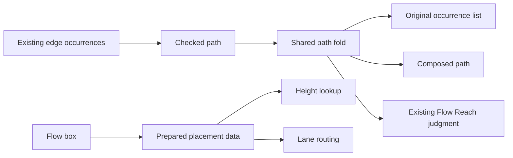

# Checked paths and prepared flow placement

Prepare a graph analysis once, and retain its data for every consumer.
Return an executable path whose type fixes its source, target, and edge interpretation.
Keep a path through drawing constraints separate from a scheduler claim.

## Base and ownership

Base: `969ed613b582bbdd4013ac21d949eb6f159369d8` on `codex/host-followup-review`.
The primary checkout remains owned by Claude.
The implementation stays in the attached review worktree.
No merge, push, owner ruling, or session message forms part of this slice.

Owned production paths:

- `tools/Tools/Graph/Path.lean`: shared finite path data, admission, and composition.
- `tools/Tools/View/Flow.lean`: prepared placement data and its consumer.
- `tools/Tools/View/FlowLaws.lean`: connectors to the existing layout laws.

Probes and receipts live in this directory.
A later edit may add one Flow path adapter after its observation is fixed here.
The existing `Flow.Reach` remains the relational meaning of paths through flow edges.
No program representation changes.

## Finishing criteria

1. Prepared placement shares wait analysis between height assignment and lane routing.
2. The existing placement observations retain their values for every flow.
3. `Walk.read?` accepts a supplied path only with matching endpoints and edge occurrences.
4. Path composition retains both component paths in order.
5. Positive and negative controls exercise actual view edges and proof dependencies.
6. Narrow builds and exact transitive dependency checks pass.
7. Compiler inspection distinguishes retained preparation from repeated closure work.
8. The Claude packet names the commits, checks, and remaining limits.

## Representation and arrows

`Walk endpoints source target` stores a finite sequence of edge occurrences.
The path constructors are an empty path and an edge followed by a path.
Its indices enforce endpoint agreement.
The edge alphabet belongs to the consumer; the library introduces no second graph representation.

`read?` is admission of a supplied edge sequence.
A refusal means that sequence does not form the requested path.
A refusal establishes no absence of other paths.

`append` composes paths at a shared endpoint.
`edges` forgets the endpoint evidence and retains the original occurrences.
An edge transport names the relation between the old and new endpoints.

`PreparedPlacement` retains the fallback height, materialized assignments, and lane order.
Preparation derives these from one wait analysis and its selected constraints.
The existing Flow fold supplies the box that it prepares.
The preparation is explicit data, never a hidden table before a returned closure.

## Proof placement

All obligations below serve `initial-algebras-folds`, concept 7 of `docs/core/semantics.md`.
They are named tool laws under decisions row 336, point 8.
The program graph design places such laws outside registry claims.
They support R14 navigation; they advance no machine progress requirement.

| Named question | Consumer | Observation and premises | Excluded claims |
| --- | --- | --- | --- |
| Supplied path validation | Flow cycle explanation; later proof dependency explanation | Accepted edge occurrences form a path between the indexed endpoints under the supplied edge interpretation | Unbounded search; scheduler deadlock; environment extraction |
| Path composition | Joining explanation segments | The composed path lists the first path's edges followed by the second path's edges | Shortest paths; graph identity |
| Prepared height agreement | `Flow.placeWith`; existing `place_placed` and layout laws | Every item receives the old `heightsOf` value under the same box, waits, and selected constraints | Faster asymptotic complexity; measured speedup |
| Prepared lane agreement | `Flow.placeWith` | Accepted and cyclic waits retain the existing lane order | Runtime execution order; fairness |

Each helper names one of these consumers.
Existing public layout theorem statements retain their hypotheses and observations.
A future claim that no path exists requires a separate check and theorem.
Fuel exhaustion remains unknown.

## Controls and limits

Check an empty path at one endpoint, a real edge, a cycle, and parallel edge occurrences.
Refuse a wrong endpoint, a broken adjacency, and evidence replayed against changed endpoints.
Compare materialized heights and lane order with independent pre-change definitions.
Exercise a cyclic wait and a wait accepted into the constraints.
Keep the same relation when testing a cycle explanation.

The implementation does not merge structural order, loop returns, waits, proof dependencies, or scheduler transitions.
A weak component requires explicitly forgetting edge direction.
No claim about connectedness follows from an arbitrary spanning forest of directed edges.

## Verification protocol

Run one Lake process at a time with `LEAN_NUM_THREADS=3`.
Build only the changed modules and direct dependents.
Audit new declarations and changed proofs with the cycle-aware exact dependency collector.
Keep independent baselines and record commands and outputs.
Run no full sweep.

## On-demand Flow explanation

Owned path: `tools/Tools/View/FlowPath.lean`.
The edge alphabet is `Fin es.length`, preserving parallel occurrences in the supplied list.
The endpoint interpretation reads each selected `Flow.Edge`.
`explainReaches` reconstructs one path through the existing breadth-first search.
`explainWait` fixes the await-to-exit direction before a candidate exit-to-await edge.
The caller supplies the exact accumulated constraint list.

Named question: bounded Flow explanation agreement.
Consumer: a tool requesting the reason for the cycle branch of `acceptWaits`.
Observation: successful explanation has the same Boolean result as `reaches` at the same fuel and endpoints.
A returned walk implies the existing `Flow.Reach` judgment.
The `reaches_reach` connector gives that judgment to callers with a successful existing Boolean query.
The helper proofs serve these two connectors.
Concept and placement remain `initial-algebras-folds`, as named tool laws under row 336, point 8.
The laws serve R14 navigation, not machine progress.

Fuel zero remains unsuccessful even at equal endpoints, matching the existing query.
An unsuccessful bounded query establishes no universal unreachability.
The layout does not eagerly run a second explanation search.
No dense all-pairs table is added.

The prepared height table retains every selected-order position, including positions outside a raw box's item list.
This preserves the existing total `heightsOf` observation without adding a formation premise.

## Shared traversal and diagram

`Walk.fold` interprets one finite path into an indexed carrier.
Edge extraction, path composition, and the Flow reachability proof use that fold.
The Boolean query and the explanation producer share the `searchNext` frontier rule.

