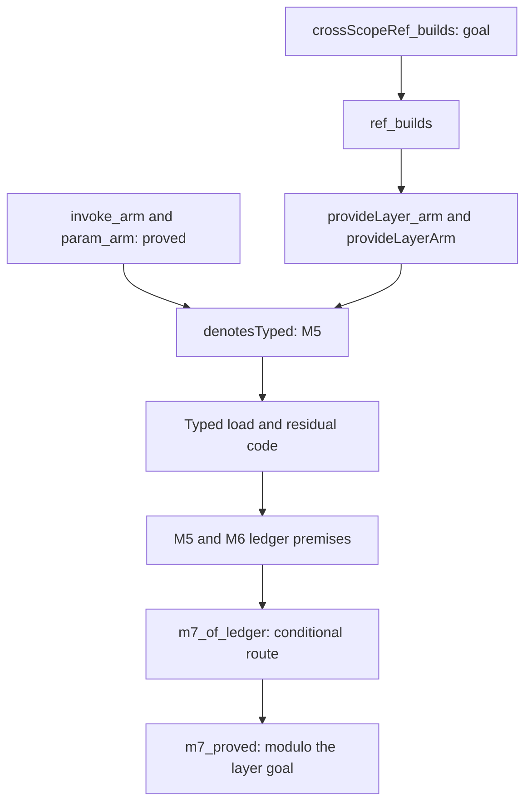
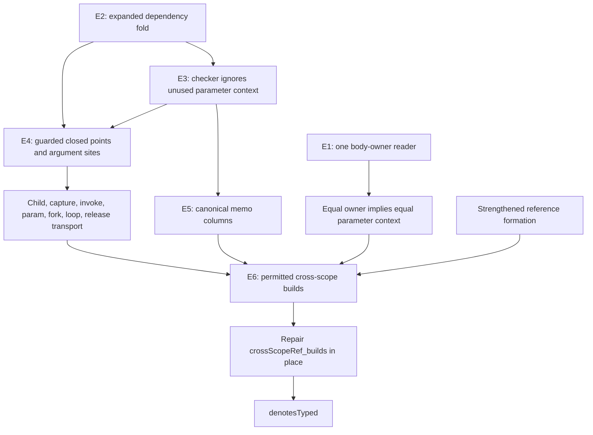
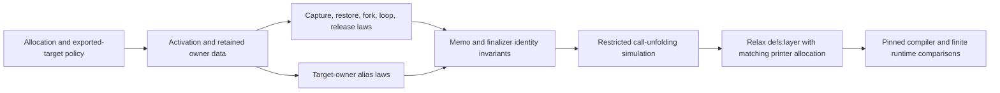
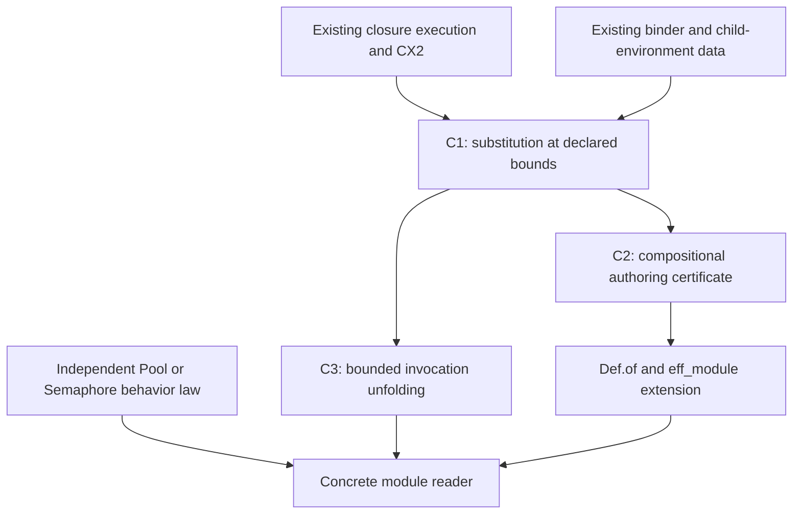

# Proof outlines for CX and authoring

This is a design packet, not a set of newly proved general claims.
Names marked proposed are obligations for the coordinator to place before implementation.
Current statuses come from [audit.log](audit.log) and [cx-audit.log](cx-audit.log).
The examined production code is `8ce5e1c4`; the primary checkout adds the docstring correction `a2b589de`.

## 1. The current dependency



The arrows summarize proof dependence, not execution order.
`ref_builds`, `provideLayer_arm`, `provideLayerArm`, and `denotesTyped` live in `src/Effect4/Laws/Program/Typed/LayerArm.lean`.
`invoke_arm` and `param_arm` live in `src/Effect4/Laws/Program/Typed/Denotation.lean`.
`m7_of_ledger` lives in `src/Effect4/Laws/Program/Typed/Assembly.lean`.
`m7_proved` is assembled in `src/Effect4/Laws/Program/Typed/Commands/Clauses/All.lean`.

M7 retains every `M7Fragment` premise.
These include a lawful checked source, empty row table, closed requirements, and an answer-free decision tape.
No result here establishes general host-session typing, termination, or physical runtime conformance.

## 2. Option (e): a closed target may cross lexical owners

The owner selects option (e) in the inspected repository session.
The coordinator must record that amendment in tracked authority before landing its implementation.
The policy combines existing reference formation with this rule:

```text
same lexical body owner(site, target)
  OR
expanded target reads no incoming program parameter
```

The second branch is relative to incoming parameters.
An invocation can enter another definition and run that definition's own parameters.
The source still contains only the existing `Eff` representation.

### Proposed connections



### E1. Share the lexical owner reader

**Concept and property:** `residual-program-typing`, scope interpretation serving `denote-typed`.

**Question and placement:** proposed helpers `ownerAt_body`, `ownerAt_child`, and `ownerAt_same_params`; role preservation.
Place the data reader in a core leaf beside `src/Effect4/Program/Refs.lean`.
Place its laws in `src/Effect4/Laws/Program/Typed/Scope.lean`.
Source admission, point typing, and the editor consume this reader.

**Reach:** well-formed root definition blocks, valid body addresses, and the matching declaration/body spine.
Equal body owners imply equal parameter declarations.
Do not require the converse.
Connect `Part.bodyAt` and `Eff.partAt` in `src/Effect4/Program/Typing/Parts.lean` to that reader.
Bounds are decisions rows 328 and 340, plus the selected option-(e) amendment.

**Limit:** this is lexical identity, not allocation identity, capture equality, or executable behavior.
The finite `ownerAt` reader in [CXControls.lean](CXControls.lean) is a probe, not this general connector.

**Unlock:** one shared explanation of scope for R4, R9, and R14.

### E2. Derive the expanded dependency witness

**Concept and property:** `initial-algebras-folds`, fold agreement serving `denote-typed`.

**Question and placement:** proposed helper `noCallerParam_expanded`; role compatibility.
The production Boolean belongs beside reference formation, using the generated fold family.
Its proof connects to `readsAlg` in `src/Effect4/Laws/Program/Signature.lean`.
E3, E4, and the refusal explanation consume the same result.

**Reach:** a formed reference graph, its expanded target, and all program-bearing children.
Those children include invocation arguments, forks, finalizers, loops, generators, and nested layer programs.
`readsAlg` treats a raw layer reference as having no direct reads.
The expansion identity therefore belongs in the statement, not merely in an implementation comment.
Bounds are existing `Eff.layerRefsWF`, DB-12, and decisions row 340.

**Limit:** no incoming parameter read does not mean no parameter execution inside a called definition.
It also implies no purity, absence of allocation, or independence from services and host replies.
Do not reuse `Reads` from `Laws/Step/Reading.lean`; that predicate describes value-term evaluation.

**Unlock:** shared program admission and dependency explanations under R4, R10, and R14.

### E3. Check the target independently of the caller's parameters

**Concept and property:** `residual-program-typing`, the checker connection needed by `denote-typed`.

**Question and placement:** proposed `checkLayer_noCallerParam`; role compatibility.
Place it with the signature laws in `src/Effect4/Laws/Program/Signature.lean`, or a small importing law module.
E4 and E5 consume it.

**Reach:** identical nonparameter signature components, one expanded target, and E2's witness.
Require its successful check and reads admitted by the base signature.
Recover those reads through `layerHasTy_sigProgram` in `src/Effect4/Laws/Program/Typing/Restrict.lean`.
Remove parameter-domain reads using E2.
Then reuse `check_alg_agreeOn` and `cata_layer_congr_on` in `Laws/Program/Signature.lean`.
Conclude equality of the successful `LayerTy` under base and scoped signatures.
Bounds are the same formed source and decisions rows 111, 114, 328, and 340.

**Limit:** equality of checker answers does not construct `StackTyped` for the target's unused declarations.
It also establishes no behavior agreement or memo liveness.

**Unlock:** one canonical layer type for permitted references, serving R4/R9.

### E4. Guard closed execution and captured argument sites

**Concept and property:** `residual-program-typing`, preservation needed by `denote-typed`.

**Question and placement:** proposed closed alternatives to existing point and argument-site typing.
Place the predicates in `src/Effect4/Laws/Program/Typed/Admission.lean`.
Place their transport laws beside existing consumers in `Typed/Denotation.lean` and `Typed/LayerArm.lean`.
These are helpers of `denote-typed`, consumed by E6 and existing invocation and parameter arms.

**Reach:** a globally admitted program definition block under option-(e) formation.
The ordinary branch retains lexical signature typing and the existing full stack obligation.
The closed branch requires the actual addressed subtree, its expanded E2 witness, and successful checking at the base signature.
It also requires typed values and the existing typed completed-view evidence.
Only that guarded branch permits arbitrary unused incoming stack entries.
For layers, keep the existing empty value environment.

A closed argument-site branch must check the expanded argument under the captured environment plus its declared request.
It must satisfy `ParamDecl.admits` at all declared columns.
Only that branch may omit the parent-stack typing obligation.
Ordinary parameter-using sites retain their current captured-stack premises.

The following are required cases of the shared transport connection:

| Transition | Required evidence | Existing consumer |
| --- | --- | --- |
| Structural child | Closure passes to the selected expanded child; retain its environment rule | `pointTyped_child` and layer child helpers |
| Reference redirect | Expansion at the alias equals expansion at the target | `layerPointTyped_redirect`, then E6 |
| Invocation | Enter the callee's ordinary context; closed arguments satisfy the guarded site branch | `argSites_typed`, `invoke_arm` |
| Parameter return | Restore the selected argument site's own mode, captured values, and parent stack | `param_arm` |
| Fork, loop, generator, finalizer | Retain the selected code's mode and captures | Existing point/frame/capture typing helpers |
| World extension | Weaken membership and completed-view evidence through the existing world relation | Point, stack, and capture weakening consumers |

Bounds are decisions row 340 and the exact capture behavior in `src/Effect4/Program/Compile.lean`.
Row-table extension remains a separate signature and lawfulness transport; do not infer it from world extension.

**Limit:** this proposes no runtime stack erasure and no weakening for code containing an incoming parameter read.
Closure survives structural navigation, but invocation can deliberately enter an open callee with a newly typed frame.
There is no progress or live-edit migration conclusion.

**Unlock:** permitted closed targets enter the M5 proof without fabricating unused stack entries; R4/R7/R9.

### E5. Keep one type for each memo entry

**Concept and property:** `context-requirements`, layer-sharing invariants serving `denote-typed`.

**Question and placement:** proposed helper `closed_memo_columns`; role preservation.
Its consumers are `memoize_typed`, `LayerCellTyped`, `MemoTableTyped`, and memo clauses of `storePre`.
Their owners are `Typed/LayerArm.lean`, `Typed/Adequacy.lean`, and `Typed/Residual.lean`.

**Reach:** the canonical target path, live memo map and scope, typed world, E3, and the current path-based identity policy.
Relate the same successful value and failure columns at every permitted reader and writer.
Include building, waiting, completed-success, completed-failure, and cleanup observations used by those predicates.
Bounds are DB-12/DI-71 and the selected formation amendment.

**Limit:** agreement of memo columns supplies no per-call allocation, cleanup completion, or target conformance.

**Unlock:** the retained fork-inside-building-layer counterexample has no permitted path; R4/R5/R9.

### E6. Repair the existing planned goal

**Concept and property:** `residual-program-typing`, `denote-typed`.

**Question and placement:** existing `crossScopeRef_builds` in `src/Effect4/Laws/Program/Typed/LayerArm.lean`; role preservation.
`ref_builds` consumes it, then `provideLayerArm` and `denotesTyped` consume the result.
Repair this goal in place after its formation premise incorporates option (e).

**Reach:** retain every existing child-denotation, fuel, world, service-table, scope-liveness, memo-liveness, and point-typing hypothesis.
The equal-owner branch uses existing redirection after E1.
The permitted unequal-owner branch uses E2 through E5 positively.
This branch is not a contradiction under option (e).

**Limit:** narrowing `layerRefsWF` changes the proposition's accepted domain even if its printed statement stays unchanged.
Public admission alone cannot repair a goal whose hypothesis still accepts the old source.
Keep the original false-domain controls with their original evidence.

**Unlock:** remove this goal from M5 through M7, with M7's existing fragment unchanged; R4/R9.

## 3. Per-call layers: define allocation before changing memo keys

The following is a design proposal for the selected next capability.
Option (e) alone does not settle allocation ownership for every cross-owner target admitted by source formation.

Use an internal activation identity beside the existing source path.
Its arrows are allocation, capture, restoration, and alias resolution; it stores no new program syntax.
Both ordinary calls and parameterized invocations need the same allocation rule.
Running a supplied argument restores its caller's ownership context.
Forks and delayed releases retain that context; a new call allocates a new context.

Two cases need explicit policy before the representation is frozen:

1. A closed cross-owner target can sit inside a definition that has no active invocation.
   Proposed rule: mark exported closed targets as globally hoisted objects, with defining uses and aliases sharing that identity.
   An alternative is to restrict sharing to explicitly global targets.
   This choice does not follow from the selected closure rule.
2. A literal constructor may execute repeatedly in a loop within one invocation.
   A key containing only the invocation and source path still shares those evaluations.
   Decide whether construction occurs at call entry or at each constructor evaluation.
   The printer must generate the matching allocation site and retain alias bindings.

Do not key identity by argument equality, content hash, current fiber, or current cleanup scope.
Those choices collapse distinct allocation or capture behavior.



| Proposed obligation and owner | Concept/property; registry question and role | Reach and bounds | Does not establish | Consumer and unlock |
| --- | --- | --- | --- | --- |
| `owner_capture_restore`, proposed `Laws/Program/InvocationOwner.lean` | `residual-program-typing`; helper of `denote-typed`, preservation | Fixed allocation policy; point, site, capture, generator, loop, and release ownership; row 340 | Progress, reclamation, or constructor frequency | Point and frame preservation; R4/R7/R9 |
| `layer_alias_owner`, same owner | `context-requirements`; helper of `layer-sharing-contract`, preservation | Actual target owner, explicit global-target rule, memo-map isolation; DB-12/DI-71 amendment | Equality from parameter values or source content | Memo lookup/build/completion and cleanup invariants; R5/R11 |
| `invocation_layer_agrees`, proposed `Laws/Program/InvocationMeaning.lean` | `translation-simulation`; part of proposed `invoke-unfolds`, simulation | Selected fragment, related decisions/budgets, allocation identities and retained state | Unrestricted Effect runtime or printer agreement | CX4, HO-3, and module instances; R8/R10 |

Use [CXControls.lean](CXControls.lean)'s nested-call example as an allocation reader.
Add counted builds, failures, delayed releases, captured arguments, repeated loops, aliases, and separate calls as independent behavior controls.
The existing `defs:layer` printer refusal stays until the source-to-target allocation relation is established.

## 4. CX3 and CX4: reuse authoring without unsafe raw insertion



### C1. Context substitution at the declared bound

**Concept and property:** `residual-program-typing`; proposed required property `context-substitution`.

**Question and placement:** proposed `context_substitution`, role substitution, in `Laws/Program/Context.lean`.
Its consumers are C2 and C3.
Add the property and semantics registry pointer in the same slice that states the planned goal.

**Reach:** checked body, ordered parameter declarations, matching arity, captured argument sites, typed caller values, and `ParamDecl.admits` for each argument.
Every use receives a request at its declared request column.
The filled interpretation uses the argument's captured value environment and caller parameter context.
Its result is typed at the declared answer, error, and requirement bounds used by the body.
Use existing `Point`, sites, and `StackTyped`; do not store a second context language.
Bounds are decisions rows 288, 328, and 340, plus the reviewed reference-formation rule.

**Limit:** this first statement concerns closure interpretation, not arbitrary raw syntax substitution.
The closed-layer capture and invariant-reference controls in [CX3Controls.lean](CX3Controls.lean) explain that restriction.
Value ascription repairs one finite answer-column case, not every error or requirement transformation.

**Unlock:** a single module-parameter typing contract, serving R4/R10/R14.

### C2. A builder certificate composes

**Concept and property:** `initial-algebras-folds`; proposed required property `authoring-context`.

**Question and placement:** proposed `authoring_context`, role compatibility, in `Laws/Program/Authoring/Context.lean`.
The consumer is the extension of `Def.of` and `eff_module`.

**Reach:** builders made from certified shared operations, lawful binder handling, and C1's supplied-program interpretation.
The certificate relates applying the builder to arguments with interpreting its generic parameter body.
State the relation under the named typing and later behavior observations.
An arbitrary Lean function can inspect its syntax argument, so its certificate remains explicit.
Bounds are the same authoring representations and decisions row 340.

**Limit:** probing one generic hole cannot prove compatibility for an arbitrary function.
No reader, printer, simulation, or runtime claim follows from typing alone.

**Unlock:** authors declare one operation and its bounds; shared rules derive body, call surface, and compatibility; R10/R14.

### C3. Unfolding under a named observation

**Concept and property:** `translation-simulation`; proposed required property `invoke-unfolds`.

**Question and placement:** proposed `invoke_unfolds`, role simulation, in `Laws/Program/InvocationMeaning.lean`.
Its consumers are concrete Pool/Semaphore readers and HO-3's later target connection.

**Reach:** admitted body and arguments, matching captures, fixed compatible decisions, and an explicit relation between unfolding budgets.
Observe exit and stores for completed sequential calls.
For unfinished calls, retain the selected pending request, stores, residual work, and cleanup state admitted by the program fragment.
Start without disputed local-layer allocation, or consume its separately frozen identity relation.
Recursive calls use budget-indexed statements; equal numeric fuel is not presumed.
Bounds are row 340, DB-03, and the selected fragment's host exclusions.

**Limit:** no universal syntactic beta equality, unchanged inference after inlining, host progress, or target execution.
Existing Pool laws transfer only after their observations and premises match this statement.

**Unlock:** reusable module behavior laws under R10, with R8 and R12 boundaries explicit.

## 5. S1: keep the resource line independent

S1 extends the host meaning with sequential scopes and acquisition.
It need not wait for CX3 when its admitted program fragment excludes definitions and layers.
It consumes detailed waiting observations, not the lexical-scope repair as a semantic premise.

The original placements are Q11/Q12 in `docs/research/2026-10-10-host-meaning-widening/README.md`.
The outline below refines their consumers without claiming they are proved.

| Proposed obligation and owner | Concept/property; registry question and role | Reach and bounds | Does not establish | Consumer and unlock |
| --- | --- | --- | --- | --- |
| `cleanup_prefix`, proposed `Laws/Program/Meaning/Scope.lean` | `scope-lifetime-finalization`; proposed `scoped-cleanup-prefix`, preservation | One sequential close, original exit, changed stores, captures, registration identity, masks, host state, and retained cleanup; Q11 | Closed-bit completion, progress, parallel cleanup, or network exactly-once | Q12; R11/R12 |
| `scoped_host_agrees`, proposed `Laws/Api/SessionMeaningScope.lean` | `translation-simulation`; proposed `scoped-host-agreement`, simulation | Reached/funded/resting host-driven run, sequential scoped fragment, related replies and fresh handles, Q11; Q12 | Interruption, general retirement, arbitrary host lawfulness, or target conformance | TodoPaged's independent model/expansion reader; R6/R10/R11 |

Retain decisions rows 156, 188, 191, 227, 244–246, and 309–310 from that packet.
Do not implement S1 by returning an error on budget exhaustion or restoring pre-failure stores.
The cleanup control here changes the release request from `2` to `0` while leaving the final error unchanged.
That demonstrates why final-exit equality cannot replace the resource observation.

## 6. Live authoring and observation obligations

These features consume existing semantics through derived views.
They do not require a second execution model or immediate migration of a running program.

| Proposed connector and owner | Concept/property; registry question and role | Reach and bounds | Does not establish | Consumer and unlock |
| --- | --- | --- | --- | --- |
| `paused_view_same_run`, proposed `Laws/Api/RunView.lean` | `host-session-protocol`; helper of `rows-loop-frontier`, compatibility | Program, table, stores, waits, and journal derived from one recorded run; L4's fragment only for the meaning badge | Meaning agreement for every displayed program or future continuation | Waiting inspector and cleanup timeline; R6/R12/R14 |
| `call_origin_instance`, proposed `Laws/Api/CallView.lean` | `host-session-protocol`; helper of `reply-at-call-instance`, preservation | Live wait, its origin, corresponding checked call instance, and explicit original/expanded-address connector | Every expansion mapping, reply application from receipt, or physical host validity | Typed reply forms; R6/R14 |
| `edit_revision_checked`, proposed `Laws/Program/EditRevision.lean` | `initial-algebras-folds`; helper of `typed-replacement`, preservation | Expected revision identifies program, holes, application signature, and row table; successful checked edit under that context | Hot-run migration, stable addresses across edits, or incremental asymptotic complexity | Agent edit/refusal API and preview; R14 |
| `replay_snapshot_inputs`, proposed `Laws/Run/Revision.lean` | `translation-simulation`; R13 input-congruence proposal, compatibility | Same Built snapshot, configuration, budgets, journal, and load inputs; existing `journal_replays` consumed | Reusing old replies after program changes or deterministic behavior without fixed decisions | Historical timeline and reproducible preview; R13/R14 |

Each proposed connector needs a recorded required property or named parent claim before proof work begins.
The existing rules remain the owners: `docs/core/host-boundary.md`, decisions rows 282/288/291, and DB-03.
See [TOOLING-DESIGN.md](TOOLING-DESIGN.md) for the concrete API consolidation and refusal boundaries.

## 7. Landing order and completion conditions

| Order | Slice | Rough work estimate | Completion condition |
| --- | --- | --- | --- |
| 1 | Option (e), E1–E6 | 1–3 days | Closed targets accepted, unsafe targets refused, planned goal replaced, affected proof audit and behavior gates pass |
| 2 | Allocation design and minimal per-call slice | 2–5 days after policy | Call, alias, loop, capture, and cleanup identity agree on the declared fragment |
| 3 | CX3, C1–C2 | 2–4 days | Two concrete builders reuse one certificate; capture and invariant-column controls pass |
| 4 | CX4, C3 | 2–4 days after its premises | One existing module law transfers under its exact observation |
| Parallel | S1 design, then Q11/Q12 | 3–6 days | Scoped host run agrees with its independent meaning, including waiting cleanup |
| Parallel | Paused inspector and checked edit API | 1–3 days | One context per view, located refusals, revision checks, and no implicit run migration |

These are planning ranges, not measurements or commitments.
Shared predicate migration can dominate the first estimate.
Keep ordinary authoring and viewing improvements independent of unsettled allocation choices.
Do not use a whole-tree build as a substitute for the named obligations and reached behavior gates.
