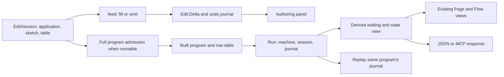

# Live editing and visualization design

## User-facing result

Keep an editable draft beside a recorded run of a specific program.
The draft explains what can be written at the selected address.
The run explains what happened and what answer it currently needs.

CX1/CX2 provide lexical parameter and capture information.
L4 connects an admitted program's waiting machine state to its meaning under the theorem's premises.
These results support richer inspection without permitting a paused run to adopt arbitrary edited code.

## Available features and missing connections

| Feature | Reuse | Smallest next connection |
| --- | --- | --- |
| Scope-aware parameter panel | `Eff.partAt`, `programFocusAt`, `Sketch.sigAt`, and the address table | Show the owning definition, value inputs, program parameters, and declared columns together |
| Typed template editing | `EditSession.open`, `feed`, `view`, and `feedStep` | Show a parameter's expected type and the actual refusal while filling a draft |
| Waiting-call inspector | `Run.outstanding`, `Program.originOf`, `Session.callInstance`, and inspection stores | Join the actual call key to its address and instantiated reply columns |
| Typed reply form | Checked `CallInstance`, `preflight`, `submit`, and `applyReply` | Generate a form for a supported value profile and submit through the existing protocol |
| Cleanup explanation | Retained stores, frame state, close snapshots, and finalizer events | Show the original failure beside pending cleanup and the current state |
| Replay slider | `Run.journal`, `Run.play`, and `journal_replays` | Inspect prefixes under the same built program and session configuration |
| Compare an edited version | Existing draft checking and a separately opened run | Re-run a compatible scripted host and compare calls, requests, stores, and exits |

Declarations are sourced below. Proposed connections are not implemented by this packet.

## One derived view, two independent histories

The core owners are `src/Effect4/Program/Edit.lean`, `src/Effect4/Api.lean`, and `src/Effect4/Run/Basic.lean`.
Rendering owners are `tools/Tools/View/Program.lean`, `Flow.lean`, and `Run.lean`.
The proposed waiting view is a derived product, not executable program syntax or a resumable serialized machine.

Suggested fields are the run's identity and program revision, current observation, stores projection, and a list of outstanding-call views.
Each call view carries its existing key, request, optional origin, and optional checked instance.
An unresolved origin remains unresolved. Do not guess it from the row name or request value.

Use one immutable `Run` to compute the whole view.
A current draft's address table must never explain an older run's saved path.
Renderers, CLI tools, and the proposed MCP adapter should consume that one view.
Keep proof evidence separate from core data. The core never imports the Laws graph.

## Consolidate the current viewer API

`Tools.View.Run.frame` currently accepts both a program argument and a `Run`.
It creates an edit session with an empty application and passes an empty row table to `codePanel`.
`Tools.View.Run.frames` explicitly supports programs without host rows.

Derive the program and row table from `Run.built` instead.
This removes a redundant input and prevents mismatched program/run displays.
Construct the displayed application from the same checked context that admitted the program.
Feed actual recorded runs to the viewer instead of rebuilding them through its empty-table helper.

`Tools.Query.answer` and `Tools.Session.answer` also use the empty application.
Pass the application through their existing request/session construction before advertising host-aware editing.
Do not introduce independent row-resolution logic in these wrappers.

## Source links have an exact scope

`Program.originOf`, in `src/Effect4/Program/Admit.lean`, reads a parked external call's saved address.
`origin_addresses_call`, in `src/Effect4/Laws/Api/SessionRef.lean`, connects that address to a call in a reached, funded run.

`HostSession.Session.callInstance`, in `src/Effect4/Api/HostSession.lean`, reads the session's cached checked instance.
Its call table uses the program with layer references expanded.
The bridge between original and expanded source addresses remains a separate obligation.
Refuse an incompatible joined view rather than showing the wrong checked columns.

`Flow.flowOf` currently keeps only a definition block's main-body flow.
A valid call in a definition may therefore have an outline address without a visible graph node.
Offer a definition drilldown or an explicit outline link.
Do not fabricate an edge or node by matching call payloads.

The finite controls resolve two actual waits to distinct source addresses and reply types.
They cover a loop and `onExit` cleanup without definitions or layers.
They do not prove the missing address correspondence for expanded references.

## Explain a wait precisely

`rows_loop_frontier` and `rows_loop_frontier_host` live in `src/Effect4/Laws/Api/SessionMeaningLoop.lean`.
They require a reached, funded, at-rest, host-driven run in `LoopedRows` and `LoopedDataRows`.
The arbitrary-host theorem also requires matching past answers and silence on the pending request.
Past a meaning-budget bound, the observation names the same pending row, request, stores, and host state.

This supports a scoped evidence label on the waiting inspector.
It does not prove that the host answers, that all budgets agree, or that a reply is admissible.
It excludes `invoke`, forks, `scoped`, acquisition, layers, and interruption.
Use the existing frontier reasons to distinguish command fuel, compile fuel, host waits, timers, and missing decisions.
Several reasons can coexist.

## Explain failure and cleanup

The probe's body changes a reference to `2`, then fails.
Its cleanup waits for `Probe.close(2)` before the original error becomes the final exit.
A destructive cleanup can instead ask for `Probe.close(0)` and still return that same error.
The viewer should expose the changed state and cleanup request, not only the final exit.

`scopeCloseSnapshot` and `storesCloseScopeUnsafe` in `src/Effect4/Machine/Stores.lean` mark a scope closed before cleanup finishes.
Remaining close work lives in `Name.closeSeq` with its exit and captures.
`EffName.restore` and `merge` in `src/Effect4/Program/Compile.lean` retain `onExit` exits.
`RunEvent.finalizerProgram` in `src/Effect4/Machine/Fibers.lean` supplies recorded finalizer events.

`RunFiber.finalizing` specifically represents child-interruption cleanup state.
It is not a general flag saying every finalizer is active.
Read the appropriate existing state instead of assigning one Boolean to all cleanup behavior.
A display of those fields needs no claim that S1's resource agreement is already proved.

## Reply authoring and replay

A reply form uses the instantiated `CallInstance` columns, not only the generic row declaration.
Form validity and reply admission remain different judgments.
`preflight` validates the existing envelope or the checked-instance envelope and neither applies nor consumes the reply.
Handle allocation and delayed reads retain their existing routes.

Show receipt and application as separate events.
A reply received by the session has not necessarily resumed its program.
Replay uses the recorded journal and invokes no external host.
`journal_replays` in `src/Effect4/Laws/Run.lean` applies to the same built program and session configuration.

For an edited program, open a new session and rebind scripted answers to its actual calls.
Compare their call sequence, requests, retained state, and exits.
Do not replay old reply envelopes blindly against changed calls.
A finite comparison remains finite, even when both programs pass the checker.

## Revision control before concurrent editing

`Tools.Session.Request` currently contains no expected revision.
Require a matching revision before applying an edit through a concurrent authoring service.
On mismatch, return a refusal and the current revision without changing the draft.

A program-only digest cannot identify the whole checking context.
The hole table, host rows, and service declarations also affect the checker.
Use an exact session revision for acceptance and keep the full context attached.
Use content digests for lookup with their stated collision premise.
The wire digest fields remain the D-C decision in `docs/core/api-surface.md`.
Do not pre-empt that ruling in a UI adapter.

An `Edit.Delta.spliced` response replaces the edited subtree's displayed segment.
Old addresses absent from the new segment must disappear.
`feed_repaint` proves an address-table fact, not a bound on graphical layout movement.
Layout may still move other nodes after a local source edit.

## What to defer

Do not yet offer safe continuation migration into edited code.
Stored paths can occur in argument sites, continuations, forks, releases, layer memo entries, and outstanding calls.
A new root can change their meanings even when its current highlight and output type stay unchanged.

Do not present static graph paths as executed branches.
Do not present a drawing cycle or a bounded wait as proof of deadlock.
Keep structural program edges, observed fiber waits, and theorem dependencies as distinct edge kinds.

The next design table places the required connectors before implementation.
See [PROOF-DAG.md](PROOF-DAG.md).
