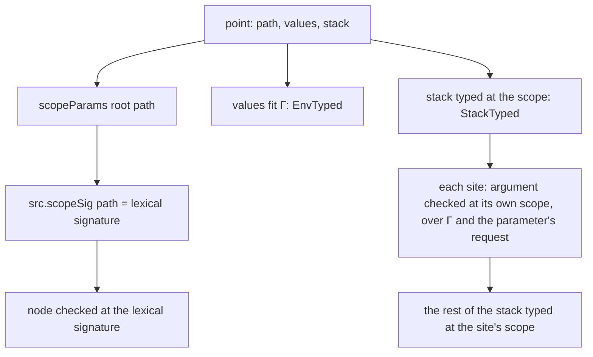
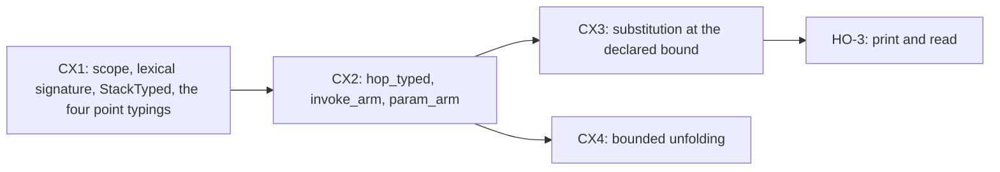

# 2026-10-10 Note: typed points at their lexical scope (CX1, CX2)

## 1. The one thing to know first

A point is a closure of a judgment with two contexts, `Θ ; Γ ⊢ e : τ`. `Γ` holds the values in
scope and `Θ` the programs passed as parameters. Lexical scope makes `Θ` a function of the
point's path, so the machine stores no type. The point's stack of sites is a substitution for
`Θ`, typed by structural recursion on the stack. `invoke_arm` and the parameter's arm then
become two instances of one hop lemma.
The M7 statement does not change. The core tree does not change: every new definition lives in
`Effect4.Laws`.

Placement: concept `residual-program-typing` (`docs/core/semantics.md`), claim `denote-typed`,
requirement R4. Consumers: the planned goal `invoke_arm`
(`src/Effect4/Laws/Program/Typed/Denotation.lean`) and, through it, M7 and the 17 claims that rest
on it (`#goal_impact`, 2026-10-10).

## 2. What fails today

`PointTyped` (`src/Effect4/Laws/Program/Typed/Admission.lean`) checks every point at
`src.signature`. `BodiesTyped` checks a body at `src.signature.withParams d.params`. The two
agree only at a definition with no parameter (`Signature.withParams` answers `sig` at `[]`), which
is why `call_arm` closes and `invoke_arm` cannot. The induction hypothesis `ChildDenotes` ranges
over typed points only, and no typed point stands inside a body with parameters. The parameter's
arm (`param_arm`) is proved by vacuity: at `src.signature` a parameter's run is outside the
domain. Both facts come from one cause: the point typing ignores the scope.

## 3. The theory

### 3.1 Parameters are second-class programs

A parameter of row 340 is a program that a definition receives, runs with one argument, and
never returns or stores in a value (program-parameters note §9.2: no value holds a site). This
is the second-class block of Effekt and System C (Brachthäuser, Schuster and Ostermann, "Effects
as capabilities", 2020; "Effects, capabilities, and boxes", 2022), and the second-class value of
Osvald, Essertel, Wu, González Alayón and Rompf ("Gentrification gone too far?", 2016).
Their type systems keep blocks in a second context beside the value context. Our checker
already does: `Signature.withParams` adds the parameters as rows, so `Θ` is a signature extension
and the parameter's rule is the row rule (note §4.1).

### 3.2 A parameter is a meta-variable, a site is a closure for it

In contextual modal type theory (Nanevski, Pfenning and Pientka, 2008) a meta-variable
`u :: B[A]` stands for an open term of type `B` in context `A`, and a meta-substitution `θ`
instantiates every meta-variable of `Δ`. Its typing is `Δ' ⊢ θ : Δ`. A parameter
`Pⱼ = Aⱼ ⇒ Bⱼ ! Eⱼ` is such a meta-variable with one hole. The machine never substitutes. It
keeps a closure per parameter: an `ArgSite`, the argument's path and the caller's values, as an
environment machine keeps a closure per variable (Ager, Biernacki, Danvy and Midtgaard, 2003).
The stack of frames is the meta-substitution, one frame per active invocation. A site is
evaluated at the stack below its own frame, so a site's typing needs the rest of the stack typed
at the site's own scope.

### 3.3 Lexical scope makes `Θ` a function of the address

Definitions stand only in the root's block: the checker refuses a block below the root
(`TypeReason.definitionBlock`). So the parameters in scope at a path are those of the definition
whose body holds the path, and `[]` outside every body. No frame needs to record its types:
the frame for the parameters in scope is the top of the stack, and the scope of a site is the
scope of its own path. The typing of a point is therefore determined by its path, its values
and its stack. This is the whole representation decision.

### 3.4 Why the alternatives lose

| Alternative | Why it loses here |
| --- | --- |
| Substitute the arguments into the body (CX3's substitution lemma) | A point addresses the root program by path; a substituted body is no subterm, so no point can stand in it. |
| Semantic typing of a site (a logical relation: the site denotes a typed program) | `PointTyped` would mention `TypedProg`, which mentions `BodyTyped`, which mentions `PointTyped`: a non-positive cycle, and a step index over fuel besides. |
| Store `Θ` in each frame | Redundant with the path; every hop would have to keep two copies in agreement. |
| Rename parameters per definition (`param k i`) into one global signature | A syntax and checker change for a fact the path already determines. |

The syntactic closure typing of §3.2 is the standard route of type safety for environment
machines, and it is the one our tree already half has: `PointTyped` is the typing of a closure
over `Γ`; this note adds `Θ`.

## 4. The representation



### 4.1 The scope of a path

```text
scopeParams root path : List ParamDecl
  root = .defs decls _ _ and path = 0 :: 1ᵏ ++ 0 :: _   ⇒ decls[k].params
  otherwise                                            ⇒ []
```

Body `k` stands at `defBodyPath root k = 0 :: 1ᵏ ++ [0]`, so the rule reads the definition's
index off the spine prefix. Three facts carry all the bookkeeping:

- descending inside an `eff` node keeps the scope (the spine prefix is untouched);
- the body of definition `k` has the scope `decls[k].params`;
- the sites of an invocation at `p` stand below `p`, so they have `p`'s scope.

### 4.2 The lexical signature

`Signature.lexical sig ps` is `withParams`'s update written without its case split on `ps`:
`{ sig with rowOf := …, dom := … }`. It equals `sig.withParams ps` at every nonempty `ps` by
definition. At `[]` it equals `src.signature` because `src.signature` keeps every parameter's run
outside its domain (`param_arm`'s `hout`). `src.scopeSig path := src.signature.lexical
(scopeParams src.program path)`.

The uniform form is the elegance point for the proofs. Every field but `rowOf` and `dom` is
`src.signature`'s field by definition, and so are `rowOf op` and `dom op` at every operation whose
`paramOf` is `none`. So the arms' facts about a host row, a store row, an invocation or a service
read at the lexical signature are the facts at `src.signature`, definitionally. An arm changes
only where it names `root.signature` as an explicit argument (thirty sites in
`Typed/Denotation.lean`), which becomes `_`. `withParams` itself stays as it is: the core tree,
the checker and the OCaml route do not change.

### 4.3 The stack's typing

```text
StackTyped src w ps : List (List ArgSite) → Prop        (structural recursion on the stack)
  stack ↦ ∀ j d, ps[j]? = some d →
            ∃ sites rest site, stack = sites :: rest ∧ sites[j]? = some site ∧
              ∃ arg env t, the root holds arg at site.path ∧
                check (src.scopeSig site.path) (env ++ [d.request]) site.path arg = ok t ∧
                d.admits t ∧ EnvTyped w env site.env ∧
                StackTyped src w (scopeParams src.program site.path) rest
```

- At `ps = []` the condition is vacuous: an inactive frame (a `call`'s body, the main program)
  constrains nothing, as review correction 3 of note §10 requires.
- The recursion is on `rest`, a strict suffix, so the definition is a function, not an
  inductive family.
- It mentions no `TypedProg`, so it stays positive.

### 4.4 One frame typing for every point

`PointTyped`, `LoopPointTyped`, `CaptureTyped` and `LayerPointTyped` share their frame: the node
checked at `src.scopeSig path`, the values typed (`EnvTyped`), the view typed, and the stack
typed at `scopeParams src.program path`. A capture holds `params` (`Capture.params`), and a
layer build and a loop point inherit them (`Point.layerBuild`, the loop point). So a release run
after its body returned, or a forked fiber, still has its sites typed: sites are first-order
data, and `StackTyped` is monotone along world extension. This covers review correction 6.

## 5. The laws

| Law | Statement | Consumer |
| --- | --- | --- |
| `scopeParams_child` | an `eff` node's child has the node's scope | every child arm, through `pointTyped_child` |
| `scopeParams_body` | body `k` has `decls[k].params` | `invoke_arm`, `call_arm` |
| `scopeParams_argSite` | an invocation's sites have the invocation's scope | `invoke_arm` |
| `lexical_nil` | `src.signature.lexical [] = src.signature` | the load (M7's statement is unchanged) |
| `lexical_eq_withParams` | equal at a nonempty list, by definition | `BodiesTyped`, the checker's `invoke` rule |
| `stackTyped_mono`, `stackTyped_rows_append` | along a world extension and a table append | `pointTyped_mono`, `pointTyped_rows_append` |
| `node_at_argSite` | the root holds argument `j` at site `j`'s path | `invoke_arm` |
| `checkEffs_slot` | each argument is checked over `env ++ [qⱼ.request]` and admitted at `qⱼ` | `invoke_arm` |
| `hop_typed` | a hop to a checked node, with typed values and a typed stack, denotes a typed program at every later world, widened to a bound | `call_arm`, `invoke_arm`, `param_arm` |

`hop_typed` is the deep module of the slice. Note §9.2 names the property ("preservation by
hop"): every hop is a new path and values built from the old ones by a rule the node fixes. The
three arms differ only in their target:

| Arm | Target path | Values | Stack | Bound |
| --- | --- | --- | --- | --- |
| `call_arm` | body `k` | `[v]` | unchanged (inactive) | the declaration |
| `invoke_arm` | body `k` | `[v]` | the call's sites over the old stack | the declaration |
| `param_arm` | site `i`'s path | `site.env ++ [v]` | the rest below the top frame | parameter `i`'s declaration |

`call_arm` keeps its current proof and is refactored onto `hop_typed` only if that shortens it.

## 6. Slices



- **CX1.** Add §4's definitions and §5's scope and signature laws in `Typed/Admission.lean`,
  and carry the stack through every arm. Every theorem stays proved, with two exceptions. The
  vacuity proof of `param_arm` no longer holds, so `param_arm` becomes a placed goal.
  `invoke_arm` stays one. The narrow build is the typed chain from `Typed/Admission.lean` on;
  no core module, generator input or behaviour gate is reached.
- **CX2.** Prove `hop_typed`, then `invoke_arm` and `param_arm` in place. `#plan_status` then shows
  `denote-typed` and M7 resting on no goal. The resting-goal pin in `Test/Audit/AxiomGate.lean`
  is updated at the next sweep.

## 7. Probe evidence

[Lexical.lean](2026-10-10-cx-lexical-scope/Lexical.lean) elaborates at `a6f4e8bb` with
`lake env lean`, with no error and no warning. It is a finite probe of §4.2, not a landing:

- `(src.signature.lexical ps).dom (.external i)`, `.rowOf (.call k)`, `.serviceTy` and
  `.atomOf` equal `src.signature`'s by `rfl`, at every `ps`;
- `src.signature.lexical (q :: qs) = src.signature.withParams (q :: qs)` by `rfl`;
- `lexical_nil`: `src.signature.lexical [] = src.signature`, proved from the domain fact that
  `param_arm` already uses, by `congr` and a case split on the operation.

## 8. What this does not establish

- No substitution lemma (CX3) and no unfolding law (CX4): the typed run goes through sites, not
  through an inlined body.
- No print or read of definitions with parameters (HO-3).
- No termination: a body that invokes itself without end runs to its budget's frontier.
- No equal-observation theorem: `denote-typed` is a typing of the run, not a simulation.
- The host boundary stays where `docs/core/host-boundary.md` puts it.
