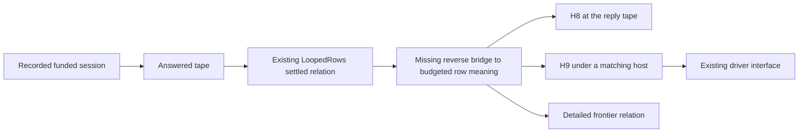
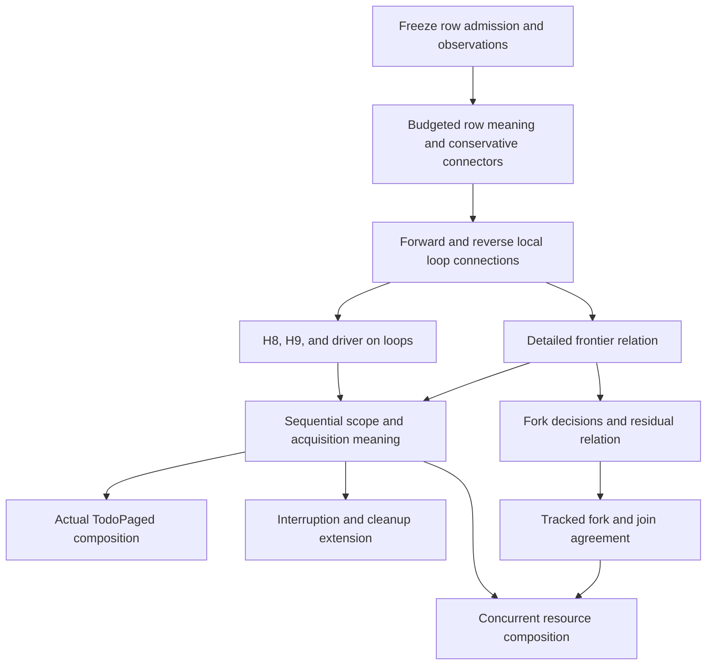

# Host meaning beyond straight programs

The next missing connection joins budgeted host meaning to the existing loop-capable machine relation.
It does not require another program representation.
Scopes then require retained cleanup state and prepared handles.
Forks require explicit scheduling decisions and a relation between residual computations.

**Evidence status:** theory and finite probes only.
**Base:** `540ee8ccb279dc8b808487e428e0e9a02d500a3f`, from `refactor/phase1-phase3`.
**Delivery branch:** `codex/host-meaning-widening`.
The packet changes no production source, including `tools/ProofGraph/Registry.lean`, root imports, owner rulings, or Lake configuration.

The packet uses the meanings of words in `docs/core/controlled-english.md`.
Here, a *detailed observation* records a finished exit or frontier, stores, and host state.
A *coarse observation* forgets every frontier's details and returns `none`.
Neither observation stores a resumable continuation.

## 1. Loops: the meaning, H8, and H9

### 1.1 What exists at the base

| Owner | Existing result | Limit relevant to this packet |
| --- | --- | --- |
| `denoteRows`, `meaningUnder`, `meaningRows`, in `src/Effect4/Laws/Program/DenoteRows.lean` | A call tree over store operations and declared host rows | `StraightRows`; iteration reaches the outside-fragment result |
| `denoteB`, `meaningB`, in `src/Effect4/Laws/Program/DenoteB.lean` | Budgeted iteration, nested loops, handlers, and explicit `onExit` cleanup | `Looped`; no host-row meaning or `catchIf` clause |
| `SoundB`, `meaningB_typed`, `meaningB_stores`, in `src/Effect4/Laws/Program/LoopSound.lean` | Typed answers and retained stores for admitted loop meanings | These statements do not add typed host replies |
| `loopAgreement_of_straight`, in `src/Effect4/Laws/Program/LoopAgreement.lean` | The loop agreement restricted to straight programs | The general result lives elsewhere |
| `localRun_compileB`, `loopAgreement`, in `src/Effect4/Laws/Program/Agreement/Loop.lean` | Semantic completion implies machine completion above an existential fuel bound on `Looped` | This direction does not recover a semantic result from a recorded run |
| `drive_seg`, in `src/Effect4/Laws/Program/Agreement/Segment.lean` | The segment connection admits `LoopedRows` | A machine connection does not add a loop clause to `denoteRows` |
| `Holds`, in `src/Effect4/Laws/Program/Agreement/Hosted.lean`, using the machine forms in `src/Effect4/Laws/Program/Agreement/Machine.lean` | A single root has related load, yield, call, and exit positions | No scope or concurrent-fiber meaning |
| `tape_holds`, `tape_holds_host`, in `src/Effect4/Laws/Api/SessionMeaning.lean` | A compatible recorded host tape maintains the relation on `LoopedRows` | Their closing meaning lemmas still require `StraightRows` |
| `denoteRows_eq_session`, `denoteRows_eq_session_host`, in `src/Effect4/Laws/Api/SessionMeaning.lean` | H8 at the reply tape; H9 at any matching host for a finished run | `StraightRows`, funded, at rest, and host-driven |
| `runWith_host_denotes`, in `src/Effect4/Laws/Api/HostDrive.lean` | H9 reaches the public driver and composed hosts | It assumes a finished, funded run, row-key distinctness, and the guarded host |

`Test/Program/FragmentCensusContract.lean` names the constructor cuts.
`LoopedRows`, in `src/Effect4/Laws/Program/FragmentLoopedRows.lean`, accepts every external row position without consulting a table.
It therefore accepts missing rows and handle-returning rows.
The current H8 fragment separately checks `dataRow`, in `src/Effect4/Laws/Program/FragmentRowAdmission.lean`.
That check rejects a top-level handle answer and requires an external row.
It is not a recursive assertion that every type contains no handles.

**Decision:** keep that row-admission premise when widening H8.
The research predicate `LoopedDataRows` in [Meaning.lean](Meaning.lean) updates only `StraightRows.alg`'s iteration field.
It keeps the existing generated fold and row admission.
The proposed H8 states both `LoopedRows` and `LoopedDataRows` explicitly.
A later implication helper can remove the redundant machine-fragment premise.

### 1.2 The candidate budgeted meaning

`denoteRowsB` in [Meaning.lean](Meaning.lean) has this checked type:

```lean
denoteRowsB (table : RowTable) (k : Nat) :
  NativeEff → List Val → Effects.Program (RowsSig table) (Option ExitV)
```

`Eff` remains the stored program.
`Effects.Program` remains a semantic call tree, with continuations used only by the proof carrier.
The candidate runs no compiler, local runner, or machine.
It reuses term evaluation, the store handler, the host signature, and `iter` from `src/Effect4/Laws/Program/Iter.lean`.

The budget `k` bounds the number of tests of each loop invocation.
The last false test also uses one unit.
Every nested body receives the same `k`, as in `denoteB`.
This budget is distinct from program compilation fuel, local machine steps, session command fuel, and driver rounds.
No equality between those budgets forms part of this plan.

A cut propagates through sequencing, handlers, reified exits, and finalizers.
A budget cut inside a body does not start its finalizer.
An actual failure does start that finalizer, with the stores already produced.
`Exit.restoreAfterFinalizer`, in `src/Effect4/Machine/Exit.lean`, combines the exits.

Running the tree through the current host handler gives:

```lean
meaningUnderB H k e env stores hostState :
  Option ((Option ExitV × Stores) × HostState)
```

| Result | Meaning | Retained information |
| --- | --- | --- |
| `some ((some exit, stores), hostState)` | Finished approximation | Exit, stores, host state |
| `some ((none, stores), hostState)` | Loop-budget frontier | Stores and host state |
| `none` | The host supplies no answer | This carrier discards the visible stores and host state |

The outer loss comes from the existing `StateT Stores (StateT HostState Option)` arrangement.
It is an observation limit, not evidence that the actual session loses state.
`observeTree` in [Meaning.lean](Meaning.lean) retains the stores, host state, and exact waiting row/request.
It evaluates the same semantic tree independently of the session.
Its `End.budget` still omits the loop cursor and residual body.
Therefore it cannot yet support resumption or identify every computational frontier.

The proposed connector between these observations is Q3 below.
The finite controls check its intended cases, but prove no general connector.

### 1.3 H8 on loops

[Goals.lean](Goals.lean) elaborates this planned goal:

```lean
@[semantics "translation-simulation" (requirement := R6)]
proof_goal h8_loopedRows : H8LoopedRows
```

`H8LoopedRows` quantifies over a reached run with these premises:

- its recorded journal is funded;
- it is at rest;
- its controls are host-driven;
- its program satisfies `LoopedRows` and the table-indexed `LoopedDataRows`.

Its conclusion is:

```lean
∃ lower, ∀ k, lower ≤ k →
  coarseRowsB s.built.table k s.built.program [] Stores.empty (Run.appliedExits s) =
    s.exit.map (fun ex => ((ex, s.machine.state), []))
```

A finished run therefore determines the exit, all stores, and consumption of its applied reply tape.
For an unfinished run, both sides use the coarse `none` observation.
This statement alone cannot distinguish persistent budget cuts from an eventual host wait.
Q4 supplies that stronger connection.
Neither statement turns a finite budget cut into a typed failure or a divergence claim.

The bound is existential because loop counts depend on replies and branch outcomes.
Do not add a global compile-depth premise merely to shorten the proof.
The existing settled relation must exclude a visited compile frontier.
An unvisited branch may exceed the compile budget without preventing the recorded run from finishing.

### 1.4 H9 on loops

`H9LoopedRows` in [Goals.lean](Goals.lean) is an elaborated proposition, not another planned theorem.
It adds an arbitrary host `H`, initial and final host states, and the existing `Run.HostAnswered` premise.
That premise checks the replies at the machine's actual requests along the recorded tape.
It also retains `s.exit = some ex`.
Its proposed conclusion is:

```lean
∃ lower, ∀ k, lower ≤ k →
  meaningUnderB H k s.built.program [] Stores.empty initial =
    some ((some ex, s.machine.state), final)
```

Past replies do not constrain the host's next reply.
A run waiting for cleanup can have the same past replies as a host that immediately answers cleanup.
`prefixDoesNotStopHost` in [BoundaryControls.lean](BoundaryControls.lean) checks that case.
A waiting version of H9 must also require that the host stops at the named pending call.
Alternatively, it must consume an explicit interaction prefix and stop there.

After H9, widen the driver theorem under its existing envelope, distinct-key, funding, rest, and completion premises.
Retain the guarded host in its meaning.
Guarded execution does not equal execution under an arbitrary unguarded host.
The result does not prove that the driver receives answers, gets enough rounds, or finishes.

### 1.5 The missing meaning connections

The missing reverse direction is substantial.
Existing `loopAgreement` starts from a finished semantic approximation and reaches a machine exit.
H8 starts from a recorded machine run.
It needs a reverse connection from a finite local exit to an adequate semantic approximation.
Identifying a waiting frontier additionally needs a reverse connection from finite waits.

The proof route should reuse the existing hosted relation:



`ReachesC`, in `src/Effect4/Laws/Program/Agreement/Segment.lean`, collapses waits in its final observation.
It cannot identify the pending request and retained stores by itself.
The reverse bridge for Q4 must strengthen the observation or retain related residual positions.

`interpret_rowsHandler`, in `src/Effect4/Laws/Program/HostRuns.lean`, is already generic in the tree's answer type.
Apply it to the optional exit carrier instead of repeating its interpreter proof.
`Folds/Denote.lean` and `Folds/DenoteRows.lean`, under `src/Effect4/Laws/Program/`, demonstrate the existing `fold_of` route.
Production integration should generate the candidate's algebra and connector there.

Consolidate the shared sequencing and loop-step clauses across `denoteB` and the new row meaning.
Compare their algebras through the existing fold agreement, rather than proving constructor-by-constructor agreements between every interpreter pair.
Keep store operations, host interactions, and unsupported program syntax as explicit interpretation choices.
Do not expose those choices as new module-author configuration knobs.

## 2. Scopes and resources: what meaning must retain

### 2.1 What the data-cursor probe leaves open

The probe uses `Stream.drain`, in `src/Effect4/Library/Stream/`, with scalar cursor replies and explicit `onExit` cleanup.
It checks iteration and cleanup under host calls.
It does not interpret `scoped` or `acquireRelease`.

The actual `listPaged` in `Test/Dogfood/Scenario/TodoPaged.lean` uses `runCollect` and an external cursor handle.
Its expansion includes a scope, acquisition, and a drain loop.
The retained controls confirm that this program lies outside both loop fragments used by the probe.
Its existing finite machine tests do not establish a compositional host-meaning theorem.

### 2.2 The additional state and rules

`scoped` and `acquireRelease` are not ordinary `onExit` substitutions.
Their meaning must retain the following data and transitions.

| Data or rule | Semantic requirement | Existing owner to connect |
| --- | --- | --- |
| Ambient and captured contexts | Acquisition sees the installed scope; release sees its captured context; close restores the outer context first | `enterScoped`, `exitScoped`, `contAOf`, in `src/Effect4/Program/Compile.lean` |
| Scope identity and state | Allocate a fresh sequential scope; distinguish open from closed | `Scope`, in `src/Effect4/Machine/Scope.lean`; scope store in `src/Effect4/Machine/Stores.lean` |
| Finalizer registration identity | Retain the acquired value, release address/environment, capture, and registration order | `FinName` and registration operations in those owners |
| Close snapshot and original exit | Mark closed before cleanup; retain the registrations and the body's original exit | `scopeCloseSnapshot`, `storesCloseScopeUnsafe`, in `src/Effect4/Machine/Stores.lean` |
| Cleanup position | Retain completed registrations, active cleanup, pending cleanup, and accumulated cleanup exits | `ScopeMachine`, in `src/Effect4/Laws/Machine/ScopeMachine.lean` |
| Exit combination | Continue after cleanup failure; every release receives the original close exit | `Exit.asVoidAll`, `Exit.restoreAfterFinalizer`, in `src/Effect4/Machine/Exit.lean` |
| Mask state | Acquisition plus registration and release have their required masking rules | `acquireMasked`, `releaseMasked`, through `interpOf`, in `src/Effect4/Program/Compile.lean` |
| External handle preparation | Distinguish the raw allocation reply from the value delivered to the program | `externalValue`, `prepareExternalAnswer`, in `src/Effect4/Program/Compile.lean` |
| Interrupted or waiting cleanup | Keep stores, host state, captures, and pending cleanup available at a frontier | R11 and R12 in `docs/core/system-map.md` |

An allocation reply `.nat i` requests the next external handle index.
The machine records its target declaration and delivers `Value.external i`.
The semantic acquisition must perform the same preparation independently.
Passing the raw number to the continuation would describe another program behavior.
A fixed correspondence must relate external handles, scopes, and registrations throughout the observation.
Choosing a fresh correspondence separately for each event would hide identity errors.

Use the existing first-order points and environments for captured program regions.
Do not store a new program tree or host closure inside canonical program data.
A proof-only residual relation may relate those points to semantic continuations.

The first resource fragment should admit sequential regions, loops, data host calls, and validated external acquisition replies.
Require a valid ambient scope at each acquisition.
Exclude arbitrary native scope mutation, layers, concurrent cleanup, delayed reference replies, and explicit interruption decisions initially.
Existing synchronous store allocation is not generally forbidden by the loop fragment.

Even without explicit interruption, keep the acquisition/release masks in the relation.
They determine the next widening's behavior.
Then add interruption with its own statement and controls.
Existing `hostDriven` excludes those decisions, so retaining that premise cannot prove cancellation behavior.

### 2.3 Proposed resource statement

The following names describe a proposed statement, not declarations claimed to exist.
`ScopedHostMeans` is an independent finite relational meaning over the existing `Eff`.
`ScopedObservation` records exit, stores, calls, prepared handles, scope states, registration identities, and cleanup progress.
`scoped_host_agrees` has this shape:

```text
Reached(s), funded(s), atRest(s), hostDriven(s), ScopedRows(table, program),
HostAnswered(table, H, program, commandFuel, tapeOf(s), initialMachine, h0, h1),
s.exit = some ex
  ⇒ there exist a fixed identity correspondence ρ and semantic observation o such that
       ScopedHostMeans(table, program, [], emptyStores, emptyContext, H, h0, o, h1)
       and o = observeScoped(ρ, s)
       and o.exit = some ex.
```

`ScopedRows` includes contextual handle-preparation premises and the stated sequential resource cut.
The meaning must support budget frontiers, but this first theorem concludes only for a finished run.
Its prefix companion retains cleanup state at every related cut.

For a close snapshot `registrations` and original exit `original`, the prefix companion requires:

```text
reverse(registrations) = completedIds ++ activeId.toList ++ pendingIds
scope is closed with original
registration identities are distinct across those three parts
completed and active releases receive original
captured values, points, contexts, masks, stores, and host state remain related
a completed-cleanup receipt requires phase complete, no activeId, and no pendingIds
```

A failed release joins the completed part; later cleanup still runs.
An unanswered release stays active and has no completed-cleanup receipt.
A closed scope therefore does not imply completed cleanup.
An empty close also needs its administrative completion step before it supplies a cleanup receipt.
`emptyClose` in [BoundaryControls.lean](BoundaryControls.lean) checks this boundary against the existing scope machine.
Exactly-once accounting concerns registration identity inside the model.
It does not imply exactly-once network requests or physical resource release.

`ScopeMachine.runState_complete` and `ScopeRestoration.resumeClosedScope_complete` give local close connections.
Their files are `src/Effect4/Laws/Machine/ScopeMachine.lean` and `src/Effect4/Laws/Machine/ScopeRestoration.lean`.
They do not relate a whole application, arbitrary finalizer programs, or host scheduling to that meaning.
Use them as dependencies of the resource relation.
Do not present them as the missing whole-run theorem.

## 3. Forks: decisions, observations, and relational meaning

### 3.1 What a tape adds

A row host answers a request from its state.
It does not select a fiber, order reply applications, advance the clock, or deliver interruption.
`Api.Decision` records those choices in the machine's `RunDecision` alphabet.
Two compatible tapes can therefore give different observations of the same program under the same row host.

The theorem remains an equal-observation statement after fixing a compatible decision tape.
The full meaning remains a relation over admitted compatible decision histories.
Decisions row 333 requires module laws to range over admitted tapes and to observe client host calls in order.
It does not replace those tapes with one scheduler policy or an arbitrary lawful-host premise.

`Run.nextControl`, in `src/Effect4/Run/Basic.lean`, offers one driver policy.
It is not the language's full meaning.
The work view also supplies no theorem that its offered moves describe every possible decision or establish deadlock.

### 3.2 The connection already present

`session_eq_ref`, in `src/Effect4/Laws/Api/SessionRef.lean`, already applies to any built program under its reached and funded premises.
It uses `run_eq_ref_table_noPreload`, in `src/Effect4/Laws/Program/Table/Agreement.lean`.
Those operational connections cover forks and scopes without constructing their call-tree meaning.
Their observation does not include every session-ledger fact, host specification, or cleanup claim proposed here.

The historical plan in `docs/research/2026-10-09-host-coalgebra.md` initially proposed one session bisimulation for every host.
At this base, H9 instead generalizes the local hosted relation through `tape_holds_host`.
`sessionSystem`, in `src/Effect4/Laws/Api/HostDrive.lean`, hides stores in a call-tree system.
Its name does not establish a machine-session bisimulation.
Do not recreate a semantic side by wrapping the same machine runner and call that an independent connection.

The pinned Effects package supplies `IsSim`, `IsBisim`, finite unfolding laws, and their host-run consequences.
Its `Step.Lift` requires matching operations and related continuations.
It supplies no generic stuttering simulation or indexed system at this pin.
The source and machine may take different numbers of internal steps before the next interaction.
Prove a settling connection or supply a generic stuttering relation before using same-depth unfolding equality.

### 3.3 The first fork statement

Start with tracked child forks, data host replies, and explicit joins.
Exclude races, daemons, clocks, interruption, external handle allocation, and dynamic scope transfer initially.
Add cleanup composition after the sequential resource relation exists.

The proposed `fork_prefix_agrees` relates an independent source residual configuration to the session at a completed journal prefix.
The configuration identifies each fiber's source point, environment, continuation, stores, child obligations, and pending interaction.
It references the existing program rather than storing another syntax.

```text
Reached(s), funded completed prefix T, ForkRows(program, table),
compatible(T, sourceStart, machineStart), matching load inputs,
HostAnswered(table, H, program, commandFuel, T, machineStart, h0, h1)
  ⇒ sourcePrefix(program, T, H, h0) and the session prefix
       have equal PrefixObservation, equal host state, and related residual configurations.
```

`PrefixObservation` names fiber exits, stores, outstanding calls, child obligations, and ordered client requests.
Identity-bearing data use one fixed correspondence.
The decision-preservation helper is a proof dependency, not a premise that assumes the desired agreement.
The compatibility judgment must state which decisions each related position admits.
A work-view snapshot alone cannot serve as that judgment.

Use `tapeFrom_cut_replays` and `tapeFrom_position_replays`, in `src/Effect4/Laws/Run/Tape.lean`, for completed journal prefixes.
The first stopped row may already change the machine.
These existing theorems do not establish its post-row observation.
That row needs a separate partial-step relation before widening the prefix statement.

`fork_finished_agrees` follows when the chosen completion condition holds.
For the first slice, the root and its joined tracked children must finish.
A root exit alone does not establish child quiescence or completed cleanup.

Finally, `fork_relational_agrees` compares the sets of finite observations over every admitted compatible history.
It follows only after the fixed-tape theorem covers that history class.
Infinite histories, divergence, fairness, termination, and eventual host answers remain separate obligations.

## 4. Order, estimated effort, and capabilities

These are planning estimates in focused person-days, not measured delivery times.
The ranges include narrow checks and independent review.
New counterexamples or a change to the observation require re-estimation.



| Step | Estimate | Required delivery | What it enables |
| --- | --- | --- | --- |
| L1: budgeted row meaning and conservative connectors | 2–3 days | Q1 and Q3; generated fold integration; explicit row admission | Existing straight host clients keep their meaning; nested host loops have a semantic carrier |
| L2: stability and local connections | 7–11 days | Q2, Q5, Q6a; reverse completion and coarse waiting evidence | Recover meaning from recorded loop execution; stop relying on one finite script |
| L3: H8, H9, and driver closure | 2–3 days | Q7–Q9; inherited driver premises and finite controls | Host-loop modules use the existing driver with a named equal observation |
| L4: detailed frontiers | 4–7 days | Q4 and Q6b; stronger local waiting relation, residual state, pending request, and related budgets | Waiting streams and cleanup retain inspectable state; R12 scope stays explicit |
| S1: sequential resource contract and meaning | 3–5 days | Q11 and Q12 definitions; masked acquisition, captures, close snapshot, reply preparation | Give `scoped` and `acquireRelease` an independent host meaning |
| S2: resource connection | 3–5 days | Q11 and Q12 relations and proofs; prefix controls | Connect registration accounting and completed cleanup to real runs |
| S3: paged-module composition | 1–2 days | Q14 and the actual TodoPaged program | Reuse stream behavior without another interpreter or fixture-only claim |
| S4: interruption extension | 2–4 days after its contract is frozen | Q13; pending causes and acquisition/release boundaries | State exactly which cancellation and release guarantees hold |
| F1: fork theory and discriminating probes | 2–4 days | Q15–Q17 definitions; two-call order and child-join controls | Freeze the decision observation and test the residual relation |
| F2: first tracked-fork/join connection | Tentatively 5–10 further days | Q16–Q20; settling or stuttering dependency resolved | Fixed-tape and relational finite observations for the first concurrent fragment |

L1–L3 together are approximately 11–17 person-days.
L4 builds the stronger local waiting relation and lifts it to session frontiers.
L2 includes only coarse waiting evidence; its estimate does not include Q6b.
F2 has the greatest uncertainty because its residual relation does not exist yet.
General races, daemons, concurrent cleanup, and capability retirement have no credible estimate before their first discriminating probes.
Q10, the typed host-loop result, needs its own protocol contract before an estimate.
It is not an unstated part of H8 or H9.

### 4.1 Requirements R1–R14

The requirement definitions remain those of `docs/core/system-map.md` §8.
This table names contributions, not new requirement statuses.

| Requirement | Contribution of this plan | Remaining boundary |
| --- | --- | --- |
| R1: parameterized signature | Loop meanings quantify over the row table and host | General signature admission and every milestone remain separate |
| R2: conservative extension | Q1 connects the new meaning to existing straight and host-free meanings | Table append and other extension obligations still need their own connections |
| R3: data | Existing values, types, and program syntax suffice for the first loop slice | No recursive-data or general codec result |
| R4: state | Frontiers and finalizers retain prior stores | No new general typed-cell allocation theorem |
| R5: services | Resource meaning relates captured and restored contexts | Layers and code-valued service behavior remain outside the first fragment |
| R6: host | Direct contribution: host meaning for loops, resources, and then forks | Host progress, cancellation contracts, capability retirement, and physical conformance remain separate |
| R7: retained behavior | Release registration retains an address, environment, value, and context | No general first-class code-entry or retained-service theorem |
| R8: named execution connections | Each fragment names its observation and operational connection | No TypeScript, OCaml, WASM, or number-profile execution claim |
| R9: typed runtime guarantees | Q10 plans a host-loop typing connection with admitted replies and worlds | Equal observation alone supplies no reply lawfulness or new M5–M7 theorem |
| R10: library composition | Stream and resource clients consume shared meaning laws | Each module still needs its independent behavior specification and wrapper connection |
| R11: release | Q11 records registration identity, order, active cleanup, and completion | No release from a merely closed bit; no unconditioned release under interruption |
| R12: frontiers | Q4 and Q15 name pending interaction and residual work | No fairness, deadlock, termination, or divergence conclusion from a finite cut |
| R13: inputs as data | Fork meanings fix compatible recorded decisions and matched load inputs | No new Config admission or full input congruence theorem |
| R14: authoring and explanations | Shared observations can later explain why a module waits | No new sketch, graduality, replacement, or minimal-type-slice theorem |

## 5. Placement of every proposed obligation

All names in this section are proposed, except the explicitly linked research declarations.
Every production pointer below means a future `proof_goal` at that name before proof work begins.
The packet edits no registry and claims no new production theorem.
The property references name required properties in `docs/core/semantics.md`.
When a property needs widening, the coordinator must add that wording and its registry claim in the implementing slice.

### 5.1 Loop and host obligations

| ID and pointer / placement | Concept and required property | Registry question, role, consumer | Exact reach and premises | Does not establish | Requirement |
| --- | --- | --- | --- | --- | --- |
| Q1 `denoteRowsB_straight`, `denoteRowsB_looped`, future `Laws/Program/DenoteRowsB.lean` | `translation-simulation`: conservative host meaning | Steps of `rows-denotation-straight` and proposed `rows-loop-session`; compatibility; Q5–Q8 consume | On `StraightRows`, tree equals `some <$> denoteRows`; on `Looped`, tree equals the injected `denoteB`; same environment and budget | No machine, host progress, table extension, or unsupported constructor result | R2, R6 |
| Q2 `meaningUnderB_stable`, same owner | `translation-simulation`: loop agreement's budget independence | Helper of proposed `rows-loop-host`; preservation; Q6a and Q8 consume | Fixed host and start states; a finished result at `k` has the same exit, stores, and host state at every larger budget | No eventual completion or equality of arbitrary unfinished approximations | R6, R12 |
| Q3 `observeTree_projection`, same owner | `host-session-protocol`: frontier information and meaning observation | Helper of proposed `rows-loop-frontier`; compatibility; Q4 and Q7 consume | Finished projects to nested `some`; budget projects to inner `none` with state; waiting projects to outer `none`; same tree and host | No general resumable continuation or session connection | R6, R12 |
| Q4 `rows_loop_frontier`, future `Laws/Program/Agreement/HostedLoop.lean` | `host-session-protocol`: extend frontier characterization to retained semantic state | Proposed `rows-loop-frontier`; simulation; resource prefix and waiting driver consumers | Row-admitted `LoopedRows`; related residual cut and stores; matched applied prefix; for H9 waiting, no host answer at the pending request or explicit prefix stopping | No equality at unrelated budgets, progress, divergence, or post-stopped-row claim | R6, R11, R12 |
| Q5 `localRunC_compileB`, future `Laws/Program/Agreement/LoopCalls.lean` | `translation-simulation`: loop agreement with calls | Helper of proposed `rows-loop-session`; simulation; Q6a and Q7–Q8 consume | Budgeted semantic completion under one fixed host implies a local exit at adequate local/compile bounds; admitted rows and related environment/stores | No reverse implication or identical fuel units | R6 |
| Q6a `localRunC_to_rowsB`, same owner | `translation-simulation`: recover meaning from finite execution | Helper of proposed `rows-loop-session`; adequacy; Q7 and Q8 consume | A finite related local exit implies an adequate finished approximant; discharge visited compile frontiers; coarse waits use Q5 to exclude semantic completion | No exact waiting request/state, global compile-depth premise added to H8, or liveness | R6 |
| Q6b `localWaitC_to_rowsB`, same owner | `translation-simulation`: recover a semantic waiting position | Helper of proposed `rows-loop-frontier`; adequacy; Q4 consumes | A finite related local wait yields an adequate approximant with the same pending row/request, stores, and host state; fixed host stops there or the semantic prefix stops explicitly | No conclusion from coarse `ReachesC` alone, arbitrary-host stopping, or unrelated budget equality | R6, R12 |
| Q7 `Test.HostMeaningWidening.h8_loopedRows`, [Goals.lean](Goals.lean); future `Laws/Api/SessionMeaningLoop.lean` | `translation-simulation`: recorded run equals meaning | Proposed extension of `rows-denotation-session`, named `rows-loop-session`; simulation; module and driver consumers | Exactly `H8LoopedRows` in the probe; reached, funded, at rest, host-driven, row-admitted loops; eventual budget bound | Coarse frontier only; no scope, external handle allocation, fork, interruption, or progress | R6, R10 |
| Q8 `denoteRowsB_eq_session_host`, same future owner | `translation-simulation`: arbitrary matching host | Proposed extension of `rows-denotation-host`, named `rows-loop-host`; simulation; Q9 consumes | Exactly `H9LoopedRows` in [Goals.lean](Goals.lean); Q7 premises plus finished root and `HostAnswered` | No unfinished-host conclusion from past answers alone; no host lawfulness theorem | R6 |
| Q9 `runWith_host_denotes_looped`, future `Laws/Api/HostDriveLoop.lean` | `translation-simulation`: driver inherits host meaning | Proposed extension of `rows-denotation-driver`; simulation; public `Run.runWith` consumer | Q8 plus existing distinct row keys, guarded reactor/host, envelope, funding, rest, and finished drive | No sufficient rounds, funding, host response, or termination guarantee | R6, R10 |
| Q10 `meaningRowsB_typed`, future `Laws/Program/LoopRowsSound.lean` | `store-typing`: membership of answers and stores | Proposed typed host-loop subclaim under R9; preservation; typed module consumers | Checked program at the application signature; well-typed input stores/environment; admitted host protocol and world extension; completed meaning | No typing from an arbitrary `Comodel`, and no new host-progress premise discharge | R1, R6, R9 |

Q1–Q10 retain decisions row 310's host exclusions until an explicit later widening.
Q7 deliberately avoids claiming Q4 from its weaker observation.
The fragment fold's implication into `LoopedRows` is a helper of Q6a, Q6b, Q7, and Q8.
The production fold connector serves Q1 and uses the existing `initial-algebras-folds` uniqueness property.
Neither helper needs an independent top-level claim.

### 5.2 Resource obligations

| ID and proposed pointer / placement | Concept and required property | Registry question, role, consumer | Exact reach and premises | Does not establish | Requirement |
| --- | --- | --- | --- | --- | --- |
| Q11 `cleanup_prefix`, future `Laws/Program/Meaning/Scope.lean` | `scope-lifetime-finalization`: state-first close, order, retained state, completed cleanup | Proposed `scoped-cleanup-prefix`; preservation; Q12 consumes | Related cut during one sequential close; fixed identity correspondence; captured registration snapshot and original exit; masks, captures, host state, and stores related | Closed does not imply cleanup finished; no progress, parallel cleanup, or network exactly-once result | R11, R12 |
| Q12 `scoped_host_agrees`, future `Laws/Api/SessionMeaningScope.lean` | `translation-simulation`: host meaning of resource regions | Proposed `scoped-host-agreement`; simulation; Q14 consumes | The statement in §2.3; reached, funded, settled, host-driven, finished; sequential fragment; raw host replies and prepared fresh handles related | No interruption, general capability ownership/retirement, host conformance, or target execution | R6, R8, R10, R11 |
| Q13 `scoped_interrupt_agrees`, future `Laws/Api/SessionMeaningScopeInterrupt.lean` | `scope-lifetime-finalization`: masked acquisition and release under explicit interruption | Proposed interruption part of scoped host agreement; simulation; cancellable module consumers | Q12's region model widened to selected admitted interruption decisions; pending causes, mask restoration, registration atomicity, and cleanup cuts included | No fairness, immediate cancellation of a masked operation, or general cancellation protocol | R6, R11, R12 |
| Q14 `todoPaged_host_agrees`, future `Laws/Library/Stream/HostMeaning.lean` with TodoPaged reader | `translation-simulation`: library expansion inherits behavior | Proposed paged-stream instance of R10; simulation; application list consumer | Independent stream model, exact expansion, Q12's fragment and host premises; ordered open/pull/close requests and all stores/cleanup observed | No database correctness, every Stream operation, or implication from finite fixtures alone | R6, R10, R11 |

Acquisition preparation and scope-capture helpers belong under Q12, consumed by its residual relation.
They establish local correspondence of raw replies, delivered handles, captured values, and contexts.
They do not establish the full host lifecycle.
Their bounds are `docs/core/host-boundary.md` §§4.2–4.5 and the interim allocation rule in §5.
Resource placements retain decisions rows 156, 188, 191, 227, 244–246, and 309–310.

### 5.3 Fork obligations

| ID and proposed pointer / placement | Concept and required property | Registry question, role, consumer | Exact reach and premises | Does not establish | Requirement |
| --- | --- | --- | --- | --- | --- |
| Q15 `fork_position_compatible`, future `Laws/Program/Meaning/ForkPosition.lean` | `reactive-scheduling`: allowed decisions at a position | Proposed `fork-position-compatible`; compatibility; Q17 consumes | Explicit enabled moves and finite compatible tapes; matched source and machine residual positions | No eventual scheduling, reply, deadlock conclusion, or completeness from `Run.Work` alone | R12 |
| Q16 `fork_requests_related`, future `Laws/Program/Agreement/Fork.lean` | `host-session-protocol`: selected replies name actual requests | Helper of `fork-prefix-agreement`; preservation; Q17 consumes | Row, request, fiber correspondence, token selection, and host state match at each admitted answer | No arbitrary-host lawfulness or reply commutativity across dependent requests | R6, R12 |
| Q17 `fork_decision_keeps_relation`, same owner | `translation-simulation`: related residuals across selected decisions | Helper of `fork-prefix-agreement`; simulation; Q18's tape induction consumes | Every allowed control/reply action in the first tracked-fork fragment; settling or stuttering connection; child and store correspondence | Invariance alone is not progress; no blanket same-depth unfolding claim | R6, R8 |
| Q18 `fork_prefix_agrees`, future `Laws/Api/SessionMeaningFork.lean` | `translation-simulation`: equal finite prefix observation | Proposed `fork-prefix-agreement`; simulation; Q19 and Q20 consume | §3.3's statement; reached run, completed funded journal prefix, compatible decisions, matching inputs and host answers | No effect of the first stopped row, termination, fairness, race, daemon, interruption, or resource claim | R6, R8, R12, R13 |
| Q19 `fork_finished_agrees`, same owner | `translation-simulation`: completed observation | Proposed `fork-finished-agreement`; simulation; joined concurrent clients consume | Q18 and the declared completion condition, including completed joined tracked children | Root exit alone is insufficient; no eventual completion or cleanup conclusion | R6, R8, R10 |
| Q20 `fork_relational_agrees`, same owner | `translation-simulation`: full finite meaning ranges over admitted decisions | Proposed `fork-relational-agreement`; simulation; scheduler-independent finite module laws consume | Every admitted compatible finite history in the frozen fragment, through Q18; same named observation | No infinite-trace, divergence, physical-host, or fairness claim | R6, R8, R13 |

These placements retain decisions rows 314 and 333.
Rows 310 and 314 already supply operational agreement; Q18 adds an independent semantic connection.
Concurrent resource composition needs Q12 and Q18 before it receives its own statement and placement.

## 6. Probe evidence and its limits

### 6.1 Files and checks

| File | Purpose | Evidence kind |
| --- | --- | --- |
| [Meaning.lean](Meaning.lean) | Budgeted row meaning, row-admitting fold, detailed and coarse observations | Elaborated research definitions |
| [Goals.lean](Goals.lean) | Exact H8 planned goal and H9 proposition | Elaborated statements; H8 remains open |
| [Controls.lean](Controls.lean) | Existing stream drain versus checked session; mutations and fragment limits | Finite evaluations |
| [BoundaryControls.lean](BoundaryControls.lean) | Request-sensitive host, missing replies, state before failure, budget cuts | Finite evaluations |
| [Audit.lean](Audit.lean) | Exact dependency audit and goal status | Local axiom gate invocation, not a production proof |
| [verify.py](verify.py) | Sequential narrow verification and evidence receipt | Reproduction command |
| [verification.json](verification.json) | Commands, exit codes, timestamps, source hashes, and guard count | Measured receipt |

The controls do not import `Goals.lean`.
The open H8 statement supplies no evidence for any finite comparison.
The audit uses `#axiom_audit`; the status report uses `#plan_status`.
Read their exact output in [Audit.log](Audit.log).
Independent GPT-6.1 Sol reviews challenged the loop statements, resource observation, and fork plan.
Those reviews corrected the cleanup receipt condition and separated coarse loop work from detailed waiting-state work.
The new scope control retains the former finding; §4 assigns the latter work to L4.

Run the packet from its own worktree:

```sh
python3 docs/research/2026-10-10-host-meaning-widening/verify.py
```

The script uses `LEAN_NUM_THREADS=3` and runs one Lake command at a time.
It builds the named dependency modules and checks the local probe files with warnings as errors.
It does not build the full test root or run a sweep.
The production source must still match the requested base.

### 6.2 What the controls distinguish

| Case | Checked observation | What a wrong candidate loses |
| --- | --- | --- |
| Two pages and end | Ordered collected values, all stores, exact reply consumption, cleanup request | A last-page-only consumer fails the expected value |
| Stateful scripted host | Exact row/request sequence, host state, exit, and stores | A reply-only tape cannot detect a wrong request |
| Insufficient loop budget | Budget frontier with unused replies; no cleanup yet | Treating the cut as failure would start cleanup early |
| Unanswered cleanup | Named pending close request, no root exit, retained stores | Coarse H8 does not identify the request |
| Pull failure | Cleanup executes and the body failure remains | Dropping cleanup or dropping the failure changes the result |
| Pull and cleanup failure | Candidate and session combine the actual causes alike | Naive replacement of the body cause changes the result |
| Open failure | No close request | Registering release before acquisition succeeds is wrong |
| Leaky consumer | Same successful list, fewer host requests | Exit equality alone cannot establish the resource behavior |
| Write before failure | Cleanup requests the updated value; waiting retains that store | The current outer `Option` cannot expose the retained state |
| Host can answer beyond recorded prefix | Past host-answer check passes while the host meaning continues | A waiting H9 without another premise is false |
| Closed empty scope | No cleanup result before the administrative completion step | Empty pending work alone is not a completed-cleanup receipt |
| False test at loop entry | Budget zero cuts; budget one returns the result | Counting only successful rounds changes the budget convention |
| Missing row and handle answer | Machine fragment accepts them; row-admitting meaning fragment refuses them | Dropping table admission silently widens H8's claim |
| Actual TodoPaged expansion | Outside both research loop fragments | A data-cursor check does not establish scope or prepared-handle meaning |

These controls compare only finite Lean runs at the declared base.
They establish no universal H8/H9 result, no scope semantics, no fork semantics, and no generated-target compatibility.

## 7. Organization and handoff

Keep the semantic definitions in the Laws graph until the intended production interface needs them.
Keep the core `Effect4` import graph free of semantic proofs and planned goals.
Place the new loop, scope, and fork connections beside the existing owners listed in §5.
Do not expand `SessionMeaning.lean` into another monolithic interpreter.

Use one observation owner for detailed frontiers and its deliberate coarse projection.
Use one row-admission owner across the fragment fold and its proofs.
Use the existing generic iteration and handler laws before adding new helpers.
Register the conservative connectors and semantic gaps before attempting their proof bodies.

The author-facing interface can remain `Stream.Source`, the existing resource combinators, and `Run.runWith`.
The new obligations belong to the shared meaning and execution connections.
An author should provide a source and its behavior specification, not duplicate scheduler or finalizer machinery.

The coordinator should begin with L1 and retain Q6a as an explicit missing dependency.
A shallow H8 generalization that checks only a completed sample must not hide that reverse connection.
Land the stronger frontier relation before claiming whole-resource behavior.

The local commit containing this packet is its delivery head.
Read it with:

```sh
git log -1 --format=%H -- docs/research/2026-10-10-host-meaning-widening/README.md
```

No merge or push forms part of this delivery.
