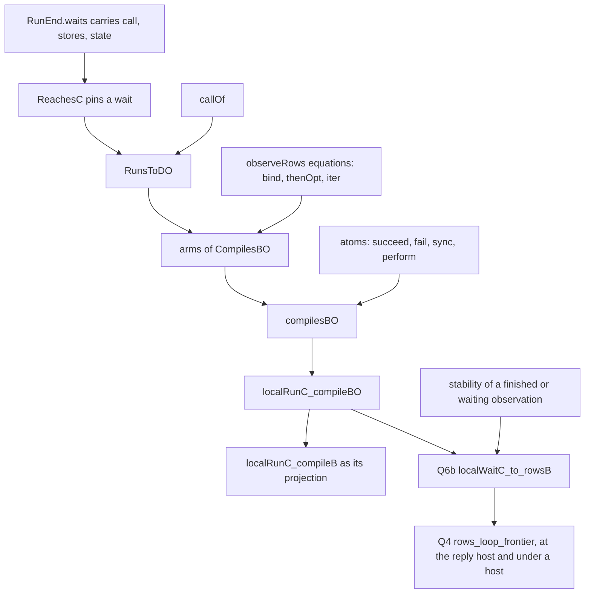

# 2026-10-10 Plan: L4, the detailed frontier of a host loop (Q4, Q6b)

## 1. The one thing to know first

A waiting run's meaning is known today only as `none`: H8 on loops observes a wait coarsely
(`coarseRowsB`). L4 makes the meaning name the wait: the pending row and request, the stores and
the host state (`observeRows`'s `RowsStop.waiting`). Two changes carry it. The local run's waiting
outcome carries the same three things, so `ReachesC` sees them. The forward agreement on loops is
restated over the detailed observation. Q6b and Q4 then follow by determinism and stability, as
Q6a and H8 did.

Placement: slice L4 of `docs/research/2026-10-10-host-meaning-widening/README.md` (§4, §5.1 Q4 and
Q6b). Concept `host-session-protocol` (Q4) and `translation-simulation` (Q6b), proposed claim
`rows-loop-frontier`, requirements R6 and R12. Consumers: the waiting driver and the resource
prefix of slices S1 and S2.

## 2. Why the coarse relation cannot give it

`ReachesC` (`src/Effect4/Laws/Program/Agreement/Segment.lean`) relates two configurations when
their local runs end alike, and `RunEnd.waits` carries nothing. So two waiting calls over
different stores relate (the H8 review's finding H8R-01), and the forward agreement's waiting
clause (`RunsTo`'s `none`) cannot say which stores the meaning waits with. The packet's Q6b row
says the same: no conclusion from coarse `ReachesC` alone.

## 3. The representation

| Change | Where | Effect |
| --- | --- | --- |
| `RunEnd.waits (call : NCode) (s : Stores) (st : σ)` | `Agreement/Segment.lean` | a wait's call, stores and host state are part of the run's end; `ReachesC` keeps its definition and now pins them |
| `callOf : NCode → Option (Nat × Val)` | `Agreement/Segment.lean` | the row and request of a host call's code, as `hostAnswer` reads them |
| `RunsToDO` over `RowsObservation` | `Agreement/LoopCalls.lean` | finished, budget cut and waiting, each with its stores and host state |

Every `ReachesC` the tree builds comes from one local step, an answered call, two fibers with the
same next step, reflexivity or transitivity (`ReachesC.step`, `.answer`, `.same`, `.refl`,
`.trans`). None of them relates two different waits, so the stronger end keeps every proof. The
ten uses of `.waits` and `localRunC_waits` change their right-hand side only.

The detailed forward agreement covers the whole fragment `LoopedDataRows` in one induction. The
atoms are discharged directly, not through the straight agreement `localRunC_compile`
(`Agreement/Calls.lean`), so that 500-line induction is not ported. The coarse agreement
`localRunC_compileB` becomes its projection (`observeRows_project`).

## 4. The proof DAG

| Node | Statement | Consumer |
| --- | --- | --- |
| `RunEnd.waits` with data | the local run's end at an unanswered call | `ReachesC`, every node below |
| `callOf_hostAnswer` | `hostAnswer` asks the host the row and request `callOf` names | `RunsToDO`'s waiting clause |
| `observeRows_thenOpt`, `observeRows_bind`, `observeRows_iter` | the observation of a sequence and of a loop, as `runRowsH_thenOpt` and `runRowsH_iter_succ` | the arms |
| `RunsToDO`, `RunsToDO.pre`, `.of_zero`, `.of_diverges`, `.mono` | the relation and its laws, as `RunsToDB`'s | the arms |
| `CompilesBO`, its atoms and arms, `compilesBO` | §3 | `localRunC_compileBO` |
| `localRunC_compileBO` | the detailed forward agreement from the root | Q6b, the projection |
| `observeRows_stable` | a finished or waiting observation at `k` is the observation at every larger budget (`Effects.Program.Approx`) | Q6b, Q4 |
| Q6b `localWaitC_to_rowsB` | a local run that waits at a call with no answer has, past a bound, the waiting observation with that call's row and request, its stores and the host's state | Q4 |
| Q4 `rows_loop_frontier` | a recorded run of `LoopedRows` parked on a call has, past a bound, the waiting observation at the machine's stores, the pending request, and the reply tape read to its end; under a host, with that host's state | S1, S2, the waiting driver |

## 5. Order of work

1. **L4a**: `RunEnd.waits` with data and `callOf`; the ten uses. One rebuild of the agreement
   chain.
2. **L4b**: the observation equations and stability, in `DenoteRowsB.lean`.
3. **L4c**: `RunsToDO` and its induction, beside `CompilesB`; then `localRunC_compileB` as the
   projection.
4. **L4d**: Q6b and Q4 in `HostedLoop.lean`, placed as goals first.

## 6. Outcome (2026-10-10)

Every node of §4 is proved; `#plan_status` gives `rows_loop_frontier`, `rows_loop_frontier_host`,
`localWaitC_to_rowsB` and `localRunC_compileBO` proved, and `#axiom_audit` over the six touched
modules gives 659 declarations within `[propext, Quot.sound]`. Three changes of plan:

- The semantic side is one detailed run, `runRowsO` (`Laws/Program/DenoteRowsB.lean`), generic
  in the answer type, with one bind law, instead of equations for `observeRows` alone. `runRowsH`
  and `observeRows` are its views. The loop arm's intermediate types need no second form.
- The detailed agreement replaces the coarse arms in place (`Agreement/LoopCalls.lean`); the
  coarse `localRunC_compileB` keeps its statement as the projection, so `HostedLoop.lean`'s
  closing steps did not change.
- Q6b needs no stability lemma: past the wait's step count, the detailed agreement leaves only a
  wait, and the local run's determinism fixes its data. `observeRows_stable` of §4 is not
  written; it has no consumer.

Q4 is stated at the run's public observable: every call in `Program.awaits` is a host row, and
the meaning waits at that row and request (`awaits_Mcall_call`).

## 7. What this does not establish

- No progress: a wait is a frontier, never a typed failure (DB-04), and nothing says a host
  answers.
- No claim at an unrelated budget below the bound.
- No fork, scope or interruption: the fragment is `LoopedRows`.
- The host boundary stays where `docs/core/host-boundary.md` puts it.
