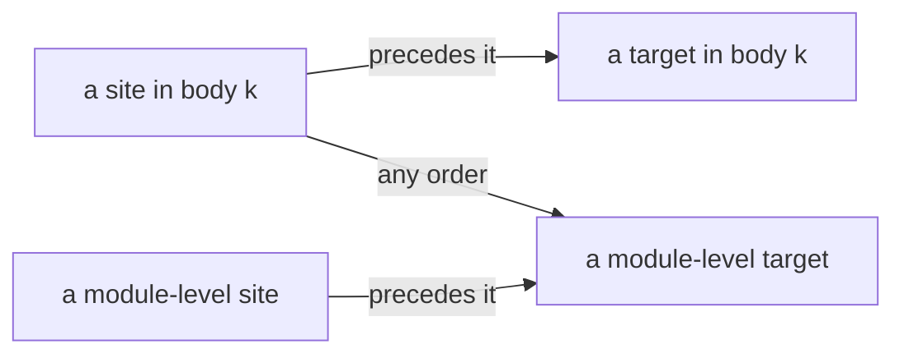

# 2026-10-10 Design: layers by lexical scope (decisions row 341, steps 2 and 3)

## 1. The one thing to know first

A layer outside every definition body belongs to the module. A layer in a body belongs to one
call of that body. rc.112 behaves this way because its memo map is keyed by the layer object. The
machine keys a build by the layer's path alone (DB-12), so today a body's layer is shared across
every call. Step 1 of row 341 landed the scope rule. Two steps remain:

- **Step 2**: a body names a module-level layer, and module-level layers get a home in the
  block.
- **Step 3**: a body's layer is keyed by its path and the call that runs it.

The language gains no other construct. A program written today keeps its meaning, except one
case: a body's layer reached by two calls. Step 3 changes that case to rc.112's meaning.

## 2. What rc.112 does

| Fact | Source |
| --- | --- |
| The memo map is a `Map` keyed by the layer object | `vendor/effect-4.0.0-rc.112/src/Layer.ts` (`MemoMapImpl`, `readonly map = new Map<Layer<any, any, any>, MemoMapEntry>()`) |
| A memoized layer looks itself up by identity, and builds on a miss | `Layer.ts` (`fromBuildMemo`: `memoMap.getOrElseMemoize(self, scope, build)`) |
| A build stores its entry under the layer object | `Layer.ts` (`memoMapBuild`: `memoMap.map.set(layer, entry)`) |
| A lookup that misses the local map asks the parent map | `Layer.ts` (`MemoMapImpl.get`: `this.parent?.get(layer, scope)`) |

Three consequences follow for printed code:

- A module-level `const DbLive = Layer.effect(…)` is one object. Every use shares one build per
  memo map, in every function.
- `Layer.effect(…)` evaluated inside a function body is a new object at each evaluation, so each
  call builds its own.
- A closure sees the object of the call that made it.

## 3. What the tree does now

| Fact | Where |
| --- | --- |
| A build is keyed by the layer's path (`LayerId := List Nat`) | DB-12; `src/Effect4/Machine/Stores.lean` (`MemoMap.entries`) |
| A reference names its target by path, and the target precedes it in program order | `Eff.layerRefsWF` (`src/Effect4/Program/Refs.lean`) |
| A block's bodies are child `0`, and its main program is child `1` | `Node.child` (`src/Effect4/Program/NodeLenses.lean`) |
| A reference and its target stand in one scope (step 1) | `Eff.scopeOf`, `Eff.layerRefsWF`; row 341 |
| The printer refuses any layer term inside a body | `printDef` (`src/Effect4/Codegen/Print.lean`, reason `defs:layer`) |
| The authoring surface places a shared layer at its first use in program order | `elaborateModule` (`src/Effect4/Program/Authoring.lean`) |

Program order puts every body before the main program. So a body never names a layer of the main
program, and the authoring surface places a layer used by a body and by the main program inside
the body. Step 1 now refuses the result: the main program's use names a layer in a body. No
module in the tree does this today (survey of 2026-10-10: no authored module declares both shared
layers and definitions).

## 4. Step 2: module-level layers

### 4.1 The rule

A reference sees its own body's layers and the module's layers: lexical visibility. A body's
reference may name a module-level target in any program order. Within one scope the target still
precedes the site.

The references stay acyclic. A module-level target holds only module-level sites, so every chain
of hops goes down within one body, jumps at most once to the module, and goes down there. The
expansion bound (`expanded_refs_nil_of_wf`, `Laws/Program/ReferenceExpansion.lean`) ranks sites
by program order. It ranks module-level sites first instead, and the existing measure argument
carries over: a target's inner sites rank below every site that names the target.

### 4.2 A home for module-level layers

The main program cannot hold every module-level layer. A layer that only bodies use, such as the
one that `const withTx = (p) => Effect.provide(p, TxLayer)` reads, has no use in the main program
to stand at. Two representations:

| Option | Shape | Cost |
| --- | --- | --- |
| (a) a block child: `.defs decls bodies layers main`, the module's layers as a `LayerTerms` spine | the printer's hoisted `const L_<path>` becomes the block's own declaration list; the authoring `Module.layers` maps onto it one to one | one constructor field: the new-field checklist (wire, LCNF roots, goldens, reader, OCaml bridge, case policy) |
| (b) the main program only | a module-level layer stands at a use in the main program | no syntax change; a layer that only bodies use cannot be written |

Ruled (a), by the owner, 2026-10-10. It is the representation the printer already prints: one
declaration per module-level layer, before the main program. The authoring surface already keeps
`Module.layers` as that list. (b) refuses an ordinary Effect program.

The field comes last: `.defs decls bodies main layers`, the module's layers at child `2`. Every
existing path keeps its meaning: the bodies stay child `0`, the main program child `1`, and no
printed `L_<path>` name or golden byte moves. Three scopes follow, by the path's first index:

| Path | Scope | Visible to |
| --- | --- | --- |
| `0 :: …` in body `k` | body `k`, with its parameters | body `k` |
| `1 :: …` | the main program | the main program |
| `2 :: …` | the module | every scope |

A module-level layer names only module-level layers. So a reference never leaves the module once
it enters it, and the order below is acyclic.

The reference order ranks module-level sites before every other site, and program order within
each class (`Path.refBefore`). Within one scope a target still precedes its site in program
order. The expansion bound's rank argument (`target_refs_prior`) reads that order in place of
`Path.lt`.

The field reaches what a new constructor field reaches (the new-field checklist): the generated
folds and lenses, the OCaml emitter and its goldens (`src/OCaml5/Eff/Goldens.lean`), the LCNF
roots, the engine bridge (`ocaml/engine/e4_program.ml`), the TypeScript generator and reader
switches (`tools/Drivers/TsGen.lean`, `ts/eff`), the foreign corpus driver, the compatibility
policy and the case policy.

### 4.3 The typing

The target's scope has no parameter, so every stack is typed there (`stackTyped_nil`). Its
expansion must check at the body's signature to the same columns as at the module's. A typed
module-level layer reads only the source signature, so no parameter. The proof:

1. The module's part is typed at the source signature (the module check).
2. Every node of a typed program is typed in its environment, layers included
   (`NodeHasTy.replace_envAt`, `Laws/Program/Typing/Replace.lean`).
3. A typed program reads only its signature (`hasTy_sigProgram`, `Laws/Program/Typing/Restrict.lean`).
4. On such a program the checker answers the same at every extension (`check_restrict`,
   `Laws/Program/Signature.lean`), at the layer sort through `cata_layer_congr_on`.

One new lemma connects the expansion to the address: the node of the expanded program at a
target's path is the target's expansion (`LayerTerm.expandIn`), since no ancestor of a layer is a
reference. The memo cell at the target is typed at the module's signature, which every reader
then agrees with, so a shared entry has one set of columns.

### 4.4 Print, read and author

- `printDef` admits a reference to a module-level target, printed as the hoisted identifier. A
  body's own layers stay refused until step 3.
- The reader reads the identifier in a body back as the reference.
- `elaborateModule` places each shared layer at module level and turns every use into a reference.

## 5. Step 3: a body's layers, one build per call

### 5.1 The key

A build in a body is keyed by its path and the call that runs it. The machine allocates a call
identity at each invocation (a store counter, as for scopes) and pushes it with the call's frame.
At a point inside body `k`, the top frame belongs to the running call of `k`. That holds because
the stack typing puts body `k`'s frame on top there (`StackTyped`). A parameter's site runs with
its caller's rest of the stack, so a layer in the site keys on the caller's call. A
module-level layer keys on its path alone.

| Layer | Key | rc.112 |
| --- | --- | --- |
| module-level | its path | one object per module |
| in body `k` | its path and the running call of `k` | one object per evaluation of the body |
| reached by a reference in its own body | the reference's call | the same object within one call |

### 5.2 What changes

- `LayerId` gains the call: `List Nat × Option Nat`. The machine's memo operations, the compile
  (`resolveLayer`), the reference denotation and the OCaml route read it.
- A frame carries its call identity: `Point.params : List Frame`, with `Frame` holding the id and
  the sites.
- The memo invariant keeps typing a cell by its path's scope: every call of one body checks the
  layer at one signature, so the columns do not depend on the call.
- The printer prints a body's layers inside the definition's suspension, so rc.112 creates one
  object per run of the body: `(a0) => Effect.suspend(() => { const L = …; return body })`.

### 5.3 What it does not establish

- No closure: a nested definition stays outside the admitted fragment. An authoring helper that
  needs its parent's parameters takes them as parameters (lambda lifting at the surface). A layer
  in one body stays invisible to another body.
- No change to `fresh`: `LayerTerm.fresh` keeps its private memo map (DI-71's amendment).
- A call identity is never a value, so no observation reads it (unlike DI-73's fiber ids).

## 6. Order of work (ruled by the owner, 2026-10-10)

1. **Located reference refusals**: `Api.explain` names the bad reference's site and its reason
   (after its target, encloses it, no layer, a reference, another scope) in place of the
   root-level `referencesIllFormed`. An agent author then fixes the right site. The refusal codec
   is regenerated.
2. **Step 2**: the home of 4.2, then the rule, the expansion bound, the typing of 4.3, the print,
   the read and the authoring placement.
3. **HO-3**: the printer prints an invocation with programs, so a helper that takes a program
   (a retry, a timeout, a transaction wrapper) reaches TypeScript.
4. **Step 3**: the call identity in the machine, the memo key, the compile, the denotation and the
   OCaml route; then the printer admits a body's layers; then the typed chain's memo invariant.
   It lands before the printer admits a layer inside a body.

After step 3, a definition that returns a layer (`makeDbLive(url)`) builds on its call identity:
a later design question.

## 7. Placement

| Obligation | Concept | Claim, consumer | Requirement |
| --- | --- | --- | --- |
| the expansion bound under lexical order | `initial-algebras-folds` | `expanded_refs_nil_of_wf`; the checker's admission | R4 |
| a module-level target checks alike in every scope | `residual-program-typing` | `denote-typed`; `ref_builds` | R4; M7 |
| the memo key with the call | `store-typing` | `denote-typed`; `memoGet_implements`, `memoize_typed` | R4, R5; M7 |
| per-call print agrees with the machine | `translation-simulation` | the truth lane's counted builds (DI-71's fixtures) | R2, R3 |
