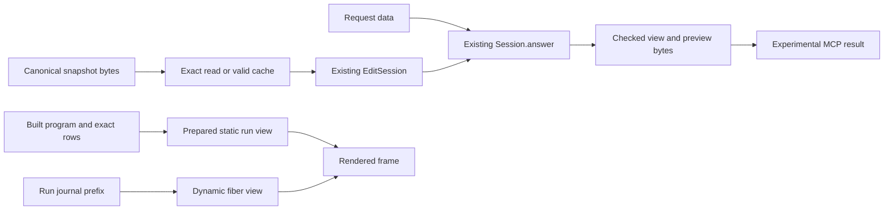

# Live graph support plan

Status: implementation plan. Base: `9389e543`.
The primary checkout remains owned by Claude and the TyView session.
This branch owns only the files listed below.

## Finishing criteria

- Keep `Eff` as the sole stored program representation.
- Prove indexed placement agrees with its retained calculation.
- Check every segment of a downward drawing route.
- Bind prepared run views to their checked program and row table.
- Exercise explicit snapshot inspection and editing through an experimental MCP driver.
- Keep published store roots and running programs unchanged by preview edits.
- Build narrow consumers, audit declarations, measure costs, and inspect rendered output.
- Commit by explicit paths. Do not push or merge into the primary checkout.

## Ownership

| Slice | Files | Worker |
| --- | --- | --- |
| Sparse incoming index | `tools/Tools/Graph/Index.lean`, `tools/Tools/View/Flow.lean`, `tools/Tools/View/FlowLaws.lean` | graph_algorithms |
| Prepared run view | `tools/Tools/View/Run.lean`, `tools/Tools/View/Program.lean` if needed | session_coalgebra |
| Route validation | `tools/Tools/View/Graph.lean` | graph_surface_audit |
| Snapshot tools | `tools/Tools/Session/Snapshot.lean`; experimental driver under this packet | root |

Each worker uses a separate worktree based on `9389e543`.
Each worker writes its obligation placement before proof work.
The parent integrates only verified local commits.

## Snapshot tool placement

1. Concept: `initial-algebras-folds`, property that a retained checked table gives the same answer as fresh checking.
2. Question: named tool compatibility law `resolve_agrees`, serving the proposed `cache-invisible` claim from the MCP note.
   Its consumer is the snapshot preview adapter.
   Existing claims remain at `EditSession.reached_view` and `Sketch.decode_exact`.
3. Reach: the empty application profile, exact canonical program and hole bytes, and a valid prepared cache.
   The cache retains an opened session for the input snapshot, never a previous request's mutable context.
   Accepted previews use existing `Tools.Session.answer` operations on that snapshot.
4. Exclusions: no shared-root publication, digest collision assumption, automatic rebase, execution, scheduler property, or arbitrary application profile.
   MCP schemas and transport receive finite independent checks, not an exact-schema theorem.
5. Unlock: repeated inspection and preview edits for R14, with explicit snapshot identity on every request.
   R13 run replay remains separate.

The adapter remains experimental under this packet.
The stable MCP server still needs the broader note's protocol and store rulings.
This slice supplies a working preview route without deciding those questions.

